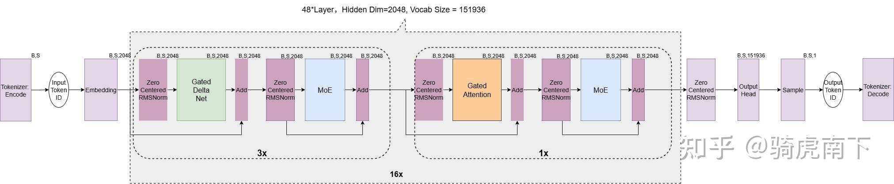
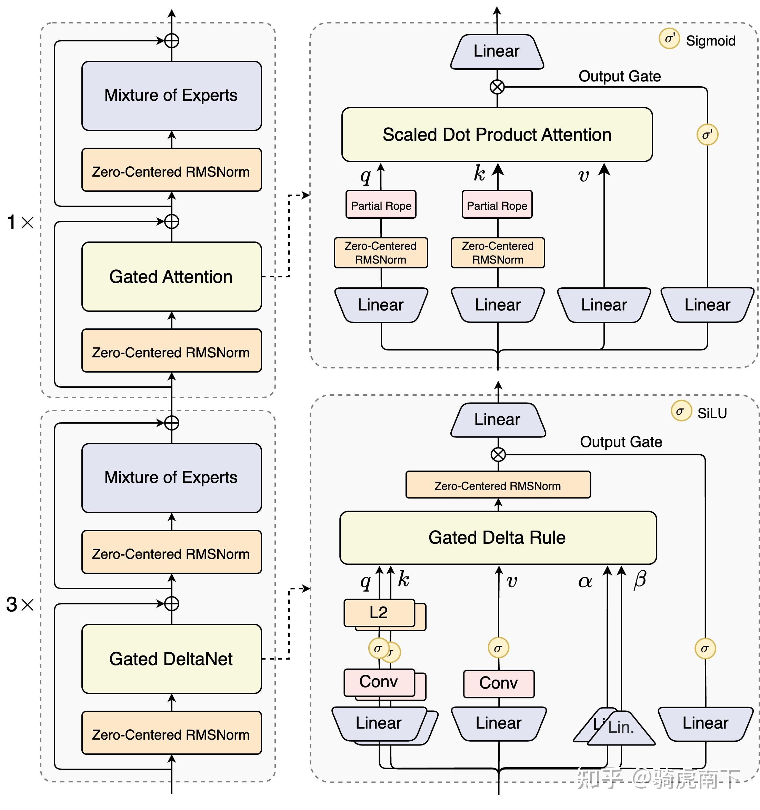
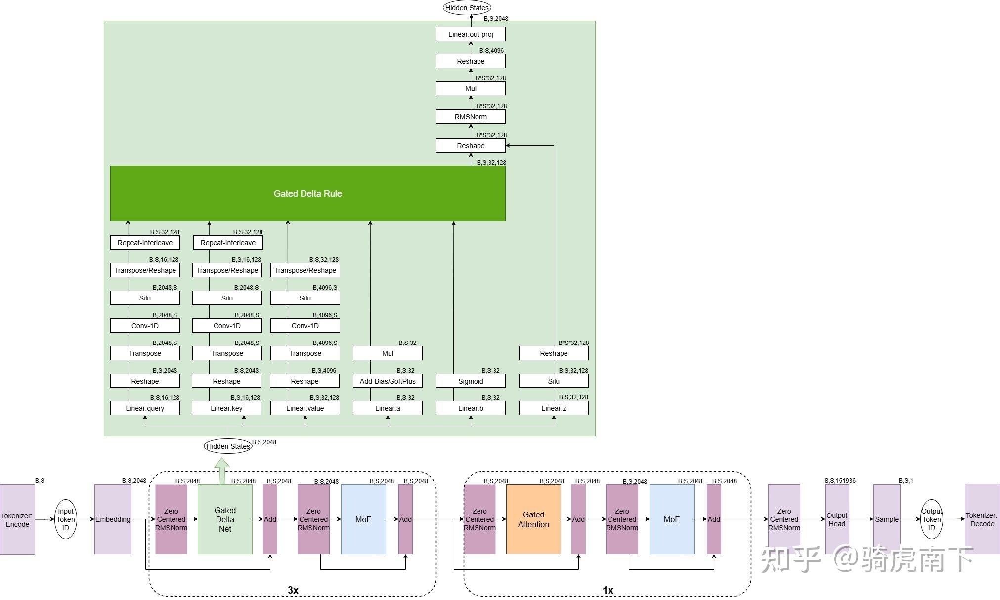
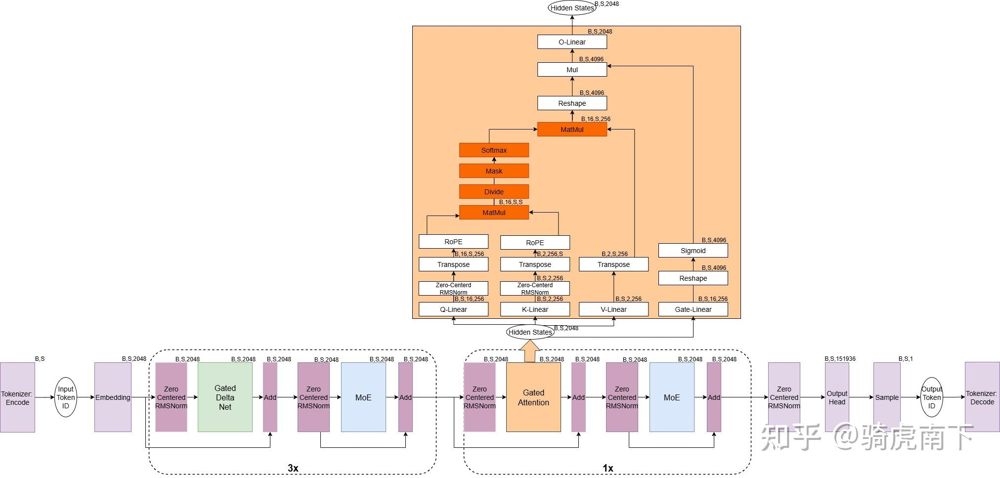
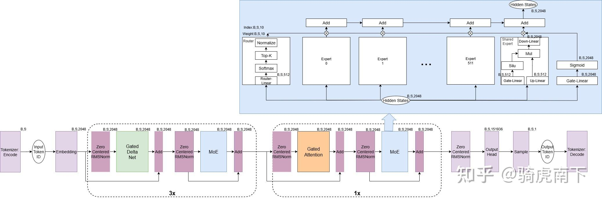

历时两天，过了一遍Qwen3-Next-80B-A3B-Instruct的模型结构 与源码逻辑，不得不说相对于Qwen3-235B有大规模的改动。以下从几个方面记录我对该模型的一些理解。

1 .  **模型结构与流程：** 以算子加输出Shape的流程图的形式，展示该模型的总体结构与流程。

2 . **Gated DeltaNet逻辑与细节：** 介绍Linear Attention模块是如何使用Gated Delta Net实现Linear Attention的逻辑。

3 . **Gated Attention逻辑与细节：** 相比于传统的Self-Attention，Gated-Attention做了哪些改动。

4 . **高度稀疏的MoE：** 所谓高度稀疏的MoE是指什么，与Qwen3-235B的MoE有哪些差别。

### 模型结构与流程

[Qwen3-Next-80B-A3B-Instruct](https://qwen.ai/blog?id=4074cca80393150c248e508aa62983f9cb7d27cd&from=research.latest-advancements-list)， 如上链接有详细的介绍该模型的训练效率，推理效率，Base模型的性能，Thinking模型的性能，以及如何在Sglang/vLLM中跑通，这里就不复制粘贴了。

如下图，整个模型共48Layer，每3个Gated DeltaNet的Layer后面串一个Gated Attention Layer，每个Layer上的MLP模块都是MoE稀疏。另外与传统的Qwen3-235B不同的是用Zero-Centered RMSNorm代替了原来的标准的RMSNorm。

针对3:1混合比例的架构官方解释是，Gated DeltaNet 相比常用的滑动窗口注意力（Sliding Window Attention）和 Mamba2 有更强的上下文学习（in-context learning）能力，并在 3:1 的混合比例（即 75% 层使用 Gated DeltaNet，25% 层保留标准注意力）下能一致超过超越单一架构，实现性能与效率的双重优化。

该模型支持的词表长度是151936，Hidden Dim是2048与Qwen3-30-A3B一致，最大支持位置编码长度256K，可以认为支持最大文本长度是256K。



以下是官方图示：



### Gated DeltaNet逻辑与细节



如上图，绿色部分是Qwen3-Next的Gated DeltaNet模块的详细流程图，其中例如B,S,2048表示算子流转的Hidden States的Shape。B表示Batch推理过程中的并发数，S表示Sequence Length，Prefill阶段是Prompt Length，Decode阶段是1（MTP方案下另说）。

了解上述模块的算子流程可以结合下面的代码理解，;每行代码注释模块描述代码逻辑，这里需要特别提到几点：

1 . 源码中，上图的Linear:query/Linear:key/Linear:value/Linear:z是一个矩阵乘实现，这里为方便理解拆开了。

2 . 源码中，上图的Q/K/V的Conv-1D是也是合并到一起实现，Conv-1D是一个卷积核为1*4卷积，Pad=3为了保证当前Token不能与未来Token计算，Conv-1D的输出后一个维度数值始终取前Sequence个。

3 . Q/K的Repeat Interleave是将Q/K的每个Head数据复制一份排布在当前Head的后，保证与V的Shape一致。

4 . *将a的值加上dt_bias，再做Softplus激活，再乘以A_log.exp()后，取负值，主要用于Delta Rule中历史记忆的衰减。*

*5 . 将b的值做Sigmoid激活，得到beta，主要用于Delta Rule中的Value的门限控制。*

*6 . z经过Gate Linear后做Silu，与Delta Rule的输出做RMSNorm（这里RMSNorm不是Zero-Centered RMSNorm）的结果，做点乘，也是为了实现门限控制 。*

```python3
class Qwen3NextGatedDeltaNet(nn.Module):
    def __init__(self, config: Qwen3NextConfig, layer_idx: int):
        super().__init__()
        self.hidden_size = config.hidden_size # 2048
        self.num_v_heads = config.linear_num_value_heads # 32   
        self.num_k_heads = config.linear_num_key_heads # 16
        self.head_k_dim = config.linear_key_head_dim # 128
        self.head_v_dim = config.linear_value_head_dim # 128
        self.key_dim = self.head_k_dim * self.num_k_heads # 128 * 16 = 2048
        self.value_dim = self.head_v_dim * self.num_v_heads # 128 * 32 = 4096

        self.conv_kernel_size = config.linear_conv_kernel_dim # 4
        self.layer_idx = layer_idx 
        self.activation = config.hidden_act # Silu
        self.act = ACT2FN[config.hidden_act] 
        self.layer_norm_epsilon = config.rms_norm_eps #1e-6

        # QKV
        self.conv_dim = self.key_dim * 2 + self.value_dim # 8192
        self.conv1d = nn.Conv1d(
            in_channels=self.conv_dim, # 8192
            out_channels=self.conv_dim, # 8192
            bias=False,
            kernel_size=self.conv_kernel_size, # 4
            groups=self.conv_dim, # 8192
            padding=self.conv_kernel_size - 1, # 3
        ) # Input Shape:[B，S，8192] -> Output Shape:[B，S，8192]，是一个Pad=3,Kernel=1*4的Depthwise卷积层,stride默认是1

        # projection of the input hidden states
        projection_size_qkvz = self.key_dim * 2 + self.value_dim * 2 # 8192 * 2 + 4096 * 2 = 16384
        projection_size_ba = self.num_v_heads * 2 # 32 * 2 = 64
        self.in_proj_qkvz = nn.Linear(self.hidden_size, projection_size_qkvz, bias=False) # Input Shape:[B，S，2048] -> Output Shape:[B，S，16384]
        self.in_proj_ba = nn.Linear(self.hidden_size, projection_size_ba, bias=False) # Input Shape:[B，S，2048] -> Output Shape:[B，S，64]

        # time step projection (discretization)
        # instantiate once and copy inv_dt in init_weights of PretrainedModel
        self.dt_bias = nn.Parameter(torch.ones(self.num_v_heads))

        A = torch.empty(self.num_v_heads).uniform_(0, 16) # 创建一个长度为32的均匀分布的随机数
        self.A_log = nn.Parameter(torch.log(A)) # 对上述随机数取对数，并作为参数

        self.norm = (
            Qwen3NextRMSNormGated(self.head_v_dim, eps=self.layer_norm_epsilon) # 使用这个门控RMSNorm函数
            if FusedRMSNormGated is None
            else FusedRMSNormGated(
                self.head_v_dim,
                eps=self.layer_norm_epsilon,
                activation=self.activation,
                device=torch.cuda.current_device(),
                dtype=config.dtype if config.dtype is not None else torch.get_current_dtype(),
            )
        )

        self.out_proj = nn.Linear(self.value_dim, self.hidden_size, bias=False) # Input Shape:[B，S，4096] -> Output Shape:[B，S，2048]

        self.causal_conv1d_fn = causal_conv1d_fn
        self.causal_conv1d_update = causal_conv1d_update or torch_causal_conv1d_update
        self.chunk_gated_delta_rule = chunk_gated_delta_rule or torch_chunk_gated_delta_rule
        self.recurrent_gated_delta_rule = fused_recurrent_gated_delta_rule or torch_recurrent_gated_delta_rule

        if not is_fast_path_available:
            logger.warning_once(
                "The fast path is not available because one of the required library is not installed. Falling back to "
                "torch implementation. To install follow https://github.com/fla-org/flash-linear-attention#installation and"
                " https://github.com/Dao-AILab/causal-conv1d"
            )

    def fix_query_key_value_ordering(self, mixed_qkvz, mixed_ba):
        """
        Derives `query`, `key` and `value` tensors from `mixed_qkvz` and `mixed_ba`.
        """

        new_tensor_shape_qkvz = mixed_qkvz.size()[:-1] + (
            self.num_k_heads,
            2 * self.head_k_dim + 2 * self.head_v_dim * self.num_v_heads // self.num_k_heads,
        ) # new_tensor_shape_qkvz的Shape为[B，S，16，768]
        new_tensor_shape_ba = mixed_ba.size()[:-1] + (self.num_k_heads, 2 * self.num_v_heads // self.num_k_heads) # new_tensor_shape_ba的值为[B，S，16，4]

        mixed_qkvz = mixed_qkvz.view(*new_tensor_shape_qkvz)
        mixed_ba = mixed_ba.view(*new_tensor_shape_ba)
        split_arg_list_qkvz = [
            self.head_k_dim,
            self.head_k_dim,
            (self.num_v_heads // self.num_k_heads * self.head_v_dim),
            (self.num_v_heads // self.num_k_heads * self.head_v_dim),
        ] # split_arg_list_qkvz的值为[128，128，256, 256]
        split_arg_list_ba = [self.num_v_heads // self.num_k_heads, self.num_v_heads // self.num_k_heads] # split_arg_list_ba的值为[2, 2]
        query, key, value, z = torch.split(mixed_qkvz, split_arg_list_qkvz, dim=3) # Split之后 query, key, value, z的Shape的Shape分别为   [B，S，16，128]，[B，S，16，128]，[B，S，16，256]，[B，S，16，256]
        b, a = torch.split(mixed_ba, split_arg_list_ba, dim=3) # Split之后 b, a的Shape的Shape分别为   [B，S，16，2]，[B，S，16，2]
        # [b, sq, ng, np/ng * hn] -> [b, sq, np, hn]
        value = value.reshape(value.size(0), value.size(1), -1, self.head_v_dim) # Reshape之后 value的Shape为[B，S，32，128]
        z = z.reshape(z.size(0), z.size(1), -1, self.head_v_dim) # Reshape之后 z的Shape为[B，S，32，128]
        b = b.reshape(b.size(0), b.size(1), self.num_v_heads) # Reshape之后 b的Shape为[B，S，32]
        a = a.reshape(a.size(0), a.size(1), self.num_v_heads) # Reshape之后 a的Shape为[B，S，32]
        return query, key, value, z, b, a

    def forward(
        self,
        hidden_states: torch.Tensor,
        cache_params: Optional[Qwen3NextDynamicCache] = None,
        cache_position: Optional[torch.LongTensor] = None,
        attention_mask: Optional[torch.Tensor] = None,
    ):
        hidden_states = apply_mask_to_padding_states(hidden_states, attention_mask) # 将padding部分置为0

        # Set up dimensions for reshapes later
        batch_size, seq_len, _ = hidden_states.shape # hidden_states的Shape为[B，S，2048]

        use_precomputed_states = (
            cache_params is not None
            and cache_params.has_previous_state
            and seq_len == 1
            and cache_position is not None
        ) # 只在Decode阶段使用增量推理

        # getting projected states from cache if it exists
        if cache_params is not None:
            conv_state = cache_params.conv_states[self.layer_idx]
            recurrent_state = cache_params.recurrent_states[self.layer_idx]

        projected_states_qkvz = self.in_proj_qkvz(hidden_states) # 对整个GateDeltaNet模块输入做矩阵乘，Input Shape：[B，S，2048]，Output Shape：[B，S，16384]
        projected_states_ba = self.in_proj_ba(hidden_states) # 对整个GateDeltaNet模块输入做矩阵乘，Input Shape：[B，S，2048]，Output Shape：[B，S，64]
        query, key, value, z, b, a = self.fix_query_key_value_ordering(projected_states_qkvz, projected_states_ba) # 针对上述两个矩阵乘的结果进行数据重组，重组之后的Shape分别是：[B，S，16，128]，[B，S，16，128]，[B，S，32，128]，[B，S，32，128]，[B，S，32]，[B，S，32]
        query, key, value = (x.reshape(x.shape[0], x.shape[1], -1) for x in (query, key, value)) # 将上述query, key, value的Shape重组成[B,S,2048], [B,S,2048], [B,S,4096]

        mixed_qkv = torch.cat((query, key, value), dim=-1) # 再将query, key, value，在最后一个维度上拼接，得到Shape为[B,S,8192]的矩阵
        mixed_qkv = mixed_qkv.transpose(1, 2) # 再转置成Shape为[B,8192,S]的矩阵，为方便后续做CONV-1D操作

        if use_precomputed_states:
            # 2. Convolution sequence transformation
            # NOTE: the conv state is updated in `causal_conv1d_update`
            mixed_qkv = self.causal_conv1d_update(
                mixed_qkv,
                conv_state,
                self.conv1d.weight.squeeze(1),
                self.conv1d.bias,
                self.activation,
            )
        else:
            if cache_params is not None: # 如果cache_params不为空，则将conv_state的值赋给cache_params.conv_states[self.layer_idx]，保存Conv-Cache
                conv_state = F.pad(mixed_qkv, (self.conv_kernel_size - mixed_qkv.shape[-1], 0)) 
                # Prefill阶段，将mixed_qkv的值padding到与conv_kernel_size=4相同长度，裁剪只剩有conv_kernel_size=4长度的数据
                # Decode阶段，因为mixed_qkv的长度为1，所以直接在左边padding 3个0
                cache_params.conv_states[self.layer_idx] = conv_state
            if self.causal_conv1d_fn is not None:
                mixed_qkv = self.causal_conv1d_fn(
                    x=mixed_qkv, # x的Shape为[B,8192,S]
                    weight=self.conv1d.weight.squeeze(1), # weight的Shape为[8192,8192,4]
                    bias=self.conv1d.bias, # 无Bias
                    activation=self.activation, # Silu做为激活函数
                    seq_idx=None, # 不配置Input Position
                )
            else:
                mixed_qkv = F.silu(self.conv1d(mixed_qkv)[:, :, :seq_len]) # 使用Conv-1D进行卷积操作，激活函数为Silu，卷积核大小为4，输出Shape为[B,8192,S]
                # 注意这里原输出是[B,8192,S]，因为Token不能感知未来的Token,所以只取了[:seq_len]部分,Pad =3是保证第一Token向前与不存在的3个Token的Attention为0

        mixed_qkv = mixed_qkv.transpose(1, 2) # 将Shape从[B,8192,S]转置为[B,S,8192]
        query, key, value = torch.split(
            mixed_qkv,
            [
                self.key_dim,
                self.key_dim,
                self.value_dim,
            ],
            dim=-1,
        ) # 将mixed_qkv在最后一个维度上按[2048,2048,4096]切分，得到query, key, value的Shape分别为[B,S,2048]，[B,S,2048]，[B,S,4096]
        query = query.reshape(query.shape[0], query.shape[1], -1, self.head_k_dim) # 将query的Shape从[B,S,2048]重组成[B,S,16,128]
        key = key.reshape(key.shape[0], key.shape[1], -1, self.head_k_dim) # 将key的Shape从[B,S,2048]重组成[B,S,16,128]
        value = value.reshape(value.shape[0], value.shape[1], -1, self.head_v_dim) # 将value的Shape从[B,S,4096]重组成[B,S,32,128]

        beta = b.sigmoid() # 将b的值做Sigmoid激活，得到beta的Shape为[B,S,32]，作为门控系数
        # If the model is loaded in fp16, without the .float() here, A might be -inf
        g = -self.A_log.float().exp() * F.softplus(a.float() + self.dt_bias) # 将a的值做Softplus激活，再加上dt_bias，再取负值，再乘以A_log.exp()，得到g的Shape为[B,S,32]，作为衰减系数
        if self.num_v_heads // self.num_k_heads > 1: #类似于GQA，复制补足少的Q/K-Head值 
            query = query.repeat_interleave(self.num_v_heads // self.num_k_heads, dim=2)
            key = key.repeat_interleave(self.num_v_heads // self.num_k_heads, dim=2)

        if not use_precomputed_states:
            core_attn_out, last_recurrent_state = self.chunk_gated_delta_rule(
                query,
                key,
                value,
                g=g,
                beta=beta,
                initial_state=None,
                output_final_state=cache_params is not None,
                use_qk_l2norm_in_kernel=True,
            ) # 使用Flash Linear Attention的优化计算计算核心注意力输出core_attn_out和并保留记忆.

        else:
            core_attn_out, last_recurrent_state = self.recurrent_gated_delta_rule(
                query,
                key,
                value,
                g=g,
                beta=beta,
                initial_state=recurrent_state,
                output_final_state=cache_params is not None,
                use_qk_l2norm_in_kernel=True,
            ) # 使用Torch原生的Gated Delta Rule，计算核心注意力输出core_attn_out和并保留记忆.

        # Update cache
        if cache_params is not None:
            cache_params.recurrent_states[self.layer_idx] = last_recurrent_state  #更新记忆状态

        z_shape_og = z.shape # 保存z的Shape=[]
        # reshape input data into 2D tensor
        core_attn_out = core_attn_out.reshape(-1, core_attn_out.shape[-1]) # 将core_attn_out的Shape从[B,S,32，128]重组成[B*S*32,128]
        z = z.reshape(-1, z.shape[-1]) # 将z的Shape从[B,S,32,128]重组成[B*S*32,128]
        core_attn_out = self.norm(core_attn_out, z) # 使用Qwen3NextNorm对core_attn_out进行RMSNorm，再乘以Z做Silu后的Gate。
        core_attn_out = core_attn_out.reshape(z_shape_og) # 将core_attn_out的Shape从[B*S*32,128]重组成[B,S,32,128]
        core_attn_out = core_attn_out.reshape(core_attn_out.shape[0], core_attn_out.shape[1], -1) # 将core_attn_out的Shape从[B,S,32,128]重组成[B,S,32*128]

        output = self.out_proj(core_attn_out) # 做Linear后输出，输出Shape为[B,S,2048]
        return output
```

有关于Gate Delta Rule可以参考以下源码中注释，他实现是一个Linear Attention。

可以参考：

[Qwen3-Next源码解析：一文看清架构中的核心点实现 - 知乎](https://zhuanlan.zhihu.com/p/1950219022890172477)

[线性注意力简史：从模仿、创新到反哺 - 科学空间|Scientific Spaces](https://spaces.ac.cn/archives/11033)

[transformers/src/transformers/models/qwen3_next/modeling_qwen3_next.py at main · huggingface/transformers · GitHub](https://github.com/huggingface/transformers/blob/main/src/transformers/models/qwen3_next/modeling_qwen3_next.py)

```python3
# query 的Shape: [batch_size, num_heads, sequence_length, k_head_dim] = [B,S,32,128]
# key 的Shape: [batch_size, num_heads, sequence_length, k_head_dim] = [B,S,32,128]
# value 的Shape: [batch_size, num_heads, sequence_length, v_head_dim] = [B,S,32,128]
# g 的Shape: [batch_size, num_heads, sequence_length] = [B,S,32]
# beta 的Shape: [batch_size, num_heads, sequence_length] = [B,S,32]
def torch_recurrent_gated_delta_rule(
    query, key, value, g, beta, initial_state, output_final_state, use_qk_l2norm_in_kernel=False
):
    initial_dtype = query.dtype
    if use_qk_l2norm_in_kernel: # true
        query = l2norm(query, dim=-1, eps=1e-6) # 针对 head上128值做L2-Norm, x/sqrt(x_0**2 +...+ x_128** + eps)
        key = l2norm(key, dim=-1, eps=1e-6) # 针对 head上128值做L2-Norm, x/sqrt(x_0**2 +...+ x_128** + eps)
    query, key, value, beta, g = [
        x.transpose(1, 2).contiguous().to(torch.float32) for x in (query, key, value, beta, g)
    ] # 将query, key, value, beta, g的最后第二与第三两个维度全部转置，并转成float32类型。输出的Shape分别为：[B,32,S,128], [B,32,S,128], [B,32,S,128], [B,32,S], [B,32,S]

    batch_size, num_heads, sequence_length, k_head_dim = key.shape # B,32,S,128
    v_head_dim = value.shape[-1] # 128
    scale = 1 / (query.shape[-1] ** 0.5) # 1/sqrt(128)
    query = query * scale # 针对 head上128值做缩放，x * 1/sqrt(128)

    core_attn_out = torch.zeros(batch_size, num_heads, sequence_length, v_head_dim).to(value) # 创建一个Attention的Output与Value的Shape/显存/类型一致。
    last_recurrent_state = (
        torch.zeros(batch_size, num_heads, k_head_dim, v_head_dim).to(value)
        if initial_state is None
        else initial_state.to(value)
    ) # 在初始化状态为0时，创建一个记忆矩阵，与Value的Shape/显存/类型一致。如果不是初始化状态，则与将记忆矩阵与value的Shape/显存/类型一致，后直接使用。

    for i in range(sequence_length):
        q_t = query[:, :, i] # [B，32，128]
        k_t = key[:, :, i] # [B，32，128]
        v_t = value[:, :, i] # [B，32，128]
        g_t = g[:, :, i].exp().unsqueeze(-1).unsqueeze(-1) # 对第i个Token的衰减值做指数变换，并扩展维度。 g_t的Shape:[B，32，1，1]
        beta_t = beta[:, :, i].unsqueeze(-1) # 对第i个token的门控值做扩展维度。 beta_t的Shape:[B，32，1]

        last_recurrent_state = last_recurrent_state * g_t # 将记忆矩阵与第i个Token的衰减值做乘法。 last_recurrent_state的Shape:[B，32，128，128]
        kv_mem = (last_recurrent_state * k_t.unsqueeze(-1)).sum(dim=-2) # 计算记忆矩阵与第i个Token的Key的乘积，并倒数第二维度求和。 kv_mem的Shape:[B，32，128]
        delta = (v_t - kv_mem) * beta_t #  计算预测误差（Delta）并门控 。 delta的Shape:[B，32，128]，beta_t的Shape:[B，32，1]。
        last_recurrent_state = last_recurrent_state + k_t.unsqueeze(-1) * delta.unsqueeze(-2) # 更新记忆矩阵，广播外积。
        core_attn_out[:, :, i] = (last_recurrent_state * q_t.unsqueeze(-1)).sum(dim=-2) # 使用更新后记忆矩阵来计算Attention的Output，先点乘在第倒数第二维求和。 core_attn_out的Shape:[B，32，128]。

    if not output_final_state:
        last_recurrent_state = None
    core_attn_out = core_attn_out.transpose(1, 2).contiguous().to(initial_dtype) # Attention的Output,转转置并还原到原始数据精度后输出，他的Shape:[B,S,32,128]
    return core_attn_out, last_recurrent_state # 返回记忆矩阵，Attention的输出。
```

### Gated Attention逻辑与细节



如上图，黄色部分是Qwen3-Next的Gated Attention模块的详细流程图，其中例如B,S,2048表示算子流转的Hidden States的Shape。B表示Batch推理过程中的并发数，S表示Sequence Length，Prefill阶段是Prompt Length，Decode阶段是1（MTP方案下另说）。

整个Gate Attention与传统的Self-Attention并无差别，对比Qwen3-MoE模型的Attention见：[QWen3 MoE模型 - 知乎](https://zhuanlan.zhihu.com/p/1904572837869617224) 。 其中Q Head Num为128，Head Dim为256，K/V Head Num为2，Attention模块是一个标准的GQA。

需要特别注意的是，Attention模块的输入经过一个Gate-Linear再做Sigmoid得到0~1之间的值，类似于权重，针对Attention的输出同样做一个门限控制。

### 高度稀疏的MoE



如上图，蓝色部分是Qwen3-Next的MoE模块的详细流程图，其中例如B,S,2048表示算子流转的Hidden States的Shape。B表示Batch推理过程中的并发数，S表示Sequence Length，Prefill阶段是Prompt Length，Decode阶段是1（MTP方案下另说）。

通过[Config文件](https://huggingface.co/Qwen/Qwen3-Next-80B-A3B-Instruct/blob/main/config.json)我们知道，Qwen3-Next的MoE是由512个路由专家与1个Share专家组成，路由专家与Share专家中计算逻辑就是一个Dense 的MLP。专家中的moe_intermediate_size为512。Router模块选出10个路由专家为某个Token计算后加权累加。

需要特别注意的是，这里的共享专家不是直接累加，而是通过上图中的Gate Linear再做Sigmoid来得到Share 专家的每个值的权重，累加做一个门限控制。

为什么是高度稀疏：

Qwen3-Next 采用了高稀疏度的 Mixture-of-Experts (MoE) 架构，总参数量达80B，每次推理仅激活约 3B 参数。我们实验表明，在使用全局负载均衡 后，当激活专家固定时，持续增加专家总参数可带来训练 loss 的稳定下降。相比Qwen3 MoE的128个总专家和8个路由专家，Qwen3-Next我们扩展到了512总专家，10路由专家与1共享专家的组合，在不牺牲效果的前提下最大化资源利用率。