## 目录

1. 新的归一化方法zero-centered RMSNorm
2. Gated DeltaNet
    1. 第一步  线性操作（对应图中的Linear操作）
    2. 第二步： 卷积操作（对应图中Conv操作）
    3. 第三步：计算门控参数
    4. 第四步：Gated Delta Rule 核心更新
    5. 第五步： OutPut Gate操作
    6. 第六步：线性变换输出
3. Gated softmax Attention

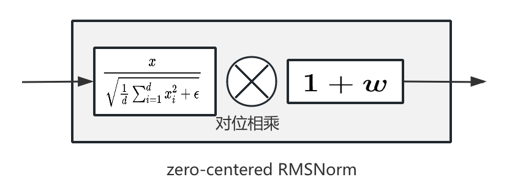

在 Qwen‑3‑Next 发布后，我对官方给出的模型架构图产生了浓厚的兴趣。遗憾的是，仅凭一张示意图难以窥见其内部细节——从图中我们只能粗略得知模型共计 **48 层** ，被划分为 **12 组** （每组 4 层）。**前 3 层**  采用 **Gated DeltaNet**  线性注意力机制，这种设计能够显著提升计算效率并降低显存占用。**第 4 层**  则回归为传统的 **Full Self‑Attention** ，在输出阶段额外加入了一道门控，以进一步增强表征能力。与此同时，为了解决原始的 Q‑K 归一化（QK‑norm）中部分权重出现异常放大的现象，Qwen团队在模型中引入全新的 **Zero‑Centered RMSNorm**  归一化方式，以实现更稳健的数值行为。为深入探究这些创新背后的真实实现细节，我决定打开源码进行逐行阅读，期待在代码层面揭开 Qwen‑3‑Next 结构的全部奥秘。如果大家对这其架构感兴趣，可以一块沟通讨论。

**友情提示：如果暂没时间细看可以先收藏哟** 

Qwen3-Next发布，创新引领新的技术发展 - 李先生的文章 - 知乎

[Qwen3-Next发布，创新引领新的技术发展](https://zhuanlan.zhihu.com/p/1949747207440958834)

首先我们来看一下Qwen3-next提供了模型架构图

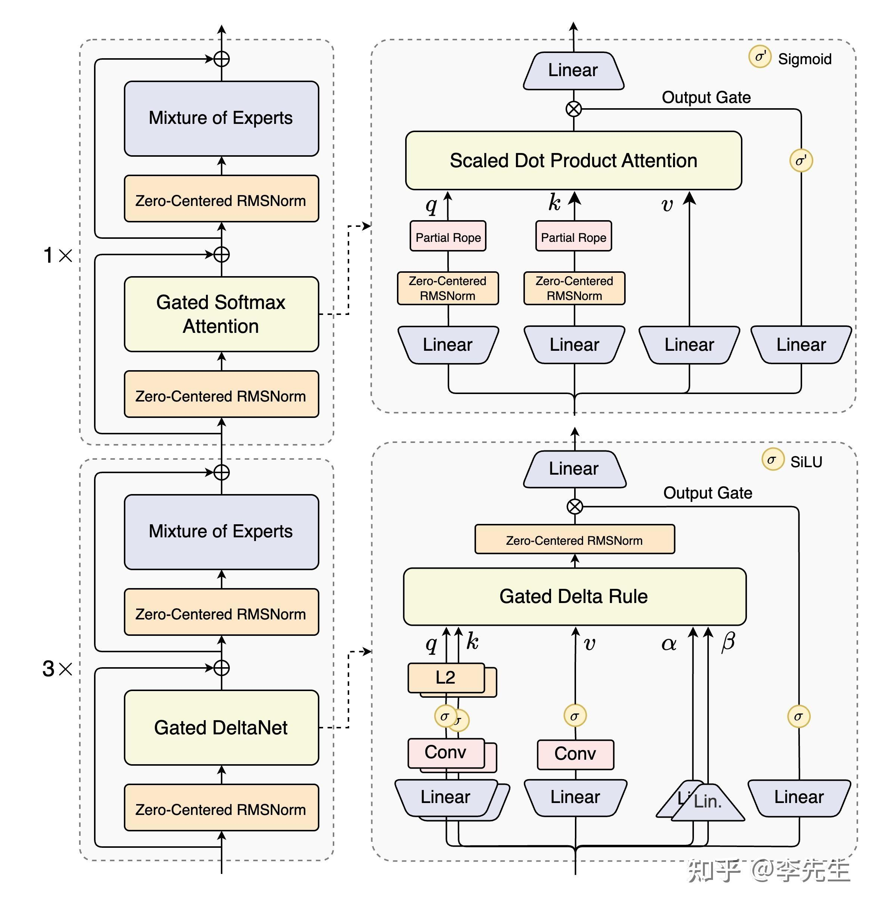

*Qwen3-next模型架构图*

## 新的归一化方法zero-centered RMSNorm

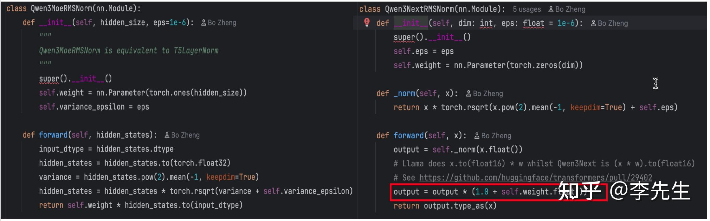

*归一化方式对比*

上面是左图是Qwen3-MoE中使用的归一化方式，右图是Qwen3-next使用归一化方式

二者公式差异主要

$\text{Qwen3-MoE-RMSNorm}(x) \;=\; \frac{x}{\sqrt{\frac{1}{d}\sum_{i=1}^{d} x_i^2 + \epsilon}}\cdot w$ 

$\text{Qwen3-next-RMSNorm}(x) \;=\; \frac{x}{\sqrt{\frac{1}{d}\sum_{i=1}^{d} x_i^2 + \epsilon}}\cdot(1+w)$ 

前者使用归一化 $w$ 会初始为1， 后者 $w$ 初始为0,  也就是这个差异能够让Qwen3-next归一化之后相应参数能够很好约束在零中心。 由此图中的Zero-Centered RMSNorm操作如下， 对应代码上面Qwen3NextRMSNorm操作

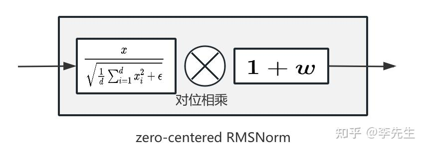

## Gated DeltaNet

对应源码为class Qwen3NextGatedDeltaNet(nn.Module)类，为了方便理解这里将整体代码中forward操作整理完整的数据公式流程

输入： $h_t \in \mathbb{R}^{\text{hidden_size}}$ 其中这里hidden_size在Qwen3-next-80B下为2048

### 第一步  线性操作（对应图中的Linear操作）

通过分别通过二个参数矩阵线性投影得到 $Q_t, K_t, V_t, Z_t$ ，及其门控参数 $\alpha_t,\beta_t$ .  这里相比之前传统标准的self attention操作多了一个 $Z_t$ 向量对应图中的，同时加入了门控参数 $\alpha_t,\beta_t$ 具体公式如下所示

$Q_t, K_t, V_t, Z_t = W_{qkvz} h_t \in \mathbb{R}^{d_k, d_v, d_z}$ 

$\beta_t, \alpha_t = W_{ba} h_t \in \mathbb{R}^{\text{num_v_heads}}$ 

其中 $W_{qkvz}$ 对应源码的成员操作函数self.in_proj_qkvz， $W_{ba}$ 对应源码的成员操作函数self.in_proj_ba

```text
self.in_proj_qkvz = nn.Linear(self.hidden_size, projection_size_qkvz, bias=False) #2048 (128*16*2 + 128*32*2)=>(128*96)
self.in_proj_ba = nn.Linear(self.hidden_size, projection_size_ba, bias=False)#2048 128*64
```

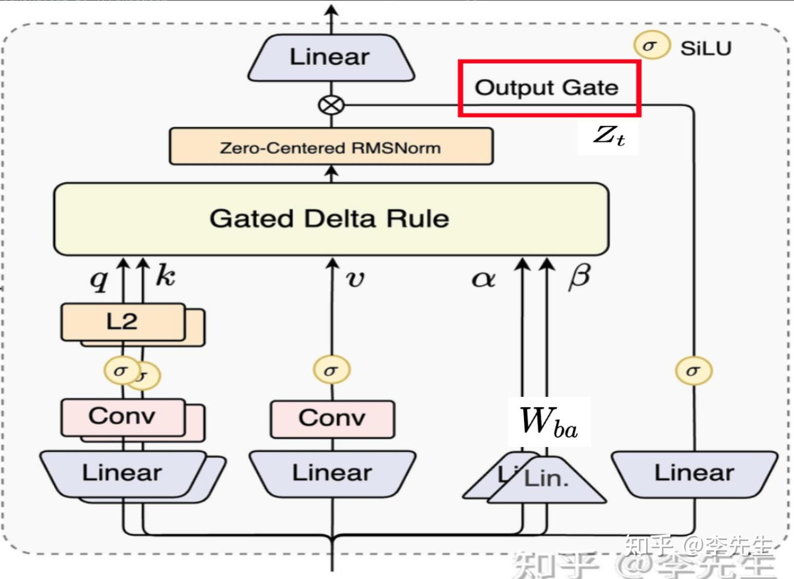

### 第二步： 卷积操作（对应图中Conv操作）

将当前的输入状态与历史指定信息进行卷积操作，历史信息考虑长度为4，对应模型配置文件中config.json中的"linear_conv_kernel_dim":4, 在代码并为针对 $Q_t,K_t,V_t$ 分别卷积，而是拼接在一块卷积之后再进行拆分的与图中显示单独卷积有所差异

$X_t = \text{concat}(Q_t, K_t, V_t) \in \mathbb{R}^{d_{\text{conv_dim}}}$ 

$\tilde{X}_t = \text{Conv1D}_{\text{depthwise}}(X_{t-k+1:t}) \in \mathbb{R}^{d_{\text{conv_dim}}}$ 其中k为4

$\tilde{X}_t=F.silu(\tilde{X}_t)$ 

$Q'_t, K'_t, V'_t = \text{split}(\tilde{X}_t)$ 

其中 $\tilde{X}_t$ 对应代码中mixed_qkv变量， 其中 $Q'_t, K'_t, V'_t$ 对应卷积之后的结果， $\text{SiLU}(x) = \frac{x}{1 + e^{-x}}$ 对就图中SiLU操作

对应如下代码中torch.split操作

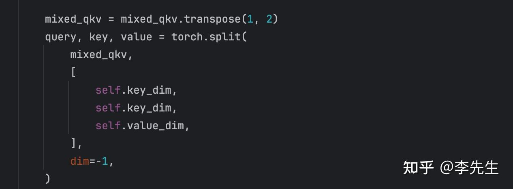

### 第三步：计算门控参数

$\begin{aligned} \beta_t &= \sigma(\beta_t) \in (0,1) \quad \text{(控制增量更新幅度)} \\ g_t &= - \exp(A_{\log}) \cdot \text{softplus}(\alpha_t + \Delta t) \quad \text{(控制历史状态保留比例)} \end{aligned}$ 

$\text{softplus}(x) = \log(1 + e^x)$ 

其中 $A_{log}$ 定义如下所示

```text
A = torch.empty(self.num_v_heads).uniform_(0, 16)
self.A_log = nn.Parameter(torch.log(A))
```

$\Delta_t$ 定义如下源码中的

```text
self.dt_bias = nn.Parameter(torch.ones(self.num_v_heads))
```

### 第四步：Gated Delta Rule 核心更新

这一步的核心操作调用的函数是torch_chunk_gated_delta_rule进行操作

$h_t^{\text{core}} = g_t \cdot h_{t-1}^{\text{recurrent}} + f(Q'_t, K'_t, V'_t, \beta_t)$ 

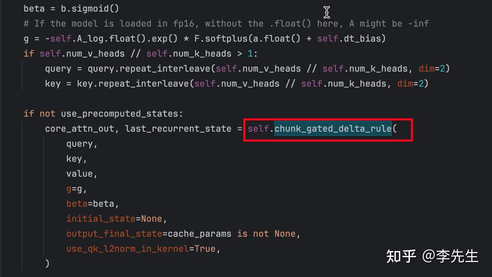

上图前二行对应第三步中门控参数计算方式，后面红框表示了这里的核心操作Gated Delta Rule执行流程

1）归一化 $Q'_t, K'_t$ 

${q}_t = \frac{Q'_t}{\sqrt{\frac{1}{d_h} \sum_i Q_{t,i}^2 + \epsilon}} \cdot \frac{1}{\sqrt{d_h}},\quad {k}_t = \frac{K'_t}{\sqrt{\frac{1}{d_h} \sum_i K_{t,i}^2 + \epsilon}} \cdot \frac{1}{\sqrt{d_h}}$ 


2)基于门控 $\beta_t$ 进行

$v^\beta_t = \beta_t \odot v_t,\quad k^\beta_t = \beta_t \odot k_t$ 其中 $v_t$ 为第二步中 $V'_t$ 

$\hat{g}_t = \sum_{j=1}^{t} g_j$ 

$D_{t,j} = \exp(\min(\hat{g}_t - \hat{g}_j, 0))$ 

$A^{\text{block}} = - (k^\beta k^\top) \odot D$ 

$A^{\text{block}}_{i,j} = A_{i,j} + \sum_{k<i} A_{i,k} \cdot A_{k,j}$ 

$A^{\text{block}} \gets A^{\text{block}} + I$ 

$V^{\text{out}} = A^{\text{block}} v^\beta,\quad K^{\text{cum}} = A^{\text{block}} (k^\beta \odot \exp(G))$ 

$S_{t}^{\text{new}} = S_{t-1} \odot \exp(G_{t,-1}) + (K_t \odot (\exp(G_{t,-1}) - \exp(G_t)))^\top \cdot V^\text{residual}_t$ 

 其中 $V^\text{residual}_t = V_t - K^{\text{cum}}_{t} \cdot S_{t-1}$ 

$h_t^{core} = (Q \odot \exp(G)) \cdot S_{t-1} + A^{\text{block}} \cdot V^\text{residual}_t$ 

关于此可以参考论文[https://arxiv.org/pdf/2412.06464](https://arxiv.org/pdf/2412.06464)GATED DELTA NETWORKS : IMPROVING MAMBA 2 WITH DELTA RULE

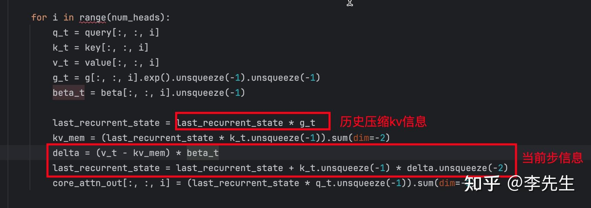

### 第五步： OutPut Gate操作

对应操作对应代码为定义在代码中Qwen3NextRMSNormGated, 从其前向操作的数学表达方式如下所示

$h_t^{\text{out}} = \mathbf{w} \odot \frac{h_t^{\text{core}}}{\sqrt{\frac{1}{d} \sum_{i=1}^{d} (h_{t,i}^{\text{core}})^2 + \epsilon}} \odot \mathrm{SiLU}(Z_t)$ 

其中 $h_t^{\text{core}}$ 为Gated Delta Rule操作之后的输出结果， $w$ 为RMSNormGated中参数， $Z_t$ 为第一步中线性操作结果。

```text
class Qwen3NextRMSNormGated(nn.Module):
    def __init__(self, hidden_size, eps=1e-6, **kwargs):
        super().__init__()
        self.weight = nn.Parameter(torch.ones(hidden_size))
        self.variance_epsilon = eps

    def forward(self, hidden_states, gate=None):
        input_dtype = hidden_states.dtype
        hidden_states = hidden_states.to(torch.float32)
        variance = hidden_states.pow(2).mean(-1, keepdim=True)
        # Norm before gate
        hidden_states = hidden_states * torch.rsqrt(variance + self.variance_epsilon)
        hidden_states = self.weight * hidden_states.to(input_dtype)
        hidden_states = hidden_states * F.silu(gate.to(torch.float32))

        return hidden_states.to(input_dtype)
```

### 第六步：线性变换输出

此操作为一步线性操作，对应公式与代码如下所示

$h_t=W_oh_t^{core}$ 

```text
self.out_proj = nn.Linear(self.value_dim, self.hidden_size, bias=False)
output = self.out_proj(core_attn_out)
```

通过以上六步就可以得到图中Gated DeltaNet的输出了，输出之后经过残差加之后，通过zero-centered RMSNorm归一化之后再经过MOE操作，对应其中代码如下所示

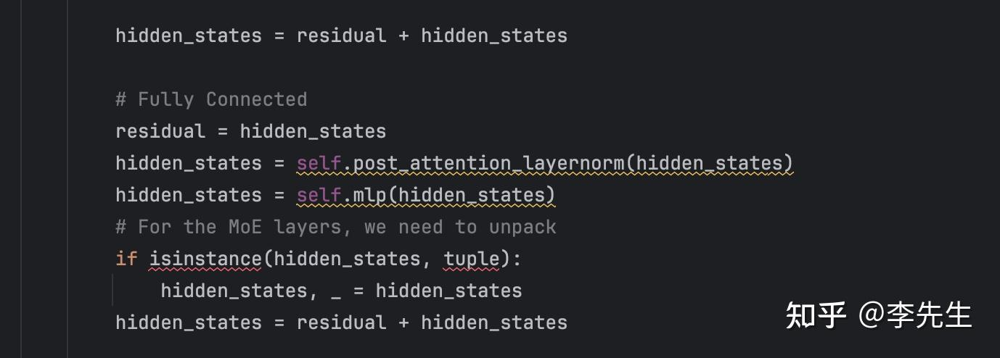

其中post_attention_layernorm会调用Qwen3NextRMSNorm类方法也就是zero-centered RMSNorm归一化， 然后经过mlp操作，这里mlp操作对应图中MOE，对应Qwen3NextSparseMoeBlock(config)类方法。

## Gated softmax Attention

这里相比传统的soft attention操作，加了一个门控操作，与原始self attention差异不大，具体代码见此类

```text
class Qwen3NextAttention(nn.Module):
    """Multi-headed attention from 'Attention Is All You Need' paper"""
```

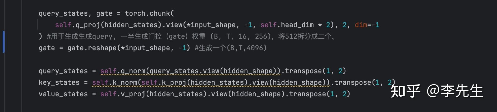

*Gated softmax Attention*

这里有三个线性变换，其中Q向量与门控向量在一个线性投影完成进行拆分的，其中gate类似Gated DeltaNet操作门控向量 $Z_t$ , Q、K向量会调用self.q_norm与self.k_norm这二个操作函数都对应了zero-centered RMSNorm操作也就是代码中Qwen3NextRMSNorm类方法。得到Q、K、V向量之后，执行旋转位置编码query_states, key_states = apply_rotary_pos_emb(query_states, key_states, cos, sin)进行传统的self attention操作。对应输出之后再进行门控操作，具休如下面的代码操作

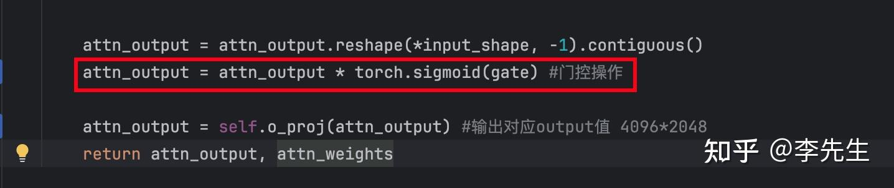

门控操作之后，再通过线性变换进行输出。

通过以上操作可以得到图中Gated softmax Attention的输出了，输出之后经过残差加之后，通过zero-centered RMSNorm归一化之后再经过MOE操作，对应其中代码如下所示

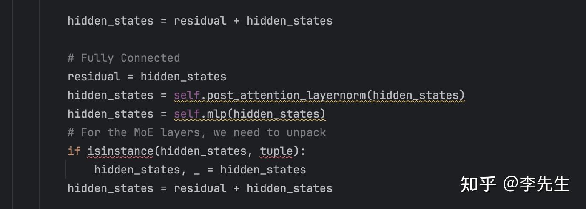

其中post_attention_layernorm会调用Qwen3NextRMSNorm类方法也就是zero-centered RMSNorm归一化， 然后经过mlp操作，这里mlp操作对应图中MOE，对应Qwen3NextSparseMoeBlock(config)类方法。

***： 从当前代码来看，暂时没有看到图中所示的**Partial Rope操作** ，也可能是我当前理解有误，大家有什么好的理解，请反馈讨论。

**算法老兵一枚，目前主要折腾大模型的 SFT 和 RL。日常就是在各种奇葩场景里给模型“踩坑+解惑”，用实验一点点把它们祛魅存真。写作不易，求个关注点个赞，咱们一起交流~。** 