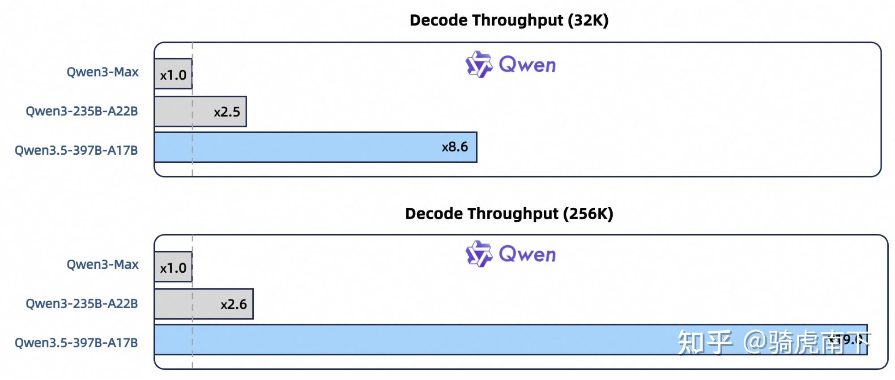
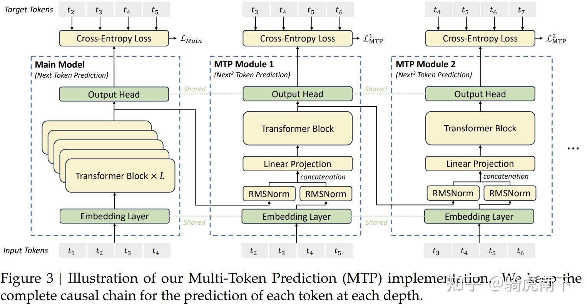
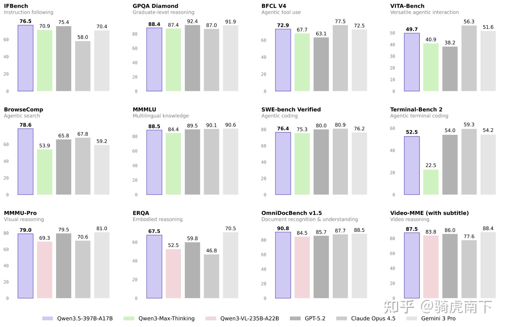
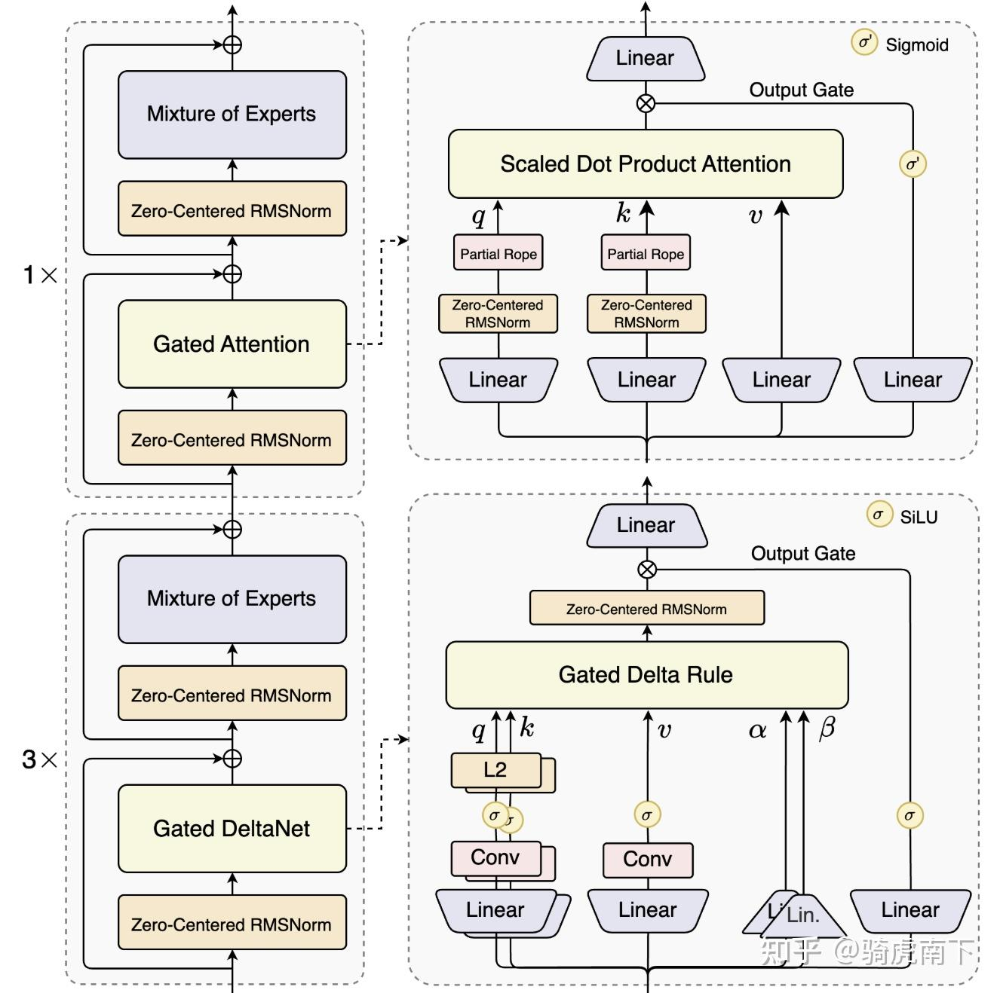
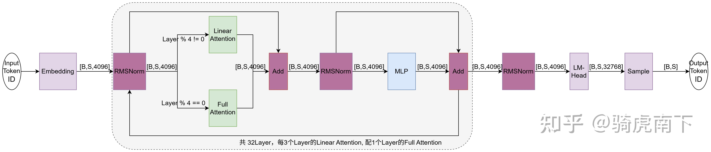
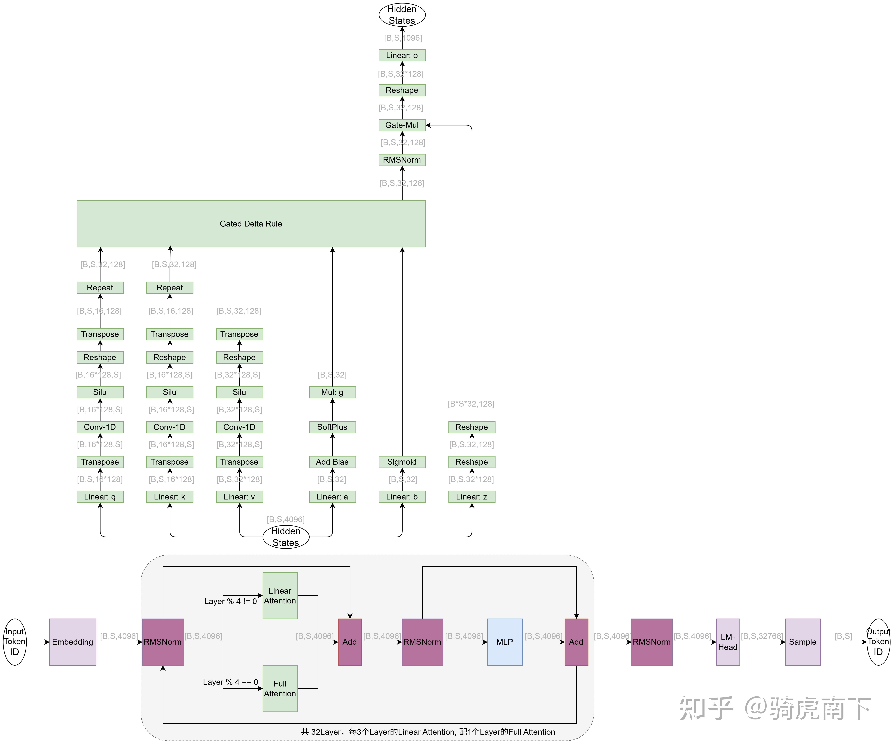
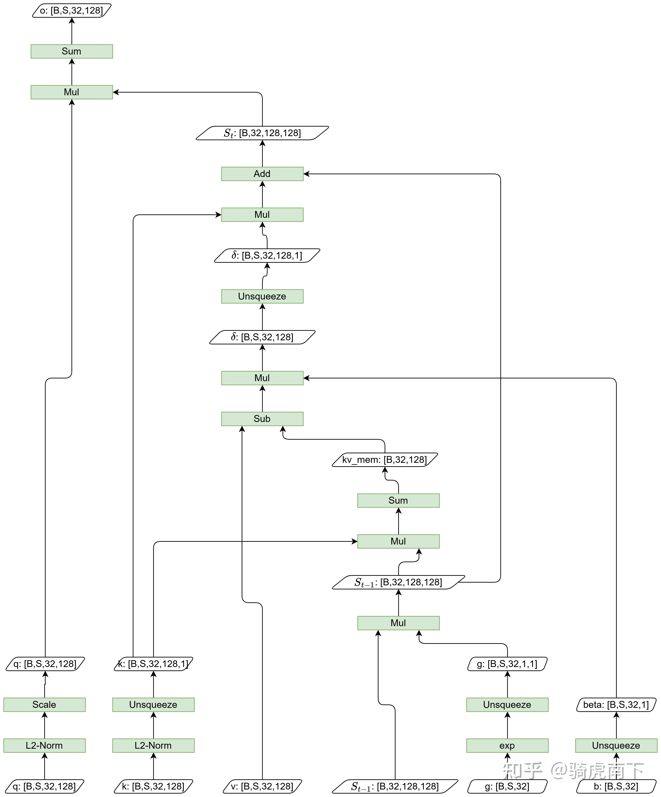
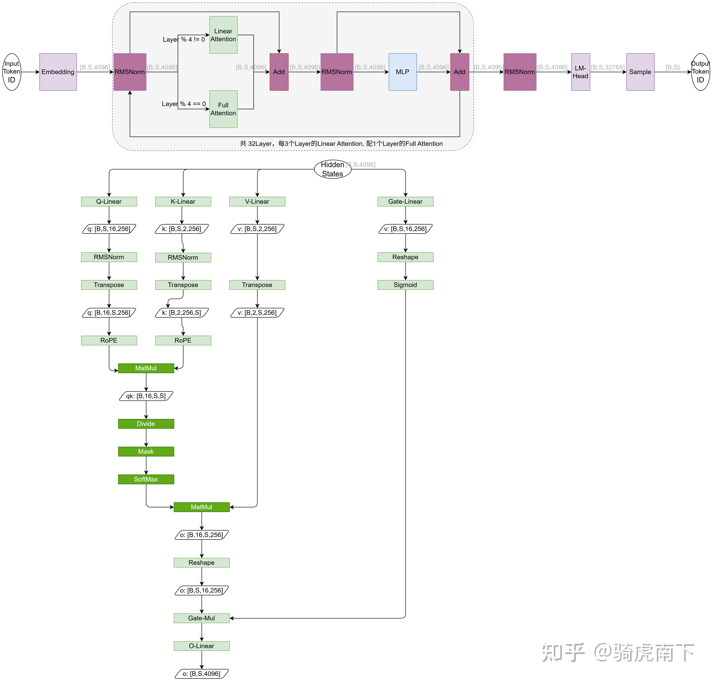
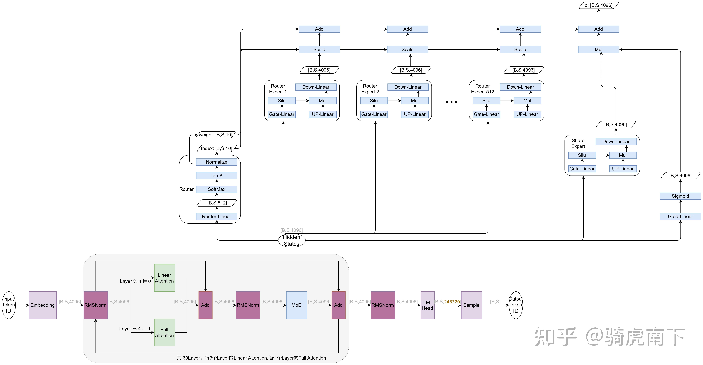

**先总结Qwen3.5-397B-A17B主要技术亮点：** 

- Linear Attention与Full Attention以3:1比例混合设计，Linear Attention将注意力计算复杂度从 $O(n^2d)$ 下降到 $O(nd^2)$ ，大大减少计算量。



*在 32k/256k 上下文长度下，Qwen3.5-397B-A17B 的解码吞吐量分别是 Qwen3-Max 的 8.6 倍/19.0 倍，且性能相当。Qwen3.5-397B-A17B 的解码吞吐量分别是 Qwen3-235B-A22B 的 3.5 倍/7.2 倍。*

- 更稀疏的MoE专家模块，共512专家每个Token推理仅激活10个专家，397B总参数仅激活17B，在保持顶级推理能力的同时大幅降低计算成本。


- 门控的极致运用，在Linear Attention/Full Attention/MoE中有对V/Attention输出/共享专家的门控限制，经典RNN技术与现代Transformer技术的融合（下面章节中会有详细介绍 ）。


- MTP（Multi-Token Prediction）采样技术运用：无论是训练还是推理均能带来1.5倍左右吞吐提升，能够在保证精度的前提下提高token吞吐率。这在Deepseek中已经被证实非常好用，也是极致压缩成本的体现：



*Deepseek中的MTP训练示意*

- 1M的超强上下文能力，多语言覆盖从 119 增至 201 种语言/方言；从15万的词表扩展到25 万词表，相比之前Qwen3在多数语言上带来约 10–60% 的编码/解码效率提升。


- 是原生的多模态模型：传统的VLM模型是Vit提取特征，再交给LLM模型去理解，Qwen3.5 通过异构基础设施实现高效的原生多模态训练：在视觉与语言组件上解耦并行策略，避免统一方案带来的低效。无论是自然语言还是视觉语言相比于其他模型均表现卓越：



整个技术在2025曾获得NIPS的最佳论文：[<Gated Attention for Large Language Models: Non-linearity, Sparsity, and Attention-Sink-Free>](https://arxiv.org/abs/2505.06708)，这是一次从理论到工程的最佳实践。


---


以下是我根据Transformer仓中悄悄上线的[Qwen3.5模型的源码](https://github.com/huggingface/transformers/tree/main/src/transformers/models/qwen3_5)梳理的Text模型的结构与源码流程，方便大家理解Linear Attention，门控如何实现，MoE模块如何稀疏化等。

Transformer仓中Qwen3.5代码，包含Text模型也就是纯粹LLM模型与Vision多模态模型。另外同时上传还有一款[MoE模型源码](https://github.com/huggingface/transformers/tree/main/src/transformers/models/qwen3_5_moe)。

## Qwen3.5 Text Dense(稠密)模型

### 整体结构



如上图是Qwen3-Next模型的核心结构，采用了Gated DeltaNet（Linear Attention） + Gated Attention（Full Attention）的混合架构。在[Qwen的官网有详细介绍](https://qwen.ai/blog?id=4074cca80393150c248e508aa62983f9cb7d27cd&from=research.latest-advancements-list)，另外在我的之前文章中有一些分析：

[Qwen3-Next模型结构与源码逻辑](https://zhuanlan.zhihu.com/p/1957120668043814101)

在Qwen3.5 Text模型上继续沿用了这种混合架构的设计：



如上图，是根据Qwen3.5-Text Dense模型的Transformer源码整理的模型算子流程图。

其中[B，S，4096]是算子之间流动传递的Hidden States的Shape，B是Batch，S是Sequence Length。

该模型整体结构主要有以下几个特点：

1 .  Transformer Layer共32个，每3个Linear Attention间隔1个Full Attention。

2 .  词典长度32K，Hidden Size为4096，整体依然是Transformer Decode结构。

3 .  Add/MLP的计算逻辑与其他大语言模型一致，MLP的Intermediate Size为12288。

4 .  RMSNorm是采用了Zero Centered RMSNorm与经典的Deepseek/LLaMa不同。

### Linear Attention模块



如上图，是Qwen3.5 模型中的Linear Attention的算子流程图。

1 . Attention的Hidden States输入做Q/K/V Linear得到Q/K/V，其中Q/K的Shape为[B,S, 16*128]，16为Head Num，128为Head Dim，V的Head Num为32。

2 . 对于Q/K/V针对从当前Token往前的4个历史Token做因果局部卷积，局部特征融合，再做Silu激活后喂到Gated DeltaRule模块计算注意力。

3 . Q/K的Repeat Interleave是将Q/K的每个Head数据复制一份排布在当前Head的后，保证与V的Shape一致。

4 . 将a的值加上dt_bias，再做Softplus激活，再乘以A_log.exp()后，取负值，主要用于Delta Rule中历史记忆的衰减。

5 . 将b的值做Sigmoid激活，得到beta，主要用于Delta Rule中的Value的门限控制。

6 . z经过Gate Linear后作为门控，Delta Rule的输出做RMSNorm（这里RMSNorm不是Zero-Centered RMSNorm）的结果，做点乘实现门限控制 。

### Gated Delta Rule



如上图是整个Gated DeltaRule的计算流程图，该Attention相比于传统的Self-Attention，用 O (n) 复杂度替代标准 Attention 的 O (n²) 复杂度，大降低了计算量。

相比于原Attention在推理过程需要维护一个KVCache，Gated DeltaRule只需要维护一个维度不受文本长度影响的状态记忆矩阵，该矩阵的shape为[b, head num,k-head-dim,v-head-dim]。

以下是Qwen3.5的Transformer源码中Gate Delta Rule的实现，针对每行代码我做详细注释。

```python3
def torch_recurrent_gated_delta_rule(
    query,               # Q矩阵，维度[b, s, 32, 128], 32是head num，128是Head Dim
    key,                 # K矩阵，维度[b, s, 32, 128], 32是head num，128是Head Dim
    value,               # V矩阵，维度[b, s, 32, 128], 32是head num，128是Head Dim
    g,                   # 门控衰减因子，维度[b, s, 32], 32是head num
    beta,                # 逐token衰减权重，维度[b, s, 32], 32是head num
    initial_state,       # 初始递归状态，维度[b, 32, 32, 32],在自回归推理中表示每个Layer初始状态
    output_final_state,  # 是否输出当前Layer最终递归状态（流式推理需返回，用于下一轮增量计算）
    use_qk_l2norm_in_kernel=False,  # 是否对Q/K做L2归一化，提升数值稳定性
):
    # 保存输入的原始数据类型（通常是fp16/bf16），最后还原以保证精度一致
    initial_dtype = query.dtype
    
    # 可选：对Q/K做L2归一化，避免QK^T（或递归状态）数值爆炸，提升注意力核稳定性
    if use_qk_l2norm_in_kernel:
        query = l2norm(query, dim=-1, eps=1e-6)  # 对每个token的每个head的128个特征做归一化
        key = l2norm(key, dim=-1, eps=1e-6) # 同上
    
    
    # 1. transpose(1,2)：[b, s, 32, 128] → [bs, 32, s, 128]
    # 2. contiguous()：保证张量内存连续，避免后续计算报错
    # 3. to(torch.float32)：低精度（fp16/bf16）下指数/矩阵乘易数值不稳定，转float32计算
    query, key, value, beta, g = [
        x.transpose(1, 2).contiguous().to(torch.float32) for x in (query, key, value, beta, g)
    ]

     # 获取核心维度：batch_size=批大小，num_heads=头数，sequence_length=序列长度，k_head_dim=K的头维度
    batch_size, num_heads, sequence_length, k_head_dim = key.shape
    v_head_dim = value.shape[-1]  # V的每个head的维度（可与K不同）
    
    # Attention标准缩放因子：1/√d_k，防止Q的数值过大导致递归状态爆炸
    scale = 1 / (query.shape[-1] ** 0.5)
    query = query * scale  # 对所有Q做缩放,这与传统的self-Attention中一致。


    # 初始化注意力输出张量：维度[b, 32, s, 128]，初始值全0
    core_attn_out = torch.zeros(batch_size, num_heads, sequence_length, v_head_dim).to(value)
    
    # 初始化递归状态（保存历史K/V的加权信息，避免计算全局QK^T）：
    # - 若initial_state为None：首次计算时初始化为全0张量，维度[b, 32, 128, 128]
    # - 若initial_state不为None：自回归推理中复用前一轮（其实是上一个Token推理）的最终状态，实现增量计算
    last_recurrent_state = (
        torch.zeros(batch_size, num_heads, k_head_dim, v_head_dim).to(value)
        if initial_state is None
        else initial_state.to(value)
    )

    # 遍历每个token（时序维度），仅依赖当前及之前token
    for i in range(sequence_length):
        q_t = query[:, :, i]          # [b, 32, 128]：第i个token的Q
        k_t = key[:, :, i]            # [b, 32, 128]：第i个token的K
        v_t = value[:, :, i]          # [b, 32, 128]：第i个token的V
        # g_t：第i个token的门控衰减因子，exp()将线性衰减转为指数衰减
        # .unsqueeze(-1).unsqueeze(-1)将g_t的Shape扩展为[b, 32, 1, 1]（方便与递归状态矩阵做广播相乘）
        g_t = g[:, :, i].exp().unsqueeze(-1).unsqueeze(-1)
        # beta_t：第i个token的逐token衰减系数，unsqueeze适配V的维度
        # .unsqueeze(-1)将beta_t的Shape变换为[b, 32, 1]（方便和xx广播相乘）
        beta_t = beta[:, :, i].unsqueeze(-1)

        # 核心逻辑：历史Token状态随Token生成，做指数级衰减，避免远的历史Token信息占比过高
        # last_recurrent_state: [b, 32, 128, 128]
        last_recurrent_state = last_recurrent_state * g_t

        # 1. k_t.unsqueeze(-1)：将k_t的Shape变换为[b, 32, 128, 1]
        # 2. last_recurrent_state * k_t.unsqueeze(-1)：广播相乘，提取历史状态中与当前K匹配的部分
        # 3. sum(dim=-2)：对k_head_dim维度求和，得到[b, 32, v_head_dim]，v_head_dim是128
        kv_mem = (last_recurrent_state * k_t.unsqueeze(-1)).sum(dim=-2)

    
        # 核心逻辑：delta = (当前V - 历史V贡献) × 逐token衰减系数beta_t
        # 物理意义：只保留当前V中“未被历史信息覆盖的新内容”，beta_t控制新内容的权重
        delta = (v_t - kv_mem) * beta_t  # [b, 32, v_head_dim]， v_head_dim是128

    
        # 1. k_t.unsqueeze(-1)：将k_t的Shape变换为[b, 32, k_head_dim, 1], k_head_dim也是128
        # 2. delta.unsqueeze(-2)：将delta的Shape变换为[b, 32, 1, v_head_dim]
        # 3. 外积运算：k_t ⊗ delta → [b, 32, k_head_dim, v_head_dim]
        # 4. 更新得到当前的递归状态，这个递归状态可以理解为K*V，就是历史Token对于生成当前Token的累加贡献
        last_recurrent_state = last_recurrent_state + k_t.unsqueeze(-1) * delta.unsqueeze(-2)

        # 1. q_t.unsqueeze(-1)：将输入q的Shape变换为[b, 32, k_head_dim, 1]
        # 2. last_recurrent_state * q_t.unsqueeze(-1)：广播相乘 
        # 3. sum(dim=-2)：对k_head_dim维度求和，得到[b, 32, v_head_dim]
        # 物理意义：当前Q对历史所有K/V加权和的“查询结果”，等价于标准Attention的Q×(KV^T)
        core_attn_out[:, :, i] = (last_recurrent_state * q_t.unsqueeze(-1)).sum(dim=-2)

    # 若不需要输出最终递归状态（非流式推理），置为None以节省显存
    if not output_final_state:
        last_recurrent_state = None
    
    # 维度还原：transpose(1,2) → [b, s, 32, v_head_dim]（回到输入的维度顺序）
    # contiguous()：保证内存连续；to(initial_dtype)：还原为原始精度（fp16/bf16）
    core_attn_out = core_attn_out.transpose(1, 2).contiguous().to(initial_dtype)
    
    # 返回注意力输出 + 最终递归状态
    return core_attn_out, last_recurrent_state
```

Gated DeltaRule的核心公式，如下

**记忆状态更新：** 

$S_t = \alpha * S_{t-1}(I - \beta_t*k_t*k_t^T) + \beta_t * v_t * k_t^T$ 

$= \alpha * S_{t-1} + \beta_t*(-\alpha * S_{t-1}*k_t + v_t) * k_t^T$ 

其中，

$I$ 为单位矩阵。

$\alpha$ 就是源码中g，也就是门控衰减因子，主要控制历史Token对当前Token的影响。

$\beta$ 就是源码中b与beta，新Token的控制权重。

整个过程大计算以点乘为主，计算量在 $O(d)$ ，Token与Head之间互不影响。

**Attention的输出结果：** 

$o_t = S_t * q_t$其中 $S_t$ 是计算得到的状态， $q_t$ 是Query，t是当前Token。计算得到状态矩阵后乘以query得到attention的输出结果！


### Full Attention模块



如上图，绿色部分是Qwen3.5的Full Attention模块的详细流程图，其中例如B,S,4096表示算子流转的Hidden States的Shape。B表示Batch推理过程中的并发数，S表示Sequence Length，Prefill阶段是Prompt Length，Decode阶段是1（MTP方案下另说）。

整个Full Attention与传统的Self-Attention并无差别, 其中Q Head Num为16，Head Dim为256，K/V Head Num为2，Attention模块是一个标准的GQA。

需要特别注意的是，Attention模块的输入经过一个Gate-Linear再做Sigmoid得到0~1之间的值作为门控因子，对Attention的输出同样做一个门限控制。

## Qwen3.5 Text MoE(稀疏)模型


如上图，是Qwen3.5-MoE模型的示意图，该模型有以下几个特点：

1 . 与Dense模型一致，均是3Layer的Linear Attention，配1Layer的FullAttention。

2 . 整个模型共40个Layer，所有Layer的MLP模块均为MoE。

3 . 其中Linear Attention与Full Attention与前文介绍的一致，Hidden Size变更为2048。

4 . 因只有MoE的区别，这里着重介绍MoE模块的具体流程，如图中蓝色算子流程图所示：

- Router模块主要作用是对于Hidden States计算Top-K选出每个Token由哪8个路由专家计算，以及这8个路由专家计算结果的权重。
- 每个MoE模块均有一个共享专家，共享专家的计算结果由Gate-Linear计算得到的门控因子做门限控制，累加到MoE模块的最终结果上。
- 选出来的8个路由专家的计算结果，根据Router计算权重累加到MoE的最终结果上。

总之，对于每个Token由8个路由专家结果以一定权重累加到一起，再与1个共享专家门控后的结果累加到一起。


### Qwen3.5-397B-A17B结构



如上图是根据Qwen3.5-397B-A17B的[huggingFace配置](https://huggingface.co/Qwen/Qwen3.5-397B-A17B/blob/main/config.json)及Transformer源码整理的模型结构图。

1 . 相比于Transformer仓中的默认配置，该模型共60Layer，15个Layer的FullAttention，45个Layer的Linear Attention。

2 . 算子之间传递的Hidden States的Shape为[B, S, 4096]，词表长度为248320，最长能处理256K的文本。

3 . 其中Linear Attention模块与前文描述的逻辑一致，只是V Head个数为64个，Q/K Head个数为16个，在Gated Delta Rule中均64个Head。

4 . 其中Full Attention模块与前文描述的逻辑一致，但是Attention Head为32，K/V Head 为2。

5 . 其中MoE模块与前文描述逻辑也一致，区别如下：

a .  每个Token选10个路由专家参与计算。

b .  路由专家与共享专家的Intermediate Size为1024，默认配置为512。

 6 . 该模型有一个额外的MTP层，即第共61Layer，该layer作为草稿模型，与前60Layer作为主模型，实现随机采样，一次推理生成两个Token。