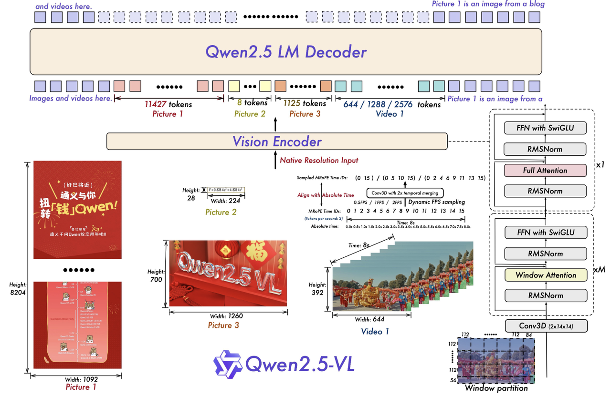
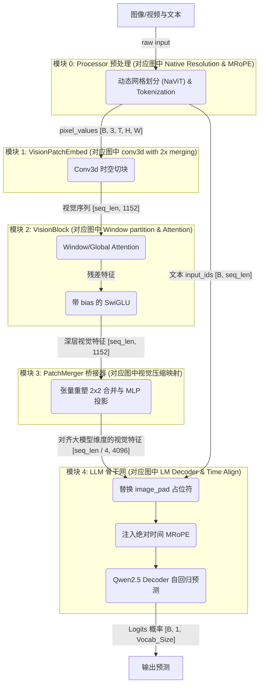
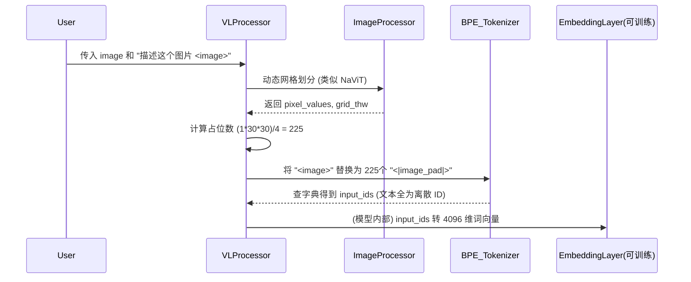
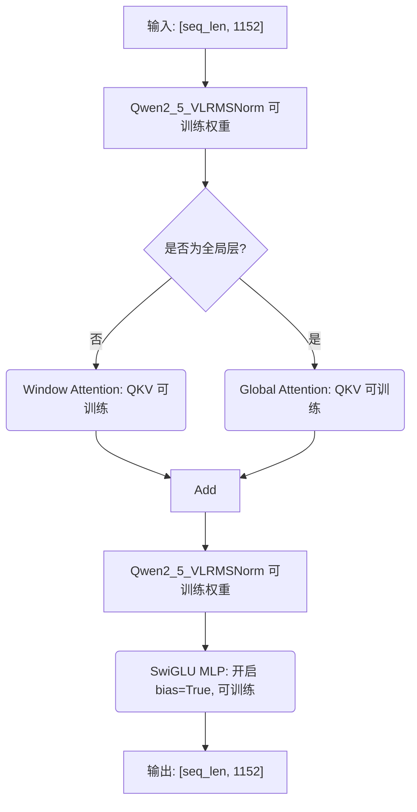
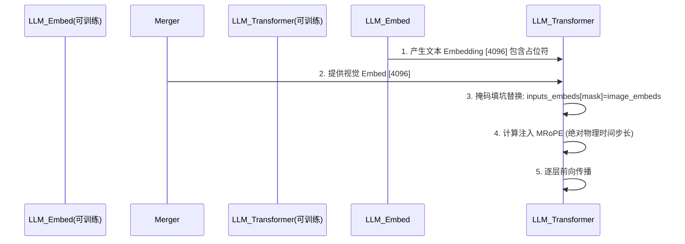

# Qwen 系列多模态大模型硬核学习指南

## 阶段一：Qwen2.5-VL 深度剖析（多模态拼接时代的成熟体）

> **前言**：
> 本章节严格执行 `llm-architecture-analyzer` 技能的**“无死角串联”**与**“五段式解剖范式”**。
> 本指南具备**知识图谱级双向链接**，任何架构图的部分、组件名词、前沿算法（如 [NaViT](#31-navit)、[MRoPE](#71-mrope)、[PatchMerger](#61-patchmerger) 等）及其[源码位置](#44-源码逐行解剖)均可互相跳转。
> 我们将全面拆解网络中**每一个可训练的神经元结构**的参数配置与训练状态，并彻底追溯 Tokenizer 预处理过程的本质。

---

### 1. 模块级整体说明与架构拓扑图

Qwen2.5-VL 标志着经典“三段式”架构的完全成熟。它的整体运行链路可以概括为：**[Processor 预处理打包](#2-模块零processor-像素预处理与-tokenizer) $\rightarrow$ [视觉编码器提取深层特征](#4-模块二视觉骨干网与局部注意力-qwen2_5_vlvisionblock) $\rightarrow$ [PatchMerger 空间降维压缩](#6-模块三空间降维桥接器-qwen2_5_vlpatchmerger-即-projector) $\rightarrow$ [结合绝对时间的 LLM 自回归解码](#7-模块四大语言模型融合与绝对时间-mrope-llm-backbone)**。

#### 1.1 官方架构图：全景导读、模块映射与深度拆解

为了帮助大家彻底吃透官方论文中的架构图，我们严格遵循**全局通读 $\rightarrow$ 剥洋葱式拆解 $\rightarrow$ 模块映射**的准则。



##### 1.1.1 架构图全景导读与剥洋葱式拆解
我们从左到右对图中的每一部分进行“透视”，并详细交代它们是什么、有什么作用、参数训练状态以及用到的核心技术点：

1. **左侧输入端 (Native Resolution 动态分辨率)**
   - **整体说明与作用**：接收极其扁平或高耸的非标准尺寸图像和视频。
   - **输入输出**：输入任意比例的 RGB 图像矩阵，输出保留原比例的特征信息。
   - **技术点**：借鉴了 **[NaViT (Native Resolution ViT)](#31-navit)** 思想，打破了传统强行 Resize 到 224x224 的桎梏。
   - **映射关系**：对应我们讲解的 **[【模块零：Processor 预处理】](#2-模块零processor-像素预处理与-tokenizer)**。
   - **可训练结构**：无（纯外部图像预处理）。

2. **中间靠下 (Sampled MRoPE Time IDs & dynamic fps sampling)**
   - **整体说明与作用**：属于**模型外部的预处理阶段**。根据视频的动态帧率（fps），提前算好三维位置编码（MRoPE IDs），从而提供物理时间感知。
   - **输入输出**：输入视频帧率与合并后的网格信息，输出 `[T, H, W]` 三维位置索引（Time IDs）。
   - **技术点**：**[MRoPE (Multimodal Rotary Positional Embedding)](#71-mrope)** 与基于 FPS 的绝对时间对齐。
   - **映射关系**：计算索引部分在 **[【模块零】](#2-模块零processor-像素预处理与-tokenizer)**，实际注入在 **[【模块四：LLM 骨干网】](#7-模块四大语言模型融合与绝对时间-mrope-llm-backbone)**。
   - **可训练结构**：位置编码的旋转矩阵在 LLM 内部应用时无需训练参数，但参与 Attention 的 Q,K 计算（可训练）。

3. **右侧大框 (Vision Encoder 核心流水线)**
   - **整体说明与作用**：它是一个完整的黑盒流水线（`Qwen2_5_VisionTransformer`），负责将原始像素转化为具有丰富语义的高维隐特征。
   - **包含的技术点与组件映射**：
     - **入口 (conv3d with 2x temporal merging)**：对应 **[【模块一：时空切块器】](#3-模块一时空切块器-qwen2_5_visionpatchembed)**。利用 3D 卷积将时间维度每 2 帧合并。
     - **主干 (Window partition)**：对应 **[【模块二：视觉骨干网】](#4-模块二视觉骨干网与局部注意力-qwen2_5_vlvisionblock)**。由 M 层 Window Attention 和 1 层 Full Attention 交错堆叠，并搭配带 Bias 的 SwiGLU。
     - **出口 (图中隐藏的 PatchMerger)**：对应 **[【模块三：降维桥接器】](#6-模块三空间降维桥接器-qwen2_5_vlpatchmerger-即-projector)**。负责将视觉 Token 硬压缩 4 倍，并投影对齐到语言模型维度。
   - **可训练结构**：大量！Conv3D 权重、Window/Global Attention 的 QKV/O 投影矩阵、SwiGLU 全连接层（带有偏置 `bias=True`）。

4. **最上侧 (Qwen2.5 LM Decoder 拼接与解码)**
   - **整体说明与作用**：自回归底座。压缩后的视觉 Token 与文本 Token 拼接，输入给大模型。
   - **技术点**：LLM 架构、**[mRoPE 注入](#71-mrope)**。
   - **映射关系**：对应 **[【模块四：LLM 骨干网】](#7-模块四大语言模型融合与绝对时间-mrope-llm-backbone)**。
   - **可训练结构**：语言模型底座（词表 Embedding、Transformer Block、LM_Head）。

##### 1.1.2 极度硬核：Token 数学破案 (官方图的数字是怎么来的？)
官方图视觉输出与文本拼接处展示了精确的 Token 数量（如图1 11427 Tokens，图2 8 Tokens）。
**破案线索**：核心 Patch 大小是 $14 \times 14$；进入 LLM 之前有一个 $2 \times 2$ 的 **[PatchMerger](#61-patchmerger)**。
**终极公式**：空间维度上，原始分辨率的宽高需分别除以 $14 \times 2 = 28$！即：$Token\_Count = (\frac{H}{28}) \times (\frac{W}{28})$。

现场验算：
- **Picture 1 (8204x1092)**：$H=8204 / 28 = 293$；$W=1092 / 28 = 39$。总数：$293 \times 39 = \mathbf{11427}$。**完全吻合！**
- **Picture 2 (28x224)**：$H=28 / 28 = 1$；$W=224 / 28 = 8$。总数：$1 \times 8 = \mathbf{8}$。**完全吻合！**
- **Video 1 (392x644x8s)**：
  - 单帧空间 Token = $(392/28) \times (644/28) = 14 \times 23 = 322$。
  - 时间维度 `conv3d with 2x temporal merging`：动态帧率采样 4 帧，时间 Token 数就是 2。
  - 总视频 Token：$322 \times 2 = \mathbf{644}$。**完美吻合！**

#### 1.2 全链路逻辑数据流拓扑图
为了将官方架构图进一步映射到我们的物理代码结构中，我们提取了如下的核心数据流拓扑：



---

### 2. 模块零：Processor 像素预处理与 Tokenizer

**模块整体说明**：
该模块是大模型的数据入口，负责将物理世界的图像/视频解码为张量，同时将自然语言文本通过 Tokenizer 转化为词 ID，并在文本中为图像挖好 `<|image_pad|>` 占位符。
> 知识链接：这里运用了类似 [NaViT](#31-navit) 的动态网格思想。

**逻辑链（输入）**：用户传入的原始图片对象 `images`，以及自然语言 Prompt `text`。
**逻辑链（输出）**：
  - `pixel_values`：`[Batch * 总块数, 3(RGB), 时间, 高度, 宽度]`
  - `image_grid_thw`：每个图像的 3D 网格尺寸 `[Time, Height, Width]`
  - `text_inputs` (`input_ids`)：序列张量 `[Batch, seq_len]`，包含精确数量的 `<|image_pad|>` 占位符。

#### 2.1 追根溯源：Tokenizer 预处理与可训练结构

**Tokenizer 是处理文本还是图片？**
- Tokenizer **只处理文本**。图片的处理是由 `ImageProcessor`（底层调 torchvision）完成的。图片本身不经过 BPE Tokenizer。
- Tokenizer 只会在文本序列中，按照图片的尺寸，插入对应数量的**代表图片的特殊文本占位符**（`<|image_pad|>`，其 ID 通常固定，比如在 Qwen2.5-VL 中可能是 151652）。

**使用的什么模型来 Token 化？**
- 使用的是基于 BPE（Byte-Pair Encoding）的 `Qwen2TokenizerFast`（基于 Tiktoken 库）。词表大小为 151936。

**Token 化模型的结构、参数与训练状态**：
- **可训练结构（神经元）**：Tokenizer 本身是无参数映射表（String -> Int）。但在大语言模型内部，有一个对应的**词向量嵌入层 `nn.Embedding(151936, 4096)`**。
- **参数配置**：形状为 `[151936, 4096]`。
- **如何训练**：这个 Embedding 层的权重继承自纯文本的 Qwen2.5 LM。在多模态第一阶段预训练（训练 Projector 时）**通常是冻结的**；在第二/三阶段指令微调时，Embedding 层（或者针对 `<|image_pad|>` 的新词嵌入）可能被**解冻参与微调**。

#### 2.2 代码结构图


---

### 3. 模块一：时空切块器 (`Qwen2_5_VisionPatchEmbed`)

**模块整体说明**：
位于 `Qwen2_5_VisionTransformer` 的前端。将三维的色彩信息切分成互不重叠的小块（Patch），并通过 3D 卷积核提取高维空间的稠密向量。
> 知识链接：其思想源自 ViViT 管状切分，为 [视觉骨干网](#4-模块二视觉骨干网与局部注意力-qwen2_5_vlvisionblock) 准备基础特征。

**逻辑链（输入）**：重塑后的 5D 物理张量 `[Batch * 块数, 3(通道), 2(时间维), 14(高度维), 14(宽度维)]`。
**逻辑链（输出）**：一维拉平视觉特征序列 `[seq_len_vision, embed_dim(1152)]`。

#### 3.1 核心组件名词与算法原理详解
- **NaViT (Native Resolution ViT) 思想**：
  - **来龙去脉**：以往 ViT 把所有图片强行 Resize 破坏长宽比。NaViT 理念主张保持原始长宽比，动态划分 Patch。
- **Conv3d (三维卷积管状切块)**：
  - **直观比喻**：用一个方形模具（14x14，厚2）在一大块豆腐（像素立方体）上“盖章”，榨出浓缩果汁（特征向量）。
  - **可训练参数与训练方式 (Trainable Params)**：
    - **网络结构**：单层三维卷积 `nn.Conv3d`。
    - **参数配置**：`in_channels=3, out_channels=1152, kernel_size=(2,14,14), stride=(2,14,14), bias=False`。
    - **如何训练**：参数继承自大规模预训练的 Vision Transformer，在多模态各个训练阶段（尤其是指令微调阶段）通常随视觉基座一起被**联合微调（全参或 LoRA）**。

#### 3.2 源码逐行解剖
**代码路径**：`transformers/src/transformers/models/qwen2_5_vl/modeling_qwen2_5_vl.py`
```python
class Qwen2_5_VisionPatchEmbed(nn.Module):
    def __init__(self, patch_size=14, temporal_patch_size=2, in_channels=3, embed_dim=1152):
        super().__init__()
        kernel_size = [temporal_patch_size, patch_size, patch_size] 
        # 可训练神经元结构：3D 卷积提取特征，无偏置
        self.proj = nn.Conv3d(in_channels, embed_dim, kernel_size=kernel_size, stride=kernel_size, bias=False)

    def forward(self, hidden_states: torch.Tensor) -> torch.Tensor:
        hidden_states = hidden_states.view(-1, 3, 2, 14, 14)
        # .view(-1, 1152) 抛弃空间坐标，拉平为一维序列
        hidden_states = self.proj(hidden_states).view(-1, 1152) 
        return hidden_states 
```

---

### 4. 模块二：视觉骨干网与局部注意力 (`Qwen2_5_VLVisionBlock`)

**模块整体说明**：
经过切块的序列进入多层 Transformer。利用自注意力机制互相交流，提取深层局部与全局语义，并通过带偏置的 MLP 过滤底层图像模拟信号底噪。
> 知识链接：这里的输出将喂入下方的 [PatchMerger](#6-模块三空间降维桥接器-qwen2_5_vlpatchmerger-即-projector) 进行压缩。

**逻辑链（输入）**：拉平的视觉序列 `[seq_len_vision, 1152]`。
**逻辑链（输出）**：深层视觉序列 `[seq_len_vision, 1152]`。

#### 4.1 核心组件名词与算法原理详解
- **Window Attention (交错窗口注意力)**：
  - **来龙去脉**：大图带来长序列 $O(N^2)$ 算力爆炸。将全图分窗口，平时只在窗口内 Attention，特定层（7, 15, 23, 31层）全图 Global Attention。
  - **可训练参数与训练方式**：内部的 $Q, K, V$ 和 $O$ 投影矩阵（`nn.Linear(1152, 1152)`），带有 `bias=True`。在多模态预训练中随视觉基座微调。
- **带 Bias 的 SwiGLU (`Qwen2_5_VLMLP`)**：
  - **物理原理**：图像是连续物理信号模拟值，存在“直流偏移（DC Offset）”。如果 MLP 无偏置，网络将浪费算力去拟合常量底噪。
  - **可训练参数与训练方式**：`gate_proj`, `up_proj`, `down_proj` 全是 `nn.Linear(1152, 4928)` 等带参数神经元结构，且**开启了 `bias=True`**，在基座上充分训练后，在多模态阶段可采用全量解冻微调。

#### 4.2 架构与代码流程图


#### 4.3 源码逐行解剖
**代码路径**：`transformers/src/transformers/models/qwen2_5_vl/modeling_qwen2_5_vl.py`
```python
class Qwen2_5_VLVisionBlock(GradientCheckpointingLayer):
    def __init__(self, config):
        super().__init__()
        # 可训练参数：缩放权重 weight
        self.norm1 = Qwen2_5_VLRMSNorm(config.hidden_size, eps=1e-6)
        self.attn = Qwen2_5_VLVisionAttention(config=config) # 包含可训练 Q,K,V,O
        self.norm2 = Qwen2_5_VLRMSNorm(config.hidden_size, eps=1e-6)
        
        # 可训练神经元结构：极其关键，传入 bias=True 对抗传感器直流偏移
        self.mlp = Qwen2_5_VLMLP(config, bias=True) 

    def forward(self, hidden_states, cu_seqlens, position_embeddings):
        # 1. 归一化 + 自注意力 
        hidden_states = hidden_states + self.attn(...)
        # 2. 归一化 + 带偏置的前馈网络
        hidden_states = hidden_states + self.mlp(self.norm2(hidden_states))
        return hidden_states
```

---

### 6. 模块三：空间降维桥接器 (`Qwen2_5_VLPatchMerger` 即 Projector)

**模块整体说明**：
视觉与文本打通前的咽喉要道。将大量局部空间特征压缩合并（降低 75% 序列长度），并作为跨模态投影仪（Projector）将 1152 维的视觉特征对齐到大模型的 4096 维字典空间。
> 知识链接：这里的输出会直接送到 [模块四：LLM Backbone](#7-模块四大语言模型融合与绝对时间-mrope-llm-backbone) 替换前面挖好的坑。

**逻辑链（输入）**：ViT 最后一层输出 `[seq_len, 1152]`。
**逻辑链（输出）**：降维并对齐维度后的超级视觉 Token `[seq_len / 4, 4096]`。

#### 6.1 组件名词：PatchMerger 与可训练参数
- **算法原理 (空间下采样)**：利用内存连续性，强行将相邻的 4 个 1152 维 Token 改变视角 `.view(-1, 4608)` 视为 1 个胖 Token，再用 MLP 压维。
- **可训练参数与训练方式 (Trainable Params)**：
  - **网络结构**：两层线性层构成的 MLP：`nn.Linear(4608, 4608) -> GELU -> nn.Linear(4608, 4096)`。
  - **如何训练**：这是多模态模型的**重头戏**！在预训练的第一阶段，通常只有这个 Projector 是**解冻的（从头训练或基于少量数据初始化）**，强行把视觉特征往语言模型的表征空间“拽”。

#### 6.2 源码逐行解剖
**代码路径**：`transformers/src/transformers/models/qwen2_5_vl/modeling_qwen2_5_vl.py`
```python
class Qwen2_5_VLPatchMerger(nn.Module):
    def __init__(self, dim=4096, context_dim=1152, spatial_merge_size=2):
        super().__init__()
        self.hidden_size = context_dim * (spatial_merge_size**2) # 4608
        self.ln_q = Qwen2_5_VLRMSNorm(context_dim, eps=1e-6)
        
        # 可训练神经元结构：桥接器 MLP
        self.mlp = nn.Sequential(
            nn.Linear(self.hidden_size, self.hidden_size), # 4608 -> 4608 (可训练)
            nn.GELU(),
            nn.Linear(self.hidden_size, dim), # 4608 -> 4096 (可训练)
        )

    def forward(self, x: torch.Tensor) -> torch.Tensor:
        # 神来之笔：抛弃 torch.cat，直接利用内存排布 view(-1, 4608) 改变视角，将 4 个 Token 合为 1 个
        x = self.mlp(self.ln_q(x).view(-1, self.hidden_size))
        return x # 输出 [seq_len / 4, 4096]
```

---

### 7. 模块四：大语言模型融合与绝对时间 MRoPE (`LLM Backbone`)

**模块整体说明**：
万里长征最后一步。视觉特征被替换到文本的 `<|image_pad|>` 空位中。随后系统注入考虑了物理客观规律的“绝对时间 MRoPE 位置编码”，帮助模型理解 3D 坐标，然后通过 LLM 的 Transformer 层自回归解码。

**逻辑链（输入）**：对齐好的视觉特征 `[seq_len / 4, 4096]` 与 文本 Embedding 特征 `[Batch, total_len, 4096]`。
**逻辑链（输出）**：语言模型最后预测的 Logits 分布 `[Batch, 1, Vocab_Size]`。

#### 7.1 MRoPE (多模态旋转位置编码) 与可训练结构
- **核心算法 (2D-RoPE / MRoPE)**：
  - **来龙去脉**：普通 1D RoPE 无法表达图像的高宽。2D-RoPE 用两个独立 RoPE 表示宽高。MRoPE 则进一步加入了基于物理时间（`fps`）的绝对秒数作为第三维时间轴 ID。
- **可训练参数与训练方式 (Trainable Params)**：
  - **网络结构 (RoPE)**：RoPE 的计算公式（旋转矩阵的 cos/sin 值）是固定的**不包含可训练参数**。但是，RoPE 的结果会直接作用在 Attention 的可训练参数 $Q, K$ 上。
  - **网络结构 (LLM Decoder)**：核心可训练神经元全在底座 `Qwen2ForCausalLM` 中（数以十亿计的 Attention 权重、MLP、`lm_head` 预测层）。在 SFT 阶段通常使用 **LoRA 微调**或**全量解冻微调**。

#### 7.2 架构与代码流程图


#### 7.3 源码逐行解剖
**代码路径**：`transformers/src/transformers/models/qwen2_5_vl/modeling_qwen2_5_vl.py`
```python
# 1. MRoPE 基于物理真实秒数的绝对时间对齐：
if modality_type == 2: # 2 代表视频
    # tokens_per_second 为基准，乘以 processor 算出的真实帧率步长 second_per_grid_ts
    time_interval = tokens_per_second * int(next(second_per_grid_ts))

# 2. 视觉特征融合填坑：
vision_outputs = self.visual(pixel_values, ...) 
image_embeds = vision_outputs.pooler_output # [seq_len/4, 4096]

# special_image_mask 是从输入 input_ids 算出的布尔掩码
# inputs_embeds 包含可训练的 nn.Embedding 权重输出
inputs_embeds[special_image_mask] = image_embeds 

# 送入底层 LLM Decoder (Qwen2_5_VLTextModel -> lm_head) 进行最终预测。
```
