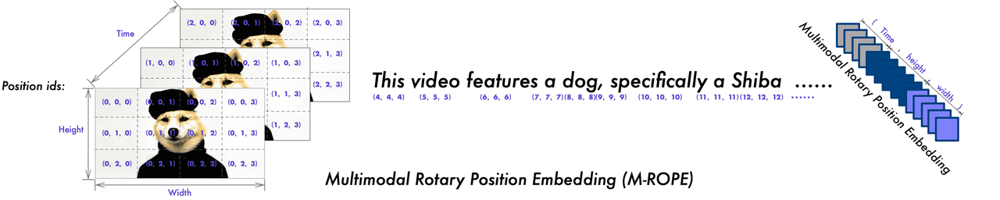

先来张图感受一下MRoPE，其原理是将hidden\_dim分为三个部分，分别用来编码Time、Height、Width三个维度：



虽然了解了他的原理，但是我们对其内部还是知之甚少，因此我们来仔细分析，[ Qwen-VL](https://scnajei2ds6y.feishu.cn/wiki/YDpewbRHwiLNAikDH1HcUtNInve) 的代码是如何实现的：

## 1. 计算 position\_ids

**<span style="color: rgb(216,57,49); background-color: inherit">首先需要计算一个三维IDs序列表示每一个token（视觉的+文本的）在时空中的位置，这里我们用一个例子就可以说明具体做的事情：</span>**

> 对于纯文本嵌入序列，旋转位置嵌入与现代大语言模型中的方法没有区别。例如：
>
> * input\_ids: `[T T T T T]`，其中 T 表示文本。
>
> * temporal position\_ids: `[0, 1, 2, 3, 4]`。
>
> * height position\_ids: `[0, 1, 2, 3, 4]`。
>
> * width position\_ids: `[0, 1, 2, 3, 4]`。
>
> 对于包含视觉和文本嵌入的序列，我们对视觉部分计算三维旋转位置嵌入（3D rotary position embedding），而对文本部分计算一维旋转位置嵌入（1D rotary position embedding）。例如：
>
> 假设我们有一个视频输入，其包含 3 个 temporal patch、2 个 height patch 和 2 个 width patch。
>
> * input\_ids: `[V V V V V V V V V V V V T T T T T]`，其中 V 表示视觉。
>
> * 视觉部分：
>
>   * temporal position\_ids: `[0, 0, 0, 0, 1, 1, 1, 1, 2, 2, 2, 2]`。
>
>   * height position\_ids: `[0, 0, 1, 1, 0, 0, 1, 1, 0, 0, 1, 1]`。
>
>   * width position\_ids: `[0, 1, 0, 1, 0, 1, 0, 1, 0, 1, 0, 1]`。
>
> * 文本部分：
>
>   * temporal position\_ids: `[3, 4, 5, 6, 7]`。
>
>   * height position\_ids: `[3, 4, 5, 6, 7]`。
>
>   * width position\_ids: `[3, 4, 5, 6, 7]`。
>
> 其中，文本部分的起始 position\_ids 是由视觉部分的最大 position\_ids 加 1 得到的。

具体的实现参考[源码](https://github.com/huggingface/transformers/blob/main/src/transformers/models/qwen2_vl/modeling_qwen2_vl.py#L433)的`Qwen2VLForConditionalGeneration.get_rope_index`。


## 2. 根据 position\_ids 计算 3D Embedding

> 首先先看一下MRoPE如何预计算的角度信息：首先计算`head＿dim//2`个 $$\theta_i$$ 角度信息，然后与 `position_id`进行相乘得到`freqs`，最后两个相同的`freqs`进行拼接得到`emb`，第`ids`位置token的 freqs为$$\left[i d s * \theta_1, i d s * \theta_2, \ldots, i d s * \theta_{d / 2}, i d s * \theta_1, i d s * \theta_2, \ldots, i d s * \theta_{d / 2}\right]$$：

```python
class Qwen2VLRotaryEmbedding(nn.Module):
 def forward(self, x, position_ids):
        if "dynamic" in self.rope_type:
            self._dynamic_frequency_update(position_ids, device=x.device)

        # Core RoPE block. In contrast to other models, Qwen2_VL has different position ids for thw grids
        # So we expand the inv_freq to shape (3, ...)
        # 首先计算head_dim//2个\theta_i角度信息，并expand到[3, 1, 64, 1]，其中head_dim=128
        inv_freq_expanded = self.inv_freq[None, None, :, None].float().expand(3, position_ids.shape[1], -1, 1) # [3, 1, 64, 1]
        position_ids_expanded = position_ids[:, :, None, :].float()  # shape (3, bs, 1, positions)
        # Force float32 (see https://github.com/huggingface/transformers/pull/29285)
        device_type = x.device.type
        device_type = device_type if isinstance(device_type, str) and device_type != "mps" else "cpu"
        with torch.autocast(device_type=device_type, enabled=False):
            # \theta_i与position_ids进行相乘，得到ids * \theta_i，这是一个二维矩阵
            freqs = (inv_freq_expanded.float() @ position_ids_expanded.float()).transpose(2, 3) # [3, bs, positions, 64]
            # 相同的freqs进行拼接
            emb = torch.cat((freqs, freqs), dim=-1) # [3, bs, positions, 128]
            cos = emb.cos()
            sin = emb.sin()

        # Advanced RoPE types (e.g. yarn) apply a post-processing scaling factor, equivalent to scaling attention
        cos = cos * self.attention_scaling
        sin = sin * self.attention_scaling

        return cos.to(dtype=x.dtype), sin.to(dtype=x.dtype)
```

这里需要解释一下为什么hidden\_dim是128，可以参考 [config.json](https://huggingface.co/Qwen/Qwen2-VL-7B-Instruct/blob/main/config.json)：

```python
"hidden_size": 3584
"num_attention_heads": 28
```

因此里是head\_dim = 3584/28 = 128


## 3. 拼接 3D Embedding

> 上一步我们分别获得了所有位置的Time、Width、Height维度的Pos Embedding，其维度为\[3, bs, positions, 128]。但是我们在实际使用位置编码时候只能使用\[bs, positions, 128]维度的向量，因此涉及一个问题：**如何把三个维度的位置编码拼接（压缩）起来？**

答案是每个维度切取一部分的位置编码，然后进行拼接得到最终的旋转位置编码，这样就包含了不同维度的位置信息。公式和code实现如下：


至于time、x、y三个维度是怎么划分hidden\_dim的，是在https://huggingface.co/Qwen/Qwen2-VL-7B-Instruct/blob/main/config.json里的rope\_scaling\["mrope\_section"]参数，里面将64个角度划分成了\[16, 24, 24]一组的三份，在实际切分方法`apply_multimodal_rotary_pos_emb`中，mrope\_section进行一次复制成为\[16, 24, 24, 16, 24, 24]，正好划分128个维度：

```python
# position_ids是一个[3, b, num_tokens], 每个token有3个方向temporal, height and width的位置编码id
# cos.shape = [3,b,num_tokens, 128]
# sin.shape = [3,b,num_tokens, 128]
# q,k.shape = [b,n_head,num_tokens,dim] dim=128
def apply_multimodal_rotary_pos_emb(q, k, cos, sin, mrope_section, unsqueeze_dim=1):
    # mrope_section = [16, 24, 24, 16, 24, 24]
    mrope_section = mrope_section * 2 
    # 先将cos对dim维度划分为6组数据，[3, 1, num_tokens, 16], [3, 1, num_tokens, 24], ...
    # (1) 第1组数据slice[0,...]即(temporal)出来[1,num_tokens,16]。
    # (2) 第2组数据slice[1,...]即(height)出来[1,num_tokens,24]
    # (3) 第3组数据slice[2,...]即(width)出来[1,num_tokens,24]
    # (4) 第4组数据slice[0,...]即(temporal)出来[1,num_tokens,16]，由于freqs(128)前一半(64)和后一半(64)相同, 这一块的freqs则与(1)中的freqs是相同的
    # (5) 第5组数据slice[1,...]即(height)出来[1,num_tokens,24]
    # (6) 第6组数据slice[2,...]即(width)出来[1,num_tokens,24]
    # cat拼接为[1,1,num_tokens,128]
    cos = torch.cat([m[i % 3] for i, m in enumerate(cos.split(mrope_section, dim=-1))], dim=-1).unsqueeze(
        unsqueeze_dim
    )
    # sin处理和cos一样的
    sin = torch.cat([m[i % 3] for i, m in enumerate(sin.split(mrope_section, dim=-1))], dim=-1).unsqueeze(
        unsqueeze_dim
    )
    # 0-15特征元素使用temporal类型的位置编码, 16-39使用height类型的位置编码, ...
    q_embed = (q * cos) + (rotate_half(q) * sin)
    k_embed = (k * cos) + (rotate_half(k) * sin)
    return q_embed, k_embed
```


参考阅读：https://zhuanlan.zhihu.com/p/9613363595（2D-RoPE的推导不正确，MRoPE可以看）
