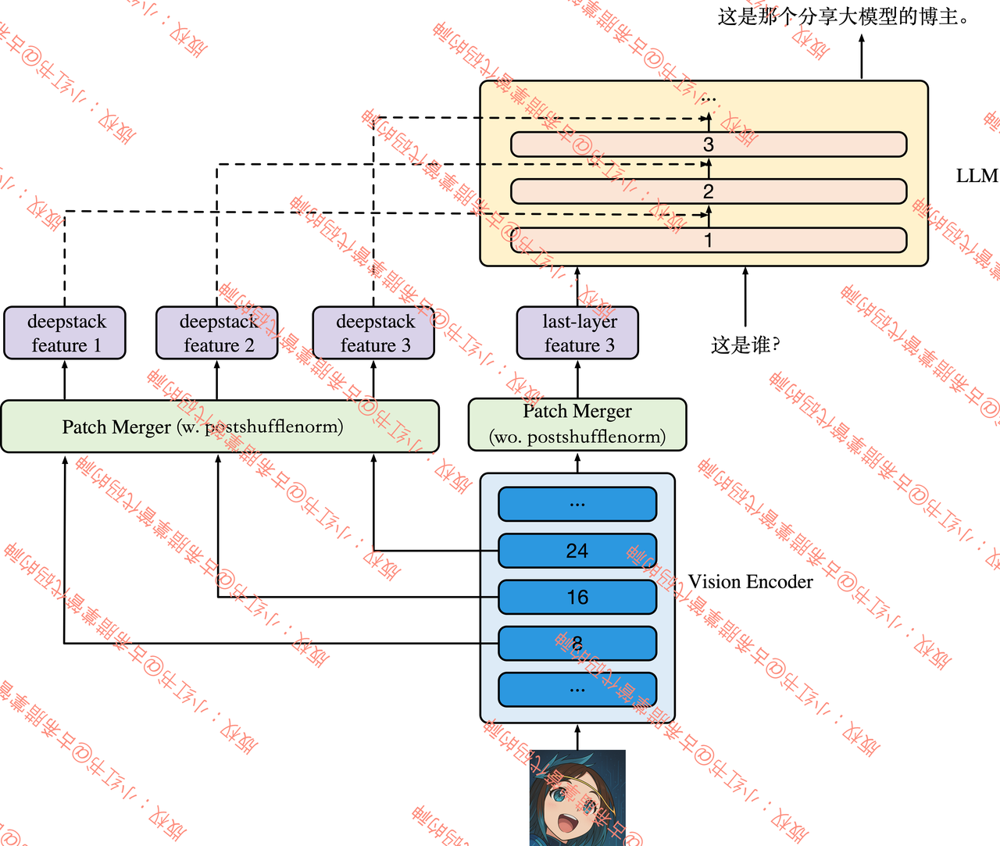

> 论文：[《Qwen3-VL Technical Report》](https://arxiv.org/pdf/2511.21631)
>
> 代码仓库：[QwenLM/Qwen3-VL](https://github.com/QwenLM/Qwen3-VL)｜完整PR代码：[代码链接](https://github.com/huggingface/transformers/blob/088e9c30712151060aacecd3454150f4edd83cd1/src/transformers/models/qwen3_vl/modeling_qwen3_vl.py)｜模型仓库：[Qwen/qwen3-vl](https://huggingface.co/collections/Qwen/qwen3-vl)

25年9月我们在[ Qwen3 VL Preview](https://scnajei2ds6y.feishu.cn/wiki/P8WqwpoUdicF9bkvaTqcdcS5nDb?from=from_copylink)中超前解析了 Qwen3-VL 的模型架构，当时依靠模型代码以及 [官方Blog](https://qwenlm.github.io/blog/qwen3/) 无法对模型训练细节进行解析（并且当时没有开源全系列模型）。现在随着Qwen3-VL技术报告发布/模型完整开源，我&#x4EEC;**<span style="color: rgb(216,57,49); background-color: inherit">重新来解析Qwen3-VL系列模型的关键技术！</span>**

Qwen3-VL是Qwen系列目前最先进的视觉-语言多模态模型（截止2025年11月），核心特性与创新：

1. **架构主要改进（对比[ Qwen2.5-VL](https://scnajei2ds6y.feishu.cn/wiki/S7Q2wviQhiYtQFk4jKvccQwDnWe)）**：使用的DeepStack的Projector整合多层级ViT特征提升视觉-语言对齐效果，LLM支持MoE和Dense不同架构。替换[ MRoPE](https://scnajei2ds6y.feishu.cn/wiki/JboKw8o8UiaUQbk1CBDckrtFn3f)为interleaved-MRoPE，强化图像/视频的时空特征建模的稳定性。

2. **长上下文支持**：原生支持256K tokens的长上下文，可无缝处理交错式文本、图像及视频输入。

3. **增强的后训练：**&#x5728;多个细分领域进行RL，采用Qwen团队的SAPO，参考“think with images”多模态agent训练。

## 1. 模型架构

> 模型还是标准的“三段式结构”，即 **<span style="color: rgb(216,57,49); background-color: inherit">ViT+Projector+LLM</span>**：
>
> * **Vision Encoder：**[ SigLIP2](https://scnajei2ds6y.feishu.cn/wiki/H3biwpNrQiAgk2kd9bscXeS2nkb)架构，初始化于SigLIP2-SO-400M、SigLIP2-Large (300M) ，进行动态分辨率CPT。沿用 Qwen2.5 bias配置、 [ 2D-RoPE](https://scnajei2ds6y.feishu.cn/wiki/BHUIwyfVUizmwQkKQPFceqJrnEe)，但是替换了激活函数，PatchEmbed启用bias。
>
> * **Projector：**&#x41;daptor本次更新中使用了两个部分特征，一部分是沿用的Qwen2.5的 PatchMerger（对比解析参考[ MLLM 之 MLP Projector 发展史](https://scnajei2ds6y.feishu.cn/wiki/KQDVwj7bAiSz8akJd3ecLLPank3)）另外一部分使用&#x4E86;**`deepstack_visual_indexes`<span style="color: rgb(216,57,49); background-color: inherit">，用于与LLM跨层进行特征融合。</span>**
>
> * **LLM：** [Qwen3-VL-235B-A22B](https://huggingface.co/Qwen/Qwen3-VL-235B-A22B-Instruct) /Qwen3-VL-30B-A3B 使用的是[ Qwen 3](https://swfvqxo30ma.feishu.cn/wiki/Yzb0w1lKJi9EEIkeNHLcpdODnIc?from=from_copylink)的MoE版本，32B/8B/4B/2B 使用的是 Qwen3 的Dense版本，架构上使用了QKNorm（解析参考[ QK Norm 的前世今生](https://swfvqxo30ma.feishu.cn/wiki/V2c5wrPboiCKJNkN5UocxvpLnTe?from=from_copylink)），与[ Qwen2.5-VL](https://scnajei2ds6y.feishu.cn/wiki/S7Q2wviQhiYtQFk4jKvccQwDnWe)区别在于：Qwen3VL 改进了[ MRoPE](https://scnajei2ds6y.feishu.cn/wiki/JboKw8o8UiaUQbk1CBDckrtFn3f)为 Interleaved MRoPE。**<span style="color: rgb(216,57,49); background-color: inherit">并且在前K层使用了DeepStack特征融合。</span>**


### 1.1 **Vision Encoder**

Vision Encoder 使用的[ SigLIP2](https://scnajei2ds6y.feishu.cn/wiki/H3biwpNrQiAgk2kd9bscXeS2nkb)架构，ViT权重来自于SigLIP2-SO-400M 和 SigLIP2-Large (300M) ，后者用于**2B/4B**的轻量级模型。Qwen3-VL对ViT增加 [ 2D-RoPE](https://scnajei2ds6y.feishu.cn/wiki/BHUIwyfVUizmwQkKQPFceqJrnEe)后进行了动态分辨率的继续预训练，方法参考[CoMP](https://arxiv.org/pdf/2503.18931)。对比[ Qwen2.5-VL](https://scnajei2ds6y.feishu.cn/wiki/S7Q2wviQhiYtQFk4jKvccQwDnWe)在ViT上的区别：

* PatchEmbed

Qwen3-VL: Qwen3VLVisionPatchEmbed 使用 Conv3d，<span style="color: rgb(216,57,49); background-color: inherit">bias=True</span>， 默认 patch\_size=16。

Qwen2.5-VL: Qwen2\_5\_VisionPatchEmbed 也用 Conv3d，<span style="color: rgb(216,57,49); background-color: inherit">bias=False</span>，默认 patch\_size=14。

* 位置编码：

两者都使用 [ 2D-RoPE](https://scnajei2ds6y.feishu.cn/wiki/BHUIwyfVUizmwQkKQPFceqJrnEe)，即支持动态分辨率（参考[ NaViT](https://scnajei2ds6y.feishu.cn/wiki/N6PmwVkCcisDJGkC7Ypc1SfInwh)）。

* MLP：

之前在[ Qwen2.5-VL](https://scnajei2ds6y.feishu.cn/wiki/S7Q2wviQhiYtQFk4jKvccQwDnWe)中讲过，[ Qwen2.5-VL](https://scnajei2ds6y.feishu.cn/wiki/S7Q2wviQhiYtQFk4jKvccQwDnWe)的ViT-MLP做出了更像语言模型架构的策略：

* 使用SwiGLU的FFN结构，`hidden_act="silu"`（参考[ 1.1.5 前馈网络 FFN 和激活函数 Activation](https://swfvqxo30ma.feishu.cn/wiki/GkbjwrCJjiMiYwko5lfcM80Vnub)）

* 标准化使用 RMSNorm。

* 其中的线性层增加bias，注意这里在llama这样的语言模型中是默认无偏置。

**<span style="color: rgb(216,57,49); background-color: inherit">Qwen3VL 沿用了这一配置，除了激活函数：</span>**

```python
class Qwen3VLVisionMLP(nn.Module):
    def __init__(self, config):
        super().__init__()
        self.hidden_size = config.hidden_size
        self.intermediate_size = config.intermediate_size
        self.linear_fc1 = nn.Linear(self.hidden_size, self.intermediate_size, bias=True)
        self.linear_fc2 = nn.Linear(self.intermediate_size, self.hidden_size, bias=True)
        self.act_fn = ACT2FN[config.hidden_act]

    def forward(self, hidden_state):
        return self.linear_fc2(self.act_fn(self.linear_fc1(hidden_state)))
```

**<span style="color: rgb(216,57,49); background-color: inherit">但是细节变化在于激活函数由</span>`silu`<span style="color: rgb(216,57,49); background-color: inherit">替换为了</span>`gelu_pytorch_tanh`**，参考代码：

```python
class Qwen3VLVisionConfig(PretrainedConfig):
    model_type = "qwen3_vl"
    base_config_key = "vision_config"

    def __init__(
        self,
        depth=27,
        hidden_size=1152,
        hidden_act="gelu_pytorch_tanh",
        intermediate_size=4304,
        num_heads=16,
        in_channels=3,
        patch_size=16,
        spatial_merge_size=2,
        temporal_patch_size=2,
        out_hidden_size=3584,
        num_position_embeddings=2304,
        deepstack_visual_indexes=[8, 16, 24],
        initializer_range=0.02,
        **kwargs,
    ):
        super().__init__(**kwargs)
        ...
```


### 1.1 Adaptor

Adaptor在沿用了[ Qwen2.5-VL](https://scnajei2ds6y.feishu.cn/wiki/S7Q2wviQhiYtQFk4jKvccQwDnWe)的基础上，增加了从ViT中间层到LLM前k层到特征融合通路。总的来讲，Qwen3-VL的Adaptor包括两个部分：


* 一部分是沿用的Qwen2.5的 PatchMerger（对比解析参考[ MLLM 之 MLP Projector 发展史](https://scnajei2ds6y.feishu.cn/wiki/KQDVwj7bAiSz8akJd3ecLLPank3)）

* 另外一部分使用&#x4E86;**`deepstack_visual_indexes`<span style="color: rgb(216,57,49); background-color: inherit">，用于与LLM特征进行融合。</span>**&#x5982;右图所示，通过特征通路进行视觉和语言的深度融合。





实现方式参考以下代&#x7801;**<span style="color: rgb(36,91,219); background-color: inherit">蓝色</span>**&#x548C;**<span style="color: rgb(216,57,49); background-color: inherit">红色</span>**&#x90E8;分：

```python
class Qwen3VLVisionModel(Qwen3VLPreTrainedModel):
    config: Qwen3VLVisionConfig
    _no_split_modules = ["Qwen3VLVisionBlock"]

    def __init__(self, config, *inputs, **kwargs) -> None:
        super().__init__(config, *inputs, **kwargs)
        self.spatial_merge_size = config.spatial_merge_size
        self.patch_size = config.patch_size
        self.spatial_merge_unit = self.spatial_merge_size * self.spatial_merge_size

        self.patch_embed = Qwen3VLVisionPatchEmbed(
            config=config,
        )

        self.pos_embed = nn.Embedding(config.num_position_embeddings, config.hidden_size)
        self.num_grid_per_side = int(config.num_position_embeddings**0.5)

        head_dim = config.hidden_size // config.num_heads
        self.rotary_pos_emb = Qwen3VLVisionRotaryEmbedding(head_dim // 2)

        self.blocks = nn.ModuleList([Qwen3VLVisionBlock(config) for _ in range(config.depth)])
        self.merger = Qwen3VLVisionPatchMerger(
            config=config,
            use_postshuffle_norm=False,
        )

        self.deepstack_visual_indexes = config.deepstack_visual_indexes
        # deepstack_visual_indexes=[8, 16, 24]
        self.deepstack_merger_list = nn.ModuleList(
            [
                Qwen3VLVisionPatchMerger(
                    config=config,
                    use_postshuffle_norm=True,
                )
                for _ in range(len(config.deepstack_visual_indexes))
            ]
        )

        self.gradient_checkpointing = False
```

可以看到，**<span style="color: rgb(216,57,49); background-color: inherit">deepstack_merger_list分别针对ViT的第[8, 16, 24]层设置了Qwen3VLVisionPatchMerger。</span>**

但是这部分的关键参数设置&#x5728;**<span style="color: rgb(216,57,49); background-color: inherit">use_postshuffle_norm</span>**&#x4E0A;区别于PatchMerger，两者的关键区别在于先做shuffle（这里的shuffle本质上是hidden\_dim上进行2\*2的堆叠，参考[ Qwen2.5-VL](https://scnajei2ds6y.feishu.cn/wiki/S7Q2wviQhiYtQFk4jKvccQwDnWe)）还是先做LayerNorm：

```python
class Qwen3VLVisionPatchMerger(nn.Module):
    def __init__(self, config: Qwen3VLVisionConfig, use_postshuffle_norm=False) -> None:
        super().__init__()
        self.hidden_size = config.hidden_size * (config.spatial_merge_size**2)
        self.use_postshuffle_norm = use_postshuffle_norm
        self.norm = nn.LayerNorm(self.hidden_size if use_postshuffle_norm else config.hidden_size, eps=1e-6)
        self.linear_fc1 = nn.Linear(self.hidden_size, self.hidden_size)
        self.act_fn = nn.GELU()
        self.linear_fc2 = nn.Linear(self.hidden_size, config.out_hidden_size)

    def forward(self, x: torch.Tensor) -> torch.Tensor:
        x = self.norm(x.view(-1, self.hidden_size) if self.use_postshuffle_norm else x).view(-1, self.hidden_size)
        x = self.linear_fc2(self.act_fn(self.linear_fc1(x)))
        return x
```

然后整体上看，Qwen3VLVisionModel（即ViT部分），提供给LLM的是两部分特征：

* hidden\_states：最后一层通过PatchMerger的特征。

* **<span style="color: rgb(216,57,49); background-color: inherit">deepstack_feature_lists：第[8, 16, 24]层中间特征。</span>**

代码参考，具体这两部分特征怎么用，我们看LLM部分代码：

```python
class Qwen3VLVisionModel(Qwen3VLPreTrainedModel):
    def forward(self, hidden_states: torch.Tensor, grid_thw: torch.Tensor, **kwargs) -> torch.Tensor:
        ...
        deepstack_feature_lists = []
        for layer_num, blk in enumerate(self.blocks):
            hidden_states = blk(
                hidden_states,
                cu_seqlens=cu_seqlens,
                position_embeddings=position_embeddings,
                **kwargs,
            )
            if layer_num in self.deepstack_visual_indexes:
            # deepstack_visual_indexes=[8, 16, 24]
                deepstack_feature = self.deepstack_merger_list[self.deepstack_visual_indexes.index(layer_num)](
                    hidden_states
                )
                deepstack_feature_lists.append(deepstack_feature)

        hidden_states = self.merger(hidden_states)

        return hidden_states, deepstack_feature_lists
```

至于为什么要用中间特征，参考：[多模态LLM中adapter部分的设计，ViT的特征取哪层哪个位置？（字节-2面）](https://scnajei2ds6y.feishu.cn/wiki/ORZvwHCgti5VehknsbRcLCYTnuh#share-YCPndVmp9oTL5Dxct5xcxYQTn1e)


### 1.2 LLM

分为[ Qwen 3](https://swfvqxo30ma.feishu.cn/wiki/Yzb0w1lKJi9EEIkeNHLcpdODnIc?from=from_copylink)的MoE版本/非MoE版本，具体开源的模型版本和LLM架构见表：

| 规格（架构）          | 模型名字                                                |
| --------------- | --------------------------------------------------- |
| **235B (MoE)**  | Qwen3-VL-235B-A22B-Instruct / Thinking / FP8 / GGUF |
| **30B (MoE)**   | Qwen3-VL-30B-A3B-Instruct / Thinking / FP8 / GGUF   |
| **32B (Dense)** | Qwen3-VL-32B-Instruct / Thinking / FP8 / GGUF       |
| **8B (Dense)**  | Qwen3-VL-8B-Instruct / Thinking / FP8 / GGUF        |
| **4B (Dense)**  | Qwen3-VL-4B-Instruct / Thinking / FP8 / GGUF        |
| **2B (Dense)**  | Qwen3-VL-2B-Instruct / Thinking / FP8 / GGUF        |

架构上使用了QKNorm（解析参考[ QK Norm 的前世今生](https://swfvqxo30ma.feishu.cn/wiki/V2c5wrPboiCKJNkN5UocxvpLnTe?from=from_copylink)），对于非MoE版本进行分析，区别在于：

* Qwen3VL 使用 3 维多模态位置编码 [ MRoPE](https://scnajei2ds6y.feishu.cn/wiki/JboKw8o8UiaUQbk1CBDckrtFn3f) ，Qwen3 则使用标准 RoPE。

* Qwen3 支持 sliding window 层，Qwen3VL 未引入。

* **<span style="color: rgb(216,57,49); background-color: inherit">在前K层使用了DeepStack特征融合。（详细参考 </span>**[<span style="color: rgb(216,57,49); background-color: inherit">Qwen3-VL的 DeepStack 技术是什么？</span>](https://w0rg9.xetlk.com/s/17bFhM)**<span style="color: rgb(216,57,49); background-color: inherit">）</span>**

我们具体来看，ViT输出的特征如何与LLM特征进行融合的，首先ViT输出的特征是两部分：

* hidden\_states：最后一层通过PatchMerger的特征。

* **<span style="color: rgb(216,57,49); background-color: inherit">deepstack_feature_lists：第[8, 16, 24]层中间特征。</span>**

首先对于hidden\_states，直接与文本特征拼接输入LLM：

```python
class Qwen3VLModel(Qwen3VLPreTrainedModel):
    base_model_prefix = ""
    _checkpoint_conversion_mapping = {}
    # Reference: fix gemma3 grad acc #37208
    accepts_loss_kwargs = False
    config: Qwen3VLConfig
    _no_split_modules = ["Qwen3VLTextDecoderLayer", "Qwen3VLVisionBlock"]

    def __init__(self, config):
        super().__init__(config)
        self.visual = Qwen3VLVisionModel._from_config(config.vision_config)
        self.language_model = Qwen3VLTextModel._from_config(config.text_config)
        self.rope_deltas = None  # cache rope_deltas here

        # Initialize weights and apply final processing
        self.post_init()
    def forward(...):
        ...
        if pixel_values is not None:
            image_embeds, deepstack_image_embeds = self.get_image_features(pixel_values, image_grid_thw)
            image_embeds = torch.cat(image_embeds, dim=0).to(inputs_embeds.device, inputs_embeds.dtype)
            image_mask, _ = self.get_placeholder_mask(
                input_ids, inputs_embeds=inputs_embeds, image_features=image_embeds
            )
            inputs_embeds = inputs_embeds.masked_scatter(image_mask, image_embeds)
        ...
```

然后对&#x4E8E;**<span style="color: rgb(216,57,49); background-color: inherit">deepstack_feature_lists，则是分别与前K层（这里是前三层，</span>`K=len(deepstack_feature_lists)`<span style="color: rgb(216,57,49); background-color: inherit">）进行融合。</span>**


我们首先来看这部分融合的代码逻辑：


```python
class Qwen3VLTextModel(Qwen3VLPreTrainedModel):
    config: Qwen3VLTextConfig
    _no_split_modules = ["Qwen3VLTextDecoderLayer"]

    def __init__(self, config: Qwen3VLTextConfig):
        ...
        self.layers = nn.ModuleList(
            [Qwen3VLTextDecoderLayer(config, layer_idx) for layer_idx in range(config.num_hidden_layers)]
        )
        ...

    def forward(
        ...
        visual_pos_masks: Optional[torch.Tensor] = None,
        deepstack_visual_embeds: Optional[list[torch.Tensor]] = None,
        ...
    ) -> Union[tuple, BaseModelOutputWithPast]:
        if (input_ids is None) ^ (inputs_embeds is not None):
            raise ValueError("You must specify exactly one of input_ids or inputs_embeds")

        ...
        # decoder layers
        for layer_idx, decoder_layer in enumerate(self.layers):
            layer_outputs = decoder_layer(
                hidden_states,
                attention_mask=attention_mask,
                position_ids=text_position_ids,
                past_key_values=past_key_values,
                cache_position=cache_position,
                position_embeddings=position_embeddings,
                **kwargs,
            )
            hidden_states = layer_outputs

            # add visual features to the hidden states of first several layers
            if deepstack_visual_embeds is not None and layer_idx in range(len(deepstack_visual_embeds)):
                hidden_states = self._deepstack_process(
                    hidden_states,
                    visual_pos_masks,
                    deepstack_visual_embeds[layer_idx],
                )

        ...
```

然后融合的方式参考\_deepstack\_process函数，具体处理逻辑为：

* 把 hidden\_states 在 visual\_pos\_masks 为 True 的位置切出来，加上对应层的视觉特征向量 visual\_embeds（就是 deepstack\_visual\_embeds\[layer\_idx]，它已经对齐到“**<span style="color: rgb(216,57,49); background-color: inherit">只有视觉位置</span>**”的子序列顺序）。

* 再写回到 hidden\_states 的这些视觉位置。

这等价于：在若干前层（deepstack 的层数）里，用视觉中间层特征对语言隐藏态进行残差式强制注入，**<span style="color: rgb(216,57,49); background-color: inherit">仅作用于视觉 token 的那些位置，文本 token 位置不变：</span>**

```python
def _deepstack_process(
        self, hidden_states: torch.Tensor, visual_pos_masks: torch.Tensor, visual_embeds: torch.Tensor
    ):
        visual_pos_masks = visual_pos_masks.to(hidden_states.device)
        visual_embeds = visual_embeds.to(hidden_states.device, hidden_states.dtype)
        local_this = hidden_states[visual_pos_masks, :].clone() + visual_embeds
        hidden_states[visual_pos_masks, :] = local_this
        return hidden_states
```


#### 1.2.1 Interleaved MRoPE

鹅圈子有详细解析，麻烦查看：[链接](https://appttaswqlt5080.h5.xet.citv.cn/xe.community.community_service/v2/feedDetail?app_id=appttaswqlt5080\&community_id=c_68afda70f9bc6_x29igT7o2026\&feed_id=d_693f158d4bd48_CMsdjT4h3woi\&share_user_id=\&share_type=)


## 2. 预训练

### 2.1 训练配置


**<span style="color: rgb(216,57,49); background-color: inherit">首先在S0之前需要对ViT进行CPT（继续预训练），主要目标是拓展其在动态分辨率下的能力，这部分不算在Stage里面。</span>**

1. **Stage-0：视觉-语言对齐**

* 目标：视觉与语言模态对齐

* 方法：<span style="color: rgb(216,57,49); background-color: inherit">仅训练MLP融合器</span>，视觉编码器和LLM冻结

* 数据：67B tokens（高质量图文对、OCR、世界知识）

2. **Stage-1：多模态预训练**

* 目标：全参数端到端训练

* 方法：全参数训练，混合视觉Instruction数据与纯文本数据

* 数据：\~1T tokens（含交错图文、视觉定位、VQA、STEM数据及少量视频）

3. **Stage-2：长上下文预训练**

* 目标：扩展上下文处理能力

* 调整：序列长度增至32768，增加纯文本比例和视频/任务数据

* 数据：\~1T tokens（强化长视频与多步骤任务理解）

4. **Stage-3：超长上下文适应**

* 目标：突破上下文窗口极限

* 调整：序列长度扩展至262144

* 数据：100B tokens（聚焦长视频/长文档分析任务）

### 2.2 数据来源

> **数据合成方法论**： &#x20;
>
> 1）强调模型标注（Qwen2.5VL系列）的数据合成、过滤与验证。
>
> 2）合成数据与真实数据配比、多样性采样，平衡规模与质量。
>
> 3）多阶段处理流程（生成→验证），确保数据可靠性。 &#x20;
>
> 4）统一标注框架与标准化设计（如坐标、格式）提升泛化性。

* **图像-文本对数据（Image-Caption Pairs）**

使用[ Qwen2.5-VL](https://scnajei2ds6y.feishu.cn/wiki/S7Q2wviQhiYtQFk4jKvccQwDnWe)-32B模型对原始文本进行重新标注，生成更细粒度的描述（对象属性、空间布局等）。

基于视觉嵌入的聚类增强，对数据分布稀疏区域并进行定向增强。

* **交错文本-图像数据（Interleaved Text-Image）**

对（多模态）网页、书籍使用[ Qwen2.5-VL](https://scnajei2ds6y.feishu.cn/wiki/S7Q2wviQhiYtQFk4jKvccQwDnWe)-7B（轻量级模型）进行多模态解析，精确对齐文本与图表/照片。

低价值内容过滤：移除纯文本/未对齐片段，要求最低页面数、图像-文本比例。

最终需要切分、合并为最长不超过256K token的序列。

* **知识实体数据（World Knowledge）**

百科数据，覆盖10+语义类别（动物/植物/地标等）。

重要性采样策略：高显著性实体高频采样，低显著性实体低频保留。

使用LLM生成增强描述，包含视觉属性、空间关系和交互信息。

* **OCR与文档解析**

OCR：30M内部样本 + 30M合成多语言样本，均使用Qwen2.5-VL标注。

文档解析：3M PDF + 4M内部文档，使用布局模型预测阅读顺序，Qwen2.5-VL-72B进行区域识别（类似[ PaddleOCR-VL](https://scnajei2ds6y.feishu.cn/wiki/CmMSw5yIki7NTckgkg7cayIxnWc)）。

* **视觉定位与计数（Grounding and Counting）**

融合开源数据与合成数据构建框/点定位数据集，通过[ Qwen2.5-VL](https://scnajei2ds6y.feishu.cn/wiki/S7Q2wviQhiYtQFk4jKvccQwDnWe)进行标注/低置信度过滤。 &#x20;

计数任务涵盖直接计数、先给出框/点再引导计数、\[0,1000]先坐标标准化后再计数三种形式。

* **<span style="color: rgb(216,57,49); background-color: inherit">空间与3D理解（Spatial Understanding and 3D Recognition）</span>**

相比视觉定位与计数，3D理解需要推理空间关系、功能推断（如“可抓握”“可按压”）以及可行动作序列（如“如何移动障碍物拿到书”），目标是为具身智能（Embodied AI）和交互系统提供基础，支持对3D场景的深层语义理解。

空间理解数据合成：融合真实场景与合成布局数据，通过模板和LLM生成多样化自然语言查询，强调相对空间关系表达（非绝对坐标）。

3D定位数据合成：整合多源公共场景数据，构建单目图像+自然语言指代+3D边界框（9自由度）的问答格式数据集。过滤遮挡/噪声标签，统一至虚拟相机坐标系（基于Omni3D方法），确保空间一致性。合成细粒度描述文本，涵盖物体属性、布局、空间位置及交互关系，提升指代表达精准度。

* **多模态代码能力（Code）**

复用Qwen3-Coder系列大规模代码语料。

开源整理+合成多模态Coding数据集：UI转HTML/CSS、SVG生成、流程图转代码等。

* **视频理解（Video）**

在视频数据集的内容多样性上进行均衡采样。

FPS动态采样策略：根据序列长度约束调整fps和最大帧数。

利用字幕模型进行密集标注，合成时间连贯的 caption label。

* **STEM多模态推理（Science, Technology, Engineering, and Mathematics）**

使用代码生成图示的方法生成几何图表数据：1M点标注样本 + 2M视觉问答对，并使用reward model进行检查。

多模态推理：60M K-12/本科习题 + 12M合成推理样本，通过<span style="color: rgb(216,57,49); background-color: inherit">拒绝采样</span>仅保留具有挑战性的问题。

* **<span style="color: rgb(216,57,49); background-color: inherit">代理数据（Agent）</span>**

GUI交互数据涵盖跨平台界面感知与多步任务轨迹：在跨平台界面感知方面，通过元数据、解析工具和人工标注构建了诸如元素描述、密集字幕生成和密集定位等任务，从而实现对多样化用户界面的稳健理解。在多步任务方面，通过一个自我演化的轨迹生成框架组装多步骤任务轨迹，并辅以针对性的人工审核。

函数调用通过合成Pipeline实现无需真实执行的数据合成：首先通过图像指导<span style="color: rgb(216,57,49); background-color: inherit">具备能力的模型</span>生成用户查询及其对应的功能定义。接着我们采样模型的功能调用并生成其推理过程，并合成功能响应。该过程会不断重复，直到用户的查询被判断为已解决，剔除其中格式错误的轨迹。

搜索能力集成在线工具，支持长尾实体知识获取：通过在线图像搜索和文本搜索工具收集多模态事实查询轨迹，鼓励模型对不熟悉的实体进行搜索。通过这种方式，模型学会了从网络上收集信息，从而生成更加准确的响应。


## 3. 后训练

后训练流程分为三个阶段，旨在提升模型的指令遵循、推理能力及人类偏好对齐：

**Stage 1：监督微调（SFT）**

* 目标：激活指令遵循能力与潜在推理技能。

* 实现方式：

  * 两阶段训练：

    1. 初始阶段：基于32k上下文长度进行训练。

    2. 扩展阶段：将上下文窗口扩展至256k，专注于长文档和长视频数据的处理。

  * 数据分类：

    * 标准格式：适用于非思考模型（Instruct模型）。

    * 思维链（CoT）格式：显式建模推理过程，适用于思考模型（Thinking模型）。

**Stage 2：强到弱蒸馏（Strong-to-Weak Distillation）**

* 核心方法：通过知识蒸馏，将强教师模型的能力迁移至学生模型。

* 关键设计：

  * 纯文本数据微调：仅使用<span style="color: rgb(216,57,49); background-color: inherit">纯文本数据</span>对LLM主干进行优化。

  * 效果：显著提升文本任务与多模态任务的推理能力。

**Stage 3：强化学习（RL）**

* 目标：增强模型性能与人类偏好对齐，优化细粒度能力。

* 子阶段划分：

  * 推理RL：针对数学、OCR、基础推理等需逻辑推导的领域。

  * 通用RL：覆盖多模态任务（如指令遵循、文本-图像对齐等）。

### 3.1 SFT

这部分方法是确定的，就是做Instruction Tuning。关键在于数据构建，分为两个部分：Instruct模型（非思考模型）数据构建、Thinking模型（思考模型）数据构建。

#### **<span style="color: rgb(216,57,49); background-color: inherit">Instruct 模型SFT数据</span>**

在[ Qwen2.5-VL](https://scnajei2ds6y.feishu.cn/wiki/S7Q2wviQhiYtQFk4jKvccQwDnWe)的8大核心领域、30个类别基础上进行拓展，新增空间推理（具身智能）、细粒度视觉理解、视频时空定位（目标追踪）及长上下文技术文档解析等类别的数据。

* **数据规模与组成**：SFT数据集包含约120万样本，其中：

  * **单模态数据**（1/3）：纯文本数据条目。

  * **多模态数据**（2/3）：图像-文本对、视频-文本对，支持复杂场景解析。

* **分阶段训练**：为适配256K token长上下文能力，采用两阶段训练：

  * **第一阶段**：32K token序列长度，训练1个epoch；

  * **第二阶段**：256K token全长度，混合长上下文数据与32K token样本（<span style="color: rgb(216,57,49); background-color: inherit">采用课程学习策略</span>）。

采用 **两阶段过滤&#x20;**&#x5BF9;查询（query）和响应（response）进行过滤，一方面需要保证查询足够清晰、可验证。另外一方面需要保证响应正确、无害。

* **查询过滤**：

  * 使用<span style="color: rgb(216,57,49); background-color: inherit">Qwen2.5-VL过滤</span>不可验证或模糊指令。

  * 修订歧义查询，保留语义意图。

  * 剔除低信息密度网络查询，保留高复杂度、高相关性样本。

* **响应过滤**：

  * **规则过滤（Rule-Based Filtering）**：去除重复、不完整、格式错误或有害内容。

  * **模型过滤（Model-Based Filtering）**：基于Qwen2.5-VL的奖励模型多维度评估。

    * **答案质量**：正确性、完整性、清晰度、实用性。

    * **视觉任务**：重点验证视觉信息利用的准确性。

    * **隐蔽问题检测**：识别语言混杂、风格突变等规则难以覆盖的缺陷。


**<span style="color: rgb(216,57,49); background-color: inherit">思考模型 Long-CoT 冷启动数据</span>**

为了对Thinking模型进行冷启动SFT，构建专门的长思维链（Long-CoT）冷启动数据集，其中多模态与纯文本数据1:1混合： &#x20;

1. **数据构成**

   * 多模态数据（占比50%）：聚焦视觉问答（VQA）、OCR、2D/3D定位、视频分析等传统任务，强化STEM与智能体工作流相关的高阶推理能力。

   * 纯文本数据（占比50%）：延续Qwen3的数据特征，覆盖数学、代码生成、逻辑推理等复杂学科领域。 &#x20;

2. **过滤低质、简单样本方法**

   * **难度校准**：我们选择性地保留基线模型通过率较低或生成较长、更详细回复的实例。这使得数据集中包含了对当前模型而言真正具有挑战性的问题。

   * **多模态必要性筛选**：通过Qwen3-30B-nothink模型过滤可仅凭文本解决的视觉数学问题，保证视觉输入的必要性。

   * **响应净化机制**： &#x20;

     * 答案核对：优先剔除含错误答案的候选答案。

     * 过程核对：二次过滤存在重复表达、语言混杂、缺乏逻辑推演的猜测型回答。


### 3.2 Strong-to-Weak Distillation

Strong-to-Weak Distillation（强到弱蒸馏）流程是为了使用旗舰模型提升轻量级模型的性能：

* **Off-policy Distillation**：在第一阶段，直接使用Teacher模型输出SFT轻量级的Student模型，硬蒸馏。

* **On-policy Distillation**：在第二阶段，学生模型根据提供的提示生成响应，最小化 KL 散度来对齐学生模型和教师模型的预测结果（logits），软蒸馏。


### 3.3 RL

#### **<span style="color: rgb(216,57,49); background-color: inherit">推理强化学习（Reasoning RL）</span>**

**数据准备** &#x20;

* 来源：开源与私有数据，经严格预处理和人工标注确保质量，<span style="color: rgb(216,57,49); background-color: inherit">注意收集的问题都是可以被规则和代码验证的。</span>

* 多模态数据筛选：通过预训练视觉语言模型采样16个响应，全错则丢弃查询；过滤通过率超90%的简单任务，混合多任务批次并预设任务样本比例。（<span style="color: rgb(216,57,49); background-color: inherit">类似DAPO的过滤策略</span>）

* 实验筛选：通过初步RL实验剔除低潜力数据，最终保留约3万条多任务query。 &#x20;

**奖励设计**&#x20;

* 统一框架，对每一个任务单独设计Reward，**<span style="color: rgb(216,57,49); background-color: inherit">这部分细节保密了</span>**。 &#x20;

* 唯一提供的细节：通过提示控制输出格式，避免显式格式奖励；对语言切换（如非提示语言响应）施加惩罚。

**RL 算法** &#x20;

* 采用SAPO算法（自适应策略梯度法，同样来自Qwen团队）。


#### **<span style="color: rgb(216,57,49); background-color: inherit">通用强化学习（General RL）</span>**

> **目标：**
>
> 1）增强模型泛化能力与鲁棒性，纠正SFT阶段的错误先验知识（如反直觉计数、复杂时钟识别）。 &#x20;
>
> 2）抑制有害行为：语言混合、重复输出、格式错误（通过专用数据集高频惩罚优化）。

**奖励机制** &#x20;

* 指令遵循：评估内容、格式、长度等约束的匹配度（如JSON结构化输出）。 &#x20;

* 偏好对齐：优化开放性任务的主观质量（有用性、事实性、风格适配性）。

**混合奖励系统** &#x20;

* 规则奖励：针对可验证任务（如格式遵循），用明确启发式规则减少奖励欺骗风险。 &#x20;

* 模型奖励：<span style="color: rgb(216,57,49); background-color: inherit">Qwen2.5-VL-72B或Qwen3作为Reward Model </span>评估开放任务，减少严格规则导致的误判（如非标准但有效响应）。


### 3.4 Thinking with Images

按照之前"Thinking with images"的思路，如果给VLM赋予Agent能力，能帮助其在Reasoning上进一步Scaling，因此Qwen3-VL提出了一种两阶段训练范式，赋予Qwen3-VL视觉Agent能力：

1. **第一阶段** &#x20;

   * 合成约10k冷启动基础数据集，主要包含两轮视觉问答任务（如attribute detection） 。&#x20;

   * 通过监督微调(SFT)训练Qwen2.5-VL-32B，模拟"思考→行动→反馈分析→回答"的Agent行为。

   * 采&#x7528;**<span style="color: rgb(216,57,49); background-color: inherit">multi-turn,tool-integrated</span>**&#x5F3A;化学习(RL)增强推理能力。

2. **第二阶段** &#x20;

   * 通过第一阶段模型生成更大规模的120k多轮交互数据集。

   * 结合合成与蒸馏数据，采用类似SFT+RL流程进行后训练。

**两个阶段共享奖励设计（唯独数据不同）：**

* **答案准确度奖励**：基于Qwen3-32B评估最终答案正确性。

* **多轮推理奖励**：通过Qwen2.5-VL-72B验证工具反馈解析与分步推理的连贯性。 &#x20;

* **工具调用奖励**：动态匹配工具使用次数与专家预估目标值（由Qwen2.5-VL-72B离线评估任务复杂度确定），早期的实验表明，<span style="color: rgb(216,57,49); background-color: inherit">模型倾向于退化为仅调用一次工具来获取前两个奖励</span>，而不管任务需求如何。为了缓解这一问题，我们明确地将工具调用奖励纳入其中，以促进与任务复杂度相适应的工具探索。


## 4. 实验

**通用视觉问答（VQA）**

* Qwen3-VL系列在不同规模模型（2B至235B参数）中均展现竞争力。旗舰模型Qwen3-VL-235B-A22B-Thinking在MMStar基准测试中达到78.7分，达到SOTA。

* 中小型模型（如32B）在RealWorldQA等任务中超越Gemini 2.5 Flash、GPT-5 Mini模型，显示良好的扩展性。

* **<span style="color: rgb(216,57,49); background-color: inherit">可以参考 </span>[<span style="color: rgb(216,57,49); background-color: inherit">Gemini-3-Pro</span>](https://deepmind.google/models/gemini/pro/)<span style="color: rgb(216,57,49); background-color: inherit"> 官网的benchmark得分，感觉差距还是有点大的，我指的是不如 </span>[<span style="color: rgb(216,57,49); background-color: inherit">Gemini-3-Pro</span>](https://deepmind.google/models/gemini/pro/)<span style="color: rgb(216,57,49); background-color: inherit">。</span>**


**多模态推理**

* 旗舰模型在数学、逻辑等STEM任务（如MathVista、MathVision、ZeroBench）中表现领先，非思考模式（Instruct）和思考模式（Thinking）均优于同类模型。

* 中小型模型（如32B）在复杂推理任务上显著优于前代Qwen2.5-VL-72B，并超越Gemini-2.5-Flash和GPT-5-mini。
