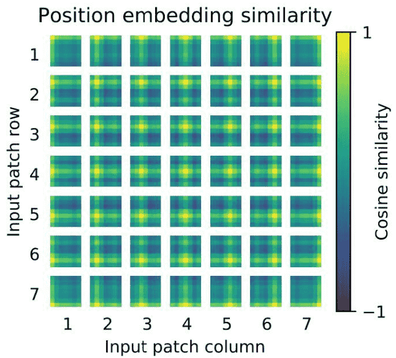

Motivation：图像切分重排后失去了位置信息，并且Transformer的内部运算是空间信息无关的，所以需要把位置信息编码重新传进网络

Solution：ViT使用了一个可学习的vector来编码，编码vector和patch vector直接相加组成输入

* 相加是一种特殊的 concat：

$$W(I+P)=WI+W P$$

$$[W_1, W_2][I, P]=W_1 I+W_2 P$$

$$\mathrm{W} 1=\mathrm{W} 2$$ 时，两式一致; 其实也有为了简化计算的原因

