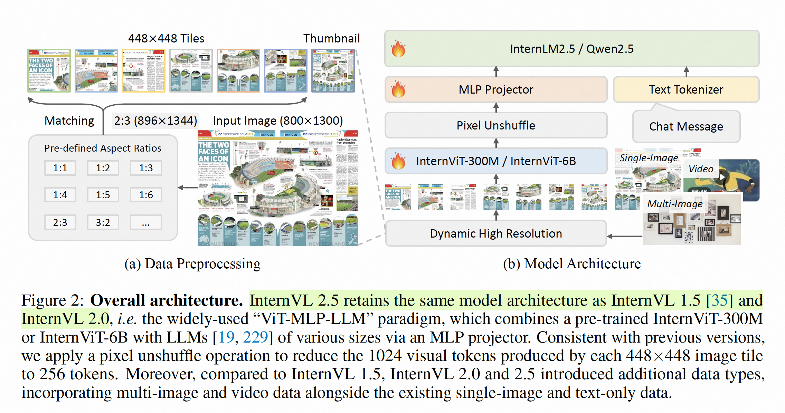

## 目录

1. 前言
2. qwen2vl动态分辨率逻辑
    1. 第一步 smart resize
    2. 第二步 rescale
    3. 第三步 normalize
    4. 第四步 堆叠 凑时间步
    5. 训练泛化性讨论
3. internvl2动态分辨率逻辑
    1. 第一步 transform
    2. 第二步 dynamic_preprocess
    3. 第三步 堆叠
    4. 训练泛化性讨论
4. token 数横向对比
    1. qwen2vl
    2. internvl2
    3. 讨论

## 前言

每一个网络都有下采样倍数，那么输入的图像尺寸按理说应该是他的整数倍，能保证刚好被整除。以qwen2vl（vision backbone 下采样 28 倍）为例，动态分辨率核心要考虑三个点

1.  图像在resize的时候，既需要考虑图像尺寸是 28 的整数倍
 
2.  也需要考虑尽可能的保证图像resize不失真，也就是保持宽高比。比如512x512的图像，如果resize 到了128x2048，那么图像就会严重失真。
 
3.  其次就是训练的泛化性，推理的时候输入更小/大的图像（尤其视频帧），模型能不能外推。
 

一个冷知识：mac上显示和实际图像大小可能不一致，猜测这是因为mac显示的时候也做了动态分辨率的resize，保证显示效果。

>  实际测试发现，mac 上看详情，图像尺寸 1224x926，pil 读入的size是1232x924，size不一致。image save到本地后再看尺寸还是1224x926。

## qwen2vl动态分辨率逻辑

qwen 对图像有三层处理逻辑：

```python
# 第一步 resize 
if do_resize:
    resized_height, resized_width = smart_resize(
        height,
        width,
        factor=self.patch_size * self.merge_size,
        min_pixels=self.min_pixels,
        max_pixels=self.max_pixels,
    )
    image = resize(
        image, size=(resized_height, resized_width), resample=resample, input_data_format=input_data_format
    )

# 第二步 rescale 
if do_rescale:
    image = self.rescale(image, scale=rescale_factor, input_data_format=input_data_format)

# 第三步 normalize
if do_normalize:
    image = self.normalize(
        image=image, mean=image_mean, std=image_std, input_data_format=input_data_format
    )

# 第四步 堆叠...
```

因为qwen2vl vit的后面有一个MLP做的pooling（x2），加上vit本身的降采样（x14），总共图像在 宽、高上会降采样2x14=28倍。

### 第一步 smart resize

smart resize 分为两步：

1、算宽高 28的整数倍最接近的数值

```python
h_bar = round(height / factor) * factor
w_bar = round(width / factor) * factor
```

2、统一放缩。这里有两个关键的参数`min_pixels`和`max_pixels`。这两个关键参数用来计量总的像素数，`pixels = hxw`。如果超过了max_pixels，那么就会统一resize到 min_pixels 和 max_pixels之间。

```python
if h_bar * w_bar > max_pixels:
    beta = math.sqrt((height * width) / max_pixels)
    h_bar = math.floor(height / beta / factor) * factor
    w_bar = math.floor(width / beta / factor) * factor
```

### 第二步 rescale

这一步有一个关键的参数，rescale_factor。qwen2vl 默认取 0.00392156862745098（其实就是1/255），得到的结果就是 rescale_factor 逐元素相乘 image。

```python
image = self.rescale(image, scale=rescale_factor, input_data_format=input_data_format)
```

### 第三步 normalize

很传统的按照mean，std归一化。

### 第四步 堆叠 凑时间步

因为qwen的vit最开始的embed方式是一个2x3x3的conv，所以需要把单图copy成2份，比如对于(1, 3, 924, 1232) 的图像就变成了(2, 3, 924, 1232)。

```python
patches = np.tile(patches, (self.temporal_patch_size, 1, 1, 1))
```

### 训练泛化性讨论

根据qwen2vl提供的[7B叙述](https://huggingface.co/Qwen/Qwen2-VL-7B-Instruct/blob/main/preprocessor_config.json)，min_pixel是3136，max_pixel是12845056，如何h和w一样大的话，大概可以兼容从 56*56 到 3584x3584的图像输入。但是对于video的每帧，考虑到多帧情况，最大是16384。并且由于scale到了min_pixels 和 max_pixels之间，所以泛化性不是问题。实际训练中也发现了，调整小max_pixel，对性能影响不大（不过这个也看啥任务）。

## internvl2动态分辨率逻辑

总的来说，internvl的逻辑更加复杂一些。以最新的internvl2.5来看，internvl的处理逻辑基本没有变化。相比于qwen的动态分辨率，internvl2的逻辑更加高清一些，所以名字起的也很好，叫dynamic **high** resolution。



代码如下，最重要的就是dynamic_preprocess这个函数。

```python
def load_image(image_file, input_size=448, max_num=12):
    image = Image.open(image_file).convert('RGB')
    # 第一步 transform
    transform = build_transform(input_size=input_size)
    # 第二步 动态分辨率
    images = dynamic_preprocess(image, image_size=input_size, use_thumbnail=True, max_num=max_num)
    pixel_values = [transform(image) for image in images]
    # 第三步 堆叠
    pixel_values = torch.stack(pixel_values)
    return pixel_values
```

### 第一步 transform

常规操作，直接绕过

```python
IMAGENET_MEAN = (0.485, 0.456, 0.406)
IMAGENET_STD = (0.229, 0.224, 0.225)

def build_transform(input_size):
    MEAN, STD = IMAGENET_MEAN, IMAGENET_STD
    transform = T.Compose([
        T.Lambda(lambda img: img.convert('RGB') if img.mode != 'RGB' else img),
        T.Resize((input_size, input_size), interpolation=InterpolationMode.BICUBIC),
        T.ToTensor(),
        T.Normalize(mean=MEAN, std=STD)
    ])
    return transform
```

### 第二步 dynamic_preprocess

dynamic_preprocess 的默认参数如下，image_size 448是因为internvl需要把图像拆分成patch，训练/测试都是448，use_thumbnail 是指用一个缩略的头图保持整体的全局信息，max_num表示一个patch的最大数目。

```python
dynamic_preprocess(
  image, 
  image_size=448, 
  use_thumbnail=True, 
  max_num=12)
```

同样是从宽高比下手

```python
aspect_ratio = orig_width / orig_height
```

他会根据max_num 拆解成35组不同的宽高比，最极限的就是 1:max_num。

```python
[(1, 1), (1, 2), (2, 1), (3, 1), (1, 3), (2, 2), (4, 1), (1, 4), (5, 1), (1, 5), (1, 6), (6, 1), (3, 2), (2, 3), (7, 1), (1, 7), (4, 2), (2, 4), (1, 8), (8, 1), (1, 9), (3, 3), (9, 1), (2, 5), (5, 2), (10, 1), (1, 10), (11, 1), (1, 11), (12, 1), (3, 4), (4, 3), (1, 12), (6, 2), (2, 6)]
```

然后会通过逻辑代码的对比，找到一个失真最小的宽高比 

```python
target_aspect_ratio = find_closest_aspect_ratio(
    aspect_ratio, target_ratios, orig_width, orig_height, image_size)
```

由于base_size = 448，得到 image最接近的宽高比之后，需要相乘变成最后的图像大小。

```python
target_width = image_size * target_aspect_ratio[0]
target_height = image_size * target_aspect_ratio[1]
blocks = target_aspect_ratio[0] * target_aspect_ratio[1]
```

比如对于我们输入的图像尺寸是(w, h) = (1224, 926)，最合适的宽高比是 (4, 3)。

-  target_width：1792 = 448 * 4
 
-  target_height：1344 = 448 * 3
 

接着就到了crop patch了。还是上面的例子 ，internvl会得到没有overlap的crop成 448x448的基础块。当然最后还有一个头图是直接把图像resize到448。

```python
# 第0个patch (0, 0, 448, 448)
# 第1个patch (448, 0, 896, 448)
# 第2个patch (896, 0, 1344, 448)
# 第3个patch (1344, 0, 1792, 448)
# 第4个patch (0, 448, 448, 896)
# 第5个patch (448, 448, 896, 896)
# 第6个patch (896, 448, 1344, 896)
# 第7个patch (1344, 448, 1792, 896)
# 第8个patch (0, 896, 448, 1344)
# 第9个patch (448, 896, 896, 1344)
# 第10个patch (896, 896, 1344, 1344)
# 第11个patch (1344, 896, 1792, 1344)
```

### 第三步 堆叠

还是上面这个case，就会得到 pixel_value，尺寸是 $13, 3, 448, 448$。

### 训练泛化性讨论

不同于qwen 的 整张图 resize，internvl 的crop patch输入是一种sliding window的方式。之前做分割的时候，或者low-level 任务，很多都是sliding window 然后merge。光通过建模方式也无法说qwen的好，还是internvl2.5的动态分辨率效果更好。我的感觉是视觉encoder架构出发，比如vit g的感受野已经很大了，无论哪种方式网络都能看全图像了，不论是patch化还是整张图，所以区分度不是很大，反而qwen2vl的实现更加简单一些。

## token 数横向对比

除此之外，我们可以讨论下qwen2vl和internvl2.5对于相同图像的token花费，判断这种image tokenizer的性价比。还是 (w, h) = (1224, 926) 这张图像拿来讨论吧。

### qwen2vl

图像的输入是 (2, 3, 924, 1232) ，qwen2vl需要 reshape成 如下格式喂给视觉编码器。reshape 过程太长，忽略。图像最后reshap的尺寸是 (5808, 1176) 。

```python
grid_t * grid_h * grid_w, \
channel * self.temporal_patch_size * self.patch_size * self.patch_size
```

qwen2vl vision encoder最后一个block的结构是

```python
PatchMerger(
  (ln_q): LayerNorm((1280,), eps=1e-06, elementwise_affine=True)
  (mlp): Sequential(
    (0): Linear(in_features=5120, out_features=5120, bias=True)
    (1): GELU(approximate='none')
    (2): Linear(in_features=5120, out_features=3584, bias=True)
  )
)
```

最后vision encoder 部分输出 $1452, 3584$ 这样一个 embedding，我们可以简单乘一下 算下这个embedding占用大小 1452x3584=5,203,968

### internvl2

internvl 采用了自己研发的 InternVisionModel，最后的特征融合层会把特征转化为 896维度的向量

```python
(mlp1): Sequential(
  (0): LayerNorm((4096,), eps=1e-05, elementwise_affine=True)
  (1): Linear(in_features=4096, out_features=896, bias=True)
  (2): GELU(approximate='none')
  (3): Linear(in_features=896, out_features=896, bias=True)
)
```

所以，internvl会把 $13, 3, 448, 448$ 的patch块变成 $13, 256, 896$ 的向量，原本448的空间维度首先下采样16倍，变成28，然后28x28的空间维度会一起变成256。所以一张 (w, h) = (1224, 926) 的图像会变成13x256=3328个token，token的维度是896。

>  当然，vlm还需要 eos 等符号，internvl 是 IMG_START_TOKEN + IMG_CONTEXT_TOKEN * self.num_image_token * num_patches + IMG_END_TOKEN。其他的

这样的标志符我们就忽略计算了，因为这些token很少。

最后的embedding大小是2,981,888。

### 讨论

对于 (w, h) = (1224, 926) 的图像，按照默认参数，internvl2.5的embedding大小是2,981,888，**而qwen2vl是5,203,968，居然更大！** 这有些反直觉，因为qwen2vl只输入了一张图，但是internvl2.5crop 了12个patch堆叠输入。分析原因发现主要就是qwen vision encoder 输出的channel 维度（3584）太大了，并且internvl系列 patch之间没有overlap，只是多了个一个缩略图的patch额外计算。

但是能不能说qwen2vl就不行呐？qwen2vl可以调整max_pixel，实际在我的case中，我在缩小max_pixel 到1/2，1/4的时候，并没有发现qwen2vl的性能有明显下降，甚至1/2变得更好了一点点... 

所以综上，目前来看，条条大路通罗马。对于默认设置，其实internvl2.5需要的image token embedding 更小，但是qwen2vl再调整max_pixel之后也不会造成明显的性能降低，仁者见仁了。peace


---


欢迎点赞关注，关注不迷路^_^