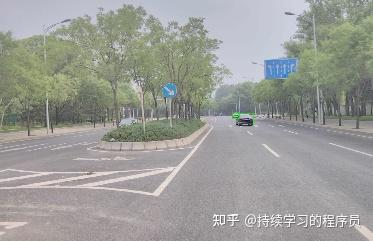
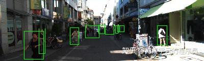
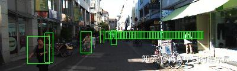
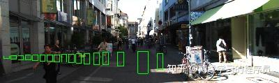
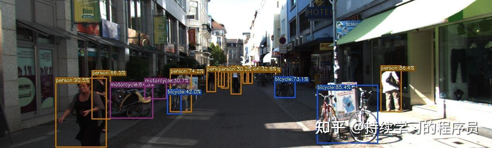
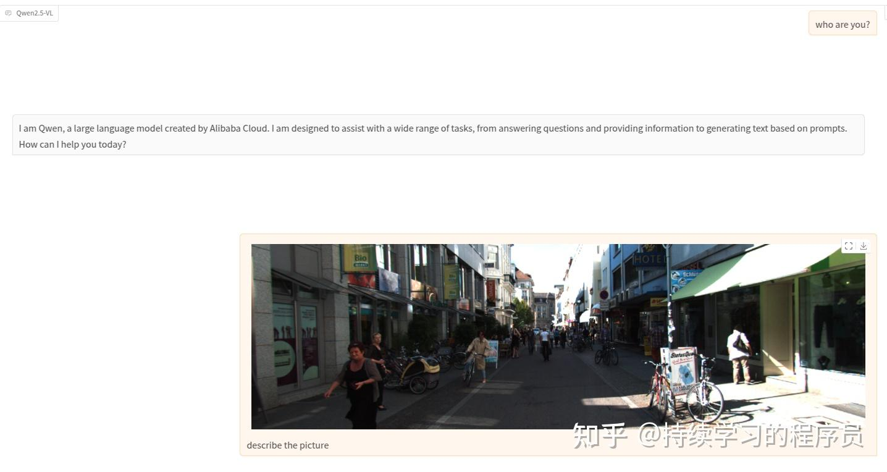
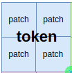
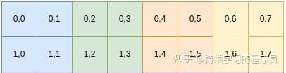
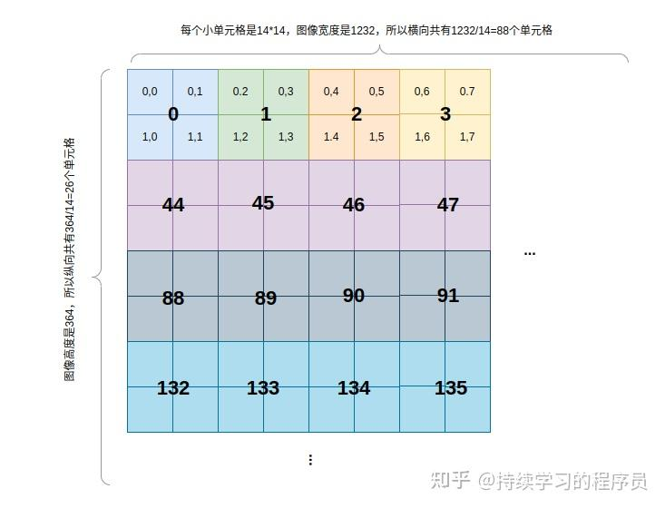

最近详细的学习了一下qwen2.5-vl国产多模态大模型，笔记如下。

在本文中主要关注数据层面是如何一步一步处理的，也会把一些关键的数据tensor列出来。至于原理层面的介绍，可以参考：[万字长文图解Qwen2.5-VL实现细节](https://zhuanlan.zhihu.com/p/1921289925552210138)，[【多模态大模型】Qwen2.5-VL解剖](https://zhuanlan.zhihu.com/p/24986805514) 这两篇文章。

## 环境安装

官方readme中关于环境安装方面的信息不多，可参考：[Qwen2.5-VL部署详细记录-CSDN博客](https://blog.csdn.net/yyy99997/article/details/148471136)，里面遇到的问题确实都会遇到。本文使用的是Qwen2.5-VL-7B-Instruct模型。

另外，建议安装flash-attn，因为我这边3090显卡24G显存在不安装flash-attn时，会话过长时会出现out of memory的错误，且速度很慢，一秒也就能输出大概几个词。开启后速度就很快，也节省显存。

## 效果测试

前一段时间在搞目标检测相关的小模型，所以就顺手拿了几张图片看看qwen识别的怎么样，过程如下：

**问题：** 

请把这张图片里所有“车辆”用一个列表返回，格式统一为[{"bbox": [x1,y1,x2,y2], "category": "vehicle/bus/van/truck"}, ...]坐标必须是整数像素，不要有任何解释，只要 JSON 列表。

**qwen2.5-vl效果：** 

如下图，我把识别结果渲染在了图片中，可以看到图片中共有5辆车，识别出了2辆，且bbox的准确性还是可以的。5辆车中有2辆在远方，确实有些难度。



**问题：** 

请把这张图片里所有“行人”用一个列表返回，格式统一为[{"bbox": [x1,y1,x2,y2], "category": "pedestrain"}, ...]坐标必须是整数像素，不要有任何解释，只要 JSON 列表。

**qwen2.5-vl效果：** 



可以看到有miss掉的，也有框得不准确的。又试了下其它主流大模型，效果如下：

**deepseek效果：** 



**kimi效果：** 



**yolox效果：** 

前一段时间训了个小模型yolox，用2.3w coco+3k的kitti数据集训练出来的yolox模型的效果：



整体上来说，qwen的效果相对最好，不过qwen在预训练时，这种bbox的任务是预训练的任务之一，所以效果有一定的保障。其它大模型详情不了解，从实验结果看效果很差。这些大模型在特定任务上，效果上整体不如专用小模型。不过对于大模型，不能由这一个单一的实验来判断哪个模型更好或较差，因为大模型基础能力，通用能力比较强大，可以经过一定的finetune来增强特定任务的效果。

## 前向推理过程详解

### 输入：

我向模型问了两个问题如下：

question1: who are you?

question2: 上传一张图片(宽高为1238*374)，并让模型"describe the picture"

下面的一些分析和关键tensor的维度呈现都是基于这两个问题作为input。



*input*

### 输入模板化：

将输入文本嵌入到固定的模板之中，并且在会话中，会把历史上问的问题，模型的回答内容都会拼接起来，整体作为输入。前面的"You are a helpful assistant."等内容，就是模板的固定输入，训练时这些内容都有，所以infer时也需要保留。在文本中保留了图片或视频的占位符。

```text
<|im_start|>system
You are a helpful assistant.<|im_end|>
<|im_start|>user
who are you?<|im_end|>
<|im_start|>assistant
I am Qwen, a large language model created by Alibaba Cloud. I am designed to assist with a wide range of tasks, from answering questions and providing information to generating text based on prompts. How can I help you today?<|im_end|>
<|im_start|>user
<|vision_start|><|image_pad|><|vision_end|>describe the picture<|im_end|>
<|im_start|>assistant
```

### 图片preprocess：

**1，分辨率调整** 

将图片的分辨率resize到宽高都可以被28整除，原因下面会讲。另外，在qwen中，输入的图片是尽量保留了所有的像素，也就是兼容不同的分辨率的图像。而有一些大模型粗暴的将图片resize成224*224或336*336等分辨率。固定分辨率的优点是处理起来比较一致且简单高效，动态分辨率的优点是灵活，保留了尽可能多的信息，缺点就是处理起来比较麻烦，从下面的讲解中可以看出来。

```text
#原始输入size
width
1238
height
374

#调整后的size
resized_width
1232
resized_height
364
```

**2，其它预处理** 

包括：图片中像素归一化，正则化，reshape等常规操作。

输入：

```text
[<PIL.Image.Image image mode=RGB size=1232x364 at 0x7F31F0DBB9A0>]
```

输出：

```text
image_inputs.data['pixel_values'].shape
torch.Size([2288, 1176]) # 图片像素转换成patch
image_inputs.data['image_grid_thw']
tensor([[ 1, 26, 88]])
```

其中，2288 = 26 * 88(26=364/14, 88=1232/14，14*14就是patch大小)，这里不是简单的patch化一下就行，因为常规的patch化就是以从左到右，从上到下的顺序将patch组织在一起。但这里不同的是，在patch的顺序中，图片中相邻的4个patch拼在一起。如下图所示。原因是最终送入到大模型中的是一个一个token，patch的数量可能还是太多了，所以将相邻的4个patch转化成一个token，在此时还没有token，只是为下游转换成token作一些数据层面的准备。



*token与patch关系*

1176 = 3*2*14*14 (channel = 3,  在时间维度上是连续2帧在一起，单张图片没有时间维度，所以对输入是单张图片时，就复制一份形成2张连续的图片。对于视频，就按一定时间间隔转化成一帧一帧的图片，然后每连续2帧形成一组来提取特征。所以对输入是单张图片时，可以理解为是只包含2帧图片的视频。)

此时，对图片的处理都还是像素级别的重组，还没有到特征提取层面。

### 文本tokenize：

将单词变为id，其中有一些特殊字符，例如图片的每个token的占位符，它的id=151655，个数是572(13*44， 13=26/2，44=88/2，原因上文讲过)。

```text
text_inputs.data['input_ids']
tensor([[151644,   8948,    198,   2610,    525,    264,  10950,  17847,     13,
         151645,    198, 151644,    872,    198,  14623,    525,    498,     30,
         151645,    198, 151644,  77091,    198,     40,   1079,   1207,  16948,
             11,    264,   3460,   4128,   1614,   3465,    553,  54364,  14817,
             13,    358,   1079,   6188,    311,   7789,    448,    264,   6884,
           2088,    315,   9079,     11,    504,  35764,   4755,    323,   8241,
           1995,    311,  23163,   1467,   3118,    389,  50932,     13,   2585,
            646,    358,   1492,    498,   3351,     30, 151645,    198, 151644,
            872,    198, 151652, 151655, 151655, 151655, 151655, 151655, 151655,
         151655, 151655, ..., 151655, 151655, 151655, 151653,
          12332,    279,   6802, 151645,    198, 151644,  77091,    198]])

(text_inputs.data['input_ids']==151655).sum()
tensor(572)
```

### 图片的特征提取：

**1，初步提取特征** 

上面已讲，image preprocess后的shape是(2288, 1176)，在这里，经过一次3d卷积，将原始的像素信息，转换为特征，输出shape：（2288, 1280）

```text
hidden_states.shape
torch.Size([2288, 1280])
```

**2，二维旋转位置编码** 

卷积后再通过transformer进行不同patch之间的特征进一步融合。在常规模型中，旋转位置编码是一维的，例如，对于一个输入是文本的模型，文本中每个word的位置从0-n自然生长。但在图像特征提取中，图像天然就是一个二维的结构，所以使用二维旋转位置编码比较合适。

首先在vision transformer中，dim=1280，head数是16，所以每个head的dim=1280/16=80。

我们知道旋转位置编码在dim的各分量上分为sin,cos计算，所以sin/cos分别占用40个维度。



如上图所示，每个patch(14*14)有一个(x,y)坐标(单元格中的数字就是此单元格的坐标)，是一个二维的位置，也就是两个数字，所以每个数字占用40/2=20个维度，拼在一起就形成了一个长度为40的位置向量。

关键代码：

```text
rotary_pos_emb = self.rot_pos_emb(grid_thw)

#rotary_pos_emb.shape
#torch.Size([2288, 40])
```

**3，window attention** 

虽然在特征提取的时候是以patch=14*14的粒度去提取的，但最终将特征输入给大模型时，在数量上又缩减到1/4（上文有解释原因）。如下图所示，每4个单元格中间那个数字就是一个token的id，因为横向有88/2=44个token，所以第二行的第一个token的id就是44。

下图中整体上是一个window，其中有4*4=16个token，它对应的图像的像素是112*112，对应的patch数量是8*8=64个。window attention就是每个patch在它所属的112*112像素的window范围内进行注意力。

例如本例中的图片，共有44(4*11，其中宽度上11正好可以整除，但在高度上26/8需要padding后达到4)个这样的window。这样将整体图片上的全局注意力，分散在了44个window中各自进行注意力计算。

在这里有window->token->patch不同层级的概念，可能性些混乱。简单总结一下，在本模块内部hidden_states(2288*1280)的物理顺序上，也是按window->token->patch的层级进行组织(也就是一个window内的patch是连续存储，然后接下一个window，依次类推)，这样自然而然的在window范围内进行attention操作，后续将patch形成token时也比较简单。需要强调一点，虽然有这么多层级，在最终的attention操作时，还是patch与patch之间的attention。



*二维旋转位置编码和window attentin示意*

关键代码：

```python3
window_index, cu_window_seqlens = self.get_window_index(grid_thw)

#window_index:
#tensor([  0,   1,   2,   3,  44,  45,  46,  47,  88,  89,  90,  91, 132, 133,
#        134, 135,   4,   5,   6,   7,  48,  49,  50,  51,  92,  93,  94,  95,
#        136, 137,...,570, 571])
#window_index中的每个数字就是上面所说的token的id，此变量就是将图片中所有的token在物理空间上按window的顺序进行组织
#所以第一个window内的token的顺序就是0,1,2,3....135，然后再接着下一个window。
#此变量用于将patch和position embed按window的顺序进行组织。


#cu_window_seqlens:
#tensor([   0,   64,  128,  192,  256,  320,  384,  448,  512,  576,  640,  704,
#         768,  832,  896,  960, 1024, 1088, 1152, 1216, 1280, 1344, 1408, 1472,
#        1536, 1600, 1664, 1728, 1792, 1856, 1920, 1984, 2048, 2112, 2128, 2144,
#        2160, 2176, 2192, 2208, 2224, 2240, 2256, 2272, 2288], device='cuda:0',
#       dtype=torch.int32)
#cu_window_seqlens就代表每个window中有多少个patch，是cumsum的结果，也就是每相邻两个数字相减，
#就是此window中的patch数量，例如，第二个数字64就代表第一个window中有64个patch。可以发现：
#前面大部分的window都是“满员”的，而后面的一些window中只有16个patch，因为在图像的底部的window是没有被占满的。
#此变量就用于上面所说的window内注意力的计算。
```

**4，attention** 

就是正常的self attention操作，共有32个block或叫layer。在其中的四个block中使用full attention。其它使用window attention。整体输出还是(2288, 1280)。

```text
#self.fullatt_block_indexes
#[7, 15, 23, 31]
#vision模块共有32个block，在上面的block中使用full attention。其它使用window attention。

#整体输出：
#x.shape
#torch.Size([2288, 1280])
```

**5，将patch特征合并成token** 

将(2288, 1280)每四个patch合并成一个token（可参考上面的图），变成(572, 5120)，然后经过一个mlp降一下维变成(572,3584)。

```text
hidden_states = self.merger(hidden_states)
```

**6，将按window顺序的token转换为以行/列顺序的token** 

经过上面的步骤后输出的572个token在物理空间的存储上是以window的顺序存储的(在前面第3步讲过)，也就是顺序是：window_1内的16个token，...，window_n内的16个token。在这里转换成了以图像行列为顺序，也就是在token物理存储上恢复原始的顺序。

```text
reverse_indices = torch.argsort(window_index)
hidden_states = hidden_states[reverse_indices, :]

#hidden_states.shape
#torch.Size([572, 3584])
```

到这里，图片的特征提取就完成了，输出tensor的维度是572*3584，其中572=13*44，此图片共提取了572个token，上文也讲过。

### 大模型部分

经过上文的将图片转换成token，再加上文本对应的token，所有的token输入到大模型中进行infer。大模型的部分本身也比较常规，目前主流的大模型大体上都类似(norm->self attn->norm->ffn...)。下面只讲几个不同的地方：

**1，三维旋转位置编码** 

感觉越来越复杂了，刚才图片中用的是二维旋转位置编码，到这里就变成了三维了。原因是此时的token可能有video的token，而在video层面，信息是三维的(t,h,w：时间，高，宽)。所以就将位置编码统一为三维的。

对于文本的token来说，t=h=w，例如，对于本次测试输入的前74个文本来说，它的position信息如下：

```text
llm_pos_ids_list[0]
tensor([[ 0,  1,  2,  3,  4,  5,  6,  7,  8,  9, 10, 11, 12, 13, 14, 15, 16, 17,
         18, 19, 20, 21, 22, 23, 24, 25, 26, 27, 28, 29, 30, 31, 32, 33, 34, 35,
         36, 37, 38, 39, 40, 41, 42, 43, 44, 45, 46, 47, 48, 49, 50, 51, 52, 53,
         54, 55, 56, 57, 58, 59, 60, 61, 62, 63, 64, 65, 66, 67, 68, 69, 70, 71,
         72, 73],
        [ 0,  1,  2,  3,  4,  5,  6,  7,  8,  9, 10, 11, 12, 13, 14, 15, 16, 17,
         18, 19, 20, 21, 22, 23, 24, 25, 26, 27, 28, 29, 30, 31, 32, 33, 34, 35,
         36, 37, 38, 39, 40, 41, 42, 43, 44, 45, 46, 47, 48, 49, 50, 51, 52, 53,
         54, 55, 56, 57, 58, 59, 60, 61, 62, 63, 64, 65, 66, 67, 68, 69, 70, 71,
         72, 73],
        [ 0,  1,  2,  3,  4,  5,  6,  7,  8,  9, 10, 11, 12, 13, 14, 15, 16, 17,
         18, 19, 20, 21, 22, 23, 24, 25, 26, 27, 28, 29, 30, 31, 32, 33, 34, 35,
         36, 37, 38, 39, 40, 41, 42, 43, 44, 45, 46, 47, 48, 49, 50, 51, 52, 53,
         54, 55, 56, 57, 58, 59, 60, 61, 62, 63, 64, 65, 66, 67, 68, 69, 70, 71,
         72, 73]])

llm_pos_ids_list[0].shape
torch.Size([3, 74])
```

而对于图片来说，t,h,w也很容易理解，就是时间position，高度的position和宽度的position。

如下，第一个数字74就是接序上面text的最后一个position。对于t维度，因为图片是没有时间序的，所以这个维度的position是一样的。而对于视频，会首先转换成图片序列，所以t维度就按正常的时间序进行设置position即可。

```text
llm_pos_ids_list[1]
tensor([[ 74,  74,  74,  ...,  74,  74,  74],
        [ 74,  74,  74,  ...,  86,  86,  86],
        [ 74,  75,  76,  ..., 115, 116, 117]])
llm_pos_ids_list[1].shape
torch.Size([3, 572]) #572就是图片的最终token数量=13*44

#本案例中，我输入的图片左右两边各有一段文本，所以后面还有一段文本的position
llm_pos_ids_list[2]
tensor([[118, 119, 120, 121, 122, 123, 124, 125, 126],
        [118, 119, 120, 121, 122, 123, 124, 125, 126],
        [118, 119, 120, 121, 122, 123, 124, 125, 126]])
llm_pos_ids_list[2].shape
torch.Size([3, 9])
```

最终将上面的文本，图片，文本三个部分拼起来，就是最终每个token的position，可以看到，position仍然是t,h,w三个维度，共655个token：

```text
position_ids
tensor([[[  0,   1,   2,  ..., 124, 125, 126]],
        [[  0,   1,   2,  ..., 124, 125, 126]],
        [[  0,   1,   2,  ..., 124, 125, 126]]], device='cuda:0')
position_ids.shape
torch.Size([3, 1, 655])
```

**2，position embedding化** 

对每个token的position编码好了以后，就需要将它转换为position embedding。在qwen2.5-vl大模型中，hidden dim=3584，head数是28，所以每个head的dim=3584/28=128。在旋转位置编码中，按sin/cos分为两部分，每部分是128/2=64。

所以现在的目标就是如何在64维的向量中编码t,h,w三个position信息，答案是t,h,w分别占用16,24,24个元素。具体来说，例如对上面图片的最后一个token，它的t,h,w的position id分别是74,86,117，那么将74对应的位置embedding向量的前0-16个元素，86对应的位置embedding向量的16-40个元素，117对应的位置embedding向量的40-64个元素，这三部分拼起来就形成了一个新的64维的向量。

**3，大模型attention** 

上面提到head数是28，在这里使用了grouped-query attention（GQA），k/v的数量是MHA的1/7。这样可以减少kv缓存。block数也是28。这些都是常规的知识，没什么多说的。

```text
query_states.shape
torch.Size([1, 28, 655, 128])
value_states.shape
torch.Size([1, 4, 655, 128])
key_states.shape
torch.Size([1, 4, 655, 128])
```

## 总结：

qwen2.5-vl多模态模型使用了window attention，二/三维旋转位置编码，保留原始图片的分辨率(qwen2-vl中就有此能力)等技术点。在video层面还有动态帧率采样，绝对时间位置编码等技术点，不过视频部分我没有细看，后续再按需研究即可。在效果层面上，市场反馈目前是国产的比较优秀的多模态大模型之一。