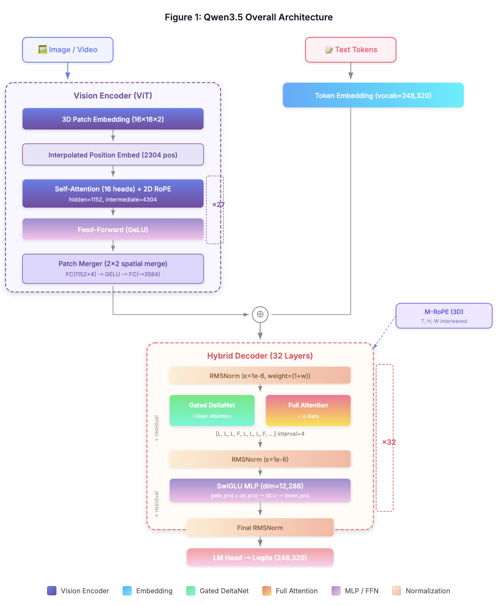
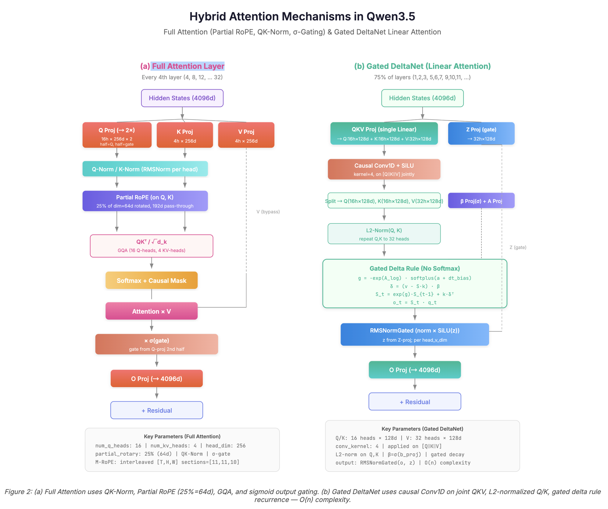
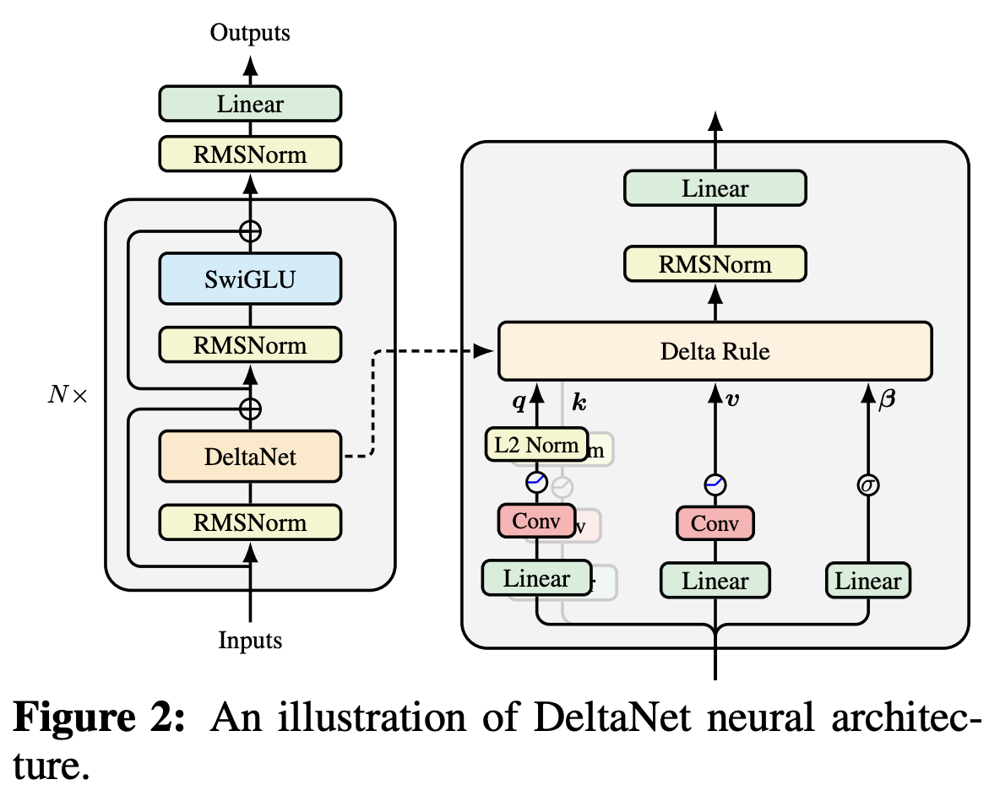

## 目录

1. 一、文本模型
    1. 1. MRoPE多模态（时间、高度、宽度）旋转位置编码
    2. 2.  全注意力Qwen3_5Attention 
    3. 3. 线性注意力Qwen3_5GatedDeltaNet 
2. 二、视觉模型



Qwen3.5 即将发布，从代码结构上看是Qwen 家族第一个原生多模态模型，后续应该不会再有 Qwen3.5-VL 了。对比前一代模型主要有以下几个创新点：

- **混合层架构** ：注意力使用了 Qwen3-Next 里的混合层架构，每3层线性注意力插入1层标准注意力
- **Gated Attention** ：全注意力和线性注意力都引入了Qwen3-Next 中的门控机制。其中线性注意力采用了DeltaNet
- **原生多模态** ：大概率从预训练开始使用了视觉数据

[Code] [https://github.com/bozheng-hit/transformers/blob/f3bd443cc9274ac8550b4585114323200b780f5a/src/transformers/models/qwen3_5/modeling_qwen3_5.py](https://github.com/bozheng-hit/transformers/blob/f3bd443cc9274ac8550b4585114323200b780f5a/src/transformers/models/qwen3_5/modeling_qwen3_5.py)


之前的Qwen 系列解读参考：

[【多模态大模型】Qwen3-VL解剖](https://zhuanlan.zhihu.com/p/1956306982970586546)

[【LLM】Gated Attention：Qwen3-Next 背后的门控机制](https://zhuanlan.zhihu.com/p/2001460429721997501)


*模型概览*

## 一、文本模型

`Qwen3_5TextModel` 混合了全注意力（Full Attention）和线性注意力（Linear Attention / Gated DeltaNet），并使用多模态旋转位置编码 MRoPE。在模型初始化阶段，构建了以下关键组件：

```text
    def __init__(self, config: Qwen3_5TextConfig):
        super().__init__(config)
        self.embed_tokens = nn.Embedding(config.vocab_size, config.hidden_size, config.pad_token_id)
        self.layers = nn.ModuleList(
            [Qwen3_5DecoderLayer(config, layer_idx) for layer_idx in range(config.num_hidden_layers)]
        )
        self.norm = Qwen3_5RMSNorm(config.hidden_size, eps=config.rms_norm_eps)
        self.rotary_emb = Qwen3_5TextRotaryEmbedding(config=config)
        self.gradient_checkpointing = False
        # Initialize weights and apply final processing
        self.post_init()
```


### 1. MRoPE多模态（时间、高度、宽度）旋转位置编码

其中值得关注的是 `Qwen3_5TextRotaryEmbedding`，熟悉Qwen-VL 系列模型的朋友知道这是一个支持多模态（时间、高度、宽度）的旋转位置编码。对于给定的 position_ids（纯文本`[batch, seq_len]`or多模态`[3, batch, seq_len]`），它返回对应的cos和sin矩阵，用于与 query/key 向量进行旋转。初始化方法中定义了两个比较重要的变量：

- **partial_rotary_factor** ： 配置文件里写 0.25，意义是只对 Q/K 四分之一的维度进行旋转，具体来说，注意力每个头的维度是`head_dim=256`，用于旋转编码的维度是 `dim=256*0.25=64`。

```text
inv_freq = 1.0 / (base ** (torch.arange(0, dim, 2, dtype=torch.int64).to(device=device, dtype=torch.float) / dim))
```

- **inv_freq** ：逆频率，形状 [D]，其中 **D = dim // 2 = 32** ，是旋转频率的个数， RoPE 的核心参数，控制不同维度正弦波形的周期。

接下来看`Qwen3_5TextRotaryEmbedding`的forward部分就比较好理解了：

```text
    def forward(self, x, position_ids):
        # In contrast to other models, Qwen3_5 has different position ids for the grids
        # So we expand the inv_freq to shape (3, ...)
        if position_ids.ndim == 2:
            position_ids = position_ids[None, ...].expand(3, position_ids.shape[0], -1)
        inv_freq_expanded = self.inv_freq[None, None, :, None].float().expand(3, position_ids.shape[1], -1, 1)
        position_ids_expanded = position_ids[:, :, None, :].float()  # shape (3, bs, 1, positions)

        device_type = x.device.type if isinstance(x.device.type, str) and x.device.type != "mps" else "cpu"
        with maybe_autocast(device_type=device_type, enabled=False):  # Force float32
            freqs = (inv_freq_expanded.float() @ position_ids_expanded.float()).transpose(2, 3)
            freqs = self.apply_interleaved_mrope(freqs, self.mrope_section)
            emb = torch.cat((freqs, freqs), dim=-1)
            cos = emb.cos() * self.attention_scaling
            sin = emb.sin() * self.attention_scaling

        return cos.to(dtype=x.dtype), sin.to(dtype=x.dtype)
```

其中expanded的维度变化如下：

- **`inv_freq`** ：初始形状 `[D]`。经过四次索引：`[None, None, :, None]` → 形状 `[1, 1, D, 1]`。接着 `.expand(3, bs, -1, 1)` → 形状 **`[3, bs, D, 1]`** 。
- **`position_ids`** ：原始形状可能是 `[bs, seq_len]`（纯文本）或 `[3, bs, seq_len]`（多模态）。
代码保证扩展为 3 维，经过 `[:, :, None, :]` → 形状 **`[3, bs, 1, seq_len]`** 。

接下来是矩阵乘法：

```text
freqs = (inv_freq_expanded.float() @ position_ids_expanded.float()).transpose(2, 3)
```

这一步得到freqs的中间结果，形状**`[3, bs, D, seq_len]`** ，离我们的期望仍有差异，因为时间、高度、宽度散落在三个不同通道。 

apply_interleaved_mrope可以将三个通道的旋转角度汇总到一个通道：

```text
    def apply_interleaved_mrope(self, freqs, mrope_section):
        """Apply interleaved MRoPE to 3D rotary embeddings.
        Reorganizes frequency layout from chunked [TTT...HHH...WWW] to
        interleaved [THWTHWTHW...TT], preserving frequency continuity.
        args:
            x: (3, bs, seq_len, head_dim // 2)
            mrope_section: (3,)
        returns:
            x_t: (bs, seq_len, head_dim // 2)
        """
        freqs_t = freqs[0]  # just overwrite the first dimension T
        for dim, offset in enumerate((1, 2), start=1):  # H, W
            length = mrope_section[dim] * 3
            idx = slice(offset, length, 3)
            freqs_t[..., idx] = freqs[dim, ..., idx]
        return freqs_t
```

`mrope_section`是一个长度为 3 的列表，表示在旋转维度中**分配给 T、H、W 各自的数量** 。例如`[11, 11, 10]`表示总旋转维度为(11+11+10)=32。

这个参数设计的原因是因为我们希望最终的频率矩阵（形状 `[bs, seq_len, D]`）中通道的顺序是：

> `[ T1, H1, W1, T2, H2, W2, T3, H3, W3, ..., T_{T_len}, H_{H_len}, W_{W_len} ]` 

每 3 个通道为一组，除非某维度先耗尽（这里是 W 少一个），同一组内的通道来自不同的模态。至此，freqs的形状是我们想要的`[bs, seq_len, D]`了。 

接下来是将每个频率对应的角度值复制一份变成`[bs, seq_len, dim]`并计算 cos/sin：

```text
emb = torch.cat((freqs, freqs), dim=-1)
cos = emb.cos() * self.attention_scaling
sin = emb.sin() * self.attention_scaling
```

以便在后续的旋转计算中与向量拆分方式相匹配。这是常用的 RoPE 计算范式，这种范式要求 cos 和 sin 张量的维度与 query 完全一致，并且前半部分和后半部分的相同索引位置必须对应同一个频率 $\theta_{i}$ 。以 query 为例，`q_embed = q * cos + rotate_half(q) * sin`，其中 rotate_half：

```text
def rotate_half(x):
    """Rotates half the hidden dims of the input."""
    x1 = x[..., : x.shape[-1] // 2]
    x2 = x[..., x.shape[-1] // 2 :]
    return torch.cat((-x2, x1), dim=-1)
```

代入上述 cos和 sin：

- q * cos：前半 D 维乘 `cos θ_i`，后半 D 维也乘 `cos θ_i`。
- rotate_half(q) * sin：前半 D 维 = `-q[..., D+i] * sin θ_i`，后半 D 维 = `q[..., i] * sin θ_i`。

合并后：

- 第 i 维（`0 ≤ i < D`）：`q_i * cos θ_i - q_{D+i} * sin θ_i`
- 第 D+i 维：`q_{D+i} * cos θ_i + q_i * sin θ_i` 

这正是将维度对 `(i, D+i)` 作为旋转对，并用 θ_i 进行旋转的数学形式。


### 2.  全注意力Qwen3_5Attention 

`Qwen3_5DecoderLayer`每一层可能是**linear_attention**  (GatedDeltaNet) 也可能是**full_attention** 。 具体来说每间隔四层有一个全注意力层，如`[L,L,L,F,L,L,L,F,L,...]` 。

```text
class Qwen3_5DecoderLayer(GradientCheckpointingLayer):
    def __init__(self, config: Qwen3_5TextConfig, layer_idx: int):
        super().__init__()
        self.hidden_size = config.hidden_size
        self.layer_type = config.layer_types[layer_idx]
        if self.layer_type == "linear_attention":
            self.linear_attn = Qwen3_5GatedDeltaNet(config, layer_idx)
        elif self.layer_type == "full_attention":
            self.self_attn = Qwen3_5Attention(config, layer_idx)
        self.mlp = Qwen3_5MLP(config, config.intermediate_size)
        self.input_layernorm = Qwen3_5RMSNorm(config.hidden_size, eps=config.rms_norm_eps)
        self.post_attention_layernorm = Qwen3_5RMSNorm(config.hidden_size, eps=config.rms_norm_eps)
```




首先讲一下全注意力**`Qwen3_5Attention`** 的具体实现，这是一个普通的门控注意力。Gated Attention是NeurIPS 2025 Best Paper，之前做过详细讲解。

```text
class Qwen3_5Attention(nn.Module):
    """Multi-headed attention from 'Attention Is All You Need' paper"""

    def __init__(self, config: Qwen3_5Config, layer_idx: int):
        super().__init__()
        self.config = config
        self.layer_idx = layer_idx
        self.head_dim = getattr(config, "head_dim", config.hidden_size // config.num_attention_heads)
        self.num_key_value_groups = config.num_attention_heads // config.num_key_value_heads
        self.scaling = self.head_dim**-0.5
        self.attention_dropout = config.attention_dropout
        self.is_causal = True
        self.q_proj = nn.Linear(
            config.hidden_size, config.num_attention_heads * self.head_dim * 2, bias=config.attention_bias
        )
        self.k_proj = nn.Linear(
            config.hidden_size, config.num_key_value_heads * self.head_dim, bias=config.attention_bias
        )
        self.v_proj = nn.Linear(
            config.hidden_size, config.num_key_value_heads * self.head_dim, bias=config.attention_bias
        )
        self.o_proj = nn.Linear(
            config.num_attention_heads * self.head_dim, config.hidden_size, bias=config.attention_bias
        )
        self.q_norm = Qwen3_5RMSNorm(self.head_dim, eps=config.rms_norm_eps)  # unlike olmo, only on the head dim!
        self.k_norm = Qwen3_5RMSNorm(self.head_dim, eps=config.rms_norm_eps)  # thus post q_norm does not need reshape

    def forward(
        self,
        hidden_states: torch.Tensor,
        position_embeddings: tuple[torch.Tensor, torch.Tensor],
        attention_mask: torch.Tensor | None,
        past_key_values: Cache | None = None,
        cache_position: torch.LongTensor | None = None,
        **kwargs: Unpack[FlashAttentionKwargs],
    ) -> tuple[torch.Tensor, torch.Tensor | None]:
        input_shape = hidden_states.shape[:-1]
        hidden_shape = (*input_shape, -1, self.head_dim)

        query_states, gate = torch.chunk(
            self.q_proj(hidden_states).view(*input_shape, -1, self.head_dim * 2), 2, dim=-1
        )
        gate = gate.reshape(*input_shape, -1)

        query_states = self.q_norm(query_states.view(hidden_shape)).transpose(1, 2)
        key_states = self.k_norm(self.k_proj(hidden_states).view(hidden_shape)).transpose(1, 2)
        value_states = self.v_proj(hidden_states).view(hidden_shape).transpose(1, 2)

        cos, sin = position_embeddings
        query_states, key_states = apply_rotary_pos_emb(query_states, key_states, cos, sin)

        if past_key_values is not None:
            # sin and cos are specific to RoPE models; cache_position needed for the static cache
            cache_kwargs = {"sin": sin, "cos": cos, "cache_position": cache_position}
            key_states, value_states = past_key_values.update(key_states, value_states, self.layer_idx, cache_kwargs)

        attention_interface: Callable = ALL_ATTENTION_FUNCTIONS.get_interface(
            self.config._attn_implementation, eager_attention_forward
        )

        attn_output, attn_weights = attention_interface(
            self,
            query_states,
            key_states,
            value_states,
            attention_mask,
            dropout=0.0 if not self.training else self.attention_dropout,
            scaling=self.scaling,
            **kwargs,
        )

        attn_output = attn_output.reshape(*input_shape, -1).contiguous()
        attn_output = attn_output * torch.sigmoid(gate)

        attn_output = self.o_proj(attn_output)
        return attn_output, attn_weights
```

其核心是定义一个和 注意力输出`attn_output` 一样形状`[batch,seq_len,n_head*head_dim]`的 `gate`，然后逐元素相乘：

```text
attn_output = attn_output * torch.sigmoid(gate)
```

gate 的值由当前的 hidden_state——也即当前的待输出 token 决定，这使得门控注意力可以通过当前的 token 的状态来调整注意力输出，这可能是它能提升训练效果的一个原因。

```text
query_states, gate = torch.chunk(self.q_proj(hidden_states).view(*input_shape, -1, self.head_dim * 2), 2, dim=-1)
```

`apply_rotary_pos_emb`对Query 和 Key 指定的维度（前四分之一）进行了旋转，其它的细节在上一节已详细讲过：

```text
def apply_rotary_pos_emb(q, k, cos, sin, unsqueeze_dim=1):
    """Applies Rotary Position Embedding to the query and key tensors.

    Removes the interleaving of cos and sin from GLM

    Args:
        q (`torch.Tensor`): The query tensor.
        k (`torch.Tensor`): The key tensor.
        cos (`torch.Tensor`): The cosine part of the rotary embedding.
        sin (`torch.Tensor`): The sine part of the rotary embedding.
        unsqueeze_dim (`int`, *optional*, defaults to 1):
            The 'unsqueeze_dim' argument specifies the dimension along which to unsqueeze cos[position_ids] and
            sin[position_ids] so that they can be properly broadcasted to the dimensions of q and k. For example, note
            that cos[position_ids] and sin[position_ids] have the shape [batch_size, seq_len, head_dim]. Then, if q and
            k have the shape [batch_size, heads, seq_len, head_dim], then setting unsqueeze_dim=1 makes
            cos[position_ids] and sin[position_ids] broadcastable to the shapes of q and k. Similarly, if q and k have
            the shape [batch_size, seq_len, heads, head_dim], then set unsqueeze_dim=2.
    Returns:
        `tuple(torch.Tensor)` comprising of the query and key tensors rotated using the Rotary Position Embedding.
    """
    cos = cos.unsqueeze(unsqueeze_dim)
    sin = sin.unsqueeze(unsqueeze_dim)

    # Keep half or full tensor for later concatenation
    rotary_dim = cos.shape[-1]
    q_rot, q_pass = q[..., :rotary_dim], q[..., rotary_dim:]
    k_rot, k_pass = k[..., :rotary_dim], k[..., rotary_dim:]

    # Apply rotary embeddings on the first half or full tensor
    q_embed = (q_rot * cos) + (rotate_half(q_rot) * sin)
    k_embed = (k_rot * cos) + (rotate_half(k_rot) * sin)

    # Concatenate back to full shape
    q_embed = torch.cat([q_embed, q_pass], dim=-1)
    k_embed = torch.cat([k_embed, k_pass], dim=-1)
    return q_embed, k_embed
```


### 3. 线性注意力Qwen3_5GatedDeltaNet 

`Qwen3_5GatedDeltaNet`是 Qwen-3.5引入的一种线性注意力（Linear Attention）或者说状态空间模型（SSM）机制。它的核心思想是使用**Delta Rule（增量规则）** 来更新记忆状态，而不是像标准 Transformer 那样简单地累加（Add）。这种机制结合了 RNN 的推理效率 $O(1)$ 和 Transformer 的训练并行性（通过 Chunkwise 算法）。



**3.1 初始化** 

首先看看初始化代码里有哪些内容，注释中补充了 config 里的部分超参：

```text
class Qwen3_5GatedDeltaNet(nn.Module):
    def __init__(self, config: Qwen3_5Config, layer_idx: int):
        super().__init__()
        self.hidden_size = config.hidden_size  # 4096
        self.num_v_heads = config.linear_num_value_heads  # 32
        self.num_k_heads = config.linear_num_key_heads  # 16
        # 这里允许 num_v_heads > num_k_heads，通过 repeat_interleave 将 key 头广播到更多 value 头，以提升容量而不显著增加计算量。
        self.head_k_dim = config.linear_key_head_dim  # 128
        self.head_v_dim = config.linear_value_head_dim  # 128
        self.key_dim = self.head_k_dim * self.num_k_heads  # 2048
        self.value_dim = self.head_v_dim * self.num_v_heads  # 4096

        self.conv_kernel_size = config.linear_conv_kernel_dim  # 4
        self.layer_idx = layer_idx
        self.activation = config.hidden_act  # "silu"
        self.act = ACT2FN[config.hidden_act]
        self.layer_norm_epsilon = config.rms_norm_eps

        # QKV
        self.conv_dim = self.key_dim * 2 + self.value_dim  # 9192
        # 用矩阵转置使得一维卷积在序列维度 L 上进行
        # (key_dim * 2 + value_dim) 作为通道数
        self.conv1d = nn.Conv1d(  
            in_channels=self.conv_dim,
            out_channels=self.conv_dim,
            bias=False,
            kernel_size=self.conv_kernel_size,
            groups=self.conv_dim,
            padding=self.conv_kernel_size - 1,
        )

        # time step projection (discretization)
        # instantiate once and copy inv_dt in init_weights of PretrainedModel
        self.dt_bias = nn.Parameter(torch.ones(self.num_v_heads))

        A = torch.empty(self.num_v_heads).uniform_(0, 16)
        self.A_log = nn.Parameter(torch.log(A))

        self.norm = (
            Qwen3_5RMSNormGated(self.head_v_dim, eps=self.layer_norm_epsilon)
            if FusedRMSNormGated is None
            else FusedRMSNormGated(
                self.head_v_dim,
                eps=self.layer_norm_epsilon,
                activation=self.activation,
                device=torch.cuda.current_device(),
                dtype=config.dtype if config.dtype is not None else torch.get_default_dtype(),
            )
        )

        self.out_proj = nn.Linear(self.value_dim, self.hidden_size, bias=False)

        self.causal_conv1d_fn = causal_conv1d_fn  # 如有就从 fla 引入，否则退化成上面定义的self.conv1d 
        self.causal_conv1d_update = causal_conv1d_update or torch_causal_conv1d_update
        self.chunk_gated_delta_rule = chunk_gated_delta_rule or torch_chunk_gated_delta_rule
        self.recurrent_gated_delta_rule = fused_recurrent_gated_delta_rule or torch_recurrent_gated_delta_rule

        if not is_fast_path_available:
            logger.warning_once(
                "The fast path is not available because one of the required library is not installed. Falling back to "
                "torch implementation. To install follow https://github.com/fla-org/flash-linear-attention#installation and"
                " https://github.com/Dao-AILab/causal-conv1d"
            )

        self.in_proj_qkv = nn.Linear(self.hidden_size, self.key_dim * 2 + self.value_dim, bias=False)
        self.in_proj_z = nn.Linear(self.hidden_size, self.value_dim, bias=False)
        self.in_proj_b = nn.Linear(self.hidden_size, self.num_v_heads, bias=False)
        self.in_proj_a = nn.Linear(self.hidden_size, self.num_v_heads, bias=False)
```

`self.dt_bias`和`self.A_log` 是两个可学习的向量。

`Qwen3_5RMSNormGated`是一个特殊的归一化层，特殊在于将归一化后的 attn_output与门控信号gate $z$ 相乘， 位置和与全注意力的门控一样，都在 attention之后， $W_O$ 之前。

```text
class Qwen3_5RMSNormGated(nn.Module):
    def __init__(self, hidden_size, eps=1e-6, **kwargs):
        super().__init__()
        self.weight = nn.Parameter(torch.ones(hidden_size))
        self.variance_epsilon = eps

    def forward(self, hidden_states, gate=None):
        input_dtype = hidden_states.dtype
        hidden_states = hidden_states.to(torch.float32)
        variance = hidden_states.pow(2).mean(-1, keepdim=True)
        # Norm before gate
        hidden_states = hidden_states * torch.rsqrt(variance + self.variance_epsilon)
        hidden_states = self.weight * hidden_states.to(input_dtype)
        hidden_states = hidden_states * F.silu(gate.to(torch.float32))

        return hidden_states.to(input_dtype)
```

`torch_causal_conv1d_update` 完成一维卷积，并更新缓存的 conv_state：

```text
def torch_causal_conv1d_update(
    hidden_states,
    conv_state,
    weight,
    bias=None,
    activation=None,
):
    _, hidden_size, seq_len = hidden_states.shape
    state_len = conv_state.shape[-1]

    # 1. 拼接历史与当前输入
    # 将缓存的过去几个 Token (conv_state) 和当前的新 Token (hidden_states) 拼在一起
    hidden_states_new = torch.cat([conv_state, hidden_states], dim=-1).to(weight.dtype)

    # 2. 更新缓存 (Rolling Cache)
    # 取拼接后序列的最后 state_len 个元素，覆盖回 conv_state
    conv_state.copy_(hidden_states_new[:, :, -state_len:])

    # 3. 执行卷积
    # groups=hidden_size 表示这是 Depthwise Convolution（深度卷积）
    # 每个通道独立进行卷积，互不干扰，计算量极小
    out = F.conv1d(hidden_states_new, weight.unsqueeze(1), bias, padding=0, groups=hidden_size)

    # 取最后 seq_len 个结果作为输出
    out = F.silu(out[:, :, -seq_len:])
    out = out.to(hidden_states.dtype)
    return out
```


**3.2 前向传播** 

```text
    def forward(
        self,
        hidden_states: torch.Tensor,
        cache_params: Qwen3_5DynamicCache | None = None,
        cache_position: torch.LongTensor | None = None,
        attention_mask: torch.Tensor | None = None,
    ):
        hidden_states = apply_mask_to_padding_states(hidden_states, attention_mask)

        # Set up dimensions for reshapes later
        batch_size, seq_len, _ = hidden_states.shape

        use_precomputed_states = (
            cache_params is not None
            and cache_params.has_previous_state
            and seq_len == 1
            and cache_position is not None
        )

        # getting projected states from cache if it exists
        if cache_params is not None:
            conv_state = cache_params.conv_states[self.layer_idx]
            recurrent_state = cache_params.recurrent_states[self.layer_idx]

        mixed_qkv = self.in_proj_qkv(hidden_states)
        mixed_qkv = mixed_qkv.transpose(1, 2)

        z = self.in_proj_z(hidden_states)
        z = z.reshape(batch_size, seq_len, -1, self.head_v_dim)

        b = self.in_proj_b(hidden_states)
        a = self.in_proj_a(hidden_states)

        if use_precomputed_states:
            # 2. Convolution sequence transformation
            # NOTE: the conv state is updated in `causal_conv1d_update`
            mixed_qkv = self.causal_conv1d_update(
                mixed_qkv,
                conv_state,
                self.conv1d.weight.squeeze(1),
                self.conv1d.bias,
                self.activation,
            )
        else:
            if cache_params is not None:
                conv_state = F.pad(mixed_qkv, (self.conv_kernel_size - mixed_qkv.shape[-1], 0))
                cache_params.conv_states[self.layer_idx] = conv_state
            if self.causal_conv1d_fn is not None:
                mixed_qkv = self.causal_conv1d_fn(
                    x=mixed_qkv,
                    weight=self.conv1d.weight.squeeze(1),
                    bias=self.conv1d.bias,
                    activation=self.activation,
                    seq_idx=None,
                )
            else:
                mixed_qkv = F.silu(self.conv1d(mixed_qkv)[:, :, :seq_len])

        mixed_qkv = mixed_qkv.transpose(1, 2)
        query, key, value = torch.split(
            mixed_qkv,
            [
                self.key_dim,
                self.key_dim,
                self.value_dim,
            ],
            dim=-1,
        )

        query = query.reshape(batch_size, seq_len, -1, self.head_k_dim)
        key = key.reshape(batch_size, seq_len, -1, self.head_k_dim)
        value = value.reshape(batch_size, seq_len, -1, self.head_v_dim)

        beta = b.sigmoid()
        # If the model is loaded in fp16, without the .float() here, A might be -inf
        g = -self.A_log.float().exp() * F.softplus(a.float() + self.dt_bias)
        if self.num_v_heads // self.num_k_heads > 1:
            query = query.repeat_interleave(self.num_v_heads // self.num_k_heads, dim=2)
            key = key.repeat_interleave(self.num_v_heads // self.num_k_heads, dim=2)

        if not use_precomputed_states:
            core_attn_out, last_recurrent_state = self.chunk_gated_delta_rule(
                query,
                key,
                value,
                g=g,
                beta=beta,
                initial_state=None,
                output_final_state=cache_params is not None,
                use_qk_l2norm_in_kernel=True,
            )

        else:
            core_attn_out, last_recurrent_state = self.recurrent_gated_delta_rule(
                query,
                key,
                value,
                g=g,
                beta=beta,
                initial_state=recurrent_state,
                output_final_state=cache_params is not None,
                use_qk_l2norm_in_kernel=True,
            )

        # Update cache
        if cache_params is not None:
            cache_params.recurrent_states[self.layer_idx] = last_recurrent_state

        # reshape input data into 2D tensor
        core_attn_out = core_attn_out.reshape(-1, self.head_v_dim)
        z = z.reshape(-1, self.head_v_dim)
        core_attn_out = self.norm(core_attn_out, z)
        core_attn_out = core_attn_out.reshape(batch_size, seq_len, -1)

        output = self.out_proj(core_attn_out)
        return output
```

该模块的大致数据流向如下：

1. 输入投影：将输入 $x$ 映射为 $q,k,v$ 以及门控信号 $z$ (输出门的 Gate)、 $b$ (用于计算 $\beta$ )和 $a$ (用于计算衰减率)。
2. 短卷积（Short Conv）：在 $q,k,v$ 序列上应用步长为 4 的 1D 卷积，捕捉局部特征（类似 Mamba）。
3. 参数计算：计算步长/写入强度 $\beta_t$和衰减率 $g_t$ 。
4. 核心 Delta Rule：更新隐藏状态 $S$ 并计算注意力输出。
5. 输出门控与归一化：使用 RMSNorm 和门控 $z$ 处理输出。

理解 `Qwen3_5GatedDeltaNet` 的核心就在于理解它如何通过两套不同的算法路径，分别处理 **并行训练/预填充（Parallel）**  和 **串行推理（Recurrent）** 。


**1、解码阶段 (Decoding Phase)** 

**场景** ：模型已经处理完 Prompt，现在开始逐个生成 Token（ L+1, L+2, ...）。

**数据特征** ：

- 输入形状：[Batch, 1, Hidden_Size] (每次只进 1 个 Token)。
- use_precomputed_states 为 True (前提是 cache_params 存在且非空)。

**代码与数据流向：** 

- 读取 Cache：  

```text
if cache_params is not None:     
    conv_state = cache_params.conv_states[self.layer_idx]  # 形状 [B, D, Kernel]     
    recurrent_state = cache_params.recurrent_states[self.layer_idx]  # 形状 [B, H, K_dim, V_dim]
```

- 投影 (Projections)：  对这 **1 个**  Token 进行投影，得到 $q_t, k_t, v_t, z_t, b_t, a_t$ 。
- 卷积 (Convolution) - 增量模式**：** 进入 if use_precomputed_states: 分支，调用 `self.causal_conv1d_update`。如前所述，<1>取出 conv_state (过去几个 Token)。<2>拼接当前 Toke。<3>做卷积计算当前结果。<4>**原地更新**  conv_state (扔掉最旧的，加入当前的)。在不重新计算整个序列的情况下，获得当前 Token 的卷积特征。

**SSM 核心计算 - Recurrent 算法** ：  

- 代码：调用 `self.recurrent_gated_delta_rule`。  
- 逻辑：使用 RNN 形式的 Delta Rule 公式。
- $S_t = \lambda_t S_{t-1} + \beta_t k_t (v_t - S_{t-1}^T k_t)^T$ 
- $o_t = S_t^T q_t$ 
- 输入：当前的 $q,k,v$ 和上一时刻的 recurrent_state ( $S_{t-1}$)。  
- 输出：`core_attn_out`（当前 Token 的输出 $o_t$ ）和`last_recurrent_state`（更新后的状态 $S_t$ ）。
- Cache 更新：cache_params.recurrent_states[self.layer_idx] = last_recurrent_state。

解码阶段完全是 $O(1)$ 的。无论之前的序列有多长（1k 还是 100k），计算量都只和 Hidden Size 有关，显存占用也是恒定的（只存 $S$ 矩阵和极小的 Conv State）。


**2、预填充阶段 (Prefilling Phase)** 

**场景** ：用户输入了一段 Prompt（例如长度 L=1024），模型需要一次性计算出这段 Prompt 的所有 Token 的特征，并生成**初始的记忆状态（Cache）** ，为后续生成做准备。

**数据特征** ：

- 输入形状：`[Batch, Seq_Len, Hidden_Size]`，其中 `Seq_Len > 1`。
- `use_precomputed_states` 为 `False`。

**投影 (Projections)** ：

- 输入 `hidden_states` 经过线性层，并行计算出整个序列的 $Q,K,V$ 以及门控信号 $z,b,a$ 
- `mixed_qkv = mixed_qkv.transpose(1, 2)`此时数据形状变为 `[B, D, L]`。

**卷积 (Convolution) - 并行模式** ：

- **Cache 初始化** ：用 F.pad同时处理“序列过短需要补零”和“序列过长需要截取”两种情况，保持`conv_state`长度为`conv_kernel_size=4` 

```text
            if cache_params is not None:
                conv_state = F.pad(mixed_qkv, (self.conv_kernel_size - mixed_qkv.shape[-1], 0))
                cache_params.conv_states[self.layer_idx] = conv_state
```

- **操作** ：调用 self.causal_conv1d_fn (如果安装了 CUDA 优化版) 或 self.conv1d (PyTorch 原生)。
- **逻辑** ：在整个序列长度 L 上直接进行 1D 卷积。 

```text
            else:
                mixed_qkv = F.silu(self.conv1d(mixed_qkv)[:, :, :seq_len])
```

**参数计算** ：

- 恢复 $q,k,v$ 的形状

```text
       mixed_qkv = mixed_qkv.transpose(1, 2)
        query, key, value = torch.split(
            mixed_qkv,
            [
                self.key_dim,
                self.key_dim,
                self.value_dim,
            ],
            dim=-1,
        )

        query = query.reshape(batch_size, seq_len, -1, self.head_k_dim)
        key = key.reshape(batch_size, seq_len, -1, self.head_k_dim)
        value = value.reshape(batch_size, seq_len, -1, self.head_v_dim)
```

- 计算整个序列的 $\beta$ (步长) 和 $g$ (衰减率)。

```text
        beta = b.sigmoid()
        # If the model is loaded in fp16, without the .float() here, A might be -inf
        g = -self.A_log.float().exp() * F.softplus(a.float() + self.dt_bias)
```

- 在 DeltaNet 里，V 的头数比 Q 和 K 多，所以需要复制Q/K。

```text
        if self.num_v_heads // self.num_k_heads > 1:
            query = query.repeat_interleave(self.num_v_heads // self.num_k_heads, dim=2)
            key = key.repeat_interleave(self.num_v_heads // self.num_k_heads, dim=2)
```

> V 的头数更多的原因 是：**V 决定“写/读什么内容”（内容子空间容量），** 可以用更多的 value heads 提升表达能力/通道数，同时 $g,\beta$ 是 per-value-head 的门控参数：让不同 value heads 即使共享 $q,k$ ，也能用不同的衰减/更新强度形成差异化记忆。

**SSM 核心计算 - Chunkwise 算法** ：

调用 `self.chunk_gated_delta_rule`。这是**并行化** 的关键。它将长度 L 的序列切分成多个小块（Chunk= 64）。**块内** 使用类似 Attention 的矩阵乘法并行计算，**块间** 传递隐藏状态。

```text
def torch_chunk_gated_delta_rule(
    query,
    key,
    value,
    g,
    beta,
    chunk_size=64,
    initial_state=None,
    output_final_state=False,
    use_qk_l2norm_in_kernel=False,
):
    """
    Args:
        query, key, value: [Batch, Seq_Len, Num_Heads, Head_Dim]
        g: Log decay (衰减因子的对数), [Batch, Seq_Len, Num_Heads]
        beta: Step size (写入步长), [Batch, Seq_Len, Num_Heads]
        chunk_size: 分块大小，通常为 64 或 128
    """
    initial_dtype = query.dtype
    
    # ============================================================
    # 1. 预处理与归一化 (Preprocessing)
    # ============================================================
    # 对 Q 和 K 进行 L2 归一化，防止数值爆炸，这是 Linear Attention 的常见技巧
    if use_qk_l2norm_in_kernel:
        query = l2norm(query, dim=-1, eps=1e-6)
        key = l2norm(key, dim=-1, eps=1e-6)
    
    # 转置为 [Batch, Num_Heads, Seq_Len, Head_Dim] 以便后续处理
    query, key, value, beta, g = [
        x.transpose(1, 2).contiguous().to(torch.float32) for x in (query, key, value, beta, g)
    ]

    batch_size, num_heads, sequence_length, k_head_dim = key.shape
    v_head_dim = value.shape[-1]

    # ============================================================
    # 2. 填充 (Padding)
    # ============================================================
    # 为了能整除 chunk_size，对序列末尾进行 Padding
    pad_size = (chunk_size - sequence_length % chunk_size) % chunk_size
    query = F.pad(query, (0, 0, 0, pad_size))
    key = F.pad(key, (0, 0, 0, pad_size))
    value = F.pad(value, (0, 0, 0, pad_size))
    beta = F.pad(beta, (0, pad_size))
    g = F.pad(g, (0, pad_size))
    
    total_sequence_length = sequence_length + pad_size
    
    # Q 的缩放系数 (Scale)，类似 Attention 中的 1/sqrt(d)
    scale = 1 / (query.shape[-1] ** 0.5)
    query = query * scale

    # 预先计算加权的 V 和 K
    # v_beta = v * beta
    # k_beta = k * beta
    v_beta = value * beta.unsqueeze(-1)
    k_beta = key * beta.unsqueeze(-1)

    # ============================================================
    # 3. 重塑为 Chunks (Reshape to Chunks)
    # ============================================================
    # 将序列维度拆分为 [Num_Chunks, Chunk_Size]
    # 形状变为: [Batch, Heads, Num_Chunks, Chunk_Size, Dim]
    query, key, value, k_beta, v_beta = [
        x.reshape(x.shape[0], x.shape[1], -1, chunk_size, x.shape[-1]) for x in (query, key, value, k_beta, v_beta)
    ]
    g = g.reshape(g.shape[0], g.shape[1], -1, chunk_size)
    
    # 生成上三角掩码，用于后续的因果遮蔽
    mask = torch.triu(torch.ones(chunk_size, chunk_size, dtype=torch.bool, device=query.device), diagonal=0)

    # ============================================================
    # 4. 块内衰减计算 (Intra-Chunk Decay)
    # ============================================================
    # 计算块内的累积衰减。
    # g 是 log space，cumsum 后相减再 exp 得到相对衰减系数
    g = g.cumsum(dim=-1)
    # decay_mask[i, j] = exp(g[i] - g[j])，表示从时刻 j 到 i 的衰减
    decay_mask = ((g.unsqueeze(-1) - g.unsqueeze(-2)).tril().exp().float()).tril()

    # ============================================================
    # 5. 块内正交化/逆变换 (Intra-Chunk Orthogonalization)
    #    这是 Delta Rule 并行化的核心难点。
    # ============================================================
    # Delta Rule 公式: v_new = v - (S_{t-1} * k)
    # 在块内并行时，我们需要解出“如果不考虑前一个块的状态，当前块产生的纯净更新量是多少”。
    # 这等价于求解矩阵方程：(I + LowerTriangular) * V_new = V_input
    
    # 初始化 attn = - (K * beta * K^T) * Decay
    attn = -((k_beta @ key.transpose(-1, -2)) * decay_mask).masked_fill(mask, 0)
    
    # 通过迭代求解逆矩阵 (I - A)^-1 ≈ I + A + A^2 ... 
    # 这里利用了下三角矩阵的性质，在 chunk_size 次内完成传播
    for i in range(1, chunk_size):
        row = attn[..., i, :i].clone()
        sub = attn[..., :i, :i].clone()
        attn[..., i, :i] = row + (row.unsqueeze(-1) * sub).sum(-2)
    
    # 加上单位矩阵 I
    attn = attn + torch.eye(chunk_size, dtype=attn.dtype, device=attn.device)
    
    # 计算块内的“净增量” (Net Delta)
    # value 现在存储的是经过块内相互抵消后的 v_new
    value = attn @ v_beta 
    
    # 预计算 K 的累积效应，用于计算对下一个块的状态贡献
    # K_cumdecay = (I + ...)^-1 * K * beta * decay
    k_cumdecay = attn @ (k_beta * g.exp().unsqueeze(-1))

    # ============================================================
    # 6. 块间递归 (Inter-Chunk Recurrence)
    #    主循环：串行处理每个 Chunk，更新状态 S
    # ============================================================
    # 初始化记忆状态 S (Hidden State)
    last_recurrent_state = (
        torch.zeros(batch_size, num_heads, k_head_dim, v_head_dim).to(value)
        if initial_state is None
        else initial_state.to(value)
    )
    core_attn_out = torch.zeros_like(value)
    # 用于 Attention 的掩码 (对角线偏移1)
    mask = torch.triu(torch.ones(chunk_size, chunk_size, dtype=torch.bool, device=query.device), diagonal=1)

    # 遍历每一个 Chunk
    for i in range(0, total_sequence_length // chunk_size):
        # 取出当前 Chunk 的数据
        q_i, k_i, v_i = query[:, :, i], key[:, :, i], value[:, :, i]
        
        # --- A. 计算块内 Attention ---
        # 标准的 Q * K^T * Decay
        attn = (q_i @ k_i.transpose(-1, -2) * decay_mask[:, :, i]).masked_fill_(mask, 0)
        
        # --- B. 引入历史状态的影响 ---
        # 计算历史状态 S_{n-1} 对当前块 Key 的投影 (即预测值)
        # v_prime = S_{n-1}^T * K_cumdecay
        v_prime = (k_cumdecay[:, :, i]) @ last_recurrent_state
        
        # 计算最终的 Delta (误差)
        # v_new = 块内净增量 - 历史预测
        # 对应公式: delta = beta * (v - S * k)
        v_new = v_i - v_prime
        
        # --- C. 计算输出 (Output) ---
        # 第一部分: Q 读取历史状态 S_{n-1}
        # attn_inter = Q * Decay * S_{n-1}
        attn_inter = (q_i * g[:, :, i, :, None].exp()) @ last_recurrent_state
        
        # 第二部分: Q 读取当前块内的更新 v_new
        # out = Q * S_{n-1} + (Q * K^T) * v_new
        core_attn_out[:, :, i] = attn_inter + attn @ v_new
        
        # --- D. 更新状态 (State Update) ---
        # S_n = S_{n-1} * decay + K^T * v_new
        # 第一项: 历史状态衰减
        # 第二项: 写入新的信息 (外积 K^T * v_new)
        last_recurrent_state = (
            last_recurrent_state * g[:, :, i, -1, None, None].exp()
            + (k_i * (g[:, :, i, -1, None] - g[:, :, i]).exp()[..., None]).transpose(-1, -2) @ v_new
        )

    # ============================================================
    # 7. 后处理 (Post-processing)
    # ============================================================
    if not output_final_state:
        last_recurrent_state = None
        
    # 还原形状 [Batch, Heads, Num_Chunks, Chunk_Size, Dim] -> [Batch, Heads, Seq_Len, Dim]
    core_attn_out = core_attn_out.reshape(core_attn_out.shape[0], core_attn_out.shape[1], -1, core_attn_out.shape[-1])
    
    # 去除 Padding
    core_attn_out = core_attn_out[:, :, :sequence_length]
    
    # 转置回 [Batch, Seq_Len, Heads, Dim]
    core_attn_out = core_attn_out.transpose(1, 2).contiguous().to(initial_dtype)
    
    return core_attn_out, last_recurrent_state
```

- **输出** ：`core_attn_out`（整个序列的注意力输出 `[B, L, D]`）和`last_recurrent_state`（处理完第 L 个 token 后的最终记忆矩阵 $S_L$ ）。
- **Cache 保存：** 将最终状态 S_L 存入 recurrent_states 。

预填充阶段利用 GPU 的并行能力，通过 Chunkwise 算法快速处理长序列，并产出“压缩”后的记忆状态 。


最后，prefilling 和 decoding 阶段 结束之后都需要对结果进行门控归一化， $W_O$ 投影输出。

```text
        # reshape input data into 2D tensor
        core_attn_out = core_attn_out.reshape(-1, self.head_v_dim)
        z = z.reshape(-1, self.head_v_dim)
        core_attn_out = self.norm(core_attn_out, z)
        core_attn_out = core_attn_out.reshape(batch_size, seq_len, -1)

        output = self.out_proj(core_attn_out)
        return output
```


## 二、视觉模型

看了很久貌似只是去除了 DeepStack，其它和 Qwen3-VL 的视觉部分没什么区别。

模型层面的创新是比较稀疏的，因为不如 scaling 数据、搭建更真实的训练环境来得立竿见影，而且有些 trick 并不一定总是有效，有时候还面临尴尬的回退，比如这份代码里MRoPE 依然是退化的（t_index is always 0），不知道为什么没被删掉。