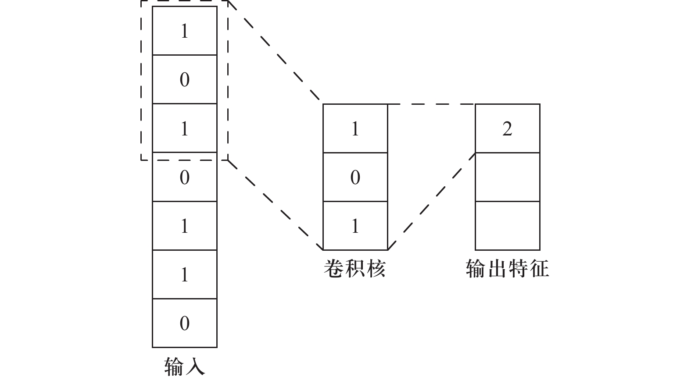

## 目录

1. 1. nn.Conv1d
    1. 1.1 输入（Input）和输出（Output）
    2. 1.2 输出长度计算公式
    3. 1.3 构造函数入参详解
    4. 1.4 各参数作用和典型场景
    5. 1.5 示例
    6. 1.6 使用注意事项
2. 2. nn.Conv2d
    1. 2.1 输入（Input）和输出（Output）
    2. 2.2 输出尺寸计算公式
    3. 2.3 构造函数入参详解
    4. 2.4 参数作用与典型场景
    5. 2.5 示例
    6. 2.6 使用注意事项
3. 3.nn.Conv3d
    1. 3.1 输入（Input）和输出（Output）
    2. 3.2 输出尺寸计算公式
    3. 3.3 构造函数参数详解
    4. 3.4 参数作用与典型场景
    5. 3.5 示例
    6. 3.6 使用注意事项
4. 4.小结
    1. 4.1 输入输出
    2. 4.2 典型应用场景
    3. 4.3 参数通用性
    4. 4.4 输出尺寸公式
    5. 4.5 使用注意
5. 5.Conv1D计算实例
    1. 5.1 输出维度计算
    2. 5.2 具体数值例子
    3. 5.3 通俗理解
    4. 打个比方

## 1. nn.Conv1d

### 1.1 输入（Input）和输出（Output）

- **输入张量** 
形状：`(batch_size, in_channels, length)` 
- `batch_size`：一次过网络的样本数  
- `in_channels`：每个样本的通道数（特征维度）
- `length`：一维序列长度（时间步/采样点数）
 
- **输出张量** 
形状：`(batch_size, out_channels, L_out)` 
 
- `out_channels`：卷积核个数，也就是输出通道数  
- `L_out`：输出长度，由下面公式决定

### 1.2 输出长度计算公式

```text
L_out = ⌊(length + 2·padding - dilation·(kernel_size−1) − 1) / stride⌋ + 1
```

- `⌊·⌋` 表示向下取整  
- 当 `stride=1`、`dilation=1` 且想让 `L_out = length` 时，令
`python padding = (kernel_size - 1) // 2`且 `kernel_size` 应为奇数。

### 1.3 构造函数入参详解

```python
nn.Conv1d(
    in_channels: int,
    out_channels: int,
    kernel_size: int or tuple,
    stride: int or tuple = 1,
    padding: int or tuple = 0,
    dilation: int or tuple = 1,
    groups: int = 1,
    bias: bool = True,
    padding_mode: str = 'zeros'
)
```

| 参数           | 类型                                         | 说明                                                                                |
| ------------ | ------------------------------------------ | --------------------------------------------------------------------------------- |
| in_channels  | int                                        | 输入通道数，必须与输入张量的第二维度匹配。                                                             |
| out_channels | int                                        | 输出通道数，即卷积核数量，也决定了输出张量的通道数。                                                        |
| kernel_size  | int 或 1-tuple                              | 卷积核大小。单个整数表示每次跨越 kernel_size 个位置；也可写成 (k,)。                                       |
| stride       | int 或 1-tuple                              | 步幅：卷积核每次滑动的长度；默认为 1。                                                              |
| padding      | int 或 1-tuple                              | 边界补零数；默认为 0。可用来控制输出长度或让特征对齐。                                                      |
| dilation     | int 或 1-tuple                              | 膨胀系数：在卷积核内部元素之间插入 (dilation−1) 个“空洞”。                                             |
| groups       | int                                        | 分组卷积：<br>‒1（默认）：标准卷积<br>‒ =in_channels：每通道独立卷积（Depthwise）<br>‒ 其它：将通道分为若干组，各组内部卷积 |
| bias         | bool                                       | 是否加偏置项；如果后面接 BatchNorm1d，常设为 False。                                               |
| padding_mode | {'zeros','reflect','replicate','circular'} | 填充模式；默认 'zeros'。其余几种根据边界不同策略插值或循环。                                                |

### 1.4 各参数作用和典型场景

- **`in_channels` & `out_channels`**  
- 直接决定参数量：
`参数量 ≈ out_channels × in_channels × kernel_size` 
-  设计网络时，通道数往往从少到多（如 1→16→32→64），提取越来越丰富的特征。
- **`kernel_size`**  
- 越大感受野越宽，但参数量和计算量增加。  
-  常用 3、5、7，小模型常选 3；序列任务也会用 `[3,5,7]` 多尺度并行。
- **`stride`**  
- 控制下采样率。`stride>1` 会缩短序列长度，类似池化的效果。  
-  如果不想丢信息，设为 1；想快速减少长度，可设为 2、4。
- **`padding`**  
- 保证边界信息，或让输出与输入对齐。  
- “same” 效果：`padding = (kernel_size−1)//2`，需 `stride=1, dilation=1`。
- **`dilation`**  
- 增大感受野的同时保持参数量不变。  
-  WaveNet、语音分割、序列建模中常用。
- **`groups`**  
- `groups=in_channels` → **Depthwise 卷积** ，极大减少计算量（MobileNet 系列）。  
- `groups>1` 且不等于 `in_channels` → 分组卷积（ResNeXt 即用到）。
- **`bias` & `BatchNorm1d`**  
-  若后面加了 BN，可不加 bias；否则对非线性对齐、加偏效果更好。
- **`padding_mode`**  
- 对信号边界处理更灵活：  
- `'reflect'`：镜像填充  
- `'replicate'`：复制边界值  
- `'circular'`：循环填充

### 1.5 示例

```python
import torch
import torch.nn as nn

# 1. 定义 Conv1d 层
conv = nn.Conv1d(
    in_channels=2,
    out_channels=4,
    kernel_size=5,
    stride=2,
    padding=2,
    dilation=1,
    groups=1,
    bias=False,
    padding_mode='zeros'
)

# 2. 输入：batch=8, channels=2, length=100
x = torch.randn(8, 2, 100)

# 3. 前向
y = conv(x)

print(f"输入 shape: {x.shape}")
print(f"输出 shape: {y.shape}")

# 4. 手动验证输出长度
L_out = (100 + 2*2 - 1*(5-1) - 1) // 2 + 1
print(f"计算的输出长度: {L_out}")
assert y.shape[-1] == L_out
```

输出：

```text
输入 shape: torch.Size([8, 2, 100])
输出 shape: torch.Size([8, 4, 50])
计算的输出长度: 50
```

### 1.6 使用注意事项

- **维度顺序** ：务必保证输入是 `(N, C, L)`，尤其对接入预处理或自定义 Dataset 时不要搞反通道和长度维度。  
- **长度保持** ：要 “同尺寸” 通常 `stride=1`, `dilation=1`, `padding=(k−1)//2`，且 `k` 为奇数。  
- **参数对齐** ：`groups` 和通道数要整除匹配，否则初始化会报错。  
- **结合 BatchNorm/Activation** ：常见顺序是
`text Conv1d → BatchNorm1d → ReLU`
或
`text Conv1d(bias=False) → BatchNorm1d → ReLU` 
- **Memory/Speed** ：大 `kernel_size`、大 `out_channels`、小 `groups` 都会显著增加计算和显存，实践中常做微调。

## 2. nn.Conv2d

### 2.1 输入（Input）和输出（Output）

- **输入张量** 
形状：`(batch_size, in_channels, height, width)` 
- `batch_size`：一次过网络的样本数  
- `in_channels`：输入通道数，例如 RGB 图像是 3  
- `height, width`：图像（或特征图）的高和宽  
 
- **输出张量** 
形状：`(batch_size, out_channels, H_out, W_out)` 
- `out_channels`：卷积核个数，也是输出通道数  
- `H_out, W_out`：输出高宽，由下面的公式计算得出  

### 2.2 输出尺寸计算公式

对于高（height）方向：

```text
H_out = ⌊(height + 2·padding[0] - dilation[0]·(kernel_size[0]-1) - 1) / stride[0]⌋ + 1
```

对于宽（width）方向同理：

```text
W_out = ⌊(width  + 2·padding[1] - dilation[1]·(kernel_size[1]-1) - 1) / stride[1]⌋ + 1
```

- ⌊·⌋ 表示向下取整  
- 如果 `stride=1, dilation=1` 并希望 `H_out=height, W_out=width`，则令
`python padding = ((kernel_size[0]-1)//2, (kernel_size[1]-1)//2)`且 `kernel_size` 各维应为奇数。

### 2.3 构造函数入参详解

```python
nn.Conv2d(
    in_channels: int,
    out_channels: int,
    kernel_size: int or tuple,
    stride: int or tuple = 1,
    padding: int or tuple = 0,
    dilation: int or tuple = 1,
    groups: int = 1,
    bias: bool = True,
    padding_mode: str = 'zeros'
)
```

| 参数           | 类型                                         | 说明                                                                       |
| ------------ | ------------------------------------------ | ------------------------------------------------------------------------ |
| in_channels  | int                                        | 输入通道数，必须与输入张量第2维匹配。                                                      |
| out_channels | int                                        | 输出通道数，决定卷积核数量以及输出张量第2维。                                                  |
| kernel_size  | int 或 2-tuple                              | 卷积核大小。<br>单个整数表示同高同宽；元组 (k_h,k_w) 可分别指定。                                 |
| stride       | int 或 2-tuple                              | 步幅：控制卷积核滑动的步长。<br>默认为 1（不下采样）。                                           |
| padding      | int 或 2-tuple                              | 边界补零层数。<br>可为单值或 (pad_h,pad_w)。                                          |
| dilation     | int 或 2-tuple                              | 膨胀系数：在卷积核内元素之间插入 (dilation−1) 个间隔。                                       |
| groups       | int                                        | 分组卷积：<br>‒ 1（默认）：标准卷积<br>‒ =in_channels：Depthwise 卷积<br> ‒ 其它：通道分组后各组内卷积 |
| bias         | bool                                       | 是否添加偏置项；若后接 BatchNorm2d，可设为 False。                                       |
| padding_mode | {'zeros','reflect','replicate','circular'} | 填充模式；默认 'zeros'。                                                         |

### 2.4 参数作用与典型场景

- **`in_channels` & `out_channels`**  
- 参数量：`out_channels × in_channels × k_h × k_w`。  
- 通道数一般从小到大设计（例如 3→16→32→64）以逐步提取更丰富特征
- **`kernel_size`**  
- 大核：更大感受野但参数/计算增加。  
- 小核（如 3×3）：常用，能堆叠模拟更大感受野且节省参数（VGG、ResNet 均用 3×3）。
- **`stride`**  
- `>1` 会下采样（缩小 H_out/W_out），等价于卷积 + 池化叠加。  
-  若希望保留所有空间信息，使用 `stride=1`。
- **`padding`**  
- “same” 填充：`padding = ((k_h−1)//2, (k_w−1)//2)` 保持高宽不变（需 `stride=1, dilation=1`）。  
-  边界补零可缓和边缘效应。
- **`dilation`**  
- 可在不增大核尺寸的情况下扩展感受野。  
- 在语义分割（DeepLab）、序列建模、波形生成中常用。
- **`groups`**  
- `groups=in_channels`：**Depthwise 卷积** ，极大减少乘加量（MobileNet）。  
- `1<groups<in_channels`：**分组卷积** ，ResNeXt 等网络使用。
- **`bias` & BN**  
- 若后接 `BatchNorm2d` → 多余偏置，可设 `bias=False`；仅卷积 + ReLU 时通常保留偏置。
- **`padding_mode`**  
- 除 `zeros` 外，`reflect`（镜像填充）、`replicate`（边界复制）、`circular`（循环填充）可根据图像边界特征选择。

### 2.5 示例

```python
import torch
import torch.nn as nn

# 定义一个 Conv2d 层
conv2d = nn.Conv2d(
    in_channels=3,        # 输入RGB通道
    out_channels=16,      # 输出特征图通道数
    kernel_size=(3, 3),   # 3×3 卷积
    stride=(1, 1),        # 步幅1，不下采样
    padding=(1, 1),       # same 填充，保持尺寸
    dilation=(1, 1),      # 不使用膨胀
    groups=1,             # 标准卷积
    bias=False,           # 后接 BatchNorm2d 时可以 False
    padding_mode='zeros'  # 零填充
)

# 输入：batch=8, C=3, H=64, W=64
x = torch.randn(8, 3, 64, 64)

# 前向
y = conv2d(x)

print("输入 shape:", x.shape)   # torch.Size([8,3,64,64])
print("输出 shape:", y.shape)   # torch.Size([8,16,64,64])

# 验证输出尺寸
H_out = (64 + 2*1 - 1*(3-1) - 1) // 1 + 1
W_out = (64 + 2*1 - 1*(3-1) - 1) // 1 + 1
print("计算 H_out, W_out:", H_out, W_out)
assert y.shape[2:] == (H_out, W_out)
```

### 2.6 使用注意事项

- **维度顺序** ：确保输入为 `(N, C, H, W)`，预处理管道或自定义 Dataset 时不要弄反。  
- **同尺寸卷积** ：`stride=1, dilation=1, padding=(k−1)//2` 且 `k` 为奇数。  
- **分组/深度卷积** ：`groups` 必须整除 `in_channels` 和 `out_channels`，否则会报错。  
- **性能权衡** ：大 `kernel_size`、大 `out_channels`、小 `groups` → 计算/显存开销大；小 `groups` 或 `groups=in_channels` → 轻量但信息融合有限。  
- **典型组合** ：
`text Conv2d(bias=False) → BatchNorm2d → ReLU`
或
`text Conv2d → ReLU → MaxPool2d` 
- **边界填充模式** ：对自然图像常用 `reflect` 或 `replicate`，可减少硬零填充带来的边缘伪影。

## 3.nn.Conv3d

### 3.1 输入（Input）和输出（Output）

- **输入张量** 
形状：`(batch_size, in_channels, depth, height, width)` 
- `batch_size`：一次过网络的样本数  
- `in_channels`：输入通道数，例如医学体数据常是 1（灰度）或多模态时>1  
- `depth, height, width`：体数据的深度、行高和列宽
 
- **输出张量** 
形状：`(batch_size, out_channels, D_out, H_out, W_out)` 
- `out_channels`：卷积核个数，也是输出通道数  
- `D_out, H_out, W_out`：输出的深度、高度和宽度，由下面公式计算得出

### 3.2 输出尺寸计算公式

对于深度（depth）方向：

```text
D_out = ⌊(depth + 2·padding[0] - dilation[0]·(kernel_size[0]−1) − 1) / stride[0]⌋ + 1
```

对于高度（height）和宽度（width）方向同理：

```text
H_out = ⌊(height + 2·padding[1] - dilation[1]·(kernel_size[1]−1) − 1) / stride[1]⌋ + 1
W_out = ⌊(width  + 2·padding[2] - dilation[2]·(kernel_size[2]−1) − 1) / stride[2]⌋ + 1
```

- ⌊·⌋ 表示向下取整  
- 若希望 `D_out=depth, H_out=height, W_out=width`（保持尺寸不变），需 `stride=1, dilation=1` 且   `python padding = ( (kernel_size[0]-1)//2, (kernel_size[1]-1)//2, (kernel_size[2]-1)//2 )`且每个 `kernel_size` 维度为奇数。

### 3.3 构造函数参数详解

```python
nn.Conv3d(
    in_channels: int,
    out_channels: int,
    kernel_size: int or tuple,
    stride: int or tuple = 1,
    padding: int or tuple = 0,
    dilation: int or tuple = 1,
    groups: int = 1,
    bias: bool = True,
    padding_mode: str = 'zeros'
)
```

| 参数           | 类型                                         | 说明                                                                                 |
| ------------ | ------------------------------------------ | ---------------------------------------------------------------------------------- |
| in_channels  | int                                        | 输入通道数，必须与输入张量的第2维匹配。                                                               |
| out_channels | int                                        | 输出通道数，即卷积核数量，也决定输出张量的第2维。                                                          |
| kernel_size  | int 或 3-tuple                              | 卷积核大小。<br>单个整数表示 d×d×d，元组 (k_d,k_h,k_w) 可分别指定。                                     |
| stride       | int 或 3-tuple                              | 步幅。控制卷积核在各维度滑动的步长。默认为 1（无下采样）。                                                     |
| padding      | int 或 3-tuple                              | 边界补零数。可为单值或 (pad_d,pad_h,pad_w)。用于控制输出尺寸或保持边界信息。                                   |
| dilation     | int 或 3-tuple                              | 膨胀系数：在卷积核内部元素之间插入 (dilation−1) 个间隔以增大感受野。                                          |
| groups       | int                                        | 分组卷积：<br>‒ 1（默认）：标准卷积<br>‒ =in_channels：每通道独立卷积（Depthwise 卷积）<br>‒ 其它：按组分通道，各组内部卷积 |
| bias         | bool                                       | 是否加偏置项；若后接 BatchNorm3d，可设为 False。                                                  |
| padding_mode | {'zeros','reflect','replicate','circular'} | 填充模式；默认 'zeros'。其他模式按镜像、复制或循环策略处理边界。                                               |

### 3.4 参数作用与典型场景

- **`in_channels` & `out_channels`**  
- 参数量≈`out_channels × in_channels × k_d × k_h × k_w`。  
-  设计时常沿用“通道逐层增加”策略（如 1→8→16→32），逐级提取更丰富的空间-体素特征。
 
- **`kernel_size`**  
- 大核（如 5×5×5）感受野大，但参数和计算量显著增加。  
- 小核（3×3×3）常用，可叠加多层模拟更大感受野且更高效（如 3D-ResNet、C3D 网络）。
 
- **`stride`**  
- `>1` 会在相应维度下采样，减小数据尺寸，类似 3D 池化。  
-  若不想丢特征，使用 `stride=1`; 若要快速降采样，可设为 `(2,2,2)`。
 
- **`padding`**  
- 保持边界信息、防止空间尺寸急剧缩小。  
-  “same” 填充：设为 `(k_i−1)//2` 可在 `stride=1,dilation=1` 时保持尺寸。
 
- **`dilation`**  
-  扩张卷积，可在不增加核大小的情况下增大感受野，常用于分割任务（如 3D 医学图像分割）。
 
- **`groups`**  
- `groups=in_channels` → Depthwise 3D 卷积（MobileNet-3D 变体）。  
-  分组卷积可减小计算开销、启发出多路径特征提取（ResNeXt-3D 等）。
 
- **`bias` & BN**  
-  对于 “Conv3d → BatchNorm3d” 可关掉 bias，减少冗余；单纯卷积时保留更灵活。
 
- **`padding_mode`**  
- 自然场景体数据较少用非零填充，但在边缘伪影敏感的医学体数据上，可尝试 `reflect`、`replicate` 或 `circular`。

### 3.5 示例

```python
import torch
import torch.nn as nn

# 1. 定义 Conv3d 层
conv3d = nn.Conv3d(
    in_channels=1,          # 单通道体数据
    out_channels=4,         # 输出4个特征通道
    kernel_size=(3, 3, 3),  # 3×3×3 卷积
    stride=(1, 2, 2),       # 深度不下采样，高宽各下采样2
    padding=(1, 1, 1),      # same 填充
    dilation=(1, 1, 1),     # 普通卷积
    groups=1,               # 标准
    bias=False,             # 后接 BN
    padding_mode='zeros'    # 零填充
)

# 2. 构造输入：batch=2, C=1, D=8, H=64, W=64
x = torch.randn(2, 1, 8, 64, 64)

# 3. 前向计算
y = conv3d(x)

print("输入 shape:", x.shape)   # torch.Size([2,1, 8,64,64])
print("输出 shape:", y.shape)   # torch.Size([2,4, 8,32,32])

# 4. 验证输出尺寸
D_out = (8  + 2*1 - 1*(3-1) - 1) // 1 + 1   # =8
H_out = (64 + 2*1 - 1*(3-1) - 1) // 2 + 1   # =32
W_out = (64 + 2*1 - 1*(3-1) - 1) // 2 + 1   # =32
assert y.shape[2:] == (D_out, H_out, W_out)
```

### 3.6 使用注意事项

- **维度顺序** ：务必保证输入为 `(N, C, D, H, W)`，切忌把通道与其中任一空间维搞错。  
- **同尺寸卷积** ：要保持 `D/H/W` 不变，需 `stride=1,dilation=1` 且 `padding=(k_i−1)//2`，`kernel_size` 各维为奇数。  
- **分组/深度卷积** ：`groups` 必须整除 `in_channels` 与 `out_channels`，否则报维度不匹配错误。  
- **性能考量** ：3D 卷积计算量和显存开销大，设计网络时多用小核叠加、合适下采样、或借助 `groups` 降低复杂度。  
- **典型配合** ：
`text Conv3d(bias=False) → BatchNorm3d → ReLU`
或
`text Conv3d → ReLU → MaxPool3d` 
- **边界填充模式** ：对医学体数据可尝试 `reflect`/`replicate`，减少边缘假性纹理。

## 4.小结

### 4.1 输入输出

- **Conv1d** ：处理一维序列，输入 `(N, C_in, L)` → 输出 `(N, C_out, L_out)`。  
- **Conv2d** ：处理二维平面（图像、特征图），输入 `(N, C_in, H, W)` → 输出 `(N, C_out, H_out, W_out)`。  
- **Conv3d** ：处理体数据（视频帧序列、医学体素），输入 `(N, C_in, D, H, W)` → 输出 `(N, C_out, D_out, H_out, W_out)`。

### 4.2 典型应用场景

- **Conv1d** ：时间序列预测、语音/音频特征提取、传感器信号处理。  
- **Conv2d** ：图像分类、目标检测、语义分割、风格迁移等所有平面图像相关任务。  
- **Conv3d** ：3D 医学图像分割（CT/MRI）、视频动作识别、三维点云特征学习。

### 4.3 参数通用性

所有三者均共享相同的设计思路和参数：
- `in_channels`, `out_channels`（通道数）
- `kernel_size`（卷积核大小，一维/二维/三维对应 1–3 元组）
- `stride`（步幅）
- `padding`（边界填充）
- `dilation`（膨胀率）
- `groups`（分组卷积/Depthwise）
- `bias`（偏置项）
- `padding_mode`（如 `zeros`, `reflect` 等）

### 4.4 输出尺寸公式

对每个空间/时间维度均可用：
`L_out = ⌊(L_in + 2·pad − dilation·(k−1) −1) / stride⌋ + 1`
其中 `k`, `pad`, `stride`, `dilation` 可为单值或对应维数的元组。

### 4.5 使用注意

1. **维度顺序要对齐** ：始终是 `(batch, channels, …dims…)`。  
2. **保持“same”尺寸** ：`stride=1, dilation=1` 且 `padding=(k−1)//2`（`k`为奇数）。  
3. **分组卷积** ：`groups` 必须能整除 `in_channels` 和 `out_channels`；`groups=in_channels` 做 Depthwise 卷积。  
4. **结合 BatchNorm** ：若后面接 BatchNorm，可将 `bias=False`，减少冗余。  
5. **计算与内存** ：随着维度增加（1→2→3D）、`kernel_size` 或 `out_channels` 增大，计算量和显存需求呈指数增长，注意合理下采样和分组。

## 5.Conv1D计算实例

- **输入参数**  
- 批大小 $B=1$ 
- 输入通道数 $C_{\rm in}=4$ ，长度 $L_{\rm in}=4$ 
- 卷积核大小 $K=2$ ，步幅 $\text{stride}=1$ ，填充 $\text{padding}=0$ ，膨胀 $\text{dilation}=1$ 
- 输出通道数 $C_{\rm out}=2$ 

### 5.1 输出维度计算

长度方向输出为 

$L_{\rm out} = \Big\lfloor   \frac{L_{\rm in}         +2\,\mathrm{padding}         -\mathrm{dilation}\,(K-1)         -1   }{\mathrm{stride}}   +1 \Big\rfloor = \Big\lfloor\frac{4 + 0 -1 -1}{1} +1\Big\rfloor =3 \\$ 

所以输出张量形状为


$(1,\;C_{\rm out}=2,\;L_{\rm out}=3)\\$ 

### 5.2 具体数值例子

**1 输入张量 $X\in\mathbb R^{1\times4\times4}$ ** 

我们取： $X[0,0,:]=[\,1,2,3,4\,],\quad X[0,1,:]=[\,5,6,7,8\,],\quad X[0,2,:]=[\,9,10,11,12\,],\quad X[0,3,:]=[\,13,14,15,16\,].\\$ 

**2 卷积核权重 $W\in\mathbb R^{2\times4\times2}$ ，偏置 $b=[0,0]$ ** 

- **第 0 号输出通道**  $\bigl(W[0,:,:]\bigr)$ : 所有通道、所有位置权重都设为 1
$W[0,:,:]     =      \begin{bmatrix}       1 & 1\\       1 & 1\\       1 & 1\\       1 & 1     \end{bmatrix}$ 
- **第 1 号输出通道**  只“看”通道 2 和 3
$W[1,:,:]     =      \begin{bmatrix}       0 & 0\\       0 & 0\\       1 & 1\\       1 & 1     \end{bmatrix}.$ 

**3 滑窗展开（Unfold）** 

- 每条通道从长度 4 上取 $K=2$ 连续滑窗，步幅 1，共 $L_{\rm out}=3$ 个窗口。  
- 将 $C_{\rm in}K=4\times2=8$ 行、 $L_{\rm out}=3$ 列堆成矩阵 $M\in\mathbb R^{8\times3}$ ：
$M =  \begin{bmatrix} % 通道0 1 & 2 & 3\\ 2 & 3 & 4\\[2pt] % 通道1 5 & 6 & 7\\ 6 & 7 & 8\\[2pt] % 通道2 9 & 10&11\\ 10&11&12\\[2pt] % 通道3 13&14&15\\ 14&15&16 \end{bmatrix}.$ 

**4 权重拉平** 

- 把 $W$ 的每个输出通道的 $(4,2)$ 小核展平为 8 维向量：
$W_{\rm flat} = \begin{bmatrix}   \underbrace{1,1,1,1,1,1,1,1}_{\text{第0通道}}\\   \underbrace{0,0,0,0,1,1,1,1}_{\text{第1通道}} \end{bmatrix} \in\mathbb R^{2\times8}.$ 

**5 矩阵乘 + 偏置** 

$Y_{\rm flat} = W_{\rm flat}\;M \;+\; b\;\bigl[\underbrace{1,\,1,\,1}_{L_{\rm out}}\bigr] = \begin{bmatrix}1&1&1&1&1&1&1&1\\0&0&0&0&1&1&1&1\end{bmatrix}   \begin{bmatrix}     1 & 2 & 3\\     2 & 3 & 4\\     5 & 6 & 7\\     6 & 7 & 8\\     9 &10 &11\\     10&11 &12\\     13&14 &15\\     14&15 &16   \end{bmatrix}.$ - **第 0 通道** （全通道求和）：   $[\,1+2+5+6+9+10+13+14,\;       2+3+6+7+10+11+14+15,\;       3+4+7+8+11+12+15+16\,]     =[60,\;78,\;96].$ - **第 1 通道** （只求通道 2、3）：   $[\,9+10+13+14,\;       10+11+14+15,\;       11+12+15+16\,]     =[46,\;50,\;54].$ 

**6 恢复输出张量形状** 

将 $Y_{\rm flat}\in\mathbb R^{2\times3}$ reshape 成 $(1,2,3)$ ：

```text
Y[0,0,:] = [60, 78, 96]
Y[0,1,:] = [46, 50, 54]
```

**总结** ：
- 输出维度 $(1,\,2,\,3)$ 来自于 $\;C_{\rm out}=2$ 和 $L_{\rm out}=3$ 。
- 底层是先 `Unfold` → 拼成 $(C_{\rm in}K)\times L_{\rm out}$ 的滑窗矩阵 → 用 $(C_{\rm out}\times C_{\rm in}K)$ 的权重做矩阵乘 → 加偏置 → reshape。

### 5.3 通俗理解

**1个batch下，100维度7个时间步的数据，使用kernel_size=2，out_channels=变成=10，如何通俗解释一下？**  



- 原始数据：每个样本是一条“7 天×100 维” 的时间序列，形状 $(100,7)$ 。横轴是时间（一周的 7 天），竖轴是每天的 100 个特征。 

- `kernel_size=2`：相当于你每次“看两天”——滑动窗口宽度是 2 天。
- `out_channels=10`：相当于你准备了 10 台不同的“提炼机”（滤波器），每台机子专门学会从这两天里 100 维的原始特征中，提炼出一个新的“综合指标”（一个标量）。
- **滑动过程** ：
1. 窗口 1–2 天：把第 1 天和第 2 天上各自的 100 维拼在一起，交给 10 台“提炼机”，每台机子输出一个分数 → 得到 10 维。
2. 窗口 2–3 天：同样再看第 2、3 天的 100 维，10 台机子各产出一个分数 → 又是一组 10 维。
3. …如此往后，直到看第 6、7 天。  

- **输出长度** ：由于一周 7 天，窗口宽 2 天、步幅默认为 1 天，就能滑出 $7-(2-1)=6$ 个位置（1–2、2–3、…、6–7）。  
- **输出形状** ：每个样本变成 $(10,6)$ —— 10 条新特征，6 个时间点（每个点对应原来的两天窗口）。

### 打个比方

想象你是气象专家，每天记录 100 种气象指标（温度、湿度、风速……共 100 种）。现在你要学“2 天为期”的短期趋势分析：  

- 你设计了 10 种 短期趋势摘要方法（out_channels=10），
- 每种方法每天都对“前两天的数据”做一次综合打分，
- 然后滑过一周，就得到了 6 个连续两天的趋势分数，每个分数是 10 维。

这样，Conv1d 就把原来“一周×100 维”的原始数据，转换成了“6 个两天窗口×10 维”的高层特征，更利于后续捕捉短期模式和做预测。