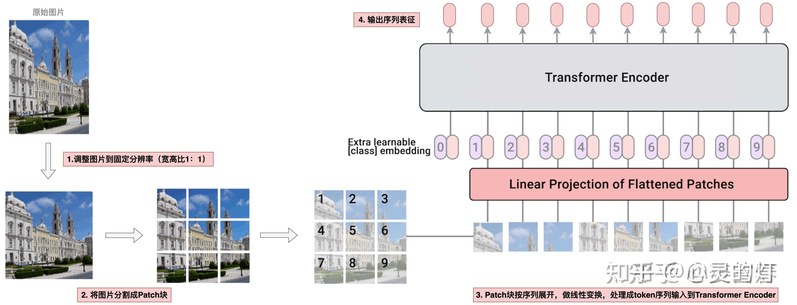
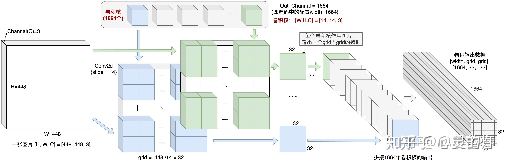
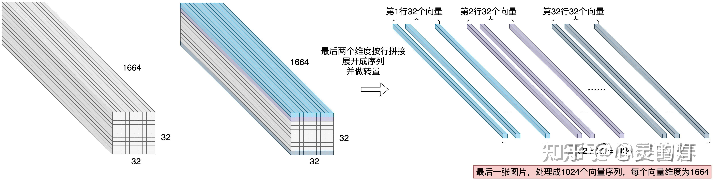
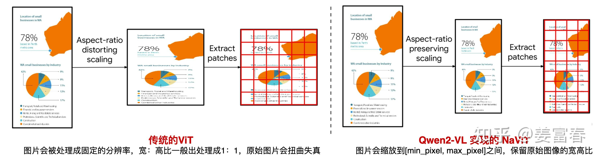
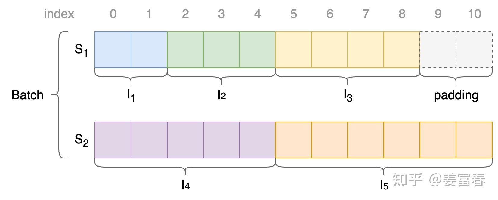
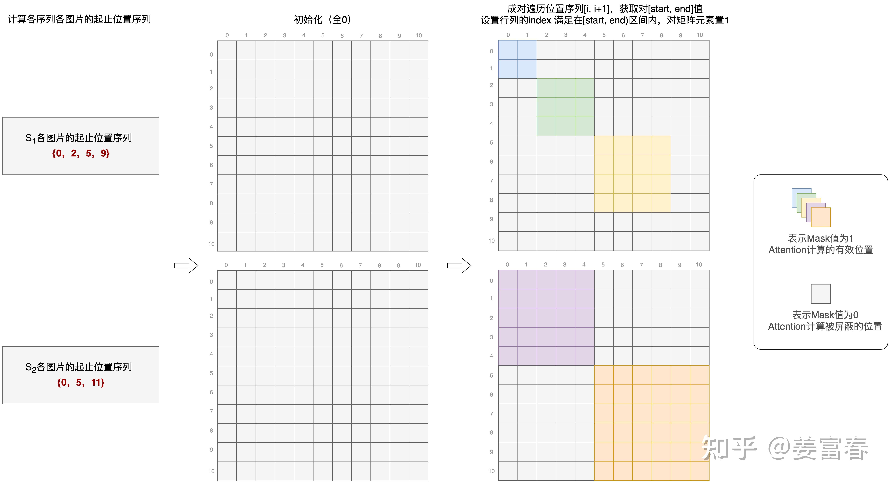

一句话来讲，qwen2-vl和qwen-vl都需要resize，只是qwen-vl无脑resize同一尺寸（长宽1:1），会导致图片失真（尤其是对长宽比比较高的图片，会使得图片扭曲），qwen2-vl是按照原始图片的长宽比去resize（这样保留了原始图片的长宽比）， 但是会导致2个问题：

1、打成Patch之后，Patch的序列长度一样，怎么处理呢？其实就是参照文本的处理方法，在Batch 内Padding 对齐。

2、为了提高处理的效率，一个batch中会有不同的图片Patch的序列，如何标记不同图片的Patch呢？就是增加了图片Patch的相对位置信息，然后用Attention Mask进行计算隔离（对应位置为1，其他为0）。

参考文章：[多模态技术梳理：Qwen-VL系列](https://zhuanlan.zhihu.com/p/25267823390)

这得先从Qwen-vl说起，Qwen-vl用的是标准的ViT的架构设计，只能处理固定分辨率的图片。因此在图片输入视觉编码器之前，需要把图片resize成固定的分辨率。

具体的处理流程如下图：

先调整(resize)图片到固定分辨率（通常是正方形1:1）----> 然后将图片分割成Patch----->然后把Patch块按序列展开，做线性变换，处理成token序列输入到Transformer Encoder。



show code 环节：

```text
class VisionTransformer(nn.Module):
   def __init__(...）:
       self.conv1 = nn.Conv2d(in_channels=3, out_channels=width, kernel_size=patch_size, stride=patch_size, bias=False)

   def forward(self, x: torch.Tensor):
        # 注释1：通过卷积核将一张图片从[H，W，C]=[448, 448, 3] 映射成 [width, grid, grid] = [1664, 32, 32]
        x = self.conv1(x)  # shape = [*, width, grid, grid]
        # 注释2：一张图片按行展开，[width, grid, grid] 映射成 [grid * grid, width]二维序列
        x = x.reshape(x.shape[0], x.shape[1], -1)  # shape = [*, width, grid ** 2]
        x = x.permute(0, 2, 1)  # shape = [*, grid ** 2, width]
        # 注释3：增加位置编码输入transformer模型
        x = x + get_abs_pos(self.positional_embedding, x.size(1))
        x = self.transformer(x)
```

code 解释环节：

首先是一张图片做卷积操作，处理成 [width, grid, grid] = [1664, 32, 32]的数据，如图所示。（`[1664, 32, 32]` 表示的是经过卷积操作后得到的特征图，其具有 1664 个通道，每个通道是一个 32x32 的二维矩阵。）

```text
self.conv1 = nn.Conv2d(in_channels=3, out_channels=width, kernel_size=patch_size, stride=patch_size, bias=False)
```



然后按行优先展开，处理成一个二维格式的数据[sequence_len, hidden_size] = [1024, 1664]（32*32 = 1024类似与一条文本处理后的序列）



QwenVL的这种设计需要把图片在输入模型之前resize成单一分辨率，会导致Vision数据为了适配单一分辨率而失真的问题。

而Qwen2-VL通过采用原生动态分辨率，可输入不同分辨率的图像，避免了Vision数据适配单一分辨率而导致的失真问题。

那么，为什么resize成单一分辨率，就会使图片失真？原生动态分辨率具体是怎么做的呢？

首先回答第一个问题：**因为预训练好的ViT，通常会将图片resize成正方形（** 长:宽=1:1**），可能会造成图片的扭曲（尤其是宽高比差距比较大的图片）。** 

**具体来说** 

Qwen-VL使用的视觉编码器是ViT，这要求输入的图片要统一处理成单一的、固定的分辨率，才能feed到模型进行处理。**一般标准的预训练好的ViT，通常是将图片处理成正方形（长:宽=1:1）。这样处理后通常图片会失真，导致模型理解上有信息损失或引入一些误导。** 如下图所示：



*图10、Qwen-VL VS Qwen2-VL的图像处理*

左侧是传统的ViT对输入的处理（也是Qwen-VL采用的方法），对于一些宽高比差距较大的图片，处理后通常会造成图片扭曲，而Qwen2-VL实现的**原生动态分辨率方法** 则会保留**原始图片的宽高比，将图片resize到适当的大小，** 图片像素满足 $[min\_pixel, max\_pixel]$ 区间,再对图片做Patch处理，将每个图片处理成变长的Vision token序列，再输入给LLM模型。

目前看上述的方法是比标准的ViT更合理的，因为它保留了图片的原始分辨率，但是同时也引入了一个问题。

> 问题是这样：
> 
> 传统的ViT会将任何图片数据都处理成定长的Patch序列，然后输入给Vision Encoder，这种统一定长的输入是对硬件计算非常友好的，非常好组Batch，并且不需要任何padding处理。Batch序列中每个位置的计算都是有效的。
> 
> 而对于上面提到的原生动态分辨率方法会将不同图片处理成不同长度的Patch序列。对于不同的长度的输入，做并行计算时，我们自然会想到类似于文本数据的操作，对数据做padding，再Feed给模型。但这相比传统的ViT方法（无Padding）会更慢（因为为了适配一个Batch中最长的序列，要做适当的Padding处理，导致会有些冗余计算）。因此这并不是一个完美的方法。Qwen2-VL采用的原生动态分辨率方法实现上同时也考虑了性能问题。

那么原生动态分辨率方法具体是怎么实现的呢？ **核心方法是采用了NaViT的Patch n’ Pack技术，把不同图像的多个patch打包到一个序列，能保留不同图片的可变分辨率。同时在一个次序列计算中同时可处理多个图像，提升了模型计算的吞吐，在性能上始终优于传统的ViT** 。其性能提升主要来源于Pack处理后，一个序列包括多个图片能同时计算，使得在固定计算预算下，动态分辨率方法能训练更多样本，从而带来更好的性能。

那么一个序列中塞进了多个图像数据，怎么能互不干扰的计算呢（也就是在做ViT的Attention计算时，多个图片的Patch在一个序列中需要做计算隔离）

我们以一个简单例子描述下动态分辨率方法的处理逻辑。

> **举例** ：假设我们5张图片： $I_1 \sim I_5$ ，且patch长度为： $2 \sim 6$ ，即图片Patch后长度为： $\{ I_1:2, I_2:3, I_3:4, I_4:5, I_5:6\}$ 。为了描述简单，我们假设模型设置Batch_Size=2，并且正好处理这5张图片到一个Batch中。

**处理过程：** 

**a) 首先我们将5张图片进行Pack，放到2个序列中** 

一个很简单的方式是将3个Patch较短的图片放到一个序列 $S_1$ ，2个较长Patch的图片放到一个序列 $S_2$ 。符号化为： $Batch = \{ S_1, S_2\}$ ，其中 $S_1 = \{ I_1: 2, I_2:3, I_3:4\}$ 序列长度为 $9$ ， $S_2=\{I_4:5, I_5:6\}$ 序列长度为 $11$

**b) Batch内做序列Padding对齐处理** 

根据Batch内最长序列，通过F.pad方法做序列对齐，在序列前后增加Padding token，该例子中由于 $S_1$ 较短，需要在末尾增加Padding token，处理后，如下图11所示



*图11、Patch&#39; Pack示例*

**c) 通过设置Attention Mask保证同Sequence中各图片计算隔离** 

一个序列中有多张图片输入，在计算时要必须保证各图片的Attention计算是相互隔离的。实现上通过对Attention Mask矩阵做特殊的设置，来保证计算隔离。计算Attention Mask的过程如下：

首先，记录序列中每个图片起止token位置（包括初始0位置），得到两个位置序列为：$P_{s_1} = \{0, 2, 5,9\}$和$P_{s_2}=\{ 0, 5, 11\}$ ， $P_{s_t}$ 中连续的两个数 $(j, k)$ 表示一张图片在序列中的长度为 $k-j$ 个特征，且特征的起止位置为： $j$ 和 $k-1$ 。

然后，分别用 $P_{s_1}$ 和 $P_{s_2}$ 来计算二维Attention mask矩阵，计算方式为：先初始化一个全0的mask矩阵，然后遍历每个 $P_{s_t}$，取 $[i, i+1]$ 位置的两个数字 $(j, k)$ ，使得矩阵行列坐标都满足在 $[j, k-1]$ 区间范围的位置置1。两个序列计算后的Mask矩阵，如下图12所示。



*图12、Patch&#39; Pack Attention Mask*

计算好了上面的Attention Mask矩阵，在过Vision Encoder网络时，将Attention Mask作用在Attention计算上，就会隔离同一序列中不同图像的Attention计算。

总结：

Qwen2-VL是按照图片的比例resize在规定的区间内（这样就保留了原始图片长宽比，不会失真），然后将图片处理成不同长度的Patch序列，组成Batch， 在Batch中做Padding对齐处理。同时通过位置标记，设置Attention Mask保证同Sequence中不同图片的计算隔离（在对应条件的位置设置为1，其他为0）。


