## 目录

1. 前言
2. 1. 卷积与互相关（信号处理）
3. 2. 深度学习中的卷积（单通道/多通道）
    1. 2.1 卷积：单通道形式
    2. 2.2 卷积：多通道形式
4. 3. 3D卷积
5. 4. 1 x 1卷积
6. 5. 卷积运算
7. 6. 转置卷积（反卷积）
    1. 6.1  Checkerboard artifacts
8. 7. 扩张卷积（空洞卷积）
9. 8. 可分离卷积
    1. 8.1 空间可分离卷积
    2. 8.2 深度可分离卷积
10. 9. 扁平卷积（Flattened Convolution）
11. 10. 分组卷积（Grouped Convolution）
    1. 10.1 分组卷积与深度卷积
12. 11. 随机分组卷积（Shuffled Grouped Convolution）
13. 12. 逐点分组卷积（Pointwise Grouped Convolution）


## 前言

本文参考：[A Comprehensive Introduction to Different Types of Convolutions in Deep Learning](https://towardsdatascience.com/a-comprehensive-introduction-to-different-types-of-convolutions-in-deep-learning-669281e58215)，并在文章的基础上进行了补充改进，持续更新中......

这篇文章总结了深度学习中常用的几种类型的卷积，并尝试以每个人都可以访问的方式解释它们，除了本文之外，还有其他一些关于该主题的好文章（已经在参考文献中列出）。

**本文主要包含的内容如下：** 

1. 卷积与互相关（信号处理）
2. 深度学习中的卷积（单通道/多通道）
3. 3D卷积
4. 1 x 1卷积
5. 卷积运算（Convolution Arithmetic）
6. 转置卷积（反卷积，checkerboard artifacts）
7. 扩张卷积（空洞卷积）
8. 可分离卷积（空间可分离卷积，深度卷积）
9. 扁平卷积（Flattened Convolution）
10. 分组卷积（Grouped Convolution）
11. 随机分组卷积（Shuffled Grouped Convolution）
12. 逐点分组卷积（Pointwise Grouped Convolution）

## 1. 卷积与互相关（信号处理）

详细的解析可以看下面这篇文章：

[初识CV：信号处理中的卷积、深度学习中的卷积和反卷积](https://zhuanlan.zhihu.com/p/366472797)

卷积是在信号处理、图像处理和其他工程/科学领域中广泛使用的技术。 在深度学习中，一种模型架构即卷积神经网络（CNN），以此技术命名。 然而，深度学习中的卷积本质上是信号/图像处理中的互相关，这两个操作之间存在细微差别。下面让我们来看一下两者之间的区别和联系。 

在信号/图像处理中，卷积定义为：

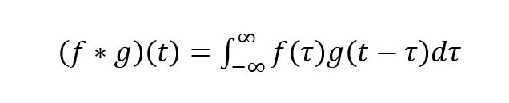

它被定义为两个函数在反转和移位后的乘积的积分，以下可视化展示了这一过程：

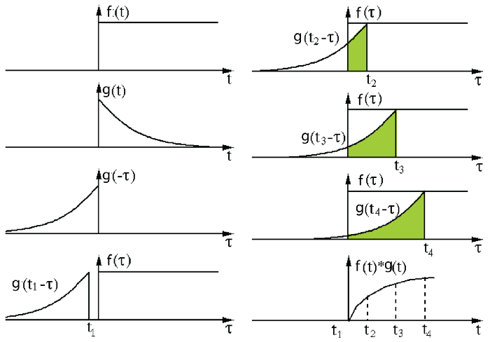

*信号处理中的卷积：滤波器g反转，然后沿水平轴滑动。 对于每个位置，我们计算f和反向g之间的交叉面积，交叉区域是该特定位置的卷积值。*

由以上可以看出，信号处理中的卷积是对滤波器进行反转位移后，再沿轴滑动，每一个滑动位置相交区域的面积，即为该位置的卷积值。

另一方面，互相关被称为**滑动点积** 或两个函数的**滑动内积** 。互相关的filters不需要反转，它直接在函数f中滑动。f和g之间的交叉区域是互相关，下图显示了相关性和互相关之间的差异：

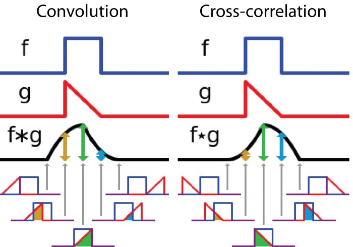

*信号处理中卷积和互相关之间的差异*

在深度学习中，卷积中的filters是不需要反转的。严格来说，它们是互相关的，**本质上是执行逐元素的乘法和加法** ，在深度学习中我们称之为卷积。因为可以在训练过程中了解filters的权重。如果以上示例中的逆函数g是正确的函数，则在训练后，学习到的滤波器将看起来像逆函数g。因此，不需要像真正的卷积那样在训练之前先反转滤波器。

## 2. 深度学习中的卷积（单通道/多通道）

进行卷积的目的是从输入中提取有用的特征。在图像处理中，可以选择各种各样的filters。每种类型的filter都有助于从输入图像中提取不同的特征，例如水平/垂直/对角线边缘等特征。在卷积神经网络中，通过使用filters提取不同的特征，这些filters的权重是在训练期间自动学习的，然后将所有这些提取的特征“组合”以做出决策。

进行卷积有一些优势，例如**权重共享** 和**平移不变性** 。卷积还考虑了像素的空间关系，这些功能尤其有用，特别是在许多计算机视觉任务中，因为这些任务通常涉及识别某些组件与其他组件在空间上有一定的关系（例如，狗的身体通常连接到头部，四条腿和尾部）。

在PyTorch中，实现二维卷积是通过`nn.Conv2d`实现的，这个函数是非常强大的，其功能不仅仅是实现**常规卷积** ，通过合理的参数选择就可以实现**分组卷积、空洞卷积以及分离卷积** 。API的官方介绍如下，通过改变参数dilation和groups可以实现分组卷积、空洞卷积以及分离卷积：

```python3
CLASS torch.nn.Conv2d(in_channels, out_channels, kernel_size, stride=1, padding=0, dilation=1, groups=1, bias=True)

 - stride: controls the stride for the cross-correlation, a single number or a tuple.
 - padding: controls the amount of implicit zero-paddings on both sides for padding number of points for each dimension.
 - dilation: controls the spacing between the kernel points; also known as the à trous algorithm. It is harder to describe, but this link has a nice visualization of what dilation does.
 - groups: controls the connections between inputs and outputs. in_channels and out_channels must both be divisible by groups. For example,
		At groups=1, all inputs are convolved to all outputs.
		At groups=2, the operation becomes equivalent to having two conv layers side by side, each seeing half the input channels, and producing half the output channels, and both subsequently concatenated.
		At groups= in_channels, each input channel is convolved with its own set of filters.
```

参数解析：

```python3
in_channels (int) – Number of channels in the input image

out_channels (int) – Number of channels produced by the convolution

kernel_size (int or tuple) – Size of the convolving kernel

stride (int or tuple, optional) – Stride of the convolution. Default: 1

padding (int, tuple or str, optional) – Padding added to all four sides of the input. Default: 0

padding_mode (string, optional) – 'zeros', 'reflect', 'replicate' or 'circular'. Default: 'zeros'

dilation (int or tuple, optional) – Spacing between kernel elements. Default: 1

groups (int, optional) – Number of blocked connections from input channels to output channels. Default: 1

bias (bool, optional) – If True, adds a learnable bias to the output. Default: True
```

### 2.1 卷积：单通道形式

在深度学习中，卷积本质上是对信号按元素相乘累加得到卷积值。对于具有1个通道的图像，下图演示了卷积的运算形式：

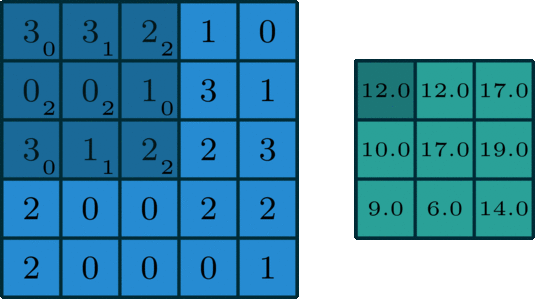

*单通道卷积*

这里的filter是一个3 x 3的矩阵，元素为[[0，1，2]，[2，2，0]，[0，1，2]]。filter在输入数据中滑动。在每个位置，它都在进行逐元素的乘法和加法。每个滑动位置以一个数字结尾，最终输出为3 x 3矩阵。（注意，在这个例子中，stride = 1和padding = 0，这些概念将在下面的算术部分中描述。）

### 2.2 卷积：多通道形式

在许多应用程序中，我们处理的是具有多个通道的图像，典型的例子是RGB图像，如下图所示：

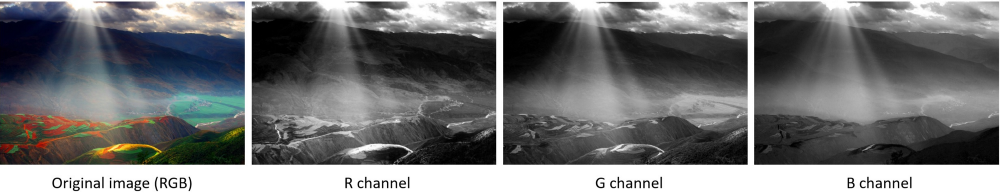

*不同通道的图像*

多通道数据的另一个示例是卷积神经网络中的图层。卷积网络层通常包含多个通道（通常为数百个通道），每个通道描述了上一层中不同的特征。我们如何在不同深度的图层之间进行过渡？我们如何将深度为n的图层转换为深度为m的图层？

在描述过程之前，我们想澄清一些术语：层，通道，特征图，filters和kernels。从层次结构的角度来看，层和filters的概念在同一级别，而通道和kernels在下面的一层。通道和特征图是一回事。图层可能具有多个通道（或特征图）：如果输入是RGB图像，则输入图层具有3个通道。**通常使用“通道”来描述“层”的结构。类似地，“kernels”用于描述“filters”的结构。** 

filters和kernels之间的区别有点棘手，有时，它们可以互换使用，这可能会产生混淆。 从本质上讲，这两个术语有微妙的区别。“kernels”指的是2D-权重矩阵。 术语“filters”用于堆叠在一起的多个kernels的3D-结构。 对于2D-filters，filters与kernels相同。 但是对于3D-filters和深度学习中的大多数卷积而言，filters是kernels的集合。 每个kernels都是独一无二的，强调了输入通道的不同特征。如下图所示：

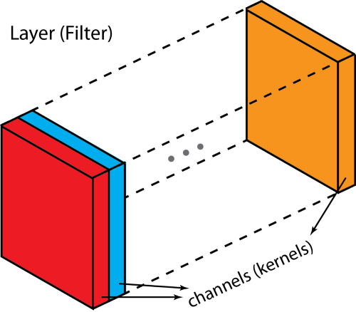

*层（“filters”）和通道（“kernels”）之间的区别*

有了这些概念，多通道卷积如下图所示，将每个kernels应用到前一层的输入通道上，以生成一个输出通道，这是一个kernels方面的过程。我们为所有kernels重复这样的过程以生成多个通道。然后将这些通道中的每一个加在一起以形成单个输出通道。

这里输入层是一个5 x 5 x 3矩阵，有3个通道，filters是3 x 3 x 3矩阵。首先，filters中的每个kernels分别应用于输入层中的三个通道，执行三次卷积，产生3个尺寸为3×3的通道：

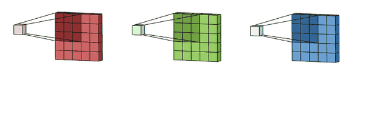

*多通道2D卷积的第一步：将filters中的每个kernels分别应用于输入层中的三个通道*

然后将这三个通道相加（逐个元素相加）以形成一个单个通道（3 x 3 x 1），该通道是使用filters（3 x 3 x 3矩阵）对输入层（5 x 5 x 3矩阵）进行卷积的结果：

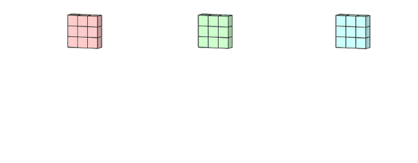

*多通道2D卷积的第二步：将这三个通道加在一起（逐元素加法）以形成一个单个通道*

可以将这个过程视作将一个3D-filters矩阵滑动通过输入层。注意，这个输入层和filters的深度都是相同的（即通道数=卷积核数）。这个 3D-filters仅沿着 2 个方向（图像的高和宽）移动（这也是为什么 3D-filters即使通常用于处理3D-体积数据，但这样的操作还是被称为 2D-卷积）。

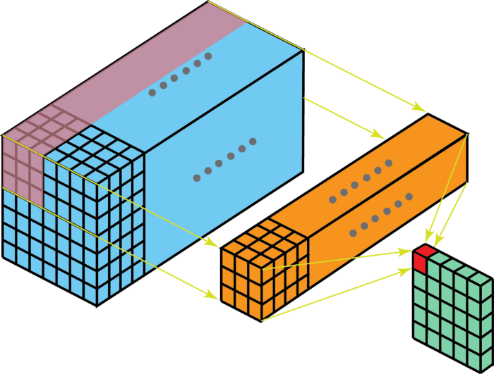

现在我们可以看到如何在不同深度的层之间实现过渡，假设输入层有 Din 个通道，而想让输出层的通道数量变成 Dout，我们需要做的仅仅是将 Dout个filters应用到输入层中。每一个filters都有Din个卷积核，都提供一个输出通道。在应用Dout个filters后，Dout个通道可以共同组成一个输出层。标准 2D-卷积，通过使用 Dout 个filters，将深度为 Din 的层映射为另一个深度为 Dout 的层。

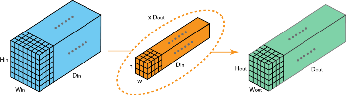

*标准2D卷积：使用Dout个filters将深度为Din的一层映射到深度为Dout的另一层*

进一步地，对于卷积网络的设计需要记住以下公式（**2D卷积的计算** ）：

输入层：$W_{in}*H_{in}*D_{in}$

超参数：

- filters个数：$k$
- filters中卷积核维度：$w*h$
- 滑动步长（Stride）：$s$
- 填充值（Padding）：$p$

输出层：$W_{out}*H_{out}*D_{out}$

其中输出层和输入层之间的参数关系为，

$\begin{cases} W_{out} = (W_{in} +2p - w)/s + 1 ,\\ H_{out} = (H_{in} +2p - h)/s + 1, \\ D_{out} = k \end{cases}$

参数量为：$(w*h*D_{in} + 1)*k$

## 3. 3D卷积

在上一个插图中，可以看出，这实际上是在完成3D-卷积。但通常意义上，仍然称之为深度学习的2D-卷积。因为filters的深度和输入层的深度相同，3D-filters仅在2个维度上移动（图像的高度和宽度），得到的结果为单通道。

通过将2D-卷积的推广，在3D-卷积定义为filters的深度小于输入层的深度（即卷积核的个数小于输入层通道数），故3D-filters需要在三个维度上滑动（输入层的长、宽、高）。在filters上滑动的每个位置执行一次卷积操作，得到一个数值。当filters滑过整个3D空间，输出的结构也是3D的。

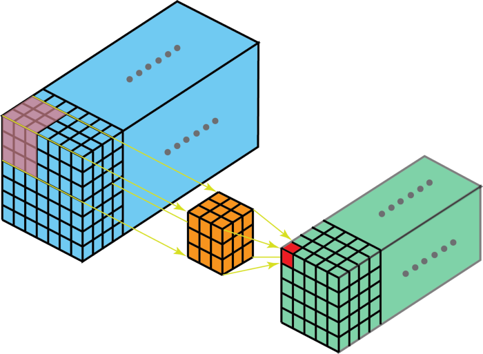

 2D-卷积和3D-卷积的主要区别为filters滑动的空间维度，3D-卷积的优势在于描述3D空间中的对象关系。3D关系在某一些应用中十分重要，如3D-对象的分割以及医学图像的重构等。

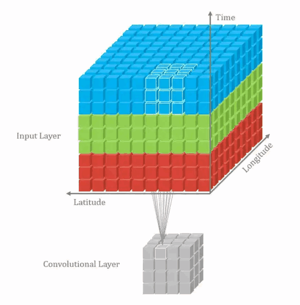

**3D卷积的计算过程：** 

输入层：$W_{in}*H_{in}*D_{in}*C_{in}$

超参数：

- filters个数：$k$
- filters中卷积核维度：$w*h*d$
- 滑动步长（Stride）：$s$
- 填充值（Padding）：$p$

输出层：$W_{out}*H_{out}*D_{out}*C_{out}$

其中输出层和输入层之间的参数关系为，

$\begin{cases} W_{out} = (W_{in} +2p - w)/s + 1 ,\\ H_{out} = (H_{in} +2p - h)/s + 1, \\ D_{out} = (D_{in} +2p - d)/s + 1, \\ C_{out} = k \end{cases}$

参数量为：$(w*h*d + 1)*k$

**3D卷积** , 一般是在处理的**视频** 的时候才会使用，目的是为了提取**时序信息(temporal feature)，** Pytorch代码使用的是`nn.Conv3d`（类似于`nn.Conv2d`） ：

```python3
in_channels (int) – Number of channels in the input image

out_channels (int) – Number of channels produced by the convolution

kernel_size (int or tuple) – Size of the convolving kernel

stride (int or tuple, optional) – Stride of the convolution. Default: 1

padding (int, tuple or str, optional) – Padding added to all six sides of the input. Default: 0

padding_mode (string, optional) – 'zeros', 'reflect', 'replicate' or 'circular'. Default: 'zeros'

dilation (int or tuple, optional) – Spacing between kernel elements. Default: 1

groups (int, optional) – Number of blocked connections from input channels to output channels. Default: 1

bias (bool, optional) – If True, adds a learnable bias to the output. Default: True
```

## 4. 1 x 1卷积

由于我们在前面的3D-卷积部分讨论了深度操作，让我们看看另一个有趣的操作，即1 x 1卷积。

**思考一个问题：** 难道1 x 1卷积只是将一个数字乘以输入层中的每个数字吗？Yes or No。

最初，在[这篇论文](https://arxiv.org/abs/1312.4400)中提出了1 x 1卷积。然后，它们在[Google Inception论文](https://arxiv.org/abs/1409.4842)中得到了广泛使用。1 x 1卷积的一些优点是：

- 降维以实现高效计算。
- 高效的低维嵌入或特征池。
- 卷积后再次应用非线性。

对于1*1卷积而言，表面上好像只是feature maps中的每个值乘了一个数，但实际上不仅仅如此，首先由于会经过激活层，所以实际上是进行了非线性映射，其次就是可以改变feature maps的channel数目。

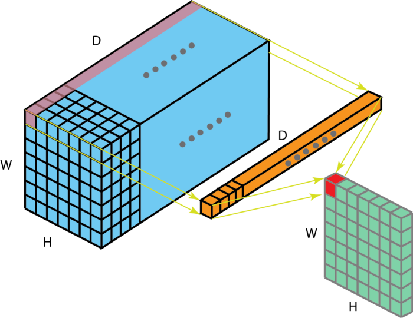

*1 x 1卷积，其中filters的大小为1*1*D*

上图中描述了：在一个维度为 H x W x D 的输入层上的操作方式。经过大小为 1 x 1 x D 的filters的 1 x 1 卷积，输出通道的维度为 H x W x 1。如果我们执行 N 次这样的 1 x 1 卷积，然后将这些结果结合起来，我们能得到一个维度为 H x W x N 的输出层。

在上图中可以看到前两个优点，第一个优点**（降维）** 是经过1 x 1卷积后，我们在深度方向上减小了尺度即减少通道数。第二个优点**（低维嵌入）** 是假设原始输入有200个通道，则1 x 1卷积会将这些通道（功能）嵌入到单个通道中。第三个优点**（非线性）** 是在1 x 1卷积之后，可以添加非线性激活函数，例如ReLU，非线性允许网络学习更复杂的功能。

在执行计算昂贵的 3 x 3 卷积和 5 x 5 卷积前，往往会使用 1 x 1 卷积来减少计算量。此外，它们也可以利用调整后的非线性激活函数来实现双重用途。

Yann LeCun曾这样描述1 x 1卷积：在卷积神经网络中，没有“全连接层”之类的东西，只有带有1x1卷积核和a full connection table。

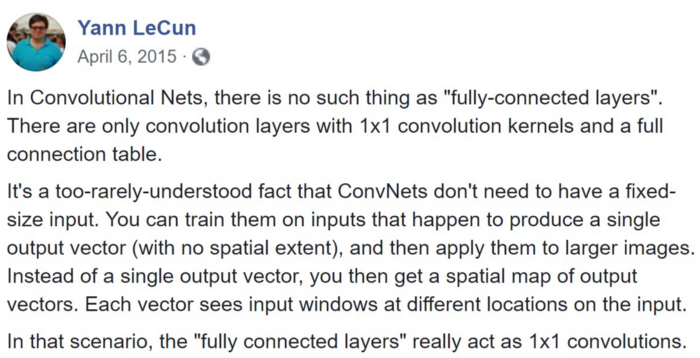

## 5. 卷积运算

现在我们知道了如何处理卷积中的深度，让我们继续讨论如何在其他两个方向（高度和宽度）上处理卷积以及重要的卷积运算。

以下是一些术语：

- `Kernel size（核的大小）`：上一节讨论了Kernel。核的大小定义了卷积的视图。
- `Stride（步长）`：它定义了在图像中滑动时，Kernels的步长。`Stride=1`表示Kernels逐像素滑动通过图像。`Stride=2`表示Kernels通过每步移动2个像素（即跳过1个像素）在图像中滑动。我们可以使用`Stride >= 2`对图像进行下采样。
- `Padding（填充）`：Padding定义了图像边框的处理方式。填充卷积（Tensorflow中的`same`填充）通过在输入边界周围填充0来保持输出的大小等于输入图像的大小。另一方面，未填充的卷积（Tensorflow中的`valid`填充）仅对输入图像的像素执行卷积，而在输入边界周围不填充0，输出的大小**小于** 输入的大小。

下图是使用`Kernel size=3`，`Stride=1`和`Padding=1`的2D-卷积：

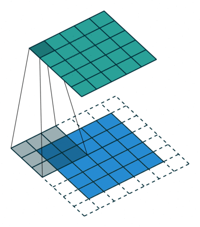

有一篇关于[A guide to convolution arithmetic for deep learning](https://arxiv.org/abs/1603.07285)的论文，可以参考它获得详细的描述和示例。

## 6. 转置卷积（反卷积）

对于许多应用程序和许多网络体系结构来说，我们经常要进行与正常卷积（下采样）相反方向的转换即**上采样** 。传统上，可以通过应用**插值方案** 或手动创建规则来实现上采样。另一方面，诸如神经网络之类的现代体系结构，倾向于让网络本身在没有人工干预的情况下，自动学习适当的转换，为此，我们可以使用转置卷积（**反卷积** ）。

**反卷积** 也可以称为**卷积转置** 或**转置卷积** ，**但其并非卷积操作的反向操作** 。由上边的介绍可以看出，卷积操作会将输入映射到一个更小的feature map中，那么反卷积则可以将这个小的feature map映射为一个大的feature map，但是切记，这不是卷积的反向操作，也不会得到与原始输入一样的输出，但是却保留了映射中相对位置关系的信息，我们可以将其理解为上采样。

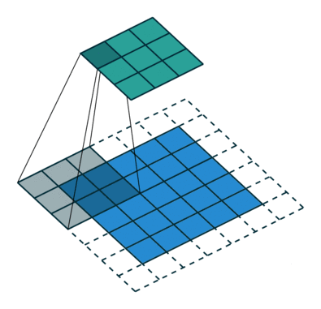

从上图中可以看出，一个3x3的输入经过一个3x3的反卷积核的处理可以得到一个7x7的feature map。

那么这一操作是怎么实现的呢？这里就需要先理解一个概念——**卷积矩阵** ，顾名思义就是把卷积操作写成一个矩阵的形式，通过一次矩阵乘法就可以完成整个卷积操作。卷积矩阵的构造是通过对卷积核的重排列构造的。例如对于3x3的卷积核：

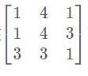

可以重排列为一个4x16的卷积矩阵：

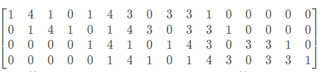

这样对于一个4x4的输入矩阵就可以通过一次矩阵相乘得到卷积操作的结果。那难道是用4x4乘4x16得到一个4x16的结果吗。首先我们来看正常的卷积操作。设该输入矩阵为：

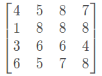

以1为步长没有填充，那么卷积结果为：

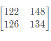

这是一个2x2的矩阵，不是4x16的矩阵啊，那是哪里出了错误呢？错误就出在矩阵相乘的地方，这里不能直接用输入的4x4矩阵与卷积矩阵相乘，而是应该将输入矩阵转换为一个1x16的列向量，那么该列向量与卷积矩阵相乘会得到一个1x4的向量，再将该向量reshape为2x2的矩阵即为卷积结果。下面我们来看具体过程，1x16的列向量为：

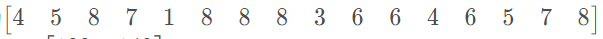

与卷积矩阵相乘后得：

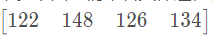

再reshape则结果为：

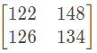

与原始的卷积操作的结果是相同的。

到这里大家可能对反卷积或者是转置卷积有了一定想法，没错，此时就是要将卷积矩阵进行转置，那么就可以得到一个16x4的转置卷积矩阵，对于输出的2x2的feature map，reshape为4x1，再将二者相乘即可得到一个16x1的转置卷积的结果，此时再reshape即可得到一个4x4的输出。

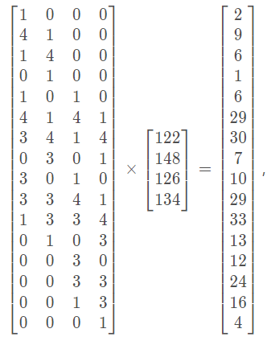

将计算的列向量reshape可得：

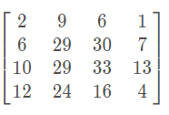

这样就通过转置卷积将2x2的矩阵反卷为一个4x4的矩阵，但是从结果也可以看出反卷积的结果与原始输入信号不同。只是保留了位置信息，以及得到了想要的形状。

反卷积可以应用在生成对抗网络(GAN)，的生成器上，大家可以参考DCGAN进行理解。

### 6.1  Checkerboard artifacts

使用转置卷积时会出现**棋盘格伪影** ：

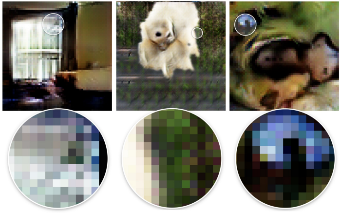

*棋盘状伪影*

文章《[Deconvolution and Checkerboard Artifacts](https://distill.pub/2016/deconv-checkerboard)》对这种问题进行了详细的分析，有关更多详细信息，请查看此[文章](https://distill.pub/2016/deconv-checkerboard)。在这里，我只概括几个要点。

棋盘状伪影是由转置卷积的“不均匀重叠”引起的。这种重叠使得更多的隐喻性绘画在某些地方比其他地方更多。

在下图中，顶部的图层是输入图层，底部的图层是转置卷积后的输出图层。在转置卷积期间，具有较小尺寸的层被映射到具有较大尺寸的层。

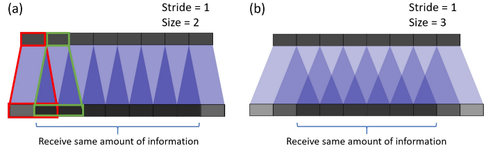

在示例(a)中，步长为1且filters大小为2。如红色所示，输入上的第一个像素映射到输出上的第一个和第二个像素。如绿色所示，输入上的第二个像素映射到输出上的第二个和第三个像素。输出上的第二个像素从输入上的第一个和第二个像素接收信息。总的来说，输出中间部分（有效输出）的像素从输入端接收相同数量的信息，这里存在中心重叠的区域。在示例(b)中filters大小增加到3时，接收最多信息的中心部分收缩。但这可能不是什么大问题，因为重叠仍然是均匀的，输出中心部分的像素从输入接收相同数量的信息。

现在，对于下面的示例，我们更改stride = 2。在示例(a)中，filter的大小= 2，输出上的所有像素都从输入接收相同数量的信息。它们都从输入上的单个像素接收信息，这里没有转置卷积的重叠。

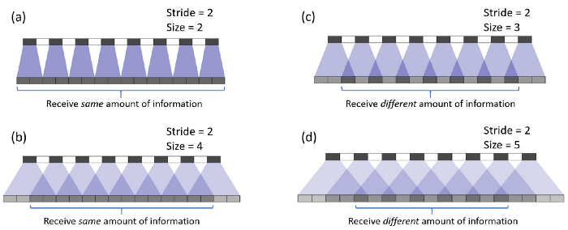

如果我们在示例(b)中将filters的大小更改为4，则均匀重叠的区域会缩小。但是，仍然可以使用输出的中心部分作为有效输出，其中每个像素从输入接收相同数量的信息。

但是，如果我们在示例(c)和(d)中将filters的大小更改为3和5，事情会变得很有趣。对于这两种情况，输出上的每个像素与其相邻像素相比接收不同数量的信息，人们无法在输出上找到连续且均匀重叠的区域。

**当filters的大小不能被步长整除时，转置卷积有不均匀的重叠。** 这种“不均匀的重叠”使得某些地方的涂料比其他地方更多，从而产生棋盘效果。事实上，不均匀重叠的区域在两个维度上往往更加极端。在那里，两个模式相乘，不均匀性变成它们的平方。

在应用转置卷积的同时，可以做两件事来减少此类伪像。首先，**请确保使用的filters的大小能被步长整除，以避免不均匀的重叠问题** 。其次，**可以使用步长=1的转置卷积，这有助于减少棋盘效应** 。但是，正如许多最新模型中所看到的那样，伪影仍可能泄漏出去。

[这篇文章](https://distill.pub/2016/deconv-checkerboard/)提出了一种更好的上采样方法：首先，调整图像的大小(使用最近邻插值或双线性插值)，然后做一个卷积层。通过这样做，作者避免了棋盘效应。

## 7. 扩张卷积（空洞卷积）

在[这篇论文](https://arxiv.org/abs/1412.7062)和《[Multi-scale context aggregation by dilated convolutions](https://arxiv.org/abs/1511.07122)》这篇论文中介绍了扩张卷积。

系统能以相同的计算成本，提供更大的感受野，扩张卷积在实时分割领域特别受欢迎。 在需要更大的观察范围，且无法承受多个卷积或更大的kennels，可以用它。

标准的离散卷积计算公式如下：

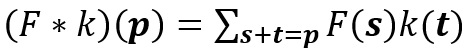


*标准的卷积*

扩张卷积的计算公式如下：

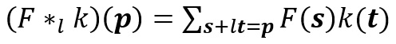

当 $l=1$ 时，扩张卷积变成标准的卷积：

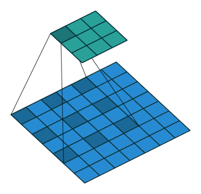

直观上，空洞卷积通过在卷积核部分之间插入空间让卷积核「膨胀」。这个增加的参数 $l$ （空洞率）表明了我们想要将卷积核放宽到多大。下图显示了当 $l=1,2,4$ 时的卷积核大小（当 $l=1$ 时，空洞卷积就变成了一个标准的卷积）。

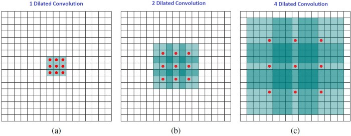

在图像中，3 x 3 的红点表明经过卷积后的输出图像的像素是3 x 3。虽然三次空洞卷积都得出了相同维度的输出图像，但是模型观察到的感受野（receptive field）是大不相同的。 $l=1$时，感受野为 3 x 3； $l=2$时，感受野是 7 x 7； $l=3$时，感受野增至 15x15。有趣的是，**这些操作的参数数量本质上是相同的，不需要增加参数运算成本就能「观察」大的感受野** 。正因为此，空洞卷积常被用以低成本地增加输出单元上的感受野，同时还不需要增加卷积核大小，当多个空洞卷积一个接一个堆叠在一起时，这种方式是非常有效的。

《[Multi-scale context aggregation by dilated convolutions](https://arxiv.org/abs/1511.07122)》一文中的作者从多层空洞卷积中构建了一个网络，其中膨胀率 $l$ 在每一层都呈指数增长。结果，有效的感受野呈指数增长，而参数的数量仅随层线性增长！

下面是来自问题：[如何理解空洞卷积（dilated convolution）？](https://www.zhihu.com/question/54149221/answer/1850592489) [@刘诗昆](https://www.zhihu.com/people/db0ed459559ca0a84149e3d9d61b2727) 的回答，写的非常不错。

不过光理解他的工作原理还是远远不够的，要充分理解这个概念我们得重新审视卷积本身，并去了解他背后的设计直觉。以下主要讨论 dilated convolution 在语义分割 (semantic segmentation) 的应用。

**重新思考卷积： Rethinking Convolution** 

在赢得其中一届ImageNet比赛里VGG网络的文章中，他最大的贡献并不是VGG网络本身，而是他对于卷积叠加的一个巧妙观察。

> This (stack of three 3 × 3 conv layers) can be seen as imposing a regularisation on the 7 × 7 conv. filters, forcing them to have a decomposition through the 3 × 3 filters (with non-linearity injected in between).

这里意思是 7 x 7 的卷积层的正则等效于 3 个 3 x 3 的卷积层的叠加。而这样的设计不仅可以大幅度的减少参数，其本身带有正则性质的 convolution map 能够更容易学一个 generlisable, expressive feature space。这也是现在绝大部分基于卷积的深层网络都在用小卷积核的原因。

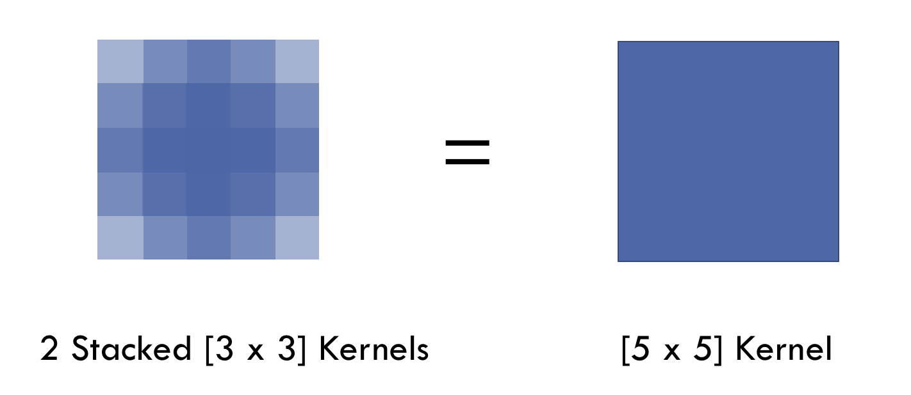

然而 Deep CNN 对于其他任务还有一些致命性的缺陷。较为著名的是 up-sampling 和 pooling layer 的设计。这个在 Hinton 的演讲里也一直提到过。

主要问题有：

1. Up-sampling / pooling layer (e.g. bilinear interpolation) is deterministic. (a.k.a. not learnable)
2. 内部数据结构丢失；空间层级化信息丢失。
3. 小物体信息无法重建 (假设有四个pooling layer 则 任何小于 2^4 = 16 pixel 的物体信息将理论上无法重建。)

在这样问题的存在下，语义分割问题一直处在瓶颈期无法再明显提高精度， 而 dilated convolution 的设计就良好的避免了这些问题。

**空洞卷积的拯救之路：Dilated Convolution to the Rescue** 

题主提到的这篇文章 [MULTI-SCALE CONTEXT AGGREGATION BY DILATED CONVOLUTIONS](https://arxiv.org/pdf/1511.07122.pdf) 可能(?) 是第一篇尝试用 dilated convolution 做语义分割的文章。后续图森组和 Google Brain 都对于 dilated convolution 有着更细节的讨论，推荐阅读：[Understanding Convolution for Semantic Segmentation](https://arxiv.org/abs/1702.08502) [Rethinking Atrous Convolution for Semantic Image Segmentation](https://arxiv.org/abs/1706.05587) 。

对于 dilated convolution， 我们已经可以发现他的优点，即内部数据结构的保留和避免使用 down-sampling 这样的特性。但是完全基于 dilated convolution 的结构如何设计则是一个新的问题。

**潜在问题 1：The Gridding Effect** 

假设我们仅仅多次叠加 dilation rate 2 的 3 x 3 kernel 的话，则会出现这个问题：

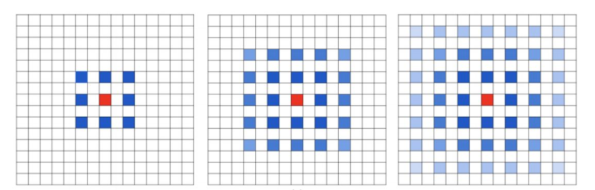

我们发现我们的 kernel 并不连续，也就是并不是所有的 pixel 都用来计算了，因此这里将信息看做 checker-board 的方式会损失信息的连续性。这对 pixel-level dense prediction 的任务来说是致命的。

**潜在问题 2：Long-ranged information might be not relevant.** 

我们从 dilated convolution 的设计背景来看就能推测出这样的设计是用来获取 long-ranged information。然而光采用大 dilation rate 的信息或许只对一些大物体分割有效果，而对小物体来说可能则有弊无利了。如何同时处理不同大小的物体的关系，则是设计好 dilated convolution 网络的关键。

**通向标准化设计：Hybrid Dilated Convolution (HDC)** 

对于上个 section 里提到的几个问题，图森组的文章对其提出了较好的解决的方法。他们设计了一个称之为 HDC 的设计结构。

第一个特性是，叠加卷积的 dilation rate 不能有大于1的公约数。比如 [2, 4, 6] 则不是一个好的三层卷积，依然会出现 gridding effect。

第二个特性是，我们将 dilation rate 设计成 锯齿状结构，例如 [1, 2, 5, 1, 2, 5] 循环结构。

第三个特性是，我们需要满足一下这个式子：$M_i=\max[M_{i+1}-2r_i,M_{i+1}-2(M_{i+1}-r_i),r_i]$

其中 $r_i$是 i 层的 dilation rate 而 $M_i$ 是指在 i 层的最大dilation rate，那么假设总共有n层的话，默认 $M_n=r_n$ 。假设我们应用于 kernel 为 k x k 的话，我们的目标则是 $M_2 \leq k$ ，这样我们至少可以用 dilation rate 1 即 standard convolution 的方式来覆盖掉所有洞。

一个简单的例子: dilation rate [1, 2, 5] with 3 x 3 kernel (可行的方案)

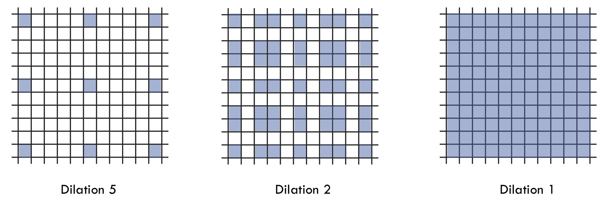

而这样的锯齿状本身的性质就比较好的来同时满足小物体大物体的分割要求(小 dilation rate 来关心近距离信息，大 dilation rate 来关心远距离信息)。

这样我们的卷积依然是连续的也就依然能满足VGG组观察的结论，大卷积是由小卷积的 regularisation 的叠加。

以下的对比实验可以明显看出，一个良好设计的 dilated convolution 网络能够有效避免 gridding effect。

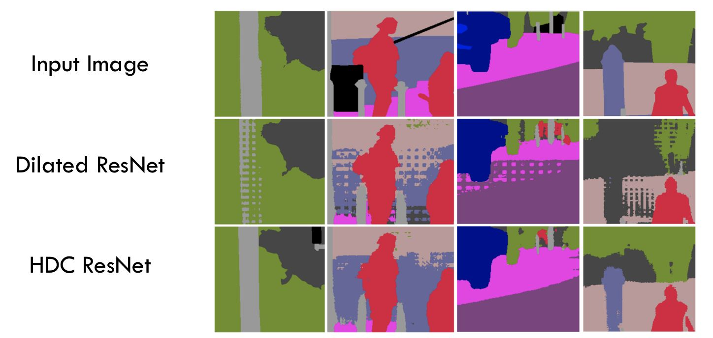

**多尺度分割的另类解：Atrous Spatial Pyramid Pooling (ASPP)** 

在处理多尺度物体分割时，我们通常会有以下几种方式来操作：

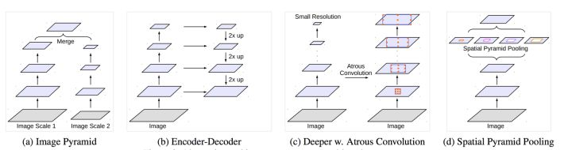

然仅仅(在一个卷积分支网络下)使用 dilated convolution 去抓取多尺度物体是一个不正统的方法。比方说，我们用一个 HDC 的方法来获取一个大（近）车辆的信息，然而对于一个小（远）车辆的信息都不再受用。假设我们再去用小 dilated convolution 的方法重新获取小车辆的信息，则这么做非常的冗余。

基于港中文和商汤组的 PSPNet 里的 Pooling module （其网络同样获得当年的SOTA结果），ASPP 则在网络 decoder 上对于不同尺度上用不同大小的 dilation rate 来抓去多尺度信息，每个尺度则为一个独立的分支，在网络最后把他合并起来再接一个卷积层输出预测 label。这样的设计则有效避免了在 encoder 上冗余的信息的获取，直接关注与物体之间之内的相关性。

**总结** 

Dilated Convolution 个人认为想法简单，直接且优雅，并取得了相当不错的效果提升。他起源于语义分割，大部分文章也用于语义分割，具体能否对其他应用有价值姑且还不知道，但确实是一个不错的探究方向。有另外的答主提到WaveNet, ByteNet 也用到了 dilated convolution 确实是一个很有趣的发现，因为本身 sequence-to-sequence learning 也是一个需要关注多尺度关系的问题。则在 sequence-to-sequence learning 如何实现，如何设计，跟分割或其他应用的关联是我们可以重新需要考虑的问题。

在Pytorch中，定义空洞卷积较为简便，只需要修改卷积层的dilation参数即可，以[nn.Conv2d](https://pytorch.org/docs/stable/generated/torch.nn.Conv2d.html#torch.nn.Conv2d)为例：

```python3
nn.Conv2d(in_channels=3, out_channels=32, kernel_size=3, stride=1, padding=0, dilation=3) #膨胀率为3

- dilation: controls the spacing between the kernel points; also known as the à trous algorithm. 
  It is harder to describe, but this link has a nice visualization of what dilation does.
```

## 8. 可分离卷积

可分离卷积用于某些神经网络体系结构中，例如[MobileNet](https://arxiv.org/abs/1704.04861)。可以在**空间上（空间可分离卷积）或在深度上（深度可分离卷积）** 进行可分离卷积。

### 8.1 空间可分离卷积

空间可分离卷积在图像的2D-空间维度（即高度和宽度）上运行。从概念上讲，空间可分离卷积将卷积分解为两个单独的运算。对于下面显示的示例，将Sobel的kennel（3x3的kennel）分为3x1和1x3的kennel。

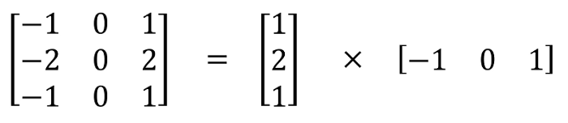

*Sobel的kennel（3x3的kennel）分为3x1和1x3的kennel*

在卷积中，3x3的kennel直接与图像卷积。在空间可分离卷积中，3x1的kennel首先与图像进行卷积，然后应用1x3的kennel。在执行相同操作时，空间可分离卷积只需要6个参数而不是9个参数。

此外，在空间可分离卷积中需要比卷积更少的矩阵乘法。举一个具体的例子，用3 x 3的kennel（步长= 1，填充= 0）在5 x 5图像上进行卷积，需要在水平3个位置（垂直3个位置）上扫描的kennel，总共9个位置（在下图中以点表示）。在每个位置上，将应用9个按元素的乘法，总体来说，这是9 x 9 = 81个乘法运算。

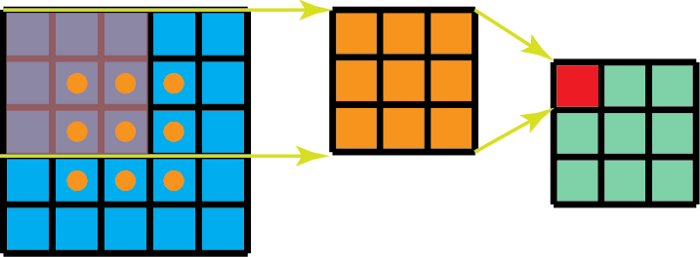

*单通道的标准卷积*

另一方面，对于空间可分离卷积，我们首先在5 x 5图像上应用3 x 1的filter。我们在水平5个位置和垂直3个位置扫描这样的kennel，总的位置是5×3 = 15（表示为下面的图像上的点）。在每个位置，应用3个逐元素的乘法，那就是15 x 3 = 45个乘法运算。现在，我们获得了一个3 x 5的矩阵，此矩阵与1 x 3的kennel卷积，该kennel在水平3个位置和垂直3个位置扫描矩阵，总共9个位置。对于这9个位置中的每一个，将应用3个按元素的乘法，此步骤需要9 x 3 = 27个乘法运算。因此，总的来说，空间可分离卷积需要45+27=72个乘法运算，小于标准卷积的81个乘法运算。

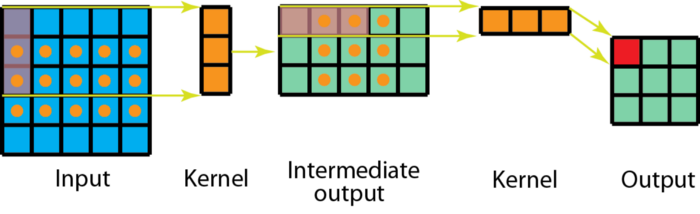

*单通道的空间可分离卷积*

比起卷积，空间可分离卷积要执行的矩阵乘法运算也更少。假设我们现在在  $m \times m$卷积核、卷积步长=1 、填充=0 的 $N \times N$ 图像上做卷积。传统的卷积需要进行 $(N-2) \times (N-2) \times m \times m$ 次乘法运算，而空间可分离卷积只需要进行 $N \times (N-2) \times m + (N-2) \times (N-2) \times m = (2N-2) \times (N-2) \times m$ 次乘法运算。空间可分离卷积与标准的卷积的计算成本之比为：

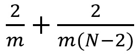

对于图像的大小N远远大于filters大小m（N >> m）的图层，比值变为2 / m。这意味着在这种渐近情况下（N >> m），空间可分离卷积的计算成本是标准卷积的2/3（3 x 3的filters）。对于5 x 5的filters为2/5，对于7 x 7的filters为2/7，依此类推。

**尽管空间可分离卷积节省了成本，但很少在深度学习中使用它。主要原因之一是并非所有kennels都可以分为两个较小的kennels。如果用空间可分离卷积代替所有传统的卷积，在训练过程中，我们将限制卷积核的类型，训练结果可能不是最佳的。** 

### 8.2 深度可分离卷积

深度可分离卷积是深度学习中更常用的方法（例如，在[MobileNet](https://arxiv.org/abs/1704.04861)和[Xception](https://arxiv.org/abs/1610.02357)中），它包括两个步骤：**深度卷积和1x1卷积** 。

在讲解这些步骤之前，我们先回顾一下在前几节中讨论的2D-卷积和1 x 1卷积。

让我们快速回顾一下标准的2D卷积，举一个具体的例子，假设输入层的大小为 $7 \times 7 \times 3$ （ $高度\times宽度\times通道$ ），而filters的大小为 $3 \times 3 \times3$ 。用一个filters进行2D卷积后，输出层为大小为 $5 \times 5 \times 1$ （只有1个通道）。

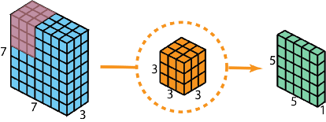

*标准的2D卷积，使用1个filter得到1层输出*

通常，在两个神经网络层之间应用多个filters。假设这里有128个filters，应用这128个2D卷积后，我们得到128个 $5 \times 5 \times 1$ 输出特征图。然后，我们将这些特征图堆叠到大小为 $5 \times 5 \times128$ 的单层中。我们将输入层（ $7 \times 7\times 3$ ）转换为输出层（ $5 \times 5 \times128$ ），在扩展深度的同时，空间尺寸（即高度和宽度）会缩小。

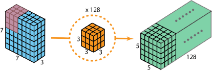

*标准的2D卷积使用128个filters得到128层输出*

接下来看看使用深度可分离卷积如何实现同样的转换。

首先第一步，我们在输入层上应用**深度卷积** 。我们在2D-卷积中分别使用 3 个卷积核（每个filter的大小为  $3\times3 \times 1$ ），而不使用大小为 $3 \times 3 \times 3$ 的单个filter。每个卷积核仅对输入层的 1 个通道做卷积，这样的卷积每次都得出大小为  $5\times 5 \times1$的映射，之后再将这些映射堆叠在一起创建一个  $5 \times 5 \times3$的特征图，最终得出一个大小为 $5 \times 5 \times3$ 的输出图像。这样的话，图像的深度保持与原来的一样。

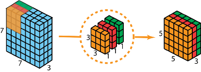

*深度卷积*

深度可分离卷积的第二步是扩大深度，我们用大小为  $1\times1\times3$的卷积核做 1x1 卷积。每个  $1\times1\times3$卷积核对  $5 \times 5 \times 3$输入图像做卷积后都得出一个大小为  $5 \times5 \times1$的特征图。

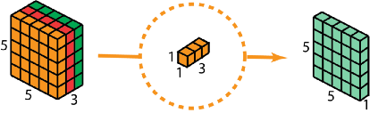

这样的话，做 128 次 1x1 卷积后，就可以得出一个大小为 $5 \times 5 \times 128$ 的层。

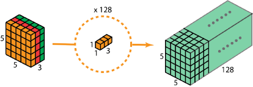

*深度可分离卷积第二步：应用多个1 x 1 x 3卷积改变深度*

深度可分离卷积完成这两步后，同样可以将一个  $7 \times 7\times 3$的输入层转换为  $5 \times 5 \times 128$的输出层。

下图展示了深度可分离卷积的整个过程：

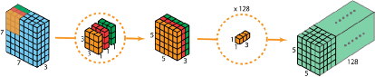

*深度可分离卷积的整个过程*

从本质上说，**深度可分离卷积就是3D卷积kernels的分解（在深度channel上的分解），而空间可分离卷积就是2D卷积kernels的分解（在WH上的分解）。** 

那么，进行深度可分离卷积有什么好处？效率！与标准的2D卷积相比，深度可分离卷积所需的运算量少得多。

让我们回忆一下标准的2D 卷积例子中的计算成本：128 个  $3\times3\times3$的卷积核移动  $5\times5$次，总共需要进行的乘法运算总数为  $128 \times 3 \times 3 \times 3 \times 5 \times 5 = 86,400$次。

那深度可分离卷积呢？在深度卷积这一步，有 3 个  $3\times3\times1$的卷积核移动  $5\times5$次，总共需要进行的乘法运算次数为 $3\times3\times3\times1\times5\times5 = 675$ 次；在第二步的  $1\times1$卷积中，有 128 个  $1\times1\times3$的卷积核移动  $5\times5$次，总共需要进行的乘法运算次数为  $128\times 1 \times 1 \times 3 \times 5 \times 5 = 9,600$次。因此，深度可分离卷积共需要进行的乘法运算总数为  $675 + 9600 = 10,275$次，**花费的计算成本仅为2D卷积的12%** 。

同样，我们对深度可分离卷积进行归纳。假设输入为$h \times w \times d$，应用$n$个$h_0 \times h_0 \times d$的filters（步长为1，填充为0，$h$为偶数），同时输出层为$(h-h_0+1)\times(w-h_0+1)\times n$。

- 2D卷积的计算成本：
$n*h_0*h_0*d*(h-h_0+1)*(w-h_0+1)$

- 深度可分卷积的计算成本：
$d*h_0*h_0*1*(h-h_0+1)*(w-h_0+1) +\\ n*1*1*d*(h-h_0+1)*(w-h_0+1)\\=(h_0*h_0+n)*d*(h-h_0+1)*(w-h_0+1)$

- 深度可分卷积和2D卷积所需的计算成本比值为:


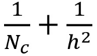

目前大多数网络结构的输出层通常都有很多通道，可达数百个甚至上千个。该情况下（$n>>h_0$），则上式可简写为$\frac{1}{h_0^2}$。基于此，如果使用$3\times3$的filters，则2D卷积的乘法计算次数比深度可分离卷积多9倍。对于$5\times5$的filters，2D卷积的乘法次数是其25倍。

**使用深度可分离卷积有什么缺点吗？** 当然有。深度可分离卷积可大幅度减少卷积的参数。因此对于规模较小的模型，如果将2D卷积替换为深度可分离卷积，其模型大小可能会显著降低，模型的能力可能会变得不太理想，因此得到的模型可能是次优的。但如果使用得当，深度可分离卷积能在不牺牲模型性能的前提下显著提高效率。

深度可分离卷积的PyTorch代码如下：

```python3
class Depthwise_Separable(nn.Module):
    def __init__(self, in_ch, out_ch):
        super(Depthwise_Separable, self).__init__()
        self.depth_conv = nn.Conv2d(
            in_channels=in_ch,
            out_channels=in_ch,
            kernel_size=3,
            stride=1,
            padding=1,
            groups=in_ch
        )
        self.point_conv = nn.Conv2d(
            in_channels=in_ch,
            out_channels=out_ch,
            kernel_size=1,
            stride=1,
            padding=0,
            groups=1
        )

    def forward(self, input):
        out = self.depth_conv(input)
        out = self.point_conv(out)
        return out
```

## 9. 扁平卷积（Flattened Convolution）

论文《Flattened convolutional neural networks for feedforward acceleration》介绍了扁平卷积。

该方法没有应用一个标准filter将输入层映射到输出层，而是将标准filter分为3个1D-filters。这种想法与上述空间可分离卷积中的想法相似，其中空间filters是由两个rank-1 filters近似得到的。

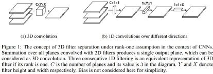

该论文认为，通过使用由3D空间中所有方向上的1D-filters的连续序列组成的扁平化网络进行训练，可以提供与标准卷积网络相当的性能，并且由于学习参数的显着减少，计算成本要低得多。

## 10. 分组卷积（Grouped Convolution）

**Grouped convolution 分组卷积** ，最早在[AlexNet](https://papers.nips.cc/paper/4824-imagenet-classification-with-deep-convolutional-neural-networks.pdf)中出现，由于当时的硬件资源有限，训练AlexNet时卷积操作不能全部放在同一个GPU处理，因此作者把feature maps分给多个GPU分别进行处理，最后把多个GPU的结果进行融合。

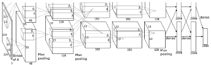

下面描述分组卷积是如何实现的。首先，传统的 2D 卷积步骤如下图所示，在这个例子中，通过应用 128 个filters（每个filter的大小为  $3 \times 3 \times 3$ ），大小为  $7 \times 7 \times 3$的输入层被转换为大小为  $5 \times 5 \times 128$的输出层。针对通用情况，可概括为：通过应用  $D_{out}$个卷积核（每个卷积核的大小为  $h \times w \times D_{in}$ ），可将大小为  $H_{in} \times W_{in} \times D_{in}$的输入层转换为大小为  $H_{out} \times W_{out} \times D_{out}$的输出层。


*标准的2D卷积*

在分组卷积中，filters被拆分为不同的组，每一个组都负责具有一定深度的传统 2D 卷积的工作。下图的例子表示得更清晰一些：


*有2个filters组的分组卷积*

上图表示的是被拆分为 2 个filters组的分组卷积。在每个filters组中，其深度仅为传统2D-卷积的一半（ $D_{in} / 2$ ），而每个filters组都包含 $D_{out} /2$ 个filters。第一个filters组（红色）对输入层的前半部分做卷积（ $[:, :, 0:  D_{in}/2 ]$ ），第二个filters组（蓝色）对输入层的后半部分做卷积（ $[:, :, D_{in}/2:D_{in} ]$ ）。最终，每个filters组都输出了  $D_{out} /2$个通道。整体上，两个组输出的通道数为  $2 \times D_{out}/2 = D_{out}$ 。之后，我们再将这些通道堆叠到输出层中，输出层就有了  $D_{out}$个通道。

分组卷积只需要对`nn.Conv2d`中的`groups`参数进行设置即可，表示需要分的组数，`groups`的默认值为1，即进行常规卷积。以下是实现分组卷积的代码：

```python3
class Group(nn.Module):
    def __init__(self, in_ch, out_ch, groups):
        super(Group, self).__init__()
        self.conv = nn.Conv2d(
            in_channels=in_ch,
            out_channels=out_ch,
            kernel_size=3,
            stride=1,
            padding=1,
            groups=groups
        )

    def forward(self, input):
        out = self.conv(input)
        return out
```

### 10.1 分组卷积与深度卷积

您可能已经观察到分组卷积和深度可分离卷积中使用的深度卷积之间的某些联系和差异。如果filters组的数量与输入层通道的数量相同，则每个filter的深度 $D_{in} / D_{in} =1$ ，这与深度卷积中的filters深度相同。

另一方面，每个filter组现在都包含 $D_{out} / D_{in}$个filters。总体而言，输出层的深度为 $D_{out}$ ，这与深度卷积法不同，后者不会改变层深度，层深度在深度可分离卷积中通过 $1\times1$ 卷积进行扩展。

使用分组卷积有一些优点：

**第一个优点是有效的训练** 。由于卷积被划分为多个路径，因此每个路径可以由不同的GPU分别处理，此过程允许以并行方式在多个GPU上进行模型训练。与使用一个GPU进行所有训练相比，通过多GPU进行的**模型并行化** ，可以将更多图像传到网络中。模型并行化被认为比数据并行化更好的方式，最终将数据集分成多个批次，然后我们对每个批次进行训练。但是，当批次大小变得太小时，与batch梯度下降相比，我们实际上是随机的，这将导致收敛变慢，有时甚至变差。

分组卷积对于训练非常深的神经网络非常重要，如下面的[ResNeXt](https://arxiv.org/abs/1611.05431)所示：


**第二个优点是模型更有效，即模型参数随着filters组数的增加而减小** 。在前面的示例中，filters具有标准2D卷积的 $h\times​​w\times D_{in} \times D_{out}$ 参数。具有2个filters组的分组卷积中的filters具有 $（h\times w\times D_{in} / 2 \times D_{out} / 2）\times2$ 个参数，参数数量减少一半。

**第三个优点分组卷积可以提供比标准2D卷积更好的模型，** 一个很棒的[博客](https://blog.yani.io/filter-group-tutorial/)对此进行了解释。

下图是相邻层filters之间的相关性，关系是稀疏的：


*在CIFAR10上训练的Network-in-Network模型中，相邻层filters之间的相关矩阵。高度相关的filters较亮，而较低相关的filters则较暗。*


*当使用1、2、4、8和16个filters组训练时，在CIFAR10上训练的Network-in-Network模型中相邻层filters之间的相关性。*

上面的图像是当使用1、2、4、8和16个filters组训练模型时，相邻层filters之间的相关性。[文章](https://blog.yani.io/filter-group-tutorial/)提出了一个推理：“filters组的作用是通过以对角线结构的稀疏性来学习channel维度……在具有filters组的网络中，以更结构化的方式来学习具有高相关性的filters。实际上，不必学习的filters关系就在较长的参数上。在以这种显着的方式减少网络中参数的数量时，过拟合并不容易，因此类似正则化的效果使优化器可以学习到更准确，更有效的深度网络。”

此外，每个filter组都会学习数据的唯一表示形式。正如AlexNet的作者所注意到的那样，filters组似乎将学习到的filters分为两个不同的组，即黑白filter和彩色filter。


*AlexNet conv1 filters 分离：黑白filter和彩色filter*

## 11. 随机分组卷积（Shuffled Grouped Convolution）

随机分组卷积是在Magvii Inc（Face ++）的ShuffleNet中引入的。ShuffleNet是一种计算效率高的卷积体系结构，专为计算能力非常有限（例如10–150 MFLOP）的移动设备而设计。

随机分组卷积背后的思想与分组卷积（例如在MobileNet和ResNeXt中使用）和深度可分离卷积（在Xception中使用）背后的思想是相关的。

总的来说，随机分组卷积包括分组卷积和channel shuffle。

在关于分组卷积的部分中，我们知道filters被分为不同的组，每个组负责具有一定深度的标准2D卷积，总操作数大大减少。对于下图中的示例，我们有3个filters组，第一个filters组与输入层中的红色部分卷积。类似地，第二和第三个filters组与输入中的绿色和蓝色部分卷积。每个filter组中的kennels深度仅为输入层中总通道数的1/3。在此示例中，在第一次分组卷积GConv1之后，输入层被映射到中间特征图。然后，此特征图通过第二个分组卷积GConv2映射到输出层。


分组卷积在计算上是有效的，但是问题在于每个filters组仅处理从先前层中的固定部分向下传递的信息。例如上图中的示例，第一个filters组（红色）仅处理从前1/3个输入通道向下传递的信息。蓝色filters组（蓝色）仅处理从最后1/3个输入通道向下传递的信息。因此，每个filters组仅限于学习一些特定功能，此属性会阻止channel 组之间的信息流，并在训练过程中削弱表示，为了克服这个问题，我们应用了channel shuffle。

channel shuffle的想法是，我们希望混合来自不同组filters的信息。在下图中，在将第一个分组卷积GConv1与3个filters组应用后，我们得到了特征图。在将此特征图传到第二组卷积之前，我们首先将每组中的通道划分为几个子组，我们将这些子组混合在一起。


*Channel shuffle.*

经过这样的改组后，我们将照常继续执行第二个分组卷积GConv2。但是现在，由于shuffled层中的信息已经混合在一起，因此我们基本上将GConv2中的每个组与特征图层（或输入层）中的不同子组一起提供。结果，我们允许信息在通道组之间流动，并加强了表示。

## 12. 逐点分组卷积（Pointwise Grouped Convolution）

[ShuffleNet论文](https://arxiv.org/abs/1707.01083)还介绍了逐点分组卷积。通常，对于诸如[MobileNet](https://arxiv.org/abs/1704.04861)或[ResNeXt](https://arxiv.org/abs/1611.05431)中的分组卷积，分组操作是在 $3\times3$ 卷积上执行的，而不是在 $1 \times1$ 卷积上执行的。

shuffleNet论文认为 $1 \times1$ 卷积在计算上也很昂贵，它建议将组卷积也应用于 $1 \times1$ 卷积。顾名思义，逐点分组卷积执行 $1 \times1$ 卷积的组运算，该操作与分组卷积的操作相同，只不过有一处修改—对 $1 \times1$ 的filters而不是 $N \times N$ 的filters（N> 1）执行。

在ShuffleNet论文中，作者使用了三种类型的卷积：

（1）随机分组卷积（Shuffled Grouped Convolution）

（2） 逐点分组卷积（Pointwise Grouped Convolution）

（3）深度可分离卷积

这样设计的体系结构在保持精度的同时大大降低了计算成本。例如，ShuffleNet和AlexNet的分类错误在实际的移动设备上是差不多的。但是，计算成本已从AlexNet中的720 MFLOP大幅度降低到ShuffleNet中的40到140 MFLOP。ShuffleNet具有相对较低的计算成本和良好的性能，在用于移动设备的卷积神经网络领域中很受欢迎。

[^1][^2][^3][^4][^5][^6][^7][^8][^9]

## 参考

[^1]: An Introduction to different Types of Convolutions in Deep Learnin
[^2]: Review: DilatedNet — Dilated Convolution (Semantic Segmentation)
[^3]: ShuffleNet: An Extremely Efficient Convolutional Neural Network for Mobile Devices
[^4]: Separable convolutions “A Basic Introduction to Separable Convolutions
[^5]: Inception network “A Simple Guide to the Versions of the Inception Network
[^6]: A Tutorial on Filter Groups (Grouped Convolution)
[^7]: Convolution arithmetic animation
[^8]: Up-sampling with Transposed Convolution
[^9]: Intuitively Understanding Convolutions for Deep Learning