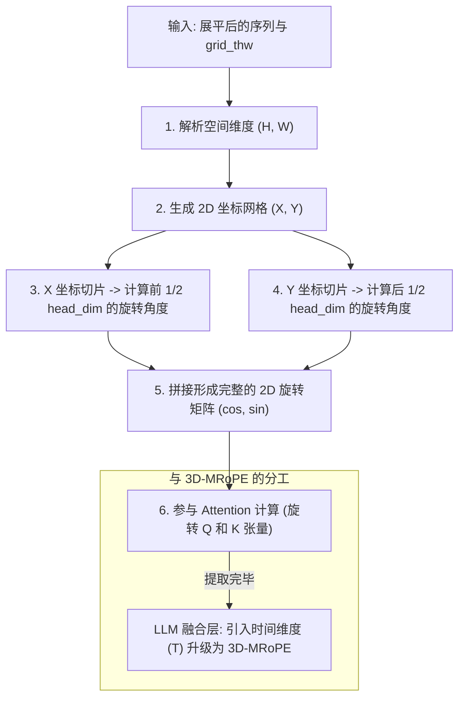

# 2D-RoPE 视觉位置编码

## 模块整体说明与架构拆解

2D-RoPE 是 Qwen2-VL/Qwen2.5-VL 视觉编码器（ViT）内部使用的旋转位置编码（Rotary Position Embedding）。它的作用是给图像的每个 Patch 打上精确的二维物理空间坐标戳（即它在图片中处于第几行、第几列）。

它**解决的核心痛点**：传统的 ViT 使用的是一维的、定长的可学习绝对位置编码（Absolute Positional Encoding），这导致模型能够处理的最大图像分辨率被死死锁住（比如最大只能处理 224x224）。引入 2D-RoPE 后，位置不再是写死在参数里的常量，而是通过三角函数实时计算出的旋转角度，从而使得模型天然支持**任意比例和任意分辨率（[[navit_动态分辨率]]）**。

### 架构流转图示



### 全局代码调用顺序与流转概览
1. **坐标生成**：在 `Qwen2_5_VLVisionTransformer.forward` 早期，调用 `get_2d_rotary_pos_emb`。系统根据传入的 `grid_thw` 计算出每个 Patch 的 $(y, x)$ 坐标。
2. **频率映射**：结合初始化好的 `VisionRotaryEmbedding`（通过底层频率基底）计算出对应的 `cos` 和 `sin` 矩阵。
3. **注入注意力**：将 `rotary_pos_emb` 作为参数传给每一层的 `Qwen2_5_VLVisionBlock`，进而传入 `Qwen2_5_VLVisionAttention`。
4. **旋转张量**：在计算 $QK^T$ 之前，调用 `apply_rotary_pos_emb` 对 Query 和 Key 张量进行旋转。

---

## 逻辑链输入与输出

- **逻辑链（输入）**：
  - `grid_thw`: `[Num_Media, 3]` (包含每张图片的 $H$ 和 $W$ Patch 数量)。
  - `head_dim`: 例如 `1152 / 16 = 72`。
- **逻辑链（输出）**：
  - `rotary_pos_emb`: `(cos, sin)` 元组，形状通常匹配 `[Total_Patch, head_dim]`，用于旋转 $Q$ 和 $K$。

---

## 核心算法原理详解

### 1. 维度的一分为二与矩阵推导

为什么要把 `head_dim` 分成两半？
这是 2D-RoPE 的最核心思想。假设 `head_dim = 72`，在概念上：
*   **前 36 维 (X 轴)**：负责编码该 Patch 位于第几**列**。它只关心 $x$ 坐标，不受 $y$ 坐标影响。
*   **后 36 维 (Y 轴)**：负责编码该 Patch 位于第几**行**。它只关心 $y$ 坐标，不受 $x$ 坐标影响。

**数学矩阵视角**：
二维位置的旋转矩阵 $\mathcal{R}_{x, y}$ 实质上是一个分块对角矩阵，相当于将一维特征分拆为 $x$ 旋转组与 $y$ 旋转组。
$$ \mathcal{R}_{x, y} = \begin{pmatrix} \cos x\theta & -\sin x\theta & 0 & 0 \\ \sin x\theta & \cos x\theta & 0 & 0 \\ 0 & 0 & \cos y\theta & -\sin y\theta \\ 0 & 0 & \sin y\theta & \cos y\theta \end{pmatrix} $$

**Torch 实现的重排列 (The 4-Chunk Trick)**：
在 Qwen2-VL 的实现中，为了利用极致高效的 `rotate_half` 函数，代码必须将 `head_dim` 组织成四段结构。
因为 1D-RoPE 是将特征劈成两半（前半和后半）来对应复平面的实部和虚部。而 2D-RoPE 有 $X$ 轴和 $Y$ 轴，所以它在 `head_dim` (如 `d`) 上会形成 `[x_cos, y_cos, x_cos, y_cos]` 和对应的 `sin` 的布局。
- `rotary_pos_emb_full` 中 $X$ 和 $Y$ 各自占用了 $d/4$ 个角度频率。
- 代码通过 `torch.cat([hpos_ids, wpos_ids], dim=-1)` 将行和列的索引拼在一起，最终查表出来的特征沿最后一个维度 Flatten。
- 在与特征 $Q, K$ 结合时，由于 `rotate_half` 把 $d$ 维切成前 $d/2$ 和后 $d/2$，这就天然对应上了 `(X实部, Y实部)` 和 `(X虚部, Y虚部)`。

具体应用层的公式映射为：
$$ q_{embed} = (q \times \text{cos\_cat}) + (\text{rotate\_half}(q) \times \text{sin\_cat}) $$

### 2. 第一性原理：为什么它能支持任意分辨率？

在传统的绝对位置编码中，模型学习到的是“第 100 个位置的向量长什么样”。如果训练时最多只有 1024 个位置，推理时遇到 2048 个位置，模型就会直接崩溃（Index Out of Bounds），即使强行插值（Interpolation），性能也会暴跌。

而 RoPE 基于**相对距离计算**。在 2D-RoPE 下：
*   Patch A 在 $(10, 10)$，Patch B 在 $(10, 15)$。
*   当计算注意力 $Q_A K_B^T$ 时，它们的相对角度偏移仅仅取决于 $\Delta x = 5, \Delta y = 0$。
*   这种相对性计算是纯数学映射，**不依赖于任何预设的序列总长度**。因此，哪怕推理时输入了一张 4K 的超级大图，只要 Patch 之间的相对距离能被数学公式描述，模型就能稳定识别出“眼睛在鼻子的上方”。

### 3. Qwen2.5-VL 的取舍：为什么 ViT 端不用 3D？

Qwen2.5-VL 是一个支持视频（3D）的模型，但为什么在视觉骨干网内部，依然沿用和 Qwen2-VL 一模一样的 2D-RoPE，而不引入时间 $T$ 维度呢？
*   因为 Qwen2.5-VL 在架构上将时间特征的处理前置和后置了：
    1. **前置**：在 [[conv3d_时空切块器]] 阶段，已经通过 3D 卷积实现了相邻两帧在物理层面上的融合压缩。
    2. **后置**：真正的时间流转（长视频的因果关系）交给了算力更强的大语言模型，通过 LLM 内部的 [[mrope_多模态位置编码]] (3D-RoPE) 去解决。
*   因此，**视觉骨干网（ViT）的任务被极其纯粹地定义为“单帧空间特征提纯”**。所以，内部只需要使用 2D-RoPE，不仅省算力，还无需修改架构。

---

## 核心源码解剖

**文件路径**：`transformers/src/transformers/models/qwen2_5_vl/modeling_qwen2_5_vl.py`

```python
# 初始化：将 head_dim 除以 2
class Qwen2_5_VLVisionTransformer(Qwen2_5_VisionTransformerPretrainedModel):
    def __init__(self, config: Qwen2_5_VLVisionConfig):
        ...
        head_dim = config.embed_dim // config.num_heads
        # rotary_dim = head_dim // 2
        self.rotary_pos_emb = VisionRotaryEmbedding(head_dim // 2)

# 计算 2D 坐标网格
def get_2d_rotary_pos_emb(grid_thw, head_dim):
    # ... 省略部分代码 ...
    for t, h, w in grid_thw:
        # 为每张图片生成 h 行 w 列的坐标网格
        h_pos = torch.arange(h)
        w_pos = torch.arange(w)
        # 将行坐标赋予 Y，列坐标赋予 X
        pos_y = h_pos.repeat_interleave(w)
        pos_x = w_pos.repeat(h)
        # ... 拼接到全局坐标列表中 ...
    
    # 返回给 VisionRotaryEmbedding 计算 cos/sin
    return pos_x, pos_y

# 施加旋转
# 在 Qwen2_5_VLVisionAttention 内部
q_rot, k_rot = apply_rotary_pos_emb(query, key, rotary_pos_emb)
```

---

## 质量自我审查与准出标准

1.  **解释清楚为什么是 2D 了吗？**：能回答因为 ViT 的任务只是空间提纯，时间交给 LLM 处理。
2.  **维度切分明白了吗？**：理解 `head_dim / 2` 的物理意义。
3.  **动态分辨率的基石懂了吗？**：理解为什么固定参数位置编码无法支持动态分辨率，而 RoPE 可以。

---

## 关联概念

- ✅ 支持 [[qwen2.5_vl_技术报告解析]]：ViT 内部沿用 2D-RoPE。
- ✅ 支持 [[navit_动态分辨率]]：2D-RoPE 是其基石。
- 🔄 演化自 Qwen2-VL 中首次引入的 2D-RoPE（代码几乎完全相同）。
- ➡️ 衍生为 [[mrope_多模态位置编码]]：LLM 内部将其升级为 3D 以支持时间轴。
