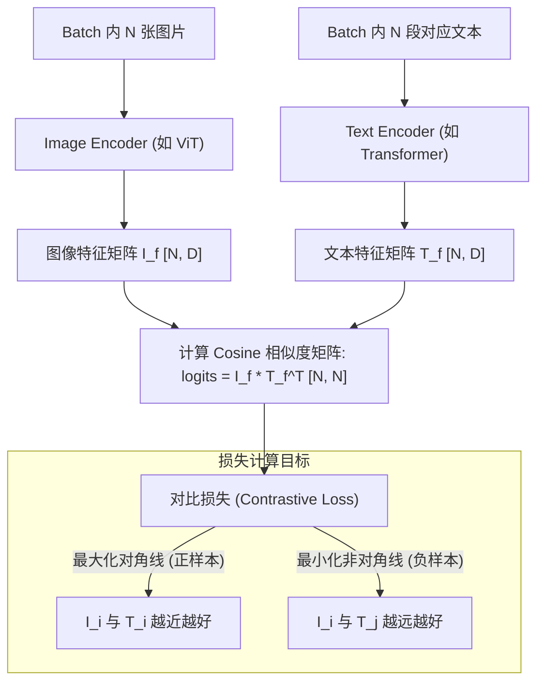

# CLIP 与对比学习视觉编码 (Contrastive Learning)

## 模块整体说明与架构拆解

在多模态大模型（如 Qwen-VL 系列）的 Stage 0（视觉-语言对齐预训练）阶段，最底层的基础往往是基于对比学习（Contrastive Learning）训练出来的视觉编码器（如 CLIP 或其进阶版 SigLIP）。

**解决的核心痛点**：传统的计算机视觉模型（如 ResNet 分类器）只能识别训练集里预先定义好的固定类别（比如 ImageNet 的 1000 类），缺乏泛化能力（Zero-shot）。CLIP (Contrastive Language-Image Pre-training) 彻底打破了这一限制，它使用爬取的数以亿计的“图像-文本对”，在一个统一的语义空间中，通过对比相似度，让模型学会了“理解图像的语言描述”。

### 架构流转图示 (CLIP 双塔模型)

CLIP 是典型的“双塔结构”：一个 Vision Encoder 处理图片，一个 Text Encoder 处理文字。

## 逻辑链输入与输出

- **逻辑链（输入）**：
  - 一个 Batch 内的图像序列 $I$ 和对应的文本描述序列 $T$。
- **逻辑链（输出）**：
  - 图文相似度矩阵的 Loss 值。

## 核心算法原理详解

### 1. CLIP 的全局 Softmax 机制
CLIP 的核心公式是在一个 Batch $B$ 内进行图文相似度的交叉熵优化：
$$ \mathcal{L}_{CLIP} = - \frac{1}{2|B|} \sum_{i=1}^{|B|} \left( \log \frac{e^{\tau I_i \cdot T_i}}{\sum_{j=1}^{|B|} e^{\tau I_i \cdot T_j}} + \log \frac{e^{\tau I_i \cdot T_i}}{\sum_{j=1}^{|B|} e^{\tau I_j \cdot T_i}} \right) $$

**局限性**：由于分母中需要求和 Batch 内所有的负样本，这要求在分布式训练时，所有的 GPU 必须将彼此的特征矩阵通过 `all-gather` 进行全局同步（Global Normalization）。这导致计算和通信开销随着 Batch Size 的增大呈二次方爆炸（$O(B^2)$）。

### 2. 进化：SigLIP 的二分类革新
为了解决 CLIP 对超大 Batch Size 内存消耗过高的问题，Google 提出了 SigLIP (Sigmoid Loss for Language Image Pre-Training)。

**核心改变**：
放弃了 Softmax，改用 Sigmoid。这意味着模型不再“在 N 个备选项里挑一个最像的（多分类）”，而是针对每一个图像-文本对 $(I_i, T_j)$ 独立地判断：“它们匹配吗？（是/否的二分类）”。
$$ \mathcal{L}_{SigLIP} = - \frac{1}{|B|} \sum_{i=1}^{|B|} \sum_{j=1}^{|B|} \log \frac{1}{1 + e^{-z_{ij} (I_i \cdot T_j + b)}} $$
其中，当 $i=j$ 时 $z_{ij}=1$（正样本），否则 $z_{ij}=-1$（负样本）。

**巨大的工程优势**：
因为去除了全局归一化的分母，损失的计算在样本对之间完全解耦。系统可以进行 **Chunked（分块）运算**：每个 GPU 只需要拿到相邻设备传过来的一小块负样本特征，算完就丢。这使得内存开销从 $O(B^2)$ 骤降到 $O(b^2)$（$b$ 为单卡 batch size），轻松支持百万级别的 Batch Size。

### 3. SigLIP 2：引入稠密（Dense）局部特征感知
基础的 CLIP 和 SigLIP 都是把整张图压缩成一个全局向量（Global Feature），这对于细粒度任务（如识别图中某个小物体的位置）很吃力。
SigLIP 2 在训练中引入了三种全新的 Loss 任务：
1. **LocCa (Localization and Captioning)**：用解码器预测目标的边界框（Bounding Box）。
2. **SILC (自蒸馏)**：让只看局部区域（Local View）的学生网络，去拟合看了全图（Global View）的教师网络的特征。
3. **TIPS (掩码预测)**：遮住一半的图片，让模型猜遮住部分的特征。

这使得视觉骨干网不仅懂“整张图是什么”，还懂“局部的 Patch 代表什么”，这为 Qwen2.5-VL 处理复杂的视觉定位（Grounding）任务奠定了极强的基石。

## QwenVL 与 CLIP 家族的渊源
Qwen1-VL 直接采用了 OpenCLIP 的 ViT-bigG 权重，完全未作修改。
到了 Qwen2-VL，团队发现通用 CLIP 在高分辨率、动态比例输入上表现不佳，于是结合了 NaViT 思想从头开始训练视觉骨干网，但其最核心的多模态拉通思想（Stage 0/1）依然是继承自对比学习的血脉。到了 Qwen3-VL，更是直接使用了 SigLIP2 架构作为视觉编码器。

## 关联概念
- [[vit_核心原理与结构]]：CLIP 双塔中的视觉塔底座。
- [[qwen2.5_vl_三阶段预训练]]：在第一阶段使用海量 Image-Caption 建立视觉-文本空间对齐。