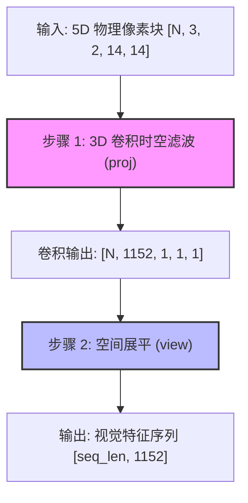

# Conv3d 时空切块器 (VisionPatchEmbed)

## 模块整体说明与架构拆解

时空切块器（`Qwen2_5_VisionPatchEmbed`）是 Qwen2.5-VL 视觉编码器的**神经元入口**。在整个多模态大模型链路中，它承接自 [[qwen2.5_vl_预处理流水线]] 输出的原始像素块，其核心作用是执行**特征提取与时空降采样**：将物理像素信号投影为 Transformer 能够理解的一维高维向量序列（Vision Tokens）。

### 内部架构流转
该模块虽然代码精简，但包含两个关键的物理转换步骤：



### 全局代码调用顺序与流转概览
1. **入口**：由 `Qwen2_5_VisionTransformer` 的 `forward` 方法调用。
2. **转换**：执行 `Qwen2_5_VisionPatchEmbed.forward(hidden_states)`。
3. **衔接**：输出的序列随后与 [[2d_rope_视觉位置编码]] 生成的位置信息结合，送入后续的 `Qwen2_5_VLBlock` 骨干网。

---

## 子模块/步骤详解

### 1. 步骤一：3D 卷积时空滤波 (Tubelet Embedding)

#### 模块说明
这是视觉模型捕获信息的“第一只眼”。相比于 2D 卷积只关注单帧空间，3D 卷积具备“时间感受野”，能够通过**管状切分（Tubelet Embedding）**的思想，在提取空间特征的同时，初步融合连续两帧之间的时间相关性。

#### 逻辑链输入与输出
- **逻辑链（输入）**：`hidden_states` [N, 3, 2, 14, 14] (物理像素值)
- **逻辑链（输出）**：[N, 1152, 1, 1, 1] (局部压缩后的稠密特征)

#### 具体操作逻辑拆解与 Torch 对齐
1. **核盖章 (Sliding Window)**：使用 `out_channels=1152` 个 3D 卷积核。
2. **时空内积**：卷积核在 $3 \times 2 \times 14 \times 14$ 的立方体区域内滑动。
3. **对齐 Stride**：由于 `stride = kernel_size = (2, 14, 14)`，卷积核在时间轴上跳过 2 帧，在空间轴上跳过 14 像素。
   - **物理魔法**：这确保了每一个 Patch 区域被且仅被处理一次，没有重叠，实现了 $2 \times 14 \times 14$ 的**硬性下采样**。

#### 第一性原理与原理解读
*   **为什么要 3D？** 视频的本质是时间的流动。通过 3D 卷积，模型在“看到”一个物体的边缘（空间）时，能顺便捕捉到这个边缘在 2 帧内的位移趋势（时间）。这比先 2D 提特征再做时间融合更具“归纳偏置（Inductive Bias）”优势。
*   **模拟 vs 离散**：这是模型将“模拟像素信号”转换为“离散语义符号”的唯一关口。

#### 核心源码解剖
**代码路径**：`transformers/src/transformers/models/qwen2_5_vl/modeling_qwen2_5_vl.py`

```python
# 初始化 3D 卷积核
kernel_size = [temporal_patch_size, patch_size, patch_size] # [2, 14, 14]
self.proj = nn.Conv3d(
    in_channels,    # 3
    embed_dim,      # 1152
    kernel_size=kernel_size, 
    stride=kernel_size, 
    bias=False      # Qwen2.5-VL 追求极致线性化
)
```

---

### 2. 步骤二：张量展平与序列化

#### 模块说明
Transformer 的输入必须是 `[Token数, 向量维度]`。3D 卷积输出的结果仍然保留着物理维度的影子（1x1x1 的尾部维度），需要通过物理拉平操作，将“块”的概念彻底转化为“序列”的概念。

#### 逻辑链输入与输出
- **逻辑链（输入）**：[N, 1152, 1, 1, 1]
- **逻辑链（输出）**：[N, 1152] (其中 N 为总 Patch 数)

#### 具体操作逻辑拆解与 Torch 对齐
*   **操作**：`hidden_states.view(-1, self.embed_dim)`
*   **物理形变物理意义**：将原本具有 $(C, T, H, W)$ 结构的张量，强行抹除所有空间和时间位置索引，只保留 1152 维的语义信息。
*   **副作用**：这一步之后，模型失去了关于“这个 Patch 在图片的左上角还是右下角”的所有物理坐标信息。因此，后续**必须**衔接 [[2d_rope_视觉位置编码]] 来找回坐标。

#### 核心源码解剖
```python
def forward(self, hidden_states: torch.Tensor) -> torch.Tensor:
    # 强制对齐 5D 输入，应对 Processor 可能的 Padding
    hidden_states = hidden_states.view(-1, 3, 2, 14, 14)
    # 卷积提取 + 物理拉平
    hidden_states = self.proj(hidden_states).view(-1, 1152)
    return hidden_states 
```

---

## 数值计算示例与心算验证

以一个典型的“长图”为例：
1. **输入图片**：$896 \times 448$ 像素，静态图（被 Processor 打包为 $T=2$）。
2. **切块计算**：
   - 空间：$896/14 = 64$，$448/14 = 32$。
   - 总空间 Patch：$64 \times 32 = 2048$。
   - 时间步：$2/2 = 1$。
3. **进入 Conv3d**：输入形状 `[2048, 3, 2, 14, 14]`（其中 2048 是 N 维度，即 Batch * Patch数）。
4. **输出形状**：`[2048, 1152]`。
5. **结论**：这张图最终占据了 LLM 上下文中的 2048 个视觉 Token 位置（未降维前）。

---

## 第一性原理深度对比：视觉 vs 文本

| 维度 | 视觉嵌入 (`Conv3d`) | 文本嵌入 (`nn.Embedding`) |
|------|--------------------|---------------------------|
| **物理本质** | **滤波器 (Filter)** | **字典 (Dictionary)** |
| **信息密度** | 极低（像素冗余极大） | 极高（每个 ID 都是浓缩语义） |
| **归纳偏置** | 强（平移不变性、局部相关性） | 弱（全凭学习位置和上下文） |
| **视野 (Field of View)** | 极小（14x14），看不见全局 | 单个 Token 即代表一个完整概念 |

---

## 参数生命周期与渊源追溯

- **网络结构**：单层 `nn.Conv3d`。
- **参数量**：约 1.35M。
- **渊源追溯**：
  - **设计灵感**：复刻了 ViViT (Video Vision Transformer) 的 Tubelet Embedding 方案。
  - **训练渊源**：该参数在 Stage 0 (CPT) 阶段从头初始化并训练，目的是让卷积核学会识别各种长宽比下的边缘特征。
- **生命周期追踪**：
  - **预训练/中继训练**：全量解冻，作为视觉特征的“开路先锋”。
  - **SFT / 生产环境**：**完全冻结**。在下游微调阶段，为了保证视觉特征的稳定性，不再改动这个物理特征提取层。

---

## 关联概念

- ✅ 支持 [[qwen2.5_vl_三阶段预训练]]：在 Stage 1 开启关键训练。
- 🔄 演化自 ViViT。
- 上游：[[qwen2.5_vl_预处理流水线]]。
- 下游：[[window_attention_交错注意力]] 与 [[2d_rope_视觉位置编码]]。

## 参考来源

- `knowledge_base/raw/万字长文图解Qwen2.5-VL实现细节_猛猿_2025-06-25/`
- `transformers/src/transformers/models/qwen2_5_vl/modeling_qwen2_5_vl.py`
