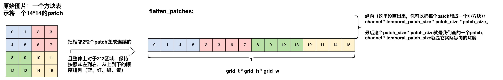
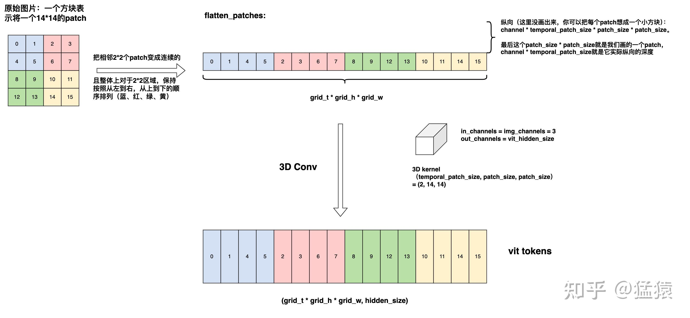
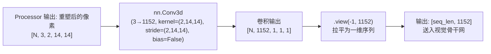

# Conv3d 时空切块器 (VisionPatchEmbed)

## 模块整体说明

时空切块器（`Qwen2_5_VisionPatchEmbed`）是 Qwen2.5-VL 视觉编码器（`Qwen2_5_VisionTransformer`）的**最前端组件**，位于整个视觉流水线的入口。它的职责是将经过 [[navit_动态分辨率]] 预处理后的三维像素立方体（RGB 色彩×时间帧×空间尺寸），切分成互不重叠的小块（Patch），并通过一层 3D 卷积核一步到位地提取高维稠密特征向量。

**直观比喻**：把一大块彩色豆腐（像素立方体：3 色×2 帧×14 高×14 宽）放在一个方形模具（Conv3d 卷积核）上"盖章"。模具一压，一整块 14×14×2 的豆腐就被榨成一滴 1152 维的"浓缩果汁"（特征向量）。模具的步长（stride）等于模具大小，所以每块豆腐只被压一次，互不重叠。

**在全链路中的位置**：这是视觉流水线的第一步可训练结构。其输出直接送给 [[window_attention_交错注意力]] 所在的视觉骨干网进行深层特征提取。

---

## 逻辑链输入与输出

- **逻辑链（输入）**：经 Processor 预处理后，重塑为 5D 物理张量 `[Batch × 块数, 3(RGB通道), 2(时间维), 14(高度维), 14(宽度维)]`。
- **逻辑链（输出）**：一维拉平的视觉特征序列 `[seq_len_vision, 1152(embed_dim)]`。

这 5D 张量在内存中的排布示意如下（注意它是把 2x2 区域内的 4 个 patch 变成连续的，为后续的合并做准备）：


其中 `seq_len_vision` 等于所有图像/视频切出来的 Patch 总数。

---

## 核心算法原理详解

### 1. 为什么用 3D 卷积而不是 2D 卷积？

**来龙去脉**：Qwen2.5-VL 不仅支持静态图片，还支持视频。视频在时间维度上有多帧连续画面。如果用 2D 卷积，每一帧独立处理，无法在最底层就融合帧间的时间信息。

3D 卷积的卷积核形状为 `(temporal_patch_size, patch_size, patch_size) = (2, 14, 14)`，其中 `temporal_patch_size=2` 意味着**每 2 帧合并为 1 个时间步**，实现了 2× 的时间降采样。这一设计灵感源自 ViViT（Video Vision Transformer）的管状切分（Tubelet Embedding）。

**Conv3d 执行示意图**：相当于拿 out_channels（1152）个 3D kernel，每个 kernel 都在所有 patch 方块上滚一遍：


### 2. 卷积参数详解

| 参数 | 值 | 含义 |
|------|-----|------|
| `in_channels` | 3 | RGB 三通道输入 |
| `out_channels` | 1152 | 输出嵌入维度（视觉编码器的 hidden_size） |
| `kernel_size` | `(2, 14, 14)` | 时间方向看 2 帧，空间方向看 14×14 像素 |
| `stride` | `(2, 14, 14)` | 步长等于核大小，保证 Patch 之间无重叠 |
| `bias` | **False** | Qwen2.5-VL 中无偏置 |

**为什么 `bias=False`？** 这是 Qwen2.5-VL 的设计选择。但在 Qwen3-VL 中被改为 `bias=True`，原因是 Qwen3-VL 的预训练数据量和模态复杂度极度膨胀，模型需要在输入层就能拟合不同传感器、不同光照条件下像素的"本底直流偏移（DC Offset）"。

### 3. 数值计算示例

假设输入一张 420×420 的静态图片（单帧，视为 `T=2` 即填充到 2 帧）：

1. 空间切分：$420 / 14 = 30$ 个 Patch（每个方向）
2. 时间切分：$2 / 2 = 1$ 个时间步
3. 总 Patch 数：$30 \times 30 \times 1 = 900$
4. Conv3d 输入：`[900, 3, 2, 14, 14]`
5. Conv3d 输出：`[900, 1152, 1, 1, 1]` → `.view(-1, 1152)` → `[900, 1152]`

所以这张图产生 900 个 1152 维的视觉 Token。

### 可训练参数与渊源追溯

- **网络结构**：单层三维卷积 `nn.Conv3d`。
- **参数量**：$3 \times 1152 \times 2 \times 14 \times 14 = 1,354,752 ≈ 1.35M$ 参数（这是第一层的量，整个 ViT 约为 675M）。
- **参数渊源追溯**：
  - Qwen2.5-VL 并没有直接拿开源的 CLIP ViT 来用，而是**重新从头训练了一版 675M 参数量的 ViT**。它在标准的 ViT 基础上融合了 NaViT 动态分辨率和 2D-RoPE。
  - 在正式接入 LLM 前，这个 ViT 经历了 Stage 0（也称 CPT，继续预训练），使用大量图像和数据专门拓展其在动态分辨率下的基础特征提取能力。
- **生命周期追踪 (训练状态)**：
  - Stage 1（ViT + PatchMerger 训练）：**解冻微调**，随 ViT 一起训练。
  - Stage 2/3（全模型联合训练）：**解冻微调**，全量参数参与。
  - SFT/DPO（指令与偏好微调阶段）：**冻结**（ViT 整体被锁定，只调优 LLM 逻辑）。详见 [[qwen2.5_vl_三阶段预训练]]。

### 4. 视觉嵌入与文本嵌入的深度对比（第一性原理）

虽然都是 Embedding（将输入转换为高维向量），但两者的物理本质和学习目标截然不同：

| 维度 | 视觉嵌入 (`Conv3d`) | 文本嵌入 (`nn.Embedding`) |
|------|--------------------|---------------------------|
| **输入对象** | 连续的物理模拟信号（RGB 像素矩阵） | 离散的、人为定义的人造符号 ID |
| **工作原理** | **滤波与特征提取**。卷积核通过滑动窗口，在局部区域内进行加权求和（内积）。 | **查表映射**（Dictionary Lookup）。直接用 ID 当索引，从权重矩阵里抽出一行。 |
| **训出的是啥** | 训出了一组**物理滤波器**（如边缘检测器、色彩斑块检测器），它认识自然界的纹理和形状。 | 训出了一本**语义字典**，它认识人类定义的语法、同义词和上下文。 |
| **局部局限性** | 它的视野（感受野）永远受限于卷积核大小（14×14），它**看不到**画面的另一半。因此**绝对不能只用这一层代替 ViT**，必须要有后面的多层 Transformer 进行全局信息交互。 | 一个字就是一个独立的完整概念，它自身就带有全量的初始语义。 |

**与后续 LLM 的关系**：
不管是底层提取出的视觉特征，还是查表得出的文本特征，它们在各自的模块（ViT 骨干、语言基座）里加工后，最终视觉特征会经过 [[patchmerger_空间降维]] 被对齐到大模型的 4096 维字典空间，伪装成一种特殊的“外语单词”，填入 `<|image_pad|>` 占位符，从而让 LLM 能够“同台竞技”地理解它们。

---

## 架构与代码流程图



---

## 源码逐行解剖

**代码路径**：`transformers/src/transformers/models/qwen2_5_vl/modeling_qwen2_5_vl.py`

```python
class Qwen2_5_VisionPatchEmbed(nn.Module):
    def __init__(self, patch_size=14, temporal_patch_size=2, in_channels=3, embed_dim=1152):
        super().__init__()
        kernel_size = [temporal_patch_size, patch_size, patch_size]  # [2, 14, 14]
        # 可训练神经元结构：3D 卷积提取特征，无偏置
        self.proj = nn.Conv3d(
            in_channels,    # 3 (RGB)
            embed_dim,      # 1152 (输出维度)
            kernel_size=kernel_size,  # (2, 14, 14)
            stride=kernel_size,       # 步长等于核大小，无重叠
            bias=False                # Qwen2.5-VL 无偏置
        )

    def forward(self, hidden_states: torch.Tensor) -> torch.Tensor:
        # 输入 hidden_states 是 Processor 已经切好的像素块
        # 先 view 成标准的 5D 格式：[总块数, 3, 2, 14, 14]
        hidden_states = hidden_states.view(-1, 3, 2, 14, 14)
        # Conv3d 前向：[N, 3, 2, 14, 14] → [N, 1152, 1, 1, 1]
        # .view(-1, 1152) 抛弃空间坐标，拉平为一维序列
        hidden_states = self.proj(hidden_states).view(-1, 1152)
        return hidden_states  # 输出: [seq_len_vision, 1152]
```

---

## 版本演化对比

| 版本 | Conv3d bias | 其他变化 |
|------|-----------|---------|
| Qwen2-VL | `bias=False` | 与 Qwen2.5-VL 相同 |
| **Qwen2.5-VL** | **`bias=False`** | 标准配置 |
| Qwen3-VL | **`bias=True`** | 开启偏置对抗 DC Offset |
| Qwen3.5 | `bias=True` | 沿用 Qwen3-VL |

---

## 关联概念

- ✅ 支持 [[qwen2.5_vl_技术报告解析]]：视觉编码器的入口第一层。
- 🔄 演化自 ViViT 管状切分（Tubelet Embedding）思想。
- 上游依赖：[[navit_动态分辨率]] 提供动态网格划分后的像素块。
- 下游输出：送给 [[window_attention_交错注意力]] 所在的视觉骨干网进行多层特征提取。
- 最终经过 [[patchmerger_空间降维]] 压缩后送入 LLM。

## 参考来源

- 原始资料：`knowledge_base/Qwen2.5-VL/Qwen2.5-VL.md`
- 学习指南：`knowledge_base/Qwen_Architecture_Guides/qwen_learning_guide_phase1.md`
