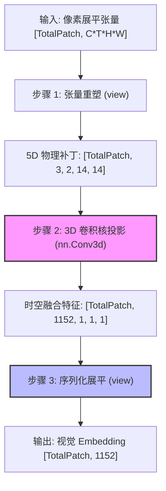

# Conv3d 时空切块器 (VisionPatchEmbed)

## 模块整体说明与架构拆解

时空切块器（`Qwen2_5_VisionPatchEmbed`）是 Qwen2.5-VL 视觉编码器的**神经元入口**。在整个多模态大模型链路中，它承接自 [[qwen2.5_vl_预处理流水线]] 输出的原始像素块。

其核心作用是执行**特征提取与初级时空压缩**：通过 **Tubelet Embedding**（管状嵌入）技术，将物理层面的像素信号投影为 Transformer 能够处理的一维高维向量序列（Vision Tokens）。

### 内部架构流转
不同于传统 ViT 在整图上滑动卷积，Qwen2.5-VL 由于采用了 [[navit_动态分辨率]] 的 Packing 策略，Processor 已经预先将图像/视频切分成了独立的物理块。因此，这里的 Conv3D 实际上是**逐 Patch 并行投影**。



### 全局代码调用顺序与流转概览
1.  **数据来源**：接收来自 `Processor` 产生的 `pixel_values`，此时 Patch 顺序已按 **2×2 空间邻域连续性**排列。
2.  **入口**：在 `Qwen2_5_VisionTransformerPretrainedModel.forward`（约 468 行）被首个调用。
3.  **计算**：执行 `patch_embed(hidden_states)`，将 $3 \times 2 \times 14 \times 14$ 的时空像素块压缩为 1152 维的向量。
4.  **后续衔接**：输出的 `hidden_states` 随后与 [[2d_rope_视觉位置编码]] 进行逐元素相加/旋转，正式进入 `VisionBlock` 骨干网络。

---

## 子模块/步骤详解

### 1. 步骤一：3D 卷积时空滤波 (Tubelet Embedding)

#### 模块说明
这是视觉模型捕捉信息的“第一只眼”。Qwen2.5-VL 抛弃了 2D 卷积，采用 3D 卷积核（Tubelet）。
*   **Tubelet 思想**：不再只看单帧的“平面”，而是看一个包含两帧深度的“管状区域”。
*   **初级运动感知**：在第一层特征提取时，卷积核就能捕捉到像素在两帧之间的微小位移（运动光流），这比 2D 卷积后再做时间建模更具**归纳偏置（Inductive Bias）**优势。

#### 逻辑链输入与输出
- **逻辑链（输入）**：`hidden_states` [TotalPatch, 3, 2, 14, 14]
- **逻辑链（输出）**：[TotalPatch, 1152, 1, 1, 1]

#### 具体操作逻辑拆解与 Torch 对齐
1.  **核盖章 (Filter)**：初始化 `out_channels=1152` 个 3D 卷积核。
2.  **满窗投影**：由于卷积核尺寸 `kernel_size=(2, 14, 14)` 恰好等于输入 Patch 的 `(T, H, W)` 尺寸，且 `stride` 也等于该尺寸。
3.  **物理意义**：这相当于对每一个 $2 \times 14 \times 14$ 的物理补丁做了一次加权全连接投影。每个卷积核产生一个标量，1152 个核产生一个 1152 维的向量。

#### 第一性原理与原理解读
*   **为什么不直接用 Linear 层？** 理论上对展平的 $3 \times 2 \times 14 \times 14$ 像素做 Linear 效果一致，但使用 `Conv3d` 能够保留卷积权重的空间局部性初始化策略（如 Xavier/Kaiming），且在代码表达上与视频理解论文（如 ViViT）保持语义一致。
*   **静态图退化**：对于静态图，由于预处理时复制了帧（[img, img]），3D 卷积在时间维度的权重会学到一种“等值映射”，自动退化为 2D 空间特征提取。
*   **卷积的归纳偏置 (Inductive Bias)**：卷积操作通过滑动窗口（Kernel）局部感知信号，天然具备平移不变性。相较于 Attention 的全局平方级开销，卷积能在初期以极低成本高效提炼边缘、角点及初级光流。
*   **卷积输出尺寸的统一计算法则**：
    无论是 1D、2D 还是 3D 卷积，其任意一维（长度 $L$、高度 $H$、宽度 $W$ 或深度 $D$）的输出尺寸计算都严格遵循以下下取整公式：
    $$ Output\_Size = \left\lfloor \frac{Input\_Size + 2 \times Padding - Dilation \times (Kernel\_Size - 1) - 1}{Stride} \right\rfloor + 1 $$
    在 Qwen2.5-VL 的时空切块器中，采用的是**无重叠、无填充**的极端特例：`Stride == Kernel_Size` 且 `Padding == 0, Dilation == 1`。因此，公式退化为极其暴力的块划分：$Output\_Size = Input\_Size / Kernel\_Size$。

#### 核心源码解剖
**文件路径**：`transformers/src/transformers/models/qwen2_5_vl/modeling_qwen2_5_vl.py`
```python
# 初始化：kernel_size == stride，实现无重叠切块
kernel_size = [temporal_patch_size, patch_size, patch_size] # [2, 14, 14]
self.proj = nn.Conv3d(
    in_channels,    # 3 (RGB)
    embed_dim,      # 1152
    kernel_size=kernel_size, 
    stride=kernel_size, 
    bias=False      # 追求极致线性度
)

# 前向传播
def forward(self, hidden_states: torch.Tensor) -> torch.Tensor:
    # 1. 重塑为 5D 物理补丁形态
    hidden_states = hidden_states.view(
        -1, self.in_channels, self.temporal_patch_size, self.patch_size, self.patch_size
    )
    # 2. 卷积核在 5D 张量上“盖章”
    # 输出 shape: [TotalPatch, 1152, 1, 1, 1]
    hidden_states = self.proj(hidden_states.to(dtype=target_dtype))
    ...
```

---

### 2. 步骤二：张量展平与序列化

#### 模块说明
Transformer 基座本质上是处理一维序列的。卷积输出的 5D 张量末尾带有三个 `1`（T, H, W 被卷没了），需要物理展平，将“空间块”彻底转变为“Token 符号”。

#### 逻辑链输入与输出
- **逻辑链（输入）**：[TotalPatch, 1152, 1, 1, 1]
- **逻辑链（输出）**：[TotalPatch, 1152]

#### 具体操作逻辑拆解
*   **语义抹除**：这一步通过 `.view(-1, 1152)` 操作，将像素间的原始几何拓扑关系抹除。
*   **后果**：此时的 Embedding 只包含“这里有什么（语义）”，而完全丢失了“这里在哪（位置）”。
*   **补偿机制**：因此，本模块之后**必须**紧跟 [[2d_rope_视觉位置编码]]，根据预处理传下来的 `grid_thw` 找回每一个 Token 的 3D 坐标并刻印位置信息。

#### 核心代码
```python
# 将卷出的特征向量从物理网格中解放出来，变成离散 Token 序列
hidden_states = hidden_states.view(-1, self.embed_dim)
```

---

## 极其关键的细节：2×2 空间邻域连续性

在 Conv3d 输出的 `TotalPatch` 维度中，Patch 的排列顺序**不是**简单的“自左向右、自上而下”。
为了配合后续 [[patchmerger_空间降维]] 的 2×2 合并操作，Processor 在生成输入时，特意调整了排列逻辑：
**它确保在 `pixel_values` 的一维序列中，物理空间上相邻的 2×2（四个）Patch 是紧挨着的。**

*   **目的**：让 `PatchMerger` 只需要做简单的 `view` 就能完成空间重组，无需复杂的 `gather` 或索引操作，极大地提升了推理效率。

---

## 数值计算示例

假设输入一张 $112 \times 112$ 的缩略图，静态模式：
1.  **预处理**：产生 $T=2, H=112, W=112$。
2.  **切块数计算**：
    *   $T\_grid = 2 / 2 = 1$
    *   $H\_grid = 112 / 14 = 8$
    *   $W\_grid = 112 / 14 = 8$
    *   总 Patch 数 $N = 1 \times 8 \times 8 = 64$。
3.  **Conv3d 输入**：`[64, 3, 2, 14, 14]`。
4.  **Conv3d 权重**：`[1152, 3, 2, 14, 14]`。
5.  **输出结果**：`[64, 1152]`。
6.  **结论**：该图在进入骨干网前，转化为 64 个 1152 维的 Token。

---

## 第一性原理深度对比：视觉 vs 文本

| 维度 | 视觉嵌入 (`Conv3d`) | 文本嵌入 (`nn.Embedding`) |
| :--- | :--- | :--- |
| **数学物理本质** | **局部滤波器 (Filter)** | **全局查找表 (Lookup Table)** |
| **信息密度** | 极低（像素间冗余度极高） | 极高（每个 ID 对应一个完整词义） |
| **归纳偏置** | 强（利用空间局部相关性） | 弱（全凭上下文学习语义） |
| **参数共享** | 卷积核在所有 Patch 上共享，参数量小 | 词表庞大，每个词有独立参数 |
| **视野 (FOV)** | 极小（仅 14x14），看不见全局 | 全局（Token 即代表抽象概念） |

---

## 参数生命周期与渊源追溯

*   **参数量**：1152 (Dim) * 3 (RGB) * 2 (T) * 14 (H) * 14 (W) ≈ **1.35M**。
*   **设计渊源**：设计理念源自 **ViViT (Video Vision Transformer)**，是实现时空统一建模的工业级最优解。
*   **训练生命周期**：
    *   **Stage 0 (数据筛选与冷启动)**：从随机初始化开始，配合大规模 (Image, Text) 对做对比学习训练，让卷积核对几何线条、色彩纹理产生敏感性。
    *   **Stage 1 (原生分辨率预训练)**：作为视觉特征提取的“基石层”，参与 4 万亿 Token 的全量训练。
    *   **Stage 3 (长上下文/SFT)**：通常会被**冻结 (Frozen)**。因为底层的像素提取逻辑在预训练后已足够通用，微调阶段主要训练后端的逻辑理解（LLM）和跨模态对齐（PatchMerger）。

---

## 关联概念

- [[navit_动态分辨率]]：决定了输入 Patch 的非对称 Packing 组织方式。
- [[qwen2.5_vl_预处理流水线]]：上游模块，负责将原始图像揉捏成本模块需要的 5D 张量。
- [[2d_rope_视觉位置编码]]：下游模块，负责在本模块展平后找回几何坐标。
- [[patchmerger_空间降维]]：下游模块，利用本模块输出的 2×2 连续性进行 4 倍降采样。

## 参考来源
- `knowledge_base/raw/万字长文图解Qwen2.5-VL实现细节_猛猿_2025-06-25/index.md`
- `transformers/src/transformers/models/qwen2_5_vl/modeling_qwen2_5_vl.py`
- 论文：*ViViT: A Video Vision Transformer* (arXiv:2103.15691)
