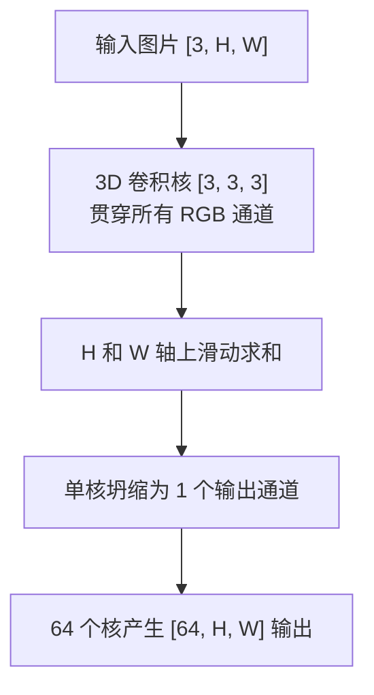
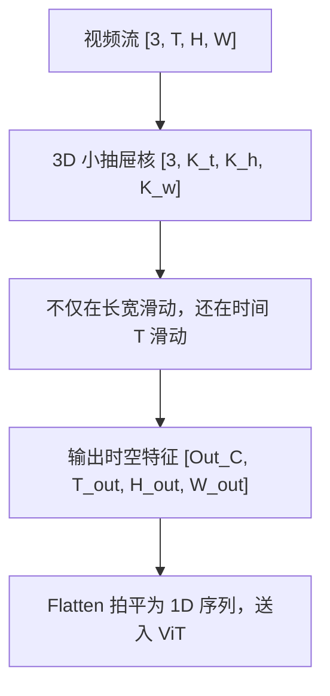

# 卷积家族原理 (1D / 2D / 3D)

卷积（Convolution）是提取局部特征的基石算法。无论是处理音频（1D）、图像（2D）还是视频时空切块（3D），其核心数学原理都是“滑动窗口”。

---

## 子模块详解

### 1. 1D 卷积 (Conv1D)

#### 模块说明
Conv1D 是最基础的卷积。通常用于处理序列数据，如时间序列（音频信号、股票价格）或一维文本的词嵌入序列。它的核心思想是一个“一维的观察窗口”沿着时间线或序列方向滑动。
**直观比喻 (天气预报员)**：假设你想预测今天的气温。你不是只看今天的数据，而是看过去 3 天的气温（窗口大小 $K=3$）。你给昨天更高的权重，前天较低的权重。你带着这个 $1 \times 3$ 的权重模板，每一天都“套”在过去 3 天的数据上算出一个综合值，这就是 1D 卷积。

#### 逻辑链输入与输出
- **输入**：`[Batch_Size, In_Channels, L_in]`。其中 `L_in` 是序列长度。
- **输出**：`[Batch_Size, Out_Channels, L_out]`。

#### 具体操作逻辑拆解与 Torch 对齐
1. **Unfold (展平)**：卷积在底层并不是真的在滑动。在 GPU 中，PyTorch 会先调用 `Unfold` 算子，把所有会被同一个卷积核扫到的窗口数据，提前复制并“拉直”成一个巨大的矩阵。
2. **MatMul (矩阵乘法)**：将拉直的数据矩阵与同样拉直的卷积核权重矩阵进行一次高效的 $O(1)$ 矩阵乘法。
3. **Fold (折叠)**：将乘法结果重新折叠回预期的输出形状。

#### 第一性原理与原理解读
为什么要有卷积核大小（Kernel Size, $K$）、步长（Stride, $S$）和填充（Padding, $P$）？
$K$ 决定了感受野（能看多远）；$S$ 决定了下采样率（跳着看能缩小分辨率）；$P$ 是为了防止边缘信息在滑动中丢失，在边缘补 0。

#### 公式推导与张量跟踪
**输出长度推导公式**：
$$ L_{out} = \left\lfloor \frac{L_{in} + 2P - D(K-1) - 1}{S} \right\rfloor + 1 $$
*(其中 D 为膨胀率 Dilation，通常为 1)*

**张量跟踪**：
假设输入 `x` 形状为 `[1, 3, 10]` (1 个样本, 3 个通道, 长度 10)。
定义 `Conv1d(in_channels=3, out_channels=16, kernel_size=3, stride=1, padding=1)`。
- Padding 1 后，长度变为 12。
- 窗口 3，步长 1，滑动次数为 $(12 - 3)/1 + 1 = 10$。
- 输出张量形状为 `[1, 16, 10]`。

#### 核心源码解剖
```python
import torch
import torch.nn as nn

# 实例化 1D 卷积
conv1d = nn.Conv1d(in_channels=3, out_channels=16, kernel_size=3, stride=1, padding=1)
x = torch.randn(1, 3, 10)  # [B, C_in, L]

# 正向传播
out = conv1d(x)
print(out.shape)  # 输出: torch.Size([1, 16, 10])

# ================= 底层原理 (Unfold + MatMul) =================
# 在 PyTorch 底层，它等价于：
# 1. 权重拉直: [16, 3*3]
weight_flat = conv1d.weight.view(16, -1)
# 2. x 展平: 取出 10 个滑动窗口，每个窗口大小为 3*3=9 -> [1, 9, 10]
x_unf = nn.functional.unfold(x.unsqueeze(-1), kernel_size=(3, 1), padding=(1, 0)).squeeze(-1)
# 3. 矩阵相乘并加上 bias
out_manual = (weight_flat @ x_unf) + conv1d.bias.view(-1, 1)
# out_manual 和 out 的数值完全相等
```

#### 图表辅助


---

### 2. 2D 卷积 (Conv2D)

#### 模块说明
这是深度学习中最著名的算子，用于图像处理。它的窗口是二维的（$K_H \times K_W$），在图像的宽度和高度方向上同时滑动。
**直观比喻**：就像你拿着一个手电筒（卷积核），在黑夜里看一幅壁画（图像）。手电筒每次只能照亮一块方形区域。你从左到右、从上到下扫过整幅画，每扫到一个地方，就记录下这块区域的光影特征。

#### 逻辑链输入与输出
- **输入**：`[Batch_Size, In_Channels, H, W]`
- **输出**：`[Batch_Size, Out_Channels, H_out, W_out]`

#### 具体操作逻辑拆解与 Torch 对齐
与 1D 卷积极其类似，但有一个**核心误区**：很多人以为 2D 卷积的核是 2 维的，错！**2D 卷积的核实际上是 3 维的立方体**。它的形状是 `[In_Channels, K_H, K_W]`。在每一次滑动时，它会穿透**所有**输入通道（比如 RGB 3 个通道），将提取到的所有特征相加（Collapse），坍缩成输出通道上的**1 个标量点**。

#### 第一性原理与原理解读
为什么 2D 卷积能提取图像特征？因为图像在空间上具有“局部相关性”。相邻的像素往往属于同一个物体。2D 卷积强迫网络去学习这种局部的空间模式（例如，某个核可能变成了一个水平边缘检测器，另一个变成了垂直边缘检测器）。

#### 公式推导与张量跟踪
**输出宽高公式**：
$$ H_{out} = \left\lfloor \frac{H_{in} + 2P_H - D_H(K_H-1) - 1}{S_H} \right\rfloor + 1 $$
$$ W_{out} = \left\lfloor \frac{W_{in} + 2P_W - D_W(K_W-1) - 1}{S_W} \right\rfloor + 1 $$

**张量跟踪**：
输入 `x` `[1, 3, 224, 224]`。
`Conv2d(in_channels=3, out_channels=64, kernel_size=3, padding=1)`。
核形状为 `[64, 3, 3, 3]`。滑动时产生 `[1, 64, 224, 224]` 的特征图。

#### 核心源码解剖
```python
# 实例化 2D 卷积
conv2d = nn.Conv2d(in_channels=3, out_channels=64, kernel_size=3, padding=1)

# 注意核的实际形状！是 4 维张量：[Out_C, In_C, H, W]
print(conv2d.weight.shape) # torch.Size([64, 3, 3, 3])

x = torch.randn(1, 3, 224, 224)
out = conv2d(x)
print(out.shape) # torch.Size([1, 64, 224, 224])
```

#### 图表辅助


---

### 3. 3D 卷积 (Conv3D)

#### 模块说明
3D 卷积是多模态时代（特别是视频理解和医疗影像 CT）的霸主。它在 2D 的基础上，增加了一个**时间（深度）维度 $T$**。
**直观比喻 (时空隧道)**：2D 卷积是在一张静态照片上滑动。而 3D 卷积的核变成了一个“小抽屉”（具有深度）。当你处理一段视频时，这个小抽屉不仅在屏幕的上下左右滑动，还**顺着时间轴（帧）滑动**。因此，它能够同时捕捉到物体的“长相（空间特征）”和“运动轨迹（时间特征）”。

#### 逻辑链输入与输出
- **输入**：`[Batch_Size, In_Channels, T, H, W]`（5D 张量）。
- **输出**：`[Batch_Size, Out_Channels, T_out, H_out, W_out]`。

#### 具体操作逻辑拆解与 Torch 对齐
Qwen2.5-VL / Qwen3.5 中的时空切块器 `VisionPatchEmbed` 就是典型的 3D 卷积。它需要将原视频在时间、高度、宽度三个维度上分别进行切块压缩（即 $T$、$H$、$W$ 的 Stride 不同）。

#### 第一性原理与原理解读
为什么不把视频的每一帧当成单独的图像丢给 2D 卷积？如果这样做，模型就只认识“静态的画面”，不知道前后帧的逻辑关系（例如“挥手”这个动作）。3D 卷积的核跨越了多帧，内积操作直接融合了连续几帧的变化量，从而原生支持了动作与时序理解。

#### 公式推导与张量跟踪
**张量跟踪 (以 Qwen 的时空切块为例)**：
假设输入了一段经过 NaViT 动态打包的 5D 张量 `[1, 3, 4, 14, 14]`（1个样本，RGB 3通道，时间 4 帧，高 14，宽 14）。
我们定义一个核大小为 `(2, 14, 14)` 的 Conv3D 算子，步长为 `(2, 14, 14)`。
- 时间维度上：$(4 - 2)/2 + 1 = 2$
- 空间维度上：$(14 - 14)/14 + 1 = 1$
最终输出形状将坍缩为 `[1, 1152, 2, 1, 1]`。随后这个张量会被 `.flatten(2)` 拉平成一维序列 `[1, 1152, 2]`，再转置为 `[1, 2, 1152]` 送入 Transformer。

#### 核心源码解剖
```python
# 截取自 Qwen3_5VisionPatchEmbed 的时空切块原理
class VisionPatchEmbed3D(nn.Module):
    def __init__(self, in_channels=3, embed_dim=1152, patch_size=(2, 14, 14)):
        super().__init__()
        # 核心算子：利用 Conv3D 进行切块
        # kernel_size 和 stride 相等，意味着无重叠滑动
        self.proj = nn.Conv3d(
            in_channels, 
            embed_dim, 
            kernel_size=patch_size, 
            stride=patch_size, 
            bias=False
        )

    def forward(self, pixel_values):
        # 逻辑链输入: [Batch, 3, 4, 14, 14]
        # x 形状: [Batch, 1152, 2, 1, 1]
        x = self.proj(pixel_values)
        
        # 展平 T, H, W 三个维度
        # x 形状: [Batch, 1152, 2]
        x = x.flatten(2)
        
        # 交换通道与序列维度，准备送入 LLM
        # 逻辑链输出: [Batch, 2, 1152]
        return x.transpose(1, 2)
```

#### 图表辅助
