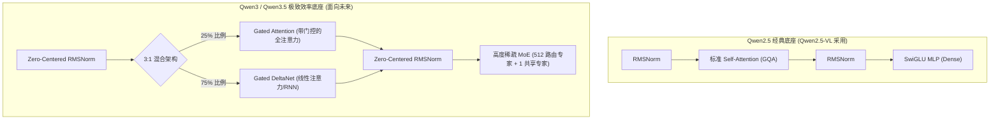

# LLM Backbone 大语言模型基座演进

## 模块整体说明与架构拆解

在多模态大模型（VLM）中，视觉编码器（ViT）负责提取图像特征，而大语言模型基座（LLM Backbone）则是整个系统的“大脑”，负责进行**逻辑推理、常识问答和最终的文本解码输出**。

Qwen2.5-VL 采用的是标准的 Qwen2.5 Dense（稠密）模型架构。但随着技术的演进，Qwen 团队在后续的 Qwen3 和 Qwen3.5 中引入了极其激进的架构创新（如 Gated Attention、Gated DeltaNet 线性注意力、高度稀疏的 MoE 等），以解决长文本上下文的算力瓶颈。

### 架构演进流转图示
了解底座的演进，对于理解多模态大模型的推理能力至关重要。



## 核心算法原理详解：从 Qwen2.5 到 Qwen3.5

多模态大语言模型的核心是语言推理能力。下面我们由浅入深，拆解 LLM 基座中的核心技术。

### 1. Qwen2.5 经典底座核心组件 (Qwen2.5-VL 的引擎)

Qwen2.5-VL 的 LLM 部分是一个基于 Transformer Decoder-only 的稠密网络。它的特征包括：
*   **GQA (Grouped-Query Attention)**：为了减少推理时的 KV Cache 显存占用，不再是每个 Q 头对应一个 K/V 头，而是多个 Q 头共享一组 K/V 头。
*   **SwiGLU 激活函数**：代替了传统的 ReLU/GELU，通过一个门控网络（Gate）对隐藏层通道进行过滤。
*   **RMSNorm**：仅利用方差进行归一化，抛弃了均值平移，提升了计算效率。

在多模态融合时，视觉特征在经过 `PatchMerger` 降维后，伪装成了 4096 维的文本 Token，填入到 `<|image_pad|>` 的位置，随后通过底座逐层自回归解码。

### 2. Qwen3.5 革命性创新一：Zero-Centered RMSNorm

在 Qwen3-Next / Qwen3.5 中，标准的 RMSNorm 被替换为了**零中心化 (Zero-Centered) RMSNorm**。

*   **传统 RMSNorm 公式**：$y = \frac{x}{\text{RMS}(x)} \cdot w$。其中 $w$ 初始值为 1。
*   **Zero-Centered RMSNorm 公式**：$y = \frac{x}{\text{RMS}(x)} \cdot (1 + w)$。其中 $w$ 初始值为 0。
*   **物理意义**：通过让可学习参数 $w$ 从 0 开始初始化，模型在训练初期表现出完美的**恒等映射（Identity Mapping）**。这解决了原始 QK-norm 中部分权重出现异常放大的不稳定现象，让训练更加平滑。

### 3. Qwen3.5 革命性创新二：Gated DeltaNet (线性注意力)

为了解决极长序列（例如 256K 超长文本或几十分钟的视频）带来的 $O(N^2)$ 注意力计算瓶颈，Qwen3.5 大量引入了线性注意力（Linear Attention）—— **Gated DeltaNet**。在 48 层的网络中，它与全注意力按照 3:1 的比例混合。

**核心机制：用 RNN 的记忆矩阵取代 KV Cache**
*   **传统的 Self-Attention**：需要保留过去所有 Token 的 $K$ 和 $V$。对于第 $T$ 个 Token，计算量是 $O(T)$。
*   **Gated DeltaNet**：维护一个固定大小的“记忆状态矩阵 $S$”。新 Token 的信息通过“增量规则（Delta Rule）”吸收到 $S$ 中，旧的无关信息通过“衰减因子（Decay, $g$）”被遗忘。
*   **数学公式**：
    $$ S_t = \lambda_t S_{t-1} + \beta_t k_t (v_t - S_{t-1}^T k_t)^T $$
    $$ o_t = S_t^T q_t $$
    其中 $\lambda_t$ 是遗忘门控，$\beta_t$ 是输入门控。
*   **物理意义**：推理时（Decoding 阶段），不论前面输入了多少图像或文本，模型只需要维护这个恒定大小的 $S$ 矩阵，计算复杂度从 $O(N^2)$ 骤降到 $O(N)$。

### 4. Qwen3.5 革命性创新三：Gated Attention 与高度稀疏 MoE

除了线性注意力，Qwen3.5 在保留的少数全注意力层（Full Attention）和前馈网络（FFN）中也做了彻底的改造。

*   **Gated Attention**：
    在 Attention 输出最终结果并乘以 $W_O$ 投影矩阵之前，利用当前 Token 的输入状态计算出一个门控向量 $z$，对注意力结果进行 Sigmoid 过滤：
    `attn_output = attn_output * torch.sigmoid(gate)`
    这使得模型能够动态控制“我当前到底要不要采纳 Attention 融合过来的全局上下文”。
*   **高度稀疏的 MoE (Mixture of Experts)**：
    Qwen3.5 拥有高达 397B 的总参数，但每次推理（每个 Token）仅激活约 17B 参数！
    *   **512 个路由专家**：每个 Token 经过 Router 只挑选出 Top-10 的专家进行计算。
    *   **1 个共享专家 (Shared Expert)**：所有 Token 都必须经过这个基础全连接层，以保障通用基础知识的稳定。但即便如此，也使用了一个 `sigmoid(shared_gate)` 进行门限控制，做到了极致的精细化计算。

## 核心源码解剖 (Gated DeltaNet 的状态更新)

**代码路径**：`transformers/src/transformers/models/qwen3_next/modeling_qwen3_next.py`

在流式推理（Decoding）阶段，Gated DeltaNet 完全化身为 RNN：

```python
def torch_recurrent_gated_delta_rule(...):
    # ... 省略初始化 ...
    for i in range(sequence_length):
        q_t, k_t, v_t = query[:, :, i], key[:, :, i], value[:, :, i]
        
        # 1. 记忆衰减：g_t 为基于输入算出的衰减系数
        last_recurrent_state = last_recurrent_state * g_t
        
        # 2. 计算当前输入 v_t 与历史预测的误差 Delta
        kv_mem = (last_recurrent_state * k_t.unsqueeze(-1)).sum(dim=-2)
        delta = (v_t - kv_mem) * beta_t
        
        # 3. 记忆更新：将新的 Delta 信息刻印到矩阵中
        last_recurrent_state = last_recurrent_state + k_t.unsqueeze(-1) * delta.unsqueeze(-2)
        
        # 4. 查询输出：Q 去读取更新后的记忆矩阵
        core_attn_out[:, :, i] = (last_recurrent_state * q_t.unsqueeze(-1)).sum(dim=-2)
        
    return core_attn_out, last_recurrent_state
```

## 质量自我审查与准出标准

1.  **架构区分清晰了吗？**：能够明确回答出 Qwen2.5-VL 的 LLM 是 Dense Transformer，而未来多模态（如 Qwen3-VL/Qwen3.5）的趋势是走向 Linear Attention + MoE 混合。
2.  **瓶颈突破懂了吗？**：能解释清楚 Gated DeltaNet 是如何用一个状态矩阵 $S$ 替代无限增长的 KV Cache 的。
3.  **零中心初始化懂了吗？**：理解 Zero-Centered RMSNorm 公式中 $(1+w)$ 对于训练初期恒等映射的意义。

## 关联概念
- 🔙 接收前置处理：[[patchmerger_空间降维]] (将视觉特征送入 LLM)
- 🤝 同级空间赋权：[[mrope_多模态位置编码]] (在 Attention 中注入空间位置)
- 🤝 激活函数参考：[[swiglu_门控激活函数]]