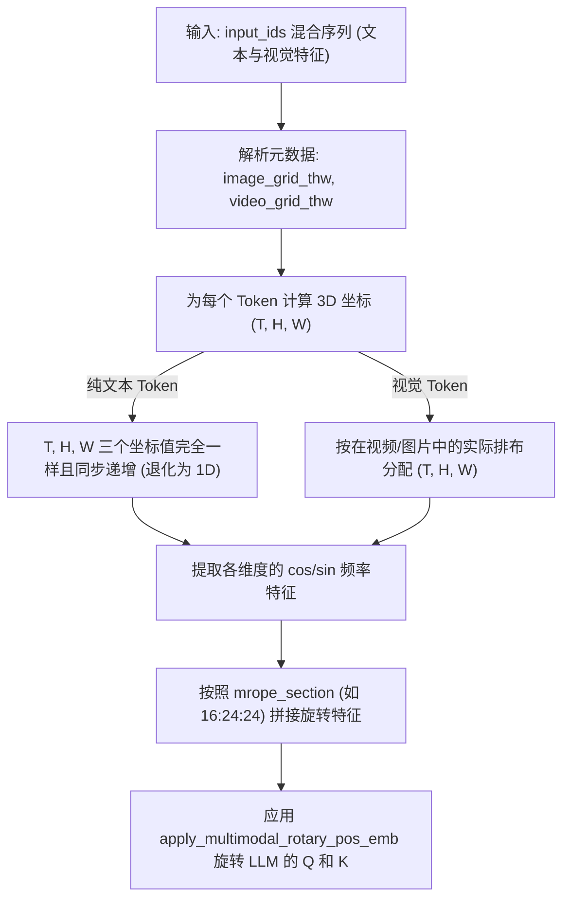

# MRoPE 多模态位置编码 (Multimodal Rotary Positional Embedding)

## 模块整体说明与架构拆解

MRoPE (M-RoPE) 是 Qwen 团队为多模态大语言模型（LLM Backbone 端）量身定制的三维位置编码方案。
**解决的核心痛点**：传统的 LLM 只有 1D RoPE，无法区分输入 Token 到底是一段文本，还是一张图片的局部，亦或是视频的某一帧。通过 MRoPE，模型在一个统一的向量空间内，同时感知到了空间结构的二维拓扑与时间流动的三维因果。

### 演化路径：从 1D 到 3D
MRoPE 的诞生并非凭空出现，它是随着模态复杂度的增加一步步演化而来的：
1. **1D-RoPE（纯文本）**：只关心 Token 的先后顺序，`head_dim` 的所有维度都用来编码一个单一的位置索引 $m$。
2. **2D-RoPE（单张图片）**：图像是二维的 $(x, y)$。将 `head_dim` 一分为二，一半用来编码横坐标 $x$，另一半用来编码纵坐标 $y$。（👉详见 [[2d_rope_视觉位置编码]]）
3. **3D-MRoPE（多模态：文本+图片+视频）**：视频引入了时间维度（T）。为了统一处理所有模态，模型将 `head_dim` 物理切割为三个独立的段，分别用于捕捉多模态数据中的**时间 (Temporal)**、**高度 (Height)** 和 **宽度 (Width)** 的 3D 相对位置关系。

### 架构流转图示
下面这张图直观地展示了 MRoPE 的切分原理：将 `hidden_dim`（或 `head_dim`）分成了三块，分别对应 T、H、W 维度的位置信息。


MRoPE 的作用位置在于 **视觉特征经过 PatchMerger 投影后，与文本 Token 一并输入到 LLM Decoder 前**。



## 逻辑链输入与输出
- **逻辑链（输入）**：
  - `position_ids`: 维度为 `[3, batch, seq_len]`，包含了序列中每个 Token 在 T, H, W 三个维度的绝对坐标索引。
  - `mrope_section`: 一组划分比例配置，例如 `[16, 24, 24]`（用于切割 `head_dim`）。
- **逻辑链（输出）**：
  - 旋转后的 `Query` 和 `Key` 张量，已完美融入了 3D 时空位置信息。

## 核心算法原理详解

### 1. 3D ID 序列的生成逻辑 (Token 级别的显微镜)

为了彻底理解 MRoPE，我们必须看看在实际序列中，`(T, H, W)` 这三个位置 ID 是如何生长的。
**我们假设有一个输入序列，包含了一段视频（2帧，每帧2x2个Patch）和一段纯文本。**
`input_ids`: `[V, V, V, V, V, V, V, V, T, T, T, T, T]`
*(其中 V 表示视觉 Patch Token，T 表示文本 Token)*

**它的 3D position_ids 分配如下：**

1. **视觉部分 (前 8 个 V)**：
   - 第一帧的 4 个 Patch：
     - `Temporal`: `[0, 0, 0, 0]` (同一帧的时间 ID 相同)
     - `Height`  : `[0, 0, 1, 1]` (2x2 网格的行号)
     - `Width`   : `[0, 1, 0, 1]` (2x2 网格的列号)
   - 第二帧的 4 个 Patch：
     - `Temporal`: `[1, 1, 1, 1]` (时间向后推进 1 步)
     - `Height`  : `[0, 0, 1, 1]`
     - `Width`   : `[0, 1, 0, 1]`
2. **文本部分 (后 5 个 T)**：
   - 文本没有长宽高，所以它的 T, H, W 坐标是**完全一致并且同步递增的**。
   - 它的起始值是由前面视觉部分最大的 ID 推导出来的。前面最大的位置是 1，所以文本从 2 开始。
   - `Temporal`: `[2, 3, 4, 5, 6]`
   - `Height`  : `[2, 3, 4, 5, 6]`
   - `Width`   : `[2, 3, 4, 5, 6]`

*注：在 Qwen2.5-VL 中，时间 T 维度的 ID 进行了进一步升级，通过乘以真实的帧时间间隔，对齐了物理绝对秒数。*

### 2. `head_dim` 的维度切割 (mrope_section)
假设大模型的 `head_dim = 128`，那么其一半 `rotary_dim = 64`（对应公式里正余弦的角度个数）。
系统需要将这 64 个角度分配给 T, H, W。在 Qwen 中，通过配置文件 `mrope_section: [16, 24, 24]` 来分配：
- 前 16 维用于编码 **时间 (Temporal)** 位置。
- 中间 24 维用于编码 **高度 (Height)** 位置。
- 后 24 维用于编码 **宽度 (Width)** 位置。
*加起来刚好 64 维。*

### 3. 特征交织与拼接 (Concatenation)
这 64 个角度是如何扩展到 128 维的 `head_dim`，并在代码中施加旋转的？
答案是每个维度切取一部分的位置编码，然后进行拼接得到最终的旋转位置编码：


在 `apply_multimodal_rotary_pos_emb` 源码中，为了与 `rotate_half` (前后两半对应虚实) 的复数旋转机制对齐，这 64 维的划分特征 `[16, 24, 24]` 被**复制了两次**，变成：
`[16(T), 24(H), 24(W), 16(T), 24(H), 24(W)]` = 128 维。

## 核心源码解剖

**代码路径**：`transformers/src/transformers/models/qwen2_vl/modeling_qwen2_vl.py`

```python
# position_ids是一个[3, b, num_tokens], 每个token有3个方向temporal, height and width的位置编码id
# cos.shape = [3,b,num_tokens, 128]
# sin.shape = [3,b,num_tokens, 128]
# q,k.shape = [b,n_head,num_tokens,dim] dim=128
def apply_multimodal_rotary_pos_emb(q, k, cos, sin, mrope_section, unsqueeze_dim=1):
    # mrope_section 初始为 [16, 24, 24]，乘 2 变为 [32, 48, 48] 
    # 注意：实际代码中因为复数形式的前后半拼接，这里的切割逻辑是将 cos 拆分为 6 块
    mrope_section = mrope_section * 2 
    
    # 按照 [16, 24, 24, 16, 24, 24] 将维度为 128 的 cos 劈开，
    # 枚举的 i 从 0 到 5，i%3 分别等于 0, 1, 2, 0, 1, 2
    # 这意味着:
    # i=0 (前16维): 取 m[0] 即 cos[0] (Temporal)
    # i=1 (中24维): 取 m[1] 即 cos[1] (Height)
    # i=2 (后24维): 取 m[2] 即 cos[2] (Width)
    # i=3 (又16维): 取 m[0] 即 cos[0] (Temporal, 后半复数对应)
    # ...
    cos_interleaved = torch.cat(
        [m[i % 3] for i, m in enumerate(cos.split(mrope_section, dim=-1))], 
        dim=-1
    ).unsqueeze(unsqueeze_dim)
    
    sin_interleaved = torch.cat(
        [m[i % 3] for i, m in enumerate(sin.split(mrope_section, dim=-1))], 
        dim=-1
    ).unsqueeze(unsqueeze_dim)
    
    # 0-15特征元素使用temporal类型的位置编码, 16-39使用height类型的位置编码, ...
    q_embed = (q * cos_interleaved) + (rotate_half(q) * sin_interleaved)
    k_embed = (k * cos_interleaved) + (rotate_half(k) * sin_interleaved)
    return q_embed, k_embed
```

在更新的 Qwen3-VL 架构中，系统进一步演化出了 **Interleaved MRoPE**。它的核心改进是将原先大块的 `[TTT... HHH... WWW...]` 排列，交错重组成了 `[THW THW THW ...]` 的细粒度高频交织结构，提升了对图像和视频时空特征的局部响应连续性，强化了模型的外推稳定性。

---

## Qwen3.5 Interleaved MRoPE 详解

Qwen3.5 对 MRoPE 进行了重要升级，采用**交错式排列**替代原先的连续块排列。

### 配置差异

| 参数 | Qwen2.5-VL | Qwen3.5 |
|------|-----------|--------|
| `mrope_section` | `[16, 24, 24]` (总和=64) | `[11, 11, 10]` (总和=32) |
| `partial_rotary_factor` | 1.0 | 可配置（部分旋转） |
| 排列方式 | 连续块 `[TTT...HHH...WWW]` | 交错 `[THWTHWTHW...]` |

### 交错排列的物理意义

原先的 chunked 方式：某些维度可能只分配到高频维度（信息量低），导致位置感知不均衡。交错排列让每个维度都能获得低频和高频的旋转信号，位置感知更均匀。

详细的源码解剖、频率索引推演和 4D position_ids 说明请见 [[qwen3.5_interleaved_mrope]]。

---

## 质量自我审查与准出标准

1.  **3D 索引推演清楚了吗？**：必须能闭眼写出一个包含 2 帧图像的视频（每帧 2x2 Patch）紧接一个文本 Token 时，所有的 (T, H, W) 坐标是如何分配的。
2.  **维度切分明白了吗？**：能回答 `[16, 24, 24]` 这个 `mrope_section` 是如何最终变成 128 维的（因为实部虚部翻倍 `*2`）。
3.  **文本退化懂了吗？**：理解为什么对于纯文本，T、H、W 的值必须同步一样，从而实现数学上向 1D RoPE 的完美退化。
4.  **Qwen3.5 交错式理解了吗？**：能解释 `[THWTHWTHW...]` vs `[TTT...HHH...WWW...]` 的优势。

## 关联概念
- 🔙 演化自：[[rope_旋转位置编码]] (奠定了基础的分段和复数旋转体系)
- 🤝 上游模块：[[2d_rope_视觉位置编码]] (ViT 内部的 2D 版本，不处理时间维度)
- 🔄 演化为：[[qwen3.5_interleaved_mrope]] (Qwen3.5 交错式 MRoPE 详解)
- ✅ 支持：[[qwen3.5_前向传播全链路]] (Qwen3.5 全链路流转)
- ✅ 支持：[[qwen3.5_多模态融合机制]] (position_ids 计算来源)