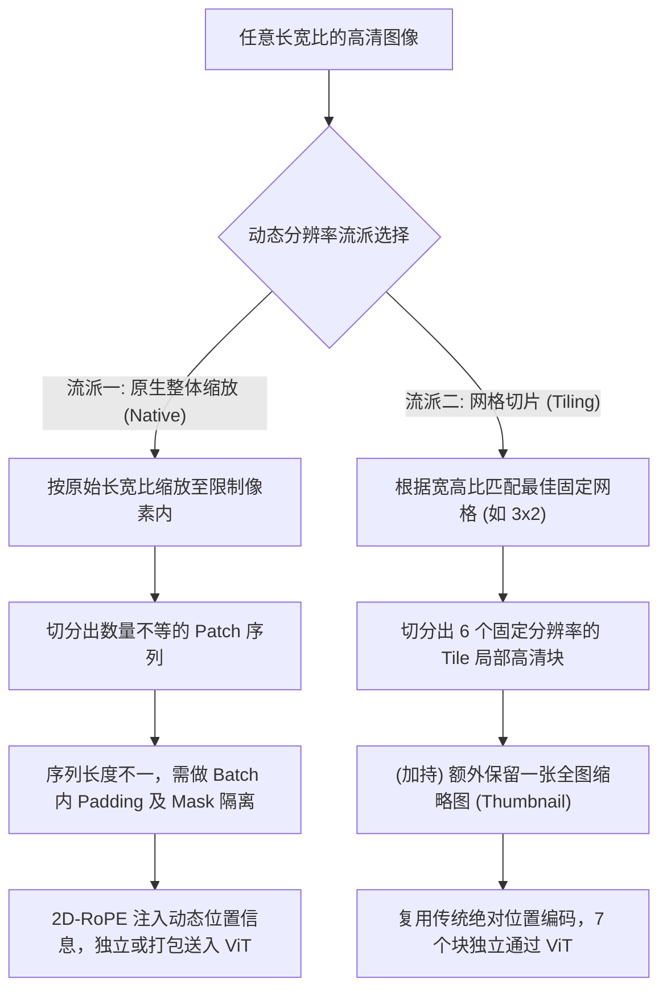

# 动态分辨率输入方案与 NaViT

## 模块整体说明与架构拆解

在传统的多模态大模型（如早期 LLaMA, Qwen-VL）中，视觉编码器使用的是标准 ViT 架构，所有的输入图像都必须强行缩放（Resize）到固定的分辨率（通常是正方形，如 224×224 或 336×336）。

**传统固定分辨率的致命缺陷**：
1. **低分辨率丢失细节**：无法识别小字和复杂的细节图表。
2. **固定宽高比引入形变**：长条形文档被强行压成正方形，导致图片严重扭曲失真，引入了误导信息。


为了解决这个问题，业界演化出了两大高颗粒度的动态分辨率流派：**原生动态分辨率 (Native Dynamic Resolution, 以 NaViT 和 Qwen2-VL 为代表)** 和 **基于切片的动态分辨率 (Dynamic Tiling, 以 InternVL 为代表)**。

### 架构演进流转图示


---

## 核心算法原理详解：流派一 - 原生动态分辨率 (NaViT 与 Qwen)

### 1. NaViT 的基石思想 (Patch n' Pack)
Google 的 NaViT (*Patch n' Pack: NaViT, a Vision Transformer for any Aspect Ratio and Resolution*) 首次提出了保留原始分辨率的做法。

**打包原理 (Sequence Packing)**：
由于不改变宽高比，每个图像产生的 Patch 数量是不同的。传统 ViT 必须输入定长序列，为了高效训练且不浪费算力，NaViT 采用了 **Patch n' Pack** 策略：将多个长度不同的图像 Patch 序列拼接到同一个 Batch 序列中，填满窗口。


**计算隔离的魔法 (Block-Diagonal Attention Mask)**：
把多张图塞进一个序列，在 Transformer 计算 Self-Attention 时绝对不能互相“串门”。这需要极其精细的**对角分块 Mask 矩阵**。
假设 5 张图（Patch长度分别为 2, 3, 4, 5, 6）打包成 2 个序列 $S_1=\{I_1:2, I_2:3, I_3:4\}$ (长 9) 和 $S_2=\{I_4:5, I_5:6\}$ (长 11)。
首先在 Batch 内做 Padding 对齐到 11：


接着生成 Mask 矩阵：遍历每个序列，只有属于同一张图的起止区间内的元素置为 1，其余全为 0。

这样，矩阵对角线上就形成了独立的块，完美隔离了不同图像的 Attention 计算。

### 2. 连续 Token 丢弃与分辨率采样 (NaViT 特有)
- **Continuous Token Dropping**：图像本身信息密度低。NaViT 允许在 Packing 时，对不同大小的图片采用不同的 Drop Rate 丢弃 Patch。为了凑够固定序列长度，甚至可以对最后一张图进行自适应丢弃。

- **Resolution Sampling**：NaViT 允许在单个 Batch 内混合不同分辨率的图像（高吞吐量小图 + 强细节大图），而传统 ViT 只能先小图预训练再大图微调。

### 3. Qwen2-VL 的源码落地与张量流转
Qwen2.5-VL 并没有采用复杂的 Patch n' Pack 和 Token Drop，而是采用了更简单的“Padding 补齐法”，但其处理动态分辨率的核心步骤分为四步：

**第一步：Smart Resize 寻找最近的 28 的倍数**
因为下游有一个 `PatchMerger` 会把 2x2 个 $14 \times 14$ 的 Patch 合并，所以宽和高必须被 28 整除。
```python
# min_pixels 控制下限，max_pixels 控制显存上限
factor = 28
h_bar = round(height / factor) * factor
w_bar = round(width / factor) * factor

if h_bar * w_bar > max_pixels:
    beta = math.sqrt((height * width) / max_pixels)
    h_bar = math.floor(height / beta / factor) * factor
    w_bar = math.floor(width / beta / factor) * factor
```

**第二步：Rescale 与 Normalize**
```python
# rescale_factor = 1/255 (0.00392156)
image = self.rescale(image, scale=rescale_factor)
image = self.normalize(image=image, mean=image_mean, std=image_std)
```

**第三步：多帧堆叠凑时间步 (针对单图)**
为了适配 3D 卷积（时间步默认 = 2），单张图会被复制一份：
```python
patches = np.tile(patches, (self.temporal_patch_size, 1, 1, 1))
```

**第四步：底层张量重组代码 (Conv2d -> Transformer Token)**

图像是如何变成一维序列的？底层代码如下：
```python
class VisionTransformer(nn.Module):
   def __init__(self, ...):
       # 用卷积核实现无重叠滑动切块
       self.conv1 = nn.Conv2d(in_channels=3, out_channels=width, kernel_size=patch_size, stride=patch_size, bias=False)

   def forward(self, x: torch.Tensor):
        # 假设输入是一张 [3, 448, 448] 的图，输出通道 width=1664, patch_size=14
        # 1. 卷积映射成 [1664, 32, 32] 的 3D 特征图 (32=448/14)
        x = self.conv1(x)  
        # 2. 按行展开：[1664, 32, 32] 映射成 [1664, 32*32=1024]
        x = x.reshape(x.shape[0], x.shape[1], -1)  
        # 3. 维度转置：变成标准的 Token 序列格式 [1024, 1664]
        x = x.permute(0, 2, 1)  
        # 4. 增加 2D-RoPE 位置编码 (Qwen 用 RoPE 替代了原始的绝对位置加法)
        x = x + get_abs_pos(self.positional_embedding, x.size(1))
        x = self.transformer(x)
```


---

## 核心算法原理详解：流派二 - 基于切片的动态分辨率 (Dynamic Tiling)

以 InternVL2.5 为例，它的逻辑比 Qwen 复杂，被称为 **Dynamic High Resolution**。


### 1. 寻找最匹配的宽高比 (Find Closest Aspect Ratio)
InternVL 预定义了 35 组不同的宽高比（最极限的是 1:12，例如 `[(1,1), (1,2), (2,1), (3,1)...]`）。
假设输入图像是 `1224 x 926`。
算法会计算它的宽高比 $1224 / 926 \approx 1.32$，在 35 组中寻找最接近的，发现是 `4:3`。
假设基础块尺寸 `image_size = 448`，则目标尺寸被强行 Resize 到：
`target_width = 448 * 4 = 1792`
`target_height = 448 * 3 = 1344`

### 2. 切块 (Crop) 与 缩略图 (Thumbnail)
将 Resize 后的 `1792 x 1344` 图片切成 $4 \times 3 = 12$ 个不重叠的 `448 x 448` 的局部高清块。
```python
# 得到没有 overlap 的 crop 块
# 第0个patch (0, 0, 448, 448)
# 第1个patch (448, 0, 896, 448)
# 第2个patch (896, 0, 1344, 448)
# ...以此类推到第11个patch
```
**关键补丁 (Thumbnail)**：为了不丢失全局宏观视野，还会把原图暴力 Resize 出一张额外的 `448 x 448` 缩略图。


**堆叠**：这 12+1=13 个块，会被 `torch.stack` 堆叠成 `[13, 3, 448, 448]` 的像素输入。它们会作为 13 张独立的图通过传统的 ViT 编码器。由于每个块尺寸都是死板的 448，所以**完美复用了传统的绝对位置编码**。

---

## 原生 (Qwen) vs 切片 (InternVL)：Token 消耗对决

我们来算一笔硬核的帐。同样一张 `1224 x 926` 的图片，谁更耗显存？

### 1. Qwen2-VL 的消耗
1. 经过 `smart_resize` 对齐 28 的倍数，重塑为 `1232 x 924`。
2. 喂给 Vision Encoder，最后有一个 2x2 的 PatchMerger 压缩。
3. 最终产生的 Token 数：$(1232 / 28) \times (924 / 28) = 44 \times 33 = \mathbf{1452}$ 个 Token。
4. Token 的维度：Qwen 的视觉隐藏层极大，输出通道维度是 $\mathbf{3584}$。
5. **Embedding 显存占用**：$1452 \times 3584 = \mathbf{5,203,968}$ 个数值。

### 2. InternVL2.5 的消耗
1. 切分出 13 个 `448 x 448` 的块。
2. 每个块内部经过 ViT 下采样 16 倍，变成 $28 \times 28 = 784$。再经过 InternVL 自己的特征融合层（类似 MLP Merger），$28 \times 28$ 被压缩成 256。
3. 最终产生的 Token 数：$13 \times 256 = \mathbf{3328}$ 个 Token。
4. Token 的维度：InternVL 将其投射到了 $\mathbf{896}$ 维。
5. **Embedding 显存占用**：$3328 \times 896 = \mathbf{2,981,888}$ 个数值。

**震撼反直觉结论**：虽然 Qwen 只是一张图，而 InternVL 切了足足 13 块，但由于 Qwen 的通道维度过大（3584 vs 896），实际上 Qwen 消耗的 Embedding 显存**更大**！不过，Qwen 可以通过缩小 `max_pixels` 轻松反超，且原生方案没有切片边缘的割裂感。

---

## 视觉 Token 压缩技术 (Vision Token Compression)

引入动态高分辨率后，不可避免地带来了“**Token 数量爆炸**”的副作用（一张高清图动辄上万 Token），这会迅速耗尽 LLM 的上下文窗口。为此，催生了四大视觉 Token 压缩流派：


1.  **基于变换 (Transformation-based)**：将特征按物理空间重塑变得紧凑。
    *   代表：Qwen2.5-VL 的 `PatchMerger` (2x2 合并降维)，InternVL 的 `Pixel Unshuffle`。
    *   优劣：保留视觉物理空间结构，但压缩率是死板固定的。
2.  **基于相似性 (Similarity-based)**：利用余弦相似度，把背景中长得一样的天空或白墙 Token 在隐空间合并。
    *   代表：ToMe, FOLDER (在 ViT 输出聚类或各层渐进合并)。
    *   优劣：压缩率灵活；但可能误伤小字等细粒度信息，且破坏了空间结构。
3.  **基于注意力 (Attention-based)**：利用注意力稀疏性进行剪枝。只保留 Attention 热力图中高亮的 Token。
    *   代表：FastV (在 LLM 中剪枝), VisionZip (基于 ViT CLS 剪枝)。
    *   优劣：解释性极强，动态剪裁；但需要显式计算注意力分数，需魔改底层加速框架。
4.  **基于查询 (Query-based)**：基于文本查询指导信息蒸馏。用极少量的“探针（Query）”去交叉提取巨大的图像特征。
    *   代表：BLIP-2 的 `Q-Former`，Qwen1-VL 的单层 Cross-Attention。
    *   优劣：极限精炼压缩，适合视频；但在多轮对话中会反复重新编码，不适合密集文字。

---

## 质量自我审查与准出标准
1. **Mask 隔离懂了吗？**：必须能默写出 NaViT 打包了不同长度图片的 Batch 后，其对角块状 Attention Mask 是如何分布防止污染的。
2. **切片逻辑清楚吗？**：能画出 InternVL 是怎么从宽高比匹配出最接近的网格，推导出 12 个 Tile，并必然加上 1 个 Thumbnail 防止全局语义丢失的。
3. **张量对决明白了吗？**：理解为什么单张图的 Qwen 的 Embedding 体积，因为 3584 维度的原因，反而超过切了 13 块的 InternVL。
4. **底层重排代码理解了吗？**：能写出 `Conv2D` 卷积完后 `reshape -> permute` 转为 Transformer 1D 序列的过程。

## 关联概念
- ➡️ 下游的极致变换压缩：[[patchmerger_空间降维]]
- ➡️ Qwen 原生位置编码的革命基石：[[2d_rope_视觉位置编码]]