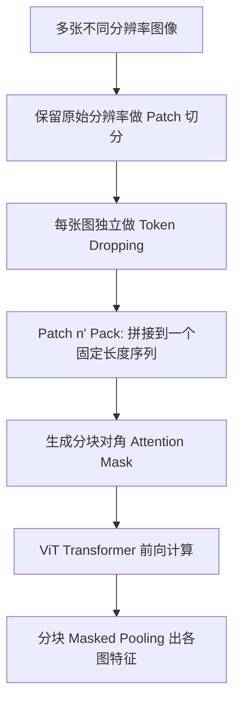

# NaViT 原生动态分辨率 (Native Resolution ViT)

## 模块整体说明

NaViT（Native Resolution ViT）是 Google 于 2023 年提出的视觉 Transformer 改进方案（论文：*Patch n' Pack: NaViT, a Vision Transformer for any Aspect Ratio and Resolution*，arXiv: 2307.06304）。

**它解决的核心问题**是：以往所有 ViT 模型都要把输入图片强行 Resize 到固定分辨率（如 224×224），这会导致两个严重问题——（1）低分辨率丢失细节，无法识别小字和细节图表；（2）固定宽高比引入形变，长条形文档被压成正方形。NaViT 主张**保持图像的原始分辨率和宽高比**，直接处理任意尺寸的图像。

**直观比喻**：传统 ViT 就像一个只有一种尺寸模具的饼干工厂，不管面团什么形状都往同一个方模具里硬塞。NaViT 则换成了一把可调节的切刀——面团多大就按多大切，只要切成统一大小的小方块（Patch），流水线就能正常工作。

**在 Qwen 系列中的地位**：NaViT 思想首先被 Qwen2-VL 引入其 ViT 中，随后在 [[qwen2.5_vl_技术报告解析]]、Qwen3-VL 和 Qwen3.5 中持续沿用，是 Qwen 全系视觉编码器的基石。它属于 [[动态分辨率方案对比]] 中的"原生动态分辨率"路线。

---

## 核心算法原理详解

### 1. 为什么传统 ViT 必须固定分辨率？

要理解 NaViT 的价值，必须先理解传统 ViT 为什么被锁死在固定分辨率上。

原始 ViT（2020, Google Research）使用了一个**可学习的 1D 绝对位置编码（Absolute Positional Embedding）**。在 Transformer 前置的 Embedding 阶段，这个位置编码向量和 Patch 向量直接相加组成输入。

**关键约束**：可学习 Embedding 的尺寸（序列长度）在初始化时就固定了（比如 256 个位置）。这意味着推理时必须以相同的尺寸组织输入，分辨率就被锁死了。例如 Patch 大小为 14×14，图像必须是 $224 \times 224$（得到 $16 \times 16 = 256$ 个 Patch），否则位置编码的维度就对不上。

**NaViT 的突破**：把位置编码从"预先固定的可学习向量"换成**分解式位置编码**，不再与固定序列长度绑定。在 Qwen 的实现中，则进一步替换为 [[2d_rope_视觉位置编码]]（2D-RoPE），基于位置动态计算旋转角度，彻底不需要预先固定序列长度。

### 2. Patch n' Pack：序列打包训练

**来龙去脉**：当图像不再被 Resize 到统一尺寸时，不同图像产生的 Patch 数量不同，无法直接组成一个 Batch 进行并行训练。NaViT 提出了 **Patch n' Pack** 方案——将多个图片按各自原始分辨率做 Patch 处理后，**拼接到同一个序列中**，填满一个固定长度的序列窗口。

**直观比喻**：这就像邮局把大小不同的包裹塞进同一个集装箱——先塞大包裹，剩余空间塞小包裹，最后用填充物（Padding）塞满。

**具体数值示例**：假设序列窗口容量为 256 个 Token：
- 图像 A（320×640）→ 产生 $(320/14) \times (640/14) ≈ 22 \times 45 = 990$ 个 Patch → 做 Token Dropping 后保留 150 个
- 图像 B（224×224）→ 产生 $16 \times 16 = 256$ 个 Patch → 做 Token Dropping 后保留 80 个
- 图像 C（112×112）→ 产生 $8 \times 8 = 64$ 个 Patch → 不 Drop，保留 26 个
- 三张图打包后总计 $150 + 80 + 26 = 256$，刚好填满序列窗口。

### 3. 掩码注意力和掩码池化 (Masked Self Attention & Masked Pooling)

多个 example 打包到同一个序列后，在 Transformer 的每一层做 Self-Attention 时，**不同 example 之间不能互相 Attention**，否则会产生信息泄露。

**解决方案**：引入一个额外的**对角分块 Mask 矩阵**（Block-Diagonal Attention Mask）。

**数值示例**：假设一个序列有三个 example，token 长度分别为 `4, 6, 5`，最后补 2 个 Padding Token 对齐到 17：

```
Attention Mask (17×17):
[1 1 1 1 0 0 0 0 0 0 0 0 0 0 0 0 0]  ← example 1 (token 0-3)
[1 1 1 1 0 0 0 0 0 0 0 0 0 0 0 0 0]
[1 1 1 1 0 0 0 0 0 0 0 0 0 0 0 0 0]
[1 1 1 1 0 0 0 0 0 0 0 0 0 0 0 0 0]
[0 0 0 0 1 1 1 1 1 1 0 0 0 0 0 0 0]  ← example 2 (token 4-9)
... (以此类推)
[0 0 0 0 0 0 0 0 0 0 1 1 1 1 1 0 0]  ← example 3 (token 10-14)
[0 0 0 0 0 0 0 0 0 0 0 0 0 0 0 0 0]  ← padding (全 0)
[0 0 0 0 0 0 0 0 0 0 0 0 0 0 0 0 0]
```

同理，做 Pooling（计算 Loss）时也需要用相同的 Mask 矩阵做隔离，防止不同 example 的特征被混合池化。

### 4. 分解式位置编码 (Factorized & Fractional Positional Embeddings)

NaViT 对位置编码做了关键的分解改进：

| 方案 | 位置编码 | 参数量 | 外推性 |
|------|---------|--------|--------|
| 原始 ViT | 可训练 1D 绝对位置编码 | $maxLen$ | 差（只见过固定长度） |
| Pix2struct | 可学习 2D 绝对位置编码 | $maxLen^2$ | 差（每个 $(x,y)$ 都要被学过） |
| **NaViT** | **分离式位置编码** | $2 \times maxLen$ | **好**（X 和 Y 独立学习） |

**为什么外推性好？** 虽然 $(a, b)$ 这个分辨率组合没见过，但高为 $a$ 的图片和宽为 $b$ 的图片模型可能分别都见过，X 轴和 Y 轴的位置编码是各自独立学习的。

**在 Qwen 中的进化**：Qwen 系列没有直接用 NaViT 的分解式可学习编码，而是更进一步，采用了 [[2d_rope_视觉位置编码]]（2D-RoPE）。RoPE 完全不需要可学习参数，位置信息通过旋转矩阵的角度来编码，天然支持任意长度外推。

### 5. Continuous Token Dropping（连续 Token 丢弃）

**来龙去脉**：图像本身是低密度的信息载体。空间临近的像素和 Patch 之间有大量冗余信息。在训练时，可以通过适当的采样丢弃一些 Patch，提高训练吞吐和性能。

**NaViT 的创新**：由于多个 image 被 Pack 到一个序列里，每个图片可以有不同的 Drop Rate。对于大尺寸图片，可以提升 Drop Rate 来压缩序列特征长度；为了控制 Sequence 总长度，可以对最后一个图片做特化的采样策略（根据剩余容纳空间来调整），从而控制多 image 拼接后得到固定的 Sequence 长度。

### 6. Resolution Sampling（分辨率采样）

NaViT 允许对图像尺寸进行**混合分辨率采样**，同时保留原始纵横比。

传统 ViT 的权衡：小图训练 → 高吞吐量 → 但推理分辨率受限；大图训练 → 分辨率高 → 但吞吐量低。通常先小分辨率预训练，再高分辨率微调。

NaViT 可以在单个 Batch 中混合不同分辨率的图像，兼顾高吞吐量与大尺寸图像训练。

---

## 架构与代码流程图



### 6. Qwen2.5-VL 实际工程实现：从 NaViT 思想到代码

> **本节是 NaViT 思想在 Qwen2.5-VL 中的完整落地**。对应学习指南 **[§2.3 NaViT 动态网格的四步流水线详解](../synthesis/qwen2.5_vl_深度剖析学习指南.md#23-navit-动态网格的四步流水线详解)** 的详细代码展开。

#### 6.1 为什么是 factor=28 而不是 14？

NaViT 思想要求 H/W 能整除 `patch_size`（14）。但 Qwen2.5-VL 在 Processor 里用的是 `factor=28`：

$$factor = patch\_size \times spatial\_merge\_size = 14 \times 2 = 28$$

原因：`PatchMerger` 会在视觉 token 进入 LLM 前做 2×2 空间合并。为了保证合并后 token 数是整数，从源头就要求 H/W 能整除 28。

#### 6.2 smart_resize：尺寸对齐实现

**代码路径**：`transformers/src/transformers/models/qwen2_5_vl/image_processing_qwen2_5_vl.py`

```python
def smart_resize(
    height: int,
    width: int,
    factor: int = 28,
    min_pixels: int = 56 * 56,
    max_pixels: int = 14 * 14 * 4 * 1280,
) -> tuple[int, int]:
    """
    将 (height, width) 调整为 factor 的整数倍，同时控制总像素数在 [min_pixels, max_pixels] 范围内。
    保持原始宽高比。
    """
    # 1. 计算当前像素数，如果超出范围则等比缩放
    if height * width > max_pixels:
        scale = math.sqrt(max_pixels / (height * width))
        height = int(height * scale)
        width  = int(width  * scale)
    elif height * width < min_pixels:
        scale = math.sqrt(min_pixels / (height * width))
        height = int(height * scale)
        width  = int(width  * scale)

    # 2. Pad 到 factor 整数倍（向上取整）
    height = math.ceil(height / factor) * factor   # e.g. 100 → 112
    width  = math.ceil(width  / factor) * factor   # e.g. 200 → 210
    return height, width
```

**数值示例对比**：

| 原始尺寸 | smart_resize 后 | 网格 H'×W' | LLM Token 数 |
|---------|----------------|------------|------------|
| 8204×1092 | 8204×1092（整除） | 586×78 | **11427** |
| 28×224 | 28×224（整除） | 2×16 | **8** |
| 100×200 | 112×210 | 8×15 | **30** |
| 1080×1920 | 1092×1932 | 78×138 | **2697** |

#### 6.3 Padding 的物理实现

在 PIL/torchvision 层面，Padding 通过先 resize 再 pad 完成：

```python
# 在 ImageProcessor.preprocess() 中
image = resize(image, size=(new_h, new_w), ...)  # Bicubic 插值缩放
# 如果 resize 后尺寸与目标不完全相同（浮点误差），补黑色边缘
if image.size != (new_w, new_h):
    padded = Image.new('RGB', (new_w, new_h), (0, 0, 0))  # 黑色背景
    padded.paste(image, (0, 0))  # 将图粘贴到左上角，右/下边自动是黑
    image = padded
```

#### 6.4 帧复制与时间对齐（视频专属）

```python
# 代码路径：image_processing_qwen2_5_vl.py -> process_video()
def process_video(frames, temporal_patch_size=2, ...):
    num_frames = len(frames)
    # 若帧数不是 temporal_patch_size 的整数倍，补最后一帧
    if num_frames % temporal_patch_size != 0:
        pad_count = temporal_patch_size - (num_frames % temporal_patch_size)
        frames = frames + [frames[-1]] * pad_count

    # 若是静态图（1帧），复制为 temporal_patch_size 帧
    if num_frames == 1:
        frames = frames * temporal_patch_size  # [frame, frame]
    
    return frames  # 长度一定是 temporal_patch_size 的整数倍
```

#### 6.5 image_grid_thw：网格元数据张量

Processor 输出的 `image_grid_thw` 是模型理解视觉结构的关键辅助信息：

```python
# shape: [N_media, 3]，每行是 [T, H', W']
# T = num_frames / temporal_patch_size
# H' = H_pad / patch_size
# W' = W_pad / patch_size

image_grid_thw = torch.tensor([
    [1, 586, 78],   # Picture 1: T=1, H'=586, W'=78
    [1,   2, 16],   # Picture 2: T=1, H'=2,   W'=16
])
video_grid_thw = torch.tensor([
    [2,  28, 46],   # Video 1:   T=2, H'=28,  W'=46
])
# 这些张量用于：
# 1. get_rope_index() 计算 MRoPE 位置 ID
# 2. VisionTransformer 内部知道每个 media 的空间结构
# 3. Processor 计算需要插入多少个 <|image_pad|> 占位符
#    n_pads = T × H' × W' / spatial_merge_size^2 = T × H' × W' / 4
```

---

## 关联概念

- ✅ 支持 [[qwen2.5_vl_技术报告解析]]：Qwen2.5-VL 的视觉编码器核心理念来源于 NaViT。
- ✅ **实际落地示例**：[学习指南 §2.3 NaViT 动态网格的四步流水线详解](../synthesis/qwen2.5_vl_深度剖析学习指南.md#23-navit-动态网格的四步流水线详解)（含官方 Picture 1/2/Video 1 的真实张量推导）
- ✅ 支持 [[动态分辨率方案对比]]：NaViT 是"原生动态分辨率"路线的代表。
- [[2d_rope_视觉位置编码]]：Qwen 系列中替代 NaViT 原始分解位置编码的技术方案。
- [[conv3d_时空切块器]]：在 NaViT 动态网格之上进行实际的 Patch 切分。
- [[patchmerger_空间降维]]：在 NaViT 产生的变长视觉 Token 之后进行 4× 空间压缩。

## 参考来源

- 论文：*Patch n' Pack: NaViT, a Vision Transformer for any Aspect Ratio and Resolution* (arXiv: 2307.06304)
- 原始资料：`knowledge_base/NaViT/NaViT.md`
- 原始资料：`knowledge_base/面试官：VLM 的动态分辨率是怎么做的？/`
- 代码路径：`transformers/src/transformers/models/qwen2_5_vl/image_processing_qwen2_5_vl.py`
