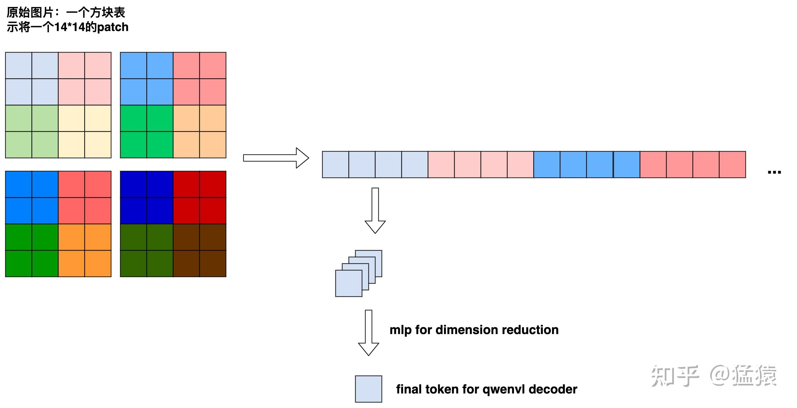
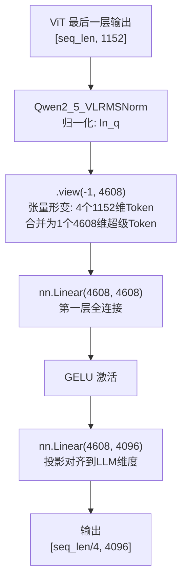

# PatchMerger 空间降维桥接器 (Projector)

## 模块整体说明

PatchMerger（全称 `Qwen2_5_VLPatchMerger`）是 Qwen 系列多模态模型中**视觉与语言之间的咽喉要道**，同时扮演两个角色：
1. **空间降维器**：将大量视觉 Token 进行 $2 \times 2$ 合并，**一步砍掉 75% 的序列长度**（4 个 Token 变 1 个）。
2. **跨模态投影仪 (Projector)**：将视觉编码器的 1152 维特征空间**对齐到大语言模型的 4096 维字典空间**。

**直观比喻**：想象你写了一份 4 页的技术报告（4 个 1152 维的 Token），现在要交给老板（LLM）审阅。但老板只看一页纸且要求用他的格式（4096 维）。PatchMerger 就是一台复印缩减机：先把 4 页拼成一张大纸（`.view(-1, 4608)`），再用 MLP 压缩翻译成老板能读的一页 4096 维摘要。

**在全链路中的位置**：PatchMerger 接收 [[window_attention_交错注意力]] 最后一层输出的深层视觉特征，压缩后输出给 LLM 骨干网，替换掉文本中预留的 `<|image_pad|>` 占位符。

---

## 逻辑链输入与输出

- **逻辑链（输入）**：ViT 最后一层输出 `[seq_len, 1152]`。
- **逻辑链（输出）**：降维并对齐维度后的超级视觉 Token `[seq_len / 4, 4096]`。

**PatchMerger 原理示意图**：


---

## 核心算法原理详解

### 1. 空间下采样：张量形变魔法

PatchMerger 的空间降维**不使用任何池化操作**，而是直接利用 PyTorch 张量的内存连续性，通过 `.view()` 改变"视角"来实现。

**物理过程**：假设 ViT 输出的 Token 按空间排列为 $H' \times W'$ 的网格（每个 Token 是 1152 维），我们取相邻的 $2 \times 2$ 个 Token（空间上紧挨的 4 个），强行 `.view(-1, 4608)` 把它们拼成一个 4608 维的"胖 Token"。

```
原始排列 (6×6 网格 = 36 个 Token):
[t00] [t01] [t02] [t03] [t04] [t05]
[t10] [t11] [t12] [t13] [t14] [t15]
[t20] [t21] [t22] [t23] [t24] [t25]
[t30] [t31] [t32] [t33] [t34] [t35]
[t40] [t41] [t42] [t43] [t44] [t45]
[t50] [t51] [t52] [t53] [t54] [t55]

合并后 (3×3 网格 = 9 个 Token):
[t00+t01+t10+t11] [t02+t03+t12+t13] [t04+t05+t14+t15]
[t20+t21+t30+t31] [t22+t23+t32+t33] [t24+t25+t34+t35]
[t40+t41+t50+t51] [t42+t43+t52+t53] [t44+t45+t54+t55]

每个合并后的 Token 维度: 4 × 1152 = 4608
```

### 2. MLP 投影：从视觉空间到语言空间

合并后的 4608 维超级 Token 通过两层 MLP 投影到 LLM 的 4096 维：

```
nn.Linear(4608, 4608) → GELU → nn.Linear(4608, 4096)
```

第一层保持维度做非线性变换（引入 GELU 激活），第二层做降维对齐。

### 3. Token 数学破案：终极公式

**核心 Patch 大小**是 $14 \times 14$；进入 LLM 之前有 $2 \times 2$ 的 PatchMerger。因此：

$$Token\_Count = \frac{H}{14 \times 2} \times \frac{W}{14 \times 2} = \frac{H}{28} \times \frac{W}{28}$$

**实际验算（与官方架构图精确对照）**：
- **Picture 1 (8204×1092)**：$8204/28 = 293$，$1092/28 = 39$，总数 $293 \times 39 = \mathbf{11427}$ ✅
- **Picture 2 (28×224)**：$28/28 = 1$，$224/28 = 8$，总数 $1 \times 8 = \mathbf{8}$ ✅
- **Video 1 (392×644×8s)**：单帧空间 $(392/28) \times (644/28) = 14 \times 23 = 322$；时间 4 帧 → 2 时间步；总视频 Token $322 \times 2 = \mathbf{644}$ ✅

### 可训练参数与训练方式

| 组件 | 网络结构 | 参数配置 |
|------|---------|---------|
| `ln_q` | `Qwen2_5_VLRMSNorm` | `(1152,)` 缩放权重 |
| `mlp[0]` | `nn.Linear` | `(4608, 4608)` |
| `mlp[1]` | `nn.GELU` | 无参数 |
| `mlp[2]` | `nn.Linear` | `(4608, 4096)` |

**训练状态——这是多模态模型的重头戏！**
- **Stage 1**（ViT + PatchMerger 训练）：PatchMerger 是**解冻的**，从头训练或基于少量数据初始化。它的工作是强行把视觉特征往语言模型的表征空间"拽"。
- **Stage 2/3**：全模型联合训练，PatchMerger 继续可训练。
- **后训练 SFT/DPO**：ViT 整体冻结，但 PatchMerger 的训练状态取决于具体配置（通常也冻结）。

详见 [[qwen2.5_vl_三阶段预训练]]。

---

## 架构与代码流程图



---

## 源码逐行解剖

**代码路径**：`transformers/src/transformers/models/qwen2_5_vl/modeling_qwen2_5_vl.py`

```python
class Qwen2_5_VLPatchMerger(nn.Module):
    def __init__(self, dim=4096, context_dim=1152, spatial_merge_size=2):
        super().__init__()
        # 4 个 1152 维的 Token 拼接后的维度
        self.hidden_size = context_dim * (spatial_merge_size**2)  # 1152 × 4 = 4608

        # 归一化层：注意这里是 RMSNorm（Qwen2-VL 中是 LayerNorm）
        self.ln_q = Qwen2_5_VLRMSNorm(context_dim, eps=1e-6)

        # 两层 MLP：4608 → 4608 → 4096
        self.mlp = nn.Sequential(
            nn.Linear(self.hidden_size, self.hidden_size),  # 4608 → 4608 (可训练)
            nn.GELU(),                                       # 激活函数
            nn.Linear(self.hidden_size, dim),                # 4608 → 4096 (可训练)
        )

    def forward(self, x: torch.Tensor) -> torch.Tensor:
        # 神来之笔：先对每个 1152 维 Token 做 RMSNorm，
        # 然后利用内存排布 .view(-1, 4608) 直接改变视角，将 4 个 Token 合为 1 个
        # 不需要任何 torch.cat 或显式索引操作！
        x = self.mlp(self.ln_q(x).view(-1, self.hidden_size))
        return x  # 输出 [seq_len / 4, 4096]
```

### Qwen3.5 源码解剖：回归大道至简

在 Qwen3-VL 中，为了增强细粒度，官方引入了极其复杂的 `DeepStack` 跨层融合（抽出 ViT 第 8、16、24 层特征注入 LLM）。
但在最新的 **Qwen3.5** 中，由于其语言底座（Gated DeltaNet + MoE）已经足够强大，不需要依赖复杂的跨层视觉补偿。因此 Qwen3.5 废弃了 DeepStack，完全回归了 Qwen2.5-VL 这种最原始的 PatchMerger。

**代码路径**：`transformers/src/transformers/models/qwen3_5/modeling_qwen3_5.py`
```python
class Qwen3_5VisionPatchMerger(nn.Module):
    def __init__(self, config: Qwen3_5VisionConfig, use_postshuffle_norm=False) -> None:
        super().__init__()
        self.hidden_size = config.hidden_size * (config.spatial_merge_size**2)
        self.use_postshuffle_norm = use_postshuffle_norm
        # 如果不开 postshuffle，则在这里做归一化
        self.norm = nn.LayerNorm(self.hidden_size if use_postshuffle_norm else config.hidden_size, eps=1e-6)
        
        # 原汁原味的两层 MLP
        self.linear_fc1 = nn.Linear(self.hidden_size, self.hidden_size)
        self.act_fn = nn.GELU()
        self.linear_fc2 = nn.Linear(self.hidden_size, config.out_hidden_size)

    def forward(self, x: torch.Tensor) -> torch.Tensor:
        # 完全相同的张量形变魔法 .view(-1, self.hidden_size)
        x = self.norm(x.view(-1, self.hidden_size) if self.use_postshuffle_norm else x).view(-1, self.hidden_size)
        x = self.linear_fc2(self.act_fn(self.linear_fc1(x)))
        return x
```
这段实锤代码证明了：**Qwen3.5 并不是没有视觉端创新，而是刻意采用了“返璞归真”的设计哲学，将所有的推理压力交给了极致优化的 LLM 基座。**

---

## 版本演化对比

| 版本 | 归一化 | MLP 结构 | 关键变化 |
|------|--------|---------|---------|
| Qwen2-VL | `LayerNorm` | `Linear → GELU → Linear` | 首次引入 PatchMerger |
| **Qwen2.5-VL** | **`RMSNorm`** | 同上 | **仅修改了 Norm** |
| Qwen3-VL | `LayerNorm` | 同上 + `use_postshuffle_norm` | 可选在拼接后再做一次 Norm |
| Qwen3.5 | 回归 RMSNorm | 同 Qwen2.5-VL | 简化结构 |

---

## 关联概念

- ✅ 支持 [[qwen2.5_vl_技术报告解析]]：承接 [[window_attention_交错注意力]] 的输出，送给 LLM。
- 上游：接收视觉骨干网输出的 `[seq_len, 1152]`。
- 下游：输出 `[seq_len/4, 4096]` 替换 LLM 输入中的 `<|image_pad|>` 占位符。
- 🔄 演化自 Qwen2-VL PatchMerger：唯一变化是 Norm 从 LayerNorm 换成 [[rmsnorm_归一化]]。
- 属于 [[动态分辨率方案对比]] 中"基于变换的压缩"方案。
- 训练策略：[[qwen2.5_vl_三阶段预训练]]。

## 参考来源

- 原始资料：`knowledge_base/Qwen2.5-VL/Qwen2.5-VL.md`
- 原始资料：`knowledge_base/面试官!从Qwen-VL到Qwen3.5技术改进？(26年2月版)/`
- 学习指南：`knowledge_base/Qwen_Architecture_Guides/qwen_learning_guide_phase1.md`
