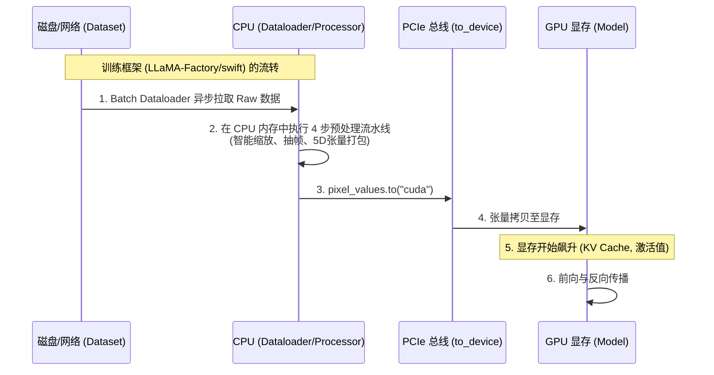

# Qwen2.5-VL 预处理框架集成与显存评估

## 模块整体说明与架构拆解

在了解了 [[qwen2.5_vl_预处理流水线]] 的纯张量与数学流转后，我们需要将其放入真实的工程环境中。
本卡片解决三大核心工业级痛点：
1. **CPU 与 GPU 的物理边界**：预处理是在哪里算的？数据什么时候上 GPU？
2. **训练与推理框架的流转**：在 LLaMA-Factory、swift（微调训练）以及 vLLM（高速推理）中，预处理是如何并行运转的？
3. **OOM (Out Of Memory) 救火指南**：如何通过预处理配置精准评估显存消耗，并进行有效调参？

### 框架集成与显存流转全景图



---

## 子模块/步骤详解

### 一、CPU 与 GPU 的物理边界与调用流转

#### 模块说明
清楚数据在哪条硬件总线上流转，是排查性能瓶颈（如 GPU 饥饿，即 GPU 算得太快但 CPU 预处理给得太慢）的关键。

#### 逻辑链输入与输出
- **逻辑链（输入）**：存在磁盘上的 JPG/MP4 文件，或 HTTP 请求传来的 Base64 编码。
- **逻辑链（输出）**：位于 GPU 显存上的 `pixel_values` 张量。

#### 第一性原理与原理解读
**预处理在哪算？什么时候上 GPU？**
所有的预处理操作（`smart_resize`, `smart_nframes`, 图像缩放的 `BICUBIC` 插值，张量的拉平拼接，Tokenizer 查表）**全部在 CPU 和主机内存（RAM）中完成**。
**这至关重要**：在这一步，虽然内存中生成了庞大的 `[48316, 3, 2, 14, 14]` 5D 张量，但**你的 GPU 显存（VRAM）是 0 消耗的**。
只有当代码执行到 `inputs.to(device)`（通过 PCIe 总线拷贝），并随后进入 `model.forward(inputs)`（也就是 [[conv3d_时空切块器]] 的入口）时，显存才会开始分配。

#### 核心源码解剖
**代码调用顺序与流转**：
从加载原始图片到推向 GPU，整个流转过程界定了 CPU 计算和 GPU 算力开始的时刻。这段逻辑与后续的模块一（Conv3D）直接连接。

**典型调用栈（以 PyTorch / Transformers 为例）**：
```python
# ==========================================
# 阶段一：纯 CPU 操作（Dataloader / 主线程内存）
# 模块：初始化处理器并摄入异构数据
# ==========================================
image = Image.open("huge_image.jpg")
processor = Qwen2_5_VLProcessor.from_pretrained(...)

# 执行庞大的 4 步预处理 (智能缩放 -> 抽帧 -> 5D打包 -> 挖坑)
# 输出的 inputs 字典此时完全存在于系统 RAM 中，GPU 显存占用 0
inputs = processor(text=["描述图片"], images=[image], padding=True, return_tensors="pt")
# inputs["pixel_values"].shape = [total_patches, 3, 2, 14, 14]

# ==========================================
# 阶段二：跨总线传输与 GPU 算力起点
# ==========================================
# 通过 PCIe 总线，将庞大的 5D 张量从 CPU 内存拷贝进 GPU 显存
# 此时 nvidia-smi 才会看到显存上涨
inputs = inputs.to("cuda")

# ==========================================
# 阶段三：连接到下一个模块（模块一：Conv3D 时空切块）
# ==========================================
# 调用模型的 forward 函数
# inputs["pixel_values"] 被交接给视觉骨干网的第一个模块 Conv3D，执行物理滤波提取
outputs = model(**inputs)
```

---

### 二、训练与推理框架的预处理范式

#### 模块说明
单次推理的代码很简单，但在工程中，我们需要用 LLaMA-Factory / swift 微调，用 vLLM 部署。它们是如何调度预处理的？

#### 第一性原理与原理解读
**1. 训练框架范式 (LLaMA-Factory / swift)**
*   **策略：异步多进程（来一点，预处理一点，训一点）**
*   它们使用的是 PyTorch 的 `DataLoader`。由于预处理（特别是超大图和视频）是非常重度的 CPU 密集型任务，训练框架通常会开启 `num_workers=8` 等多进程参数。
*   在 GPU 正在狂算 Batch N 的梯度时，CPU 的 8 个进程正在后台并行预处理 Batch N+1 和 N+2 的图片，生成 5D 张量。等 GPU 算完，直接通过 PCIe 喂给 GPU。

**2. 推理框架范式 (vLLM)**
*   **策略：异步无等待连续批处理 (Continuous Batching)**
*   vLLM 是一个极其追求吞吐的框架。当几十个用户同时发来多模态请求时，vLLM 的前端 HTTP Server 会接收 Base64 图片，并迅速分发给一个独立的**异步预处理池**。
*   CPU 池将图片预处理为 Token 序列和 `pixel_values`，一旦处理完，就塞进 vLLM 的 `Scheduler` 队列。vLLM 引擎会根据当前 GPU 剩余的 KV Cache 空间，动态决定下一秒把哪几个请求的张量 `to("cuda")` 并进行前向推理。

---

### 三、显存评估与 OOM 救火指南

#### 模块说明
多模态模型 OOM（显存溢出）的罪魁祸首往往不是模型权重（如 7B 模型固定占用 14GB），而是**序列长度带来的 KV Cache 和激活值爆炸**。本节教你如何通过控制预处理边界来精准评估和解决 OOM。

#### 第一性原理与原理解读
大模型的 Attention 显存复杂度是 $O(L^2)$ 或 $O(L)$（取决于实现）。这里的 $L$ 就是经过 PatchMerger 压缩后的**视觉 Token 数量**。
还记得我们的黄金公式吗？
单图的 $Token\_Count = \frac{max\_pixels}{28 \times 28}$
如果 OOM，你**唯一且最有效**的自救手段，就是向预处理模块下达指令，收紧边界。

#### 公式推导与调参实战

**场景 1：图片微调/推理频繁 OOM**
- **诊断**：Qwen2.5-VL 默认支持巨大的 `max_pixels`。如果一张超清大图算满，可能产生 16384 个 Token。由于长上下文需要巨额的激活值显存，很容易 OOM。
- **救火方案**：向 Processor 强行传入更小的 `max_pixels`。
- **配置示例**：将 `max_pixels` 限制为 100万像素（约 $1000 \times 1000$）。
  $$Token\_Count = 1,000,000 / 784 \approx 1275 \text{ 个 Token}$$
  显存占用瞬间从一万多 Token 的量级暴跌！
- **LLaMA-Factory 对应参数**：在 `data_args` 或配置 yaml 中设置 `max_pixels: 1000000`。

**场景 2：视频任务 OOM**
- **诊断**：视频既有空间维度又有时间维度，极其致命。
- **救火方案**：双管齐下。降低空间分辨率（`max_pixels`），同时严格限制帧数上限（`max_frames`）或抽帧率（`fps`）。
- **配置示例**：
  降低空间分辨率到 25万（$500 \times 500$），这会产生 $250000/784 \approx 318$ 个空间 Token。
  设置 `max_frames=16`，即最多 8 个时间步。
  $$Total\_Video\_Tokens = 318 \times 8 = 2544 \text{ 个 Token}$$
- **VRAM 影响**：通过这两步，你能将一个长达 1 分钟的高清视频，强行压缩在绝对安全的 3000 Token 上下文中，轻松在单卡 24G 跑起来。

---

## 关联概念
- [[qwen2.5_vl_预处理流水线]]：上述配置参数（如 `max_pixels`, `max_frames`）生效的纯张量前置源码分析。
- [[mrope_多模态位置编码]]：即便你在本节缩减了视频的帧数，底层依然能通过反推的 `sample_fps`，保证位置编码不丢失真实物理时钟。

## 参考来源
- `vLLM 官方架构文档`
- `LLaMA-Factory 源码多模态数据加载部分`