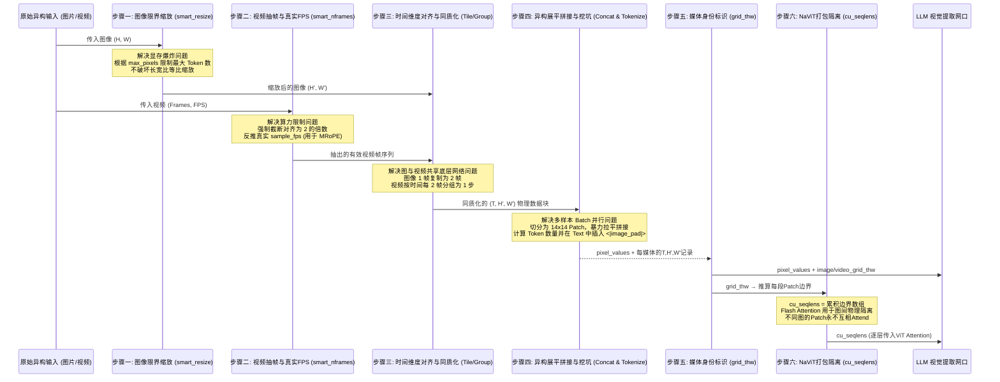

# Qwen2.5-VL 预处理流水线与异构数据大串联

## 模块整体说明与架构拆解

在多模态大模型中，LLM 基座能且仅能处理一维的“词向量（Token）”序列。预处理流水线（包含 `process_vision_info` 与 `Processor`）是**全栈架构的看门人与翻译官**。
它要解决的终极问题是：现实世界中的数据是**高度异构的**（长宽比例极端的超清长图、尺寸极小的图标、高低帧率不同的视频），如何把它们在不破坏原始比例的前提下，转换、压缩、拼接成底层 `Conv3D` 能接受的**标准 5D 张量**，并在文本对话序列中挖好**绝对精准数量的 `<|image_pad|>` 占位坑**。

### 模块整体架构与流转关系图
整个流水线不包含任何神经网络权重，完全通过纯数学和张量重塑（Reshape）操作。为了把异构数据塞进标准通道，整个模块被拆解为以下 4 个核心步骤：


### 全局代码调用顺序与流转概览
为了让大家不迷失在庞杂的源码中，整个预处理流水线的入口与流转顺序如下：
1. **数据摄入入口**：通常在 `qwen_vl_utils/vision_process.py` 的 `process_vision_info()`函数被调用，它负责接收用户的混合输入（图片路径、视频路径）。
2. **图像与视频预处理分发**：根据输入类型，调用 `fetch_image()` 或 `fetch_video()`。在这两个函数内部，将调用核心数学计算函数`smart_resize()` 和 `smart_nframes()`。
3. **处理器与 Tokenizer 打包**：预处理拿到的只是改变尺寸后的 PIL Image 或 Tensor 列表。这些数据随后进入 `transformers` 库的`Qwen2_5_VLProcessor.__call__()`。
4. **张量同质化与拼接**：在 Processor 内部，会调用 `image_processor`，使用诸如 PyTorch 的 `unsqueeze`, `view`, `permute`, `cat`等操作，将数据打平成终极的 5D 张量。同时，Tokenizer 在文本侧挖坑。
5. **模型交接点**：Processor 返回一个包含 `pixel_values` (视觉) 和 `input_ids` (文本) 的字典 `inputs`。这个字典通过 `inputs.to("cuda")`送上显卡，并执行 `model(**inputs)`，正式交接给下一个架构：[[conv3d_时空切块器]]。
---

## 子模块/步骤详解

### 步骤一：图像的配置检查与限界缩放 (smart_resize)

#### 模块说明
大模型的 Attention 算力对序列长度（Token 数量）呈平方级敏感。如果输入一张 8K 分辨率的全景图，瞬间就会导致显存 OOM。本步骤的作用是**充当安全看门人**，通过 `max_pixels` 等边界配置，等比例压缩超大图像，强行守住显存底线。

#### 逻辑链输入与输出
- **逻辑链（输入）**：单张图片的原始分辨率 `H, W`（例如 8204×1092 超宽图），以及核心配置 `min_pixels`、`max_pixels`。
- **逻辑链（输出）**：经过等比缩放并补齐的最终分辨率 `H', W'`。

#### 具体操作逻辑拆解与关键因子 factor=28 深度解读
在这个步骤中，核心操作是纯粹的数学边界计算。
**极其核心的认知拨偏：factor=28 是逻辑对齐，14x14 是物理切块**
很多人会奇怪：为什么 `smart_resize` 用的 `factor` 是 28，而后面生成的 5D 张量又是 `14x14`？这会导致源头和结尾对不上吗？
**结论是：28 是为了保证“深层语义单元”的完整性。**
1. **物理切块 (模块一)**：Conv3D 确实是以 **14x14** 为单位进行物理切片的，生成的 `pixel_values` 每一个 Patch 都是 14x14。
2. **语义合并 (模块三)**：在 [[patchmerger_空间降维]] 中，系统会强行将空间上相邻的 **2x2 (共4个)** Patch 合并为一个特征向量送入LLM。
3. **因果链路**：既然 4 个 14x14 的块最后要合体，那么在大模型看来，它的最小语义单元（1个 Token）实际上代表了原始画面上 **28x28** ($14\times 2$) 的像素区域。
4. **整除约束**：如果在第一步 `smart_resize` 时只对齐 14，产生的图片可能是 $42 \times 42$。切块没问题，但到了后方 `PatchMerger` 进行 $2\times 2$ 强行合并时，$42 / 2 = 21$ 是奇数，会导致位置编码和跨模态映射产生严重的物理错位。
**因此，`smart_resize` 必须用 28 作为因子，确保图片长宽能被 28 整除，从而从源头上保证了后续 $14 \times 14$切块后，每一行、每一列的块数都能被 2 整除，让 `PatchMerger` 的 2x2 合并魔法完美落地。**

#### 第一性原理与原理解读
**为什么没有 `max_token` 参数？**
Qwen2.5-VL 依靠 `max_pixels`（物理像素总量）在数学上直接等价锁死了 Token 上限。因为最终每个送入 LLM 的 Token 固定代表 $28 \times 28$ 的原始区域，所以 `max_token = max_pixels / (28 \times 28)`。
**有 Token Drop (随机丢弃) 策略吗？**
与它致敬的原始 NaViT 不同，Qwen2.5-VL **没有采用随机丢弃 Patch 的策略**。如果图片超大，它的做法是直接按比例 `resize` 缩小整体尺寸，然后把产生的所有 Patch 全送进去。

#### 公式推导与张量跟踪
设定 `factor=28`（因为 PatchSize=14 且 PatchMerger=2，14*2=28）。
- **追踪 Picture 1 (8204×1092)**：
  - 计算像素 $8204 \times 1092 \approx 8.9M$。如果没有超过 `max_pixels`（如 12.8M），则不缩放。
  - $8204 / 28 = 293$（整除），$1092 / 28 = 39$（整除）。
  - 输出 $H'=8204, W'=1092$。
- **追踪 Picture 2 (28×224)**：
  - $28 / 28 = 1$，$224 / 28 = 8$。均整除。
  - 输出 $H'=28, W'=224$。

#### 核心源码解剖
**文件路径**：`qwen-vl-utils/src/qwen_vl_utils/vision_process.py`
```python
def smart_resize(height: int, width: int, factor: int = 28, min_pixels: int = 3136, max_pixels: int = 12845056) -> tuple[int, int]:
    # 核心限制：如果原始像素总数超出 max_pixels，进行【等比例缩小】
    if height * width > max_pixels:
        scale = math.sqrt(max_pixels / (height * width))
        height = int(height * scale)
        width  = int(width  * scale)
    elif height * width < min_pixels:
        scale = math.sqrt(min_pixels / (height * width))
        height = int(height * scale)
        width  = int(width  * scale)
    
    # 强制对齐 28 的倍数，以便被后端的 Patch 切分完美整除
    height = math.ceil(height / factor) * factor
    width  = math.ceil(width  / factor) * factor
    return height, width
```

#### 图表辅助
对比参考：作为源头的 NaViT 是如何通过 Continuous Token Dropping 来限制长序列的（Qwen 放弃了这种丢弃，选择了全局等比 Resize）：


---

### 步骤二：视频动态抽帧与真实 FPS 计算 (smart_nframes)

#### 模块说明
视频不同于图像，它的帧数可以无限长。必须通过强力的抽帧算法来控制传入的帧数，并且抽出帧数后，必须反推实际的采样率，以供后续建立准确的绝对物理时钟。

#### 逻辑链输入与输出
- **逻辑链（输入）**：原始视频总时长与 `video_fps`，用户配置的理想 `fps`，以及约束上下界 `min_frames`, `max_frames`。
- **逻辑链（输出）**：决定提取的实际帧数 `nframes`，以及反推的真实帧率 `sample_fps`。

#### 具体操作逻辑拆解与 Torch 对齐
对于视频（无论是 `decord`, `torchvision` 还是 `torchcodec` 后端），首先算出视频自带的 `total_frames` 和`video_fps`。用户会传入期望抽取的帧数 `nframes` 或期望帧率 `fps`。
系统通过截断算法保证最终帧数落在 `[min_frames, max_frames]` 内。并且，这里又有一个强制对齐：**帧数必须向下对齐到 `FRAME_FACTOR = 2` 的倍数**。这导致实际抽取帧数与用户预期的数学计算结果存在偏差，因此系统立刻利用最终决定抽取的帧数 `nframes`，除以视频真实时长，反向推算出`sample_fps`，将其存入 `video_metadata`。

#### 第一性原理与原理解读
为什么要反推 `sample_fps`？因为受到系统截断和强行偶数对齐的影响，原本用户请求的“1秒抽2帧”可能无法完美执行。这个被扭曲后的 `sample_fps` 是后续 **[[mrope_多模态位置编码]] 唯一依赖的对齐现实世界时钟的参数**。

#### 公式推导与张量跟踪
- **追踪 Video 1 (392×644，总帧数20，原始帧率5fps)**：
  - 原始时长 = 4 秒。假设用户配置想抽取总共 4 帧。
  - $nframes = 4$（符合上下界约束，且是 2 的倍数）。
  - 反推真实帧率 $sample\_fps = 4 \text{ 帧} / 4 \text{ 秒} = 1.0 \text{ fps}$。
  - 输出 $nframes=4, sample\_fps=1.0$。

#### 核心源码解剖
**文件路径**：`qwen-vl-utils/src/qwen_vl_utils/vision_process.py`
```python
def smart_nframes(ele: dict, total_frames: int, video_fps: float) -> int:
    fps = ele.get("fps", 2)
    # 视频专属上下界约束
    min_frames = ceil_by_factor(ele.get("min_frames", 4), 2)
    max_frames = floor_by_factor(ele.get("max_frames", 764), 2)
    
    # 1. 理论抽帧数
    nframes = total_frames / video_fps * fps
    
    # 2. 截断：不能超过总帧数，且在 [min_frames, max_frames] 之间
    nframes = min(min(max(nframes, min_frames), max_frames), total_frames)
    
    # 3. 极其关键：必须向下对齐到 2 的倍数，为了配合后端 Conv3D 的 Tubelet
    nframes = floor_by_factor(nframes, 2)
    return nframes
```

#### 图表辅助
下图直观展示了原始视频（上）被均匀采样抽出指定帧数（中），并以此反推出 `sample_fps`（下）的整个逻辑：


---

### 步骤三：时间步打包与 5D 张量同质化 (Time-Step Grouping)

#### 模块说明
要把 2D 的图片和 3D 的视频，强行拉平到同一种表达结构中，全部包装成底层 Conv3D 唯一接受的 `[..., 3, 2, 14, 14]` 5D 张量。

#### 逻辑链输入与输出
- **逻辑链（输入）**：单图或被抽出的多帧视频矩阵。
- **逻辑链（输出）**：以时间厚度为 2 进行打包的张量块。

#### 第一性原理与原理解读
**为什么时间维度必须是 2？单帧单帧走不行吗？**
必须是 2。如果单帧走 2D 卷积，底层只提取到了色彩纹理，动作的运动光流信息完全丢失，强依赖极后端的 LLM 自己去脑补。时间厚度为 2 的 3D 卷积（Tubelet 思想），能在第一层神经元就提取诸如“物体在向右移动”的光学梯度特征。

**视频两两分组（1-2组, 3-4组）是不是割裂了时间连续性？**
**是的！这是一种刻意为之的极其暴力的算力妥协**。常规 3D 卷积是 1-2, 2-3, 3-4 重叠滑动的（Stride=1）。Qwen 强行设置非重叠的 `stride=(2,14,14)`，导致了轻微的时间割裂，但**直接将时间轴上的 Token 数量砍掉了一半**！丢失的时间连续性交由深层 Transformer 的全局 Attention 弥补。

**静态图片只有一帧，怎么进含有 2 维时间的 Conv3D？**
**靠内存复制（Tile）**。流水线会把静态图的像素矩阵强行在内存中复制一份，变成 `[img, img]`。由于前后两帧完全一致（无运动梯度），3D 卷积核提取的自然退化为纯 2D 空间特征。这精妙地实现了**图与视频的底层权重完美共享**。

#### 公式推导与张量跟踪
以 $14 \times 14$ 切块计算：
- **Picture 1 (8204x1092)**: 静态图复制为 2 帧（1个时间步）。空间块数 = $586 \times 78$ = **45708**。
- **Picture 2 (28x224)**: 复制为 2 帧（1个时间步）。空间块数 = $2 \times 16$ = **32**。
- **Video 1 (392x644, 4帧)**: 4 帧变成 2 个时间步（1-2, 3-4）。空间块数 = $28 \times 46$ = 1288。总块数 = $1288 \times 2$ 时间步 = **2576**。

---

### 步骤四：异构展平拼接与精准挖坑 (Concat & Tokenization)

#### 模块说明
在这个熔炉里，各种长宽不一的图片和视频被碾碎成同一种格式的 Patch，并暴力组合成一个超级长管子。同时，在自然语言的文本序列中，由 Tokenizer 预先用占位符精准凿出对应的坑位。

#### 逻辑链输入与输出
- **逻辑链（输入）**：经过时间步打包后的各类媒体小块集合，以及原始文本 `"这是图1<image>图2<image>视频1<video>"`。
- **逻辑链（输出）**：最终的 5D 张量 `pixel_values` 以及充满了 `<|image_pad|>` 的离散 `input_ids` 序列。

#### 第一性原理与原理解读
多模态的终极合流：大模型是通过 `input_ids` 索引提取词向量的。我们人为定义一个特殊的词 ID 代表 `<|image_pad|>`，提前插在文本序列中。当视觉端计算出深层的高维向量后，就像做填字游戏一样，按顺序强行替换掉这些占位坑的特征向量，实现视觉与文本向量的物理同台竞技。

#### 公式推导与张量跟踪
**1. 张量大串联 (`pixel_values`)**：
本 Batch 内所有的图和视频产生的 5D 块，被**无视归属，粗暴地拉平拼成一根超级大管子**。
总 Patch 数 = $45708 + 32 + 2576$ = **48316**。
最终输出：`[48316, 3, 2, 14, 14]`。

**2. 精准算 Token 与文本挖坑 (`input_ids`)**：
进入 LLM 的最终视觉 Token 是 Patch 数除以 4（详见 [[patchmerger_空间降维]]）。
- Picture 1: 45708 / 4 = **11427** 个坑
- Picture 2: 32 / 4 = **8** 个坑
- Video 1: 2576 / 4 = **644** 个坑
文本被替换为：`"这是图1[image_pad×11427]图2[image_pad×8]视频1[image_pad×644]"`。

#### 图表辅助
在拉平的大管子里，Patch 并不是乱排的。为了照顾后面 $2 \times 2$ 空间降维的合并，预处理**刻意将原本二维平面上构成 $2 \times 2$ 正方形的 4 个 Patch，排列在一维数组的连续位置上**（如下图深色与浅色块的连续排布）：


---

### 步骤五：媒体身份标识与网格元数据 (grid_thw)

#### 模块说明

`pixel_values` 是一根无差别的超级长管子，模型本身无法判断哪段 Patch 属于哪张图/视频。`grid_thw`（Grid Temporal-Height-Width）就是每个媒体的"身份证"，记录其时间、高、宽的网格维度，供后续所有模块（注意力隔离、MRoPE、`<|image_pad|>` 挖坑数量）使用。

#### 逻辑链输入与输出

- **逻辑链（输入）**：经过前四步处理后，每个媒体的时间步数 $T$、空间网格行数 $H'$、空间网格列数 $W'$。
- **逻辑链（输出）**：`image_grid_thw` / `video_grid_thw`，形状 `[N_media, 3]`，每行为 `[T, H', W']`：
  - $T$ = 帧数 / `temporal_patch_size`（即 /2）
  - $H'$ = 对齐后图像高度 / `patch_size`（即 /14）
  - $W'$ = 对齐后图像宽度 / `patch_size`（即 /14）

#### 具体操作逻辑拆解

`grid_thw` 在 `image_processor`/`video_processor` 内部计算，由 `Processor.__call__()` 汇总输出，之后用于两处关键计算：

**用途1：精确计算 `<|image_pad|>` 数量（文本挖坑）**

```python
# 代码路径：processing_qwen2_5_vl.py，约第 120 行
merge_length = self.image_processor.merge_size ** 2  # = 2^2 = 4
index = 0
for i in range(len(text)):
    while self.image_token in text[i]:
        # grid_thw[index].prod() = T × H' × W' = 该媒体总Patch数
        num_image_tokens = image_grid_thw[index].prod() // merge_length
        # 除以4是因为 PatchMerger 会把2×2个Patch合并为1个Token
        text[i] = text[i].replace(self.image_token, "<|placeholder|>" * num_image_tokens, 1)
        index += 1
```

**用途2：计算 MRoPE 三维位置 ID**

`get_rope_index()` 遍历 `grid_thw`，为每个 Patch 分配 `(t, h, w)` 三元组坐标，详见 [[mrope_多模态位置编码]]。

#### 公式推导与张量跟踪

| 媒体 | T | H' | W' | grid_thw行 | 总Patch数 | LLM Token数 |
|------|---|----|----|-----------|----------|------------|
| Picture 1 (8204×1092) | 1 | 586 | 78 | `[1,586,78]` | 45708 | 11427 |
| Picture 2 (28×224) | 1 | 2 | 16 | `[1,2,16]` | 32 | 8 |
| Video 1 (392×644, 4帧) | 2 | 28 | 46 | `[2,28,46]` | 2576 | 644 |

```python
# 实际输出示例
image_grid_thw = torch.tensor([
    [1, 586, 78],  # Picture 1
    [1,   2, 16],  # Picture 2
])
video_grid_thw = torch.tensor([
    [2,  28, 46],  # Video 1
])
```

---

### 步骤六：NaViT 打包隔离与掩码注意力 (cu_seqlens)

#### 模块说明

这是整个流水线最容易被忽略、但极其关键的一步。`pixel_values` 把所有 Patch 无差别地拼在一起（NaViT Packing 思想）。如果 ViT 的 Attention 直接对整根管子计算，图片 A 的像素就会"看到"图片 B 的像素，产生**特征污染**。`cu_seqlens`（Cumulative Sequence Lengths，累积序列长度）是解决这个问题的隔离屏障。

**核心认知三层递进**：

| 层次 | 问题 | 方案 |
|------|------|------|
| Packing（打包）| 为什么把不同图拼成一根管子？ | 节省显存，消除 Padding，最大化 GPU 利用率 |
| Isolation（隔离）| 管子里不同图的 Patch 为何不能互相 Attend？ | 防止特征污染，保证语义纯洁性 |
| Coordinate（坐标）| 如何标记哪段属于哪张图？ | `grid_thw` → 计算 `cu_seqlens` 边界数组 |

#### 逻辑链输入与输出

- **逻辑链（输入）**：步骤五产出的 `grid_thw`，形状 `[N_media, 3]`。
- **逻辑链（输出）**：`cu_seqlens`，形状 `[N_time_steps + 1]`，记录每个时间步在长管子中的累积结束位置（首元素恒为 0）。

#### 具体操作逻辑拆解

**cu_seqlens 的生成**（`modeling_qwen2_5_vl.py`，`Qwen2_5_VisionTransformerPretrainedModel.forward()`，约第 488 行）：

```python
# grid_thw shape: [N_media, 3]，每行 [T, H', W']

# 步骤1: 计算每个时间步的Patch数，并按T展开
# repeat_interleave: 若某媒体 T=2，则 H'×W' 重复2次
cu_seqlens = torch.repeat_interleave(
    grid_thw[:, 1] * grid_thw[:, 2],  # 每个媒体单个时间步的Patch数 = H'×W'
    grid_thw[:, 0]                    # 按时间步数T重复
).cumsum(dim=0, dtype=torch.int32)   # 步骤2: 累积求和

# 步骤3: 在头部补 0，形成完整边界数组 [0, end_1, end_2, ...]
cu_seqlens = F.pad(cu_seqlens, (1, 0), value=0)
```

**具体数值示例**：

```
# 以图像为例: image_grid_thw = [[1, 586, 78], [1, 2, 16]]
# 步骤1: repeat_interleave
#   Picture 1: H'×W' = 586×78 = 45708, T=1 → 出现1次 → [45708]
#   Picture 2: H'×W' = 2×16 = 32,      T=1 → 出现1次 → [32]
#   patch_counts_per_timestep = [45708, 32]
# 步骤2: cumsum → [45708, 45740]
# 步骤3: pad  → [0, 45708, 45740]
# 含义：
#   管子[0:45708]     → Picture 1 的全部Patch
#   管子[45708:45740] → Picture 2 的全部Patch

# 以视频为例: video_grid_thw = [[2, 28, 46]]
# 步骤1: repeat_interleave
#   Video 1: H'×W' = 28×46 = 1288, T=2 → 出现2次 → [1288, 1288]
# 步骤2: cumsum → [1288, 2576]
# 步骤3: pad  → [0, 1288, 2576]
# 含义：
#   管子[0:1288]    → Video 1 第1个时间步（帧1-2的Patch）
#   管子[1288:2576] → Video 1 第2个时间步（帧3-4的Patch）
```

#### cu_seqlens 在 ViT Attention 中的使用

`cu_seqlens` 被逐层传入 `Qwen2_5_VLVisionBlock`，在 `Qwen2_5_VLVisionAttention.forward()` 中被消费：

**路径 A：Flash Attention（主路径，高效）**

```python
# 文件：modeling_qwen2_5_vl.py，约第 244 行
if is_flash_attention_requested(self.config):
    max_seqlen = (cu_seqlens[1:] - cu_seqlens[:-1]).max()
    attn_output, _ = attention_interface(
        self,
        query_states, key_states, value_states,
        attention_mask=None,
        cu_seq_lens_q=cu_seqlens,  # ← 告知FA每段的起止边界
        cu_seq_lens_k=cu_seqlens,
        max_length_q=max_seqlen,
        max_length_k=max_seqlen,
        is_causal=False,
    )
    # Flash Attention 内核根据 cu_seqlens 自动屏蔽跨段 Attention
    # 图片A的Patch永远不会attend到图片B的Patch ✅
```

**路径 B：降级方案（无 Flash Attention 时）**

```python
else:
    # 没有高效掩码内核，手动 split 物理隔离，宁可牺牲并行也不混淆
    lengths = cu_seqlens[1:] - cu_seqlens[:-1]  # 每段长度
    splits = [
        torch.split(tensor, lengths.tolist(), dim=2)
        for tensor in (query_states, key_states, value_states)
    ]
    attn_outputs = [
        attention_interface(self, q, k, v, ...)[0]
        for q, k, v in zip(*splits)  # 每张图独立计算Attention
    ]
    attn_output = torch.cat(attn_outputs, dim=1)  # 拼回长管子
```

> 两条路径的**语义完全相同**：图片 A 的像素永远不会 attend 到图片 B 的像素。Flash Attention 用内核级掩码高效实现；降级方案用物理 split 实现，以牺牲并行换正确性。

#### Window Attention 与 Full Attention 的双重 cu_seqlens

Qwen2.5-VL 的 ViT 层混合了 Window Attention（大多数层）和 Full Attention（少数指定层）。两种注意力使用不同粒度的隔离边界：

```python
# 代码：modeling_qwen2_5_vl.py，约第 498 行
for layer_num, blk in enumerate(self.blocks):
    if layer_num in self.fullatt_block_indexes:
        cu_seqlens_now = cu_seqlens        # 以媒体为单位（图级隔离）
    else:
        cu_seqlens_now = cu_window_seqlens  # 以窗口为单位（更细粒度）
    hidden_states = blk(hidden_states, cu_seqlens=cu_seqlens_now, ...)
```

`cu_window_seqlens` 由 `get_window_index()` 计算，在媒体级别隔离的基础上，进一步按配置的空间窗口大小（`window_size`）划分子区域，详见 [[window_attention_交错注意力]]。

#### 关于"掩码池化（Masked Pooling）"的变通

原始 NaViT 需要掩码池化将变长序列聚合为定长特征向量（用于分类）。Qwen2.5-VL **不需要全局池化**，需要的是保留空间细节的 Patch 序列。其变通方案：

1. **`PatchMerger` 替代掩码池化**：以 2×2 局部合并替代全局池化，将 Patch 数降为 1/4，同时保留空间结构（见 [[patchmerger_空间降维]]）。
2. **`grid_thw` 用于事后定位边界**：PatchMerger 输出后，下游通过 `grid_thw` 记录的 T/H'/W' 信息，可以重新定位每个媒体的边界进行逻辑隔离。

---

## 可训练参数与网络状态

整个预处理流水线（步骤一至六）是纯物理切分与张量重塑，**不包含任何可训练参数**（`cu_seqlens` 是纯数学推导，不参与梯度传播）。

**可训练参数**：**0**。

---

## 版本演化对比

| 特性 | Qwen2-VL | Qwen2.5-VL |
|------|---------|------------|
| 动态分辨率基础 | smart_resize (factor=28) | 同上（沿用） |
| NaViT Packing | ✅ 支持 | ✅ 支持 |
| 掩码注意力实现 | cu_seqlens (Flash Attn) | cu_seqlens + cu_window_seqlens（新增 Window Attn 混合） |
| Token Drop 策略 | ❌ 无（全量等比 Resize） | ❌ 无（全量等比 Resize） |
| grid_thw 结构 | [N, 3] | [N, 3]（沿用） |
| 帧复制（图像入 Conv3D）| ✅ 1帧→2帧 Tile | ✅ 同上 |

---

## 关联概念

- 🔄 演化自 [[navit_动态分辨率]]：NaViT 的 Packing 思想是步骤四（Concat）和步骤六（cu_seqlens 图间隔离）的直接来源。
- [[conv3d_时空切块器]]：接住预处理大管子输出的第一个含可训练参数的实体物理网络，`pixel_values [N_patch,3,2,14,14]` 是其输入。
- [[mrope_多模态位置编码]]：依赖步骤二算出的 `sample_fps` 和步骤五的 `grid_thw`，完成绝对时间与空间坐标的刻印。
- [[patchmerger_空间降维]]：NaViT 掩码池化的变通方案，用 2×2 局部合并将 Token 数压缩为 1/4，同时保留空间结构。
- [[window_attention_交错注意力]]：`cu_window_seqlens` 提供 Window Attention 层内更细粒度的空间隔离边界。

## 参考来源

- `knowledge_base/raw/万字长文图解Qwen2.5-VL实现细节_猛猿_2025-06-25/index.md`
- `knowledge_base/raw/[qwen2vl-internvl2.5] 动态分辨率输入方案解读_梦想成真_2025-03-11/index.md`
- 源码：`transformers/src/transformers/models/qwen2_5_vl/modeling_qwen2_5_vl.py`（`Qwen2_5_VisionTransformerPretrainedModel.forward`，约 488 行；`Qwen2_5_VLVisionAttention.forward`，约 244 行）
- 源码：`transformers/src/transformers/models/qwen2_5_vl/processing_qwen2_5_vl.py`（`Qwen2_5_VLProcessor.__call__`，约 124 行）