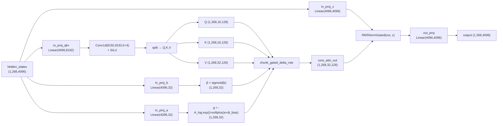

# Qwen3.5 GatedDeltaNet 线性注意力

## 模块整体说明与架构拆解

GatedDeltaNet 是 Qwen3.5 引入的**线性注意力**模块，与标准 Self-Attention 交替排列构成混合 Decoder。核心思想是用 **Gated Delta Rule**（门控增量规则）替代 softmax attention，实现 $O(N)$ 线性复杂度的序列建模。

**设计动机**：标准 Attention 的 $O(N^2)$ 复杂度在超长上下文中成为瓶颈。GatedDeltaNet 维护一个固定大小的**循环状态矩阵** $S \in \mathbb{R}^{d_k \times d_v}$，将注意力计算转化为递推更新。

### 推演样本

沿用 [[qwen3.5_前向传播全链路]] 的统一样本：1 张 448×448 图 + "描述这张图片"，seq_len=268。

### 配置参数（Qwen3.5-27B）

| 参数 | 值 | 说明 |
|------|-----|------|
| hidden_size | 4096 | 输入维度 |
| linear_num_key_heads | 16 | K head 数量 |
| linear_num_value_heads | 32 | V head 数量 |
| linear_key_head_dim | 128 | 每个 K head 维度 |
| linear_value_head_dim | 128 | 每个 V head 维度 |
| linear_conv_kernel_dim | 4 | Conv1d 核大小 |
| key_dim | 16×128 = 2048 | 总 K 维度 |
| value_dim | 32×128 = 4096 | 总 V 维度 |



### 全局代码调用顺序与流转概览

```
Qwen3_5DecoderLayer.forward() [layer_type == "linear_attention"]
  │
  ├─ residual = hidden_states                            # (1, 268, 4096)
  ├─ hidden_states = input_layernorm(hidden_states)      # RMSNorm → (1, 268, 4096)
  │
  └─ Qwen3_5GatedDeltaNet.forward(hidden_states, cache_params, attention_mask)
      │ 文件: models/qwen3_5/modular_qwen3_5.py:207
      │ 输入: (1, 268, 4096)
      │
      ├─ 1. apply_mask_to_padding_states → padding token 置零
      │
      ├─ 2. 四路投影
      │     mixed_qkv = in_proj_qkv(x)    → (1, 268, 8192)  [Q+K+V 拼接]
      │     z = in_proj_z(x)               → (1, 268, 4096)  [门控信号]
      │     b = in_proj_b(x)               → (1, 268, 32)    [写入门原始值]
      │     a = in_proj_a(x)               → (1, 268, 32)    [衰减门原始值]
      │
      ├─ 3. 因果卷积
      │     mixed_qkv: (1, 8192, 268) → Conv1d(k=4) + SiLU → (1, 8192, 268)
      │     → transpose back → (1, 268, 8192)
      │
      ├─ 4. split QKV
      │     split(mixed_qkv, [2048, 2048, 4096])
      │     query:  (1, 268, 2048) → reshape → (1, 268, 16, 128)
      │     key:    (1, 268, 2048) → reshape → (1, 268, 16, 128)
      │     value:  (1, 268, 4096) → reshape → (1, 268, 32, 128)
      │
      ├─ 5. 门控信号
      │     beta = sigmoid(b)                              → (1, 268, 32)
      │     g = -A_log.exp() × softplus(a + dt_bias)       → (1, 268, 32)
      │
      ├─ 6. GKV 扩展 (num_v_heads/num_k_heads = 32/16 = 2)
      │     query = query.repeat_interleave(2, dim=2) → (1, 268, 32, 128)
      │     key = key.repeat_interleave(2, dim=2)     → (1, 268, 32, 128)
      │
      ├─ 7. chunk_gated_delta_rule(q, k, v, g, beta)
      │     输入: q,k (1,268,32,128), v (1,268,32,128), g,beta (1,268,32)
      │     输出: core_attn_out (1, 268, 32, 128)
      │
      ├─ 8. reshape + RMSNormGated
      │     core_attn_out → (268×1, 128)  # flatten batch×seq, per head
      │     z → (268×1, 128)
      │     norm(core_attn_out, z) → (268, 128)
      │     → reshape → (1, 268, 4096)
      │
      └─ 9. out_proj(core_attn_out) → (1, 268, 4096)
```

---

## 子模块详解

### 1. 四路投影层

#### 模块说明

Qwen3.5 将 Qwen3-Next 的融合投影拆分为 4 个独立线性层，便于不同的初始化和张量并行分片。

#### 核心源码解剖

```python
# 文件: models/qwen3_5/modular_qwen3_5.py:190-202
class Qwen3_5GatedDeltaNet(Qwen3NextGatedDeltaNet):
    def __init__(self, config, layer_idx):
        super().__init__(config, layer_idx)
        # 删除 Qwen3-Next 的融合投影
        del self.in_proj_qkvz  # 原: Q,K,V,Z 融合
        del self.in_proj_ba    # 原: B,A 融合

        # key_dim = num_k_heads × head_k_dim = 16 × 128 = 2048
        # value_dim = num_v_heads × head_v_dim = 32 × 128 = 4096
        self.in_proj_qkv = nn.Linear(4096, 2048*2 + 4096, bias=False)
        #                              ↑     ↑Q    ↑K     ↑V
        #                           hidden   2048  2048   4096  = 8192

        self.in_proj_z = nn.Linear(4096, 4096, bias=False)   # 门控
        self.in_proj_b = nn.Linear(4096, 32, bias=False)     # 写入门: 每head一个标量
        self.in_proj_a = nn.Linear(4096, 32, bias=False)     # 衰减门: 每head一个标量
```

#### 推演

输入 `(1, 268, 4096)`：
- `in_proj_qkv`: 4096→8192, 输出 `(1, 268, 8192)`
- `in_proj_z`: 4096→4096, 输出 `(1, 268, 4096)`, reshape→`(1, 268, 32, 128)`
- `in_proj_b`: 4096→32, 输出 `(1, 268, 32)`
- `in_proj_a`: 4096→32, 输出 `(1, 268, 32)`

### 2. 因果卷积 (Causal Conv1d)

#### 模块说明

对 mixed_qkv 做 1D 因果卷积 + SiLU 激活，让每个 token 看到前 `kernel_size-1=3` 个 token 的信息，提供**短距离局部上下文感知**（类似 Mamba 的 Conv1d）。

#### 核心源码解剖

```python
# 文件: models/qwen3_5/modular_qwen3_5.py:229-268
# mixed_qkv: (1, 268, 8192) → transpose → (1, 8192, 268)  channel-first

# ─── 多 token prefill 路径 ───
if use_precomputed_states:
    # 缓存续接: 拼接 conv_state 保证因果性
    mixed_qkv = torch.cat([conv_state, mixed_qkv], dim=-1)
    # conv_state shape: (1, 8192, 3)  # kernel_size-1=3

if cache_params is not None:
    # 保存最新的 conv_state 供下次使用
    new_conv_state = F.pad(mixed_qkv, (4 - mixed_qkv.shape[-1], 0))
    cache_params.update_conv_state(new_conv_state, self.layer_idx)

# 卷积 + 激活
if self.causal_conv1d_fn is not None:
    # 使用 CUDA 优化的 causal_conv1d
    mixed_qkv = self.causal_conv1d_fn(x=mixed_qkv, weight=..., bias=..., activation="silu")
else:
    # 回退到 PyTorch 实现
    mixed_qkv = F.silu(self.conv1d(mixed_qkv)[:, :, :mixed_qkv.shape[-1]])
    # conv1d: nn.Conv1d(8192, 8192, kernel_size=4, groups=8192, padding=3)
    # groups=8192 → depthwise conv, 每个通道独立卷积

# → transpose back → (1, 268, 8192)
```

**为什么用 depthwise conv？** `groups=channels` 意味着每个通道独立卷积，参数量仅 8192×4=32768（而非 8192²×4），既高效又能提供局部上下文。

### 3. 门控信号计算

#### 模块说明

两个门控信号控制状态矩阵 $S$ 的更新行为：
- **β (beta)**：写入门 ∈ (0,1)，控制新信息写入强度
- **g (gate)**：衰减门 < 0，控制历史信息遗忘速率

#### 核心源码解剖

```python
# 文件: models/qwen3_5/modular_qwen3_5.py:285-290

beta = b.sigmoid()
# b: (1, 268, 32) → sigmoid → (1, 268, 32)
# beta ∈ (0,1), 越大则新信息写入越强

g = -self.A_log.float().exp() * F.softplus(a.float() + self.dt_bias)
# A_log: (32,) 可学习参数, 初始化 = uniform(0,16).log()
# dt_bias: (32,) 可学习参数, 初始化 = 全1
# a: (1, 268, 32) 来自 in_proj_a
#
# 计算过程 (以 head 0, token 0 为例, 假设 A_log[0]=2.0, dt_bias[0]=1.0, a=0.3):
#   A = exp(2.0) = 7.389
#   softplus(0.3 + 1.0) = softplus(1.3) = ln(1 + e^1.3) ≈ 1.55
#   g = -7.389 × 1.55 = -11.45
# g 越负 → 历史衰减越快 → 类似"遗忘速率"
```

**物理意义**：
- `A_log` 类似 S4/Mamba 的离散化系数 $A$，控制基础衰减率
- `dt_bias` 类似 Mamba 的 $\Delta t$（时间步长）
- `softplus(a + dt_bias)` 使衰减是**输入依赖的**（data-dependent），不同 token 有不同遗忘速率

### 4. Gated Delta Rule 核心算法

#### 模块说明

维护状态矩阵 $S \in \mathbb{R}^{d_k \times d_v}$，每个 token 的更新规则：

$$S_t = e^{g_t} \cdot S_{t-1} + \beta_t \cdot k_t \cdot (v_t - S_{t-1}^T k_t)^T$$

$$o_t = S_t^T q_t$$

**与标准线性注意力的区别**：
- 标准线性注意力：$S_t = S_{t-1} + k_t v_t^T$（简单累加，无遗忘无误差修正）
- Delta Rule：加入了 $v_t - S_{t-1}^T k_t$（**误差驱动更新** — 只写入新信息，不重复已有信息）
- Gated：加入 $e^{g_t}$（**指数衰减**，让旧信息自动遗忘）和 $\beta_t$（写入门控）

#### 两种实现

```python
# 文件: models/qwen3_5/modular_qwen3_5.py:292-314

if use_precomputed_states and seq_len == 1:
    # === 单 token 解码 (自回归生成) ===
    core_attn_out, last_state = self.recurrent_gated_delta_rule(
        query, key, value, g=g, beta=beta,
        initial_state=recurrent_state,  # (1, 32, 128, 128) 上一步的S
        output_final_state=True,
        use_qk_l2norm_in_kernel=True,
    )
    # 逐 token 递推: O(1) per token
    # 每步: S_new = exp(g) × S_old + beta × k × (v - S_old^T k)^T
    #        output = S_new^T q

else:
    # === 多 token prefill (训练/首次推理) ===
    core_attn_out, last_state = self.chunk_gated_delta_rule(
        query, key, value, g=g, beta=beta,
        initial_state=recurrent_state if use_precomputed_states else None,
        output_final_state=True,
        use_qk_l2norm_in_kernel=True,
    )
    # 分块并行: 将 268 tokens 分成若干 chunk (默认 chunk_size=64)
    # chunk 内用矩阵运算并行计算, chunk 间递推传递状态
    # 268 tokens → ceil(268/64) = 5 个 chunk
```

#### 推演（单 token 解码示例）

假设解码第 269 个 token（前面 268 个已处理完）：
- 输入: `hidden_states (1, 1, 4096)`
- 从 cache 获取: `recurrent_state (1, 32, 128, 128)` — 即 32 个 head 各自的 S 矩阵
- 计算 q,k,v 后: q,k `(1,1,32,128)`, v `(1,1,32,128)`
- 对每个 head i:
  - `S_old = recurrent_state[0, i]`  # (128, 128)
  - `prediction = S_old^T @ k[0,0,i]`  # (128,)
  - `error = v[0,0,i] - prediction`  # (128,)
  - `S_new = exp(g[0,0,i]) × S_old + beta[0,0,i] × k[0,0,i] @ error^T`  # (128, 128)
  - `output[0,0,i] = S_new^T @ q[0,0,i]`  # (128,)
- 输出: `core_attn_out (1, 1, 32, 128)`

### 5. RMSNormGated

#### 模块说明

GatedDeltaNet 输出使用**门控 RMSNorm** — 用 z 信号对归一化后的输出做缩放。

```python
# 继承自 models/qwen3_next/modeling_qwen3_next.py
class Qwen3NextRMSNormGated(nn.Module):
    def __init__(self, hidden_size, eps=1e-6):
        self.weight = nn.Parameter(torch.ones(hidden_size))  # 初始化为0(zero-centered)
        self.variance_epsilon = eps

    def forward(self, hidden_states, gate=None):
        # hidden_states: (batch×seq, 128)  per-head
        hidden_states = hidden_states.float()
        variance = hidden_states.pow(2).mean(-1, keepdim=True)
        hidden_states = hidden_states * torch.rsqrt(variance + self.variance_epsilon)
        hidden_states = (1 + self.weight) * hidden_states  # zero-centered: 初始≡恒等
        if gate is not None:
            hidden_states = hidden_states * F.silu(gate)   # z 门控
        return hidden_states
```

推演：`core_attn_out (1×268, 128)` + `z (1×268, 128)` → 归一化 → ×SiLU(z) → reshape → `(1, 268, 4096)`

---

## 第一性原理：为什么 Delta Rule 比简单线性注意力好？

简单线性注意力 $S_t = S_{t-1} + k_t v_t^T$ 的问题：
1. **状态污染**：旧信息永不衰减，S 矩阵会"饱和"
2. **重复写入**：如果两个 token 的 key 相同但 value 不同，会叠加而非覆盖

Delta Rule 的改进：
1. **误差驱动**：$v_t - S_{t-1}^T k_t$ 只写入 S 还不知道的信息（类似 Hebbian 学习的误差修正）
2. **指数衰减**：$e^{g_t}$ 让旧信息自动遗忘，S 不会饱和
3. **门控写入**：$\beta_t$ 控制写入强度，模型可以选择性地忽略某些 token

---

## 版本演化对比

| 维度 | Qwen3-Next | Qwen3.5 |
|------|------------|---------|
| 投影 | `in_proj_qkvz` + `in_proj_ba`（融合） | 拆分为 4 个独立 Linear |
| Forward | 基类实现 | 完全覆写，独立 cache 管理 |
| 核心算法 | Gated Delta Rule | 相同 |
| RMSNormGated | (1+weight) zero-centered | 相同 |

---

## 关联概念

- [[qwen3.5_前向传播全链路]] — 全链路流转 ✅ 支持
- [[qwen3.5_混合decoder架构]] — Attention/GDN 交替策略 ✅ 支持
- [[swiglu_门控激活函数]] — 门控思想类比 ✅ 支持
- [[rmsnorm_归一化]] — RMSNormGated 基础 🔄 演化自

## 参考来源

- `transformers/src/transformers/models/qwen3_5/modular_qwen3_5.py:190-327`
- `transformers/src/transformers/models/qwen3_next/modeling_qwen3_next.py:498-716`
