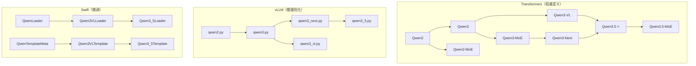
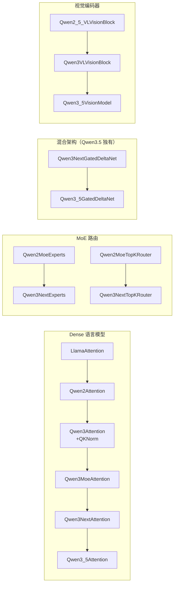

# Qwen 全系列代码地图

> **本卡片是 Qwen 代码阅读的总入口。** 任何涉及"看 Qwen 代码"的需求，都应先查阅本卡片定位目标文件，再决定是否需要打开源码。

## 总体架构概览

Qwen 代码分布在 4 个仓库中，各自职责不同：

| 仓库 | 职责 | 根路径 |
|------|------|--------|
| **transformers** | 模型定义（权威实现）：Configuration、Modeling、Tokenizer、Processor | `transformers/src/transformers/models/` |
| **vLLM** | 高性能推理：张量并行、KV Cache、PagedAttention 优化版模型 | `vllm/vllm/model_executor/models/` |
| **Swift** | 微调框架：模型加载器、对话模板、Agent 模板 | `swift/swift/` |
| **LLaMA-Factory** | 训练框架：模板渲染、多模态插件、转换脚本 | `LLaMA-Factory/src/llamafactory/` |

---

## 一、Transformers — 模型定义层（核心）

### 1.1 Qwen 模型家族继承关系

> **关键设计**：Transformers 使用 `modular_*.py` 定义继承差异，自动生成 `modeling_*.py`（完整展开版）和 `configuration_*.py`。**阅读继承关系看 modular 文件，阅读完整实现看 modeling 文件。**

### 1.2 文件清单与职责

#### Qwen2（基座语言模型）

| 文件 | 核心类/函数 | 说明 |
|------|------------|------|
| `models/qwen2/configuration_qwen2.py` | `Qwen2Config` | 基础配置 |
| `models/qwen2/modeling_qwen2.py` | `Qwen2Model`, `Qwen2ForCausalLM`, `Qwen2Attention`, `Qwen2MLP`, `Qwen2DecoderLayer` | 标准 Dense Transformer |
| `models/qwen2/modular_qwen2.py` | 继承自 `LlamaAttention`, `LlamaMLP`, `MistralModel` | 差异定义：sliding window + 自定义 MLP |
| `models/qwen2/tokenization_qwen2.py` | `Qwen2Tokenizer` | BPE Tokenizer |

#### Qwen3（+QKNorm）

| 文件 | 核心类/函数 | 说明 |
|------|------------|------|
| `models/qwen3/configuration_qwen3.py` | `Qwen3Config` | 新增 `qk_norm` 等参数 |
| `models/qwen3/modeling_qwen3.py` | `Qwen3Attention`(+QKNorm), `Qwen3MLP`(继承GemmaMLP), `Qwen3Model`, `Qwen3ForCausalLM` | Dense LLM + QK归一化 |
| `models/qwen3/modular_qwen3.py` | 继承自 `LlamaAttention` 并覆写 QKNorm | 核心差异：attention 内 q_norm/k_norm |

#### Qwen3-MoE（稀疏专家）

| 文件 | 核心类/函数 | 说明 |
|------|------------|------|
| `models/qwen3_moe/modeling_qwen3_moe.py` | `Qwen3MoeSparseMoeBlock`, `Qwen3MoeExperts`, `Qwen3MoeTopKRouter`, `Qwen3MoeDecoderLayer` | MoE 路由 + 专家并行 |
| `models/qwen3_moe/modular_qwen3_moe.py` | 继承链复杂 | Top-K 路由、load balancing loss |

#### Qwen3-Next（混合架构：Attention + GatedDeltaNet）⭐

| 文件 | 核心类/函数 | 说明 |
|------|------------|------|
| `models/qwen3_next/configuration_qwen3_next.py` | `Qwen3NextConfig` | 新增 `attn_layer_indices`, `conv_kernel_size`, `short_conv_kernel_size` 等混合层参数 |
| `models/qwen3_next/modeling_qwen3_next.py` | `Qwen3NextGatedDeltaNet`⭐, `Qwen3NextAttention`, `Qwen3NextDecoderLayer`, `Qwen3NextSparseMoeBlock`, `Qwen3NextModel` | **Gated Delta Rule 线性注意力** — Qwen3.5 的核心创新模块 |
| `models/qwen3_next/modular_qwen3_next.py` | 继承自 `Qwen3MoeAttention`, `Qwen2MoeExperts` 等 | GatedDeltaNet 完全新增，不继承 |

> **`Qwen3NextGatedDeltaNet`** 是 Qwen3.5 引入的线性注意力层，与标准 Attention 交替排列（混合架构）。核心函数：`torch_chunk_gated_delta_rule()`, `torch_recurrent_gated_delta_rule()`。

#### Qwen3-VL（视觉语言模型）

| 文件 | 核心类/函数 | 说明 |
|------|------------|------|
| `models/qwen3_vl/configuration_qwen3_vl.py` | `Qwen3VLConfig`, `Qwen3VLVisionConfig`, `Qwen3VLTextConfig` | 三段式配置：Vision + Text + 顶层 |
| `models/qwen3_vl/modeling_qwen3_vl.py` | `Qwen3VLVisionModel`, `Qwen3VLModel`, `Qwen3VLForConditionalGeneration`, `Qwen3VLVisionPatchEmbed`, `Qwen3VLVisionPatchMerger` | ViT + PatchMerger + LLM 全链路 |
| `models/qwen3_vl/modular_qwen3_vl.py` | 继承自 `Qwen2_5_VLVisionBlock`, `Qwen2VLModel` 等 | Vision 模块从 Q2.5-VL 演化 |
| `models/qwen3_vl/processing_qwen3_vl.py` | `Qwen3VLProcessor` | 图文预处理：图像缩放 + 视频采样 |
| `models/qwen3_vl/video_processing_qwen3_vl.py` | `Qwen3VLVideoProcessor`, `smart_resize()` | 视频帧处理 |

#### Qwen3.5（混合视觉语言模型 — 当前最新）⭐⭐

| 文件 | 核心类/函数 | 说明 |
|------|------------|------|
| `models/qwen3_5/configuration_qwen3_5.py` | `Qwen3_5Config`, `Qwen3_5TextConfig`(←Qwen3NextConfig), `Qwen3_5VisionConfig`(←Qwen3VLVisionConfig) | **Text 继承 Qwen3-Next（混合架构），Vision 继承 Qwen3-VL** |
| `models/qwen3_5/modeling_qwen3_5.py` | `Qwen3_5GatedDeltaNet`, `Qwen3_5Attention`, `Qwen3_5DecoderLayer`, `Qwen3_5VisionModel`, `Qwen3_5TextModel`, `Qwen3_5Model`, `Qwen3_5ForConditionalGeneration`, `Qwen3_5ForCausalLM` | 完整展开：Vision + 混合Decoder + 条件生成 |
| `models/qwen3_5/modular_qwen3_5.py` | 核心继承：`Qwen3_5TextConfig←Qwen3NextConfig`, `Qwen3_5VisionModel←Qwen3VLVisionModel`, `Qwen3_5Model←Qwen3VLModel`, `Qwen3_5ForConditionalGeneration←Qwen3VLForConditionalGeneration` | **阅读继承关系的入口文件** |
| `models/qwen3_5/tokenization_qwen3_5.py` | `Qwen3_5Tokenizer` | Tokenizer |

> **Qwen3.5 架构公式**：`Qwen3.5 = Qwen3-VL 的视觉管线 + Qwen3-Next 的混合 Decoder（Attention 交替 GatedDeltaNet）`

#### Qwen3.5-MoE（混合视觉 + MoE）

| 文件 | 核心类/函数 | 说明 |
|------|------------|------|
| `models/qwen3_5_moe/modular_qwen3_5_moe.py` | `Qwen3_5MoeForConditionalGeneration←Qwen3VLMoeForConditionalGeneration` | 在 Qwen3.5 基础上叠加 MoE 专家路由 |
| `models/qwen3_5_moe/modeling_qwen3_5_moe.py` | `Qwen3_5MoeGatedDeltaNet`, `Qwen3_5MoeSparseMoeBlock`, `Qwen3_5MoeDecoderLayer`, `load_balancing_loss_func()` | MoE 版完整展开 |

#### 其他变体（速查）

| 模型目录 | 基于 | 核心差异 |
|----------|------|----------|
| `qwen2_vl/` | Qwen2 + ViT | 首个视觉语言版，含 `image_processing_qwen2_vl.py` |
| `qwen2_5_vl/` | Qwen2-VL 演化 | NaViT 动态分辨率、MRoPE、Conv3D PatchEmbed |
| `qwen2_moe/` | Qwen2 | 早期 MoE 版 |
| `qwen2_audio/` | Qwen2 | 音频理解 |
| `qwen2_5_omni/` | Qwen2.5-VL | 全模态（视觉+音频+文本），50+ 类 |
| `qwen3_vl_moe/` | Qwen3-VL + MoE | 视觉语言 MoE 版 |
| `qwen3_omni_moe/` | Qwen3-VL-MoE + Audio | 全模态 MoE，60 类，最复杂 |
| `colqwen2/` | Qwen2-VL | ColPali 文档检索 |

---

## 二、vLLM — 推理优化层

### 2.1 核心模型文件

> vLLM 的模型**不继承** Transformers 的类，而是独立实现，针对推理优化（张量并行、KV Cache、PagedAttention）。

| 文件 | 核心类 | 对应 Transformers |
|------|--------|-------------------|
| `models/qwen2.py` | `Qwen2Model`, `Qwen2ForCausalLM`, `Qwen2Attention` | qwen2 |
| `models/qwen3.py` | `Qwen3Model(←Qwen2Model)`, `Qwen3ForCausalLM`, `Qwen3Attention` | qwen3 |
| `models/qwen3_moe.py` | `Qwen3MoeModel`, `Qwen3MoeSparseMoeBlock` | qwen3_moe |
| `models/qwen3_next.py` | `Qwen3NextModel`, `Qwen3NextDecoderLayer`, `QwenNextMixtureOfExperts` | qwen3_next |
| `models/qwen3_vl.py` | `Qwen3VLForConditionalGeneration`, `Qwen3_VisionTransformer`, `Qwen3VLProcessingInfo`, `Qwen3VLMultiModalProcessor` | qwen3_vl |
| `models/qwen3_5.py` ⭐ | `Qwen3_5ForCausalLM`, `Qwen3_5ForConditionalGeneration`, `Qwen3_5Model(←Qwen3NextModel)`, `Qwen3_5DecoderLayer(←Qwen3NextDecoderLayer)` | qwen3_5 |
| `models/qwen3_5_mtp.py` | `Qwen3_5MultiTokenPredictor`, `Qwen3_5MTP` | Multi-Token Prediction 推测解码 |
| `models/qwen3_dflash.py` | `DFlashQwen3Attention`, `DFlashQwen3ForCausalLM` | DFlash 优化注意力 |

### 2.2 辅助文件

| 文件 | 说明 |
|------|------|
| `transformers_utils/configs/qwen3_5.py` | vLLM 自定义配置（`Qwen3_5Config`, `Qwen3_5TextConfig`, `Qwen3_5VisionConfig`） |
| `transformers_utils/configs/qwen3_5_moe.py` | MoE 版配置 |
| `transformers_utils/configs/qwen3_next.py` | Qwen3-Next 配置 |
| `reasoning/qwen3_reasoning_parser.py` | `Qwen3ReasoningParser` — 思维链解析（`<think>`标签） |
| `tool_parsers/qwen3coder_tool_parser.py` | `Qwen3CoderToolParser` — 工具调用解析 |
| `tool_parsers/qwen3xml_tool_parser.py` | `Qwen3XMLToolParser` — XML 格式工具调用 |
| `tokenizers/qwen_vl.py` | Qwen-VL 专用 Tokenizer |

### 2.3 其他 vLLM 模型（速查）

| 文件 | 说明 |
|------|------|
| `qwen.py` / `qwen_vl.py` | Qwen1 / Qwen1-VL（旧版） |
| `qwen2_5_vl.py` | Qwen2.5-VL 推理 |
| `qwen2_5_omni_thinker.py` | Qwen2.5-Omni |
| `qwen2_audio.py` | Qwen2-Audio |
| `qwen2_moe.py` | Qwen2-MoE |
| `qwen2_rm.py` | Qwen2 Reward Model |
| `qwen3_asr.py` / `qwen3_asr_forced_aligner.py` / `qwen3_asr_realtime.py` | Qwen3 语音识别系列 |
| `qwen3_vl_moe.py` | Qwen3-VL-MoE |
| `qwen3_omni_moe_thinker.py` | Qwen3-Omni-MoE（含 AudioEncoder） |
| `qwen3_next_mtp.py` | Qwen3-Next Multi-Token Prediction |
| `colqwen3.py` / `colqwen3_5.py` | ColQwen 文档检索 |

---

## 三、Swift — 微调框架层

### 3.1 模型加载器 (`swift/model/models/qwen.py`)

加载器负责模型初始化、权重加载、特殊 patch 等：

| 类/函数 | 说明 |
|---------|------|
| `QwenLoader` | Qwen1 基础加载器 |
| `QwenVLLoader(←QwenLoader)` | Qwen1-VL |
| `Qwen2VLLoader(←ModelLoader)` | Qwen2-VL 系列 |
| `Qwen2_5VLLoader(←Qwen2VLLoader)` | Qwen2.5-VL |
| `Qwen3VLLoader(←Qwen2VLLoader)` | Qwen3-VL |
| `Qwen3VLMoeLoader(←Qwen3VLLoader)` | Qwen3-VL-MoE |
| `Qwen3_5Loader(←Qwen3VLLoader)` ⭐ | **Qwen3.5 加载器** |
| `Qwen3_5MoeLoader(←Qwen3VLLoader)` | Qwen3.5-MoE |
| `Qwen2_5OmniLoader(←ModelLoader)` | Qwen2.5-Omni |
| `_run_qwen3_5_gated_delta_net_sequence_parallel_forward()` | Qwen3.5 GatedDeltaNet 序列并行 forward |
| `_patch_qwen3_5_linear_attention_sequence_parallel()` | Qwen3.5 线性注意力序列并行 patch |

### 3.2 对话模板 (`swift/template/templates/qwen.py`)

| 类 | 说明 |
|----|------|
| `QwenTemplateMeta(←ChatmlTemplateMeta)` | 基础 ChatML 模板 |
| `Qwen2VLTemplate(←Template)` | Qwen2-VL 多模态模板（含图像/视频处理） |
| `Qwen2_5VLTemplate(←Qwen2VLTemplate)` | Qwen2.5-VL |
| `Qwen3VLTemplate(←Qwen2VLTemplate)` | Qwen3-VL |
| `Qwen3_5Template(←Qwen3VLTemplate)` ⭐ | **Qwen3.5 对话模板** |

### 3.3 Agent 模板

| 文件 | 核心类 | 说明 |
|------|--------|------|
| `agent_template/qwen.py` | `QwenEnAgentTemplate`, `QwenZhAgentTemplate` | 中英文 Agent |
| `agent_template/qwen3_coder.py` | `Qwen3CoderAgentTemplate`, `Qwen3_5AgentTemplate` | Qwen3.5 Agent 模板 |

---

## 四、LLaMA-Factory — 训练框架层

### 4.1 模板文件

| 文件 | 核心函数 | 说明 |
|------|----------|------|
| `v1/plugins/model_plugins/templates/qwen3.py` | `render_qwen3_messages()`, `parse_qwen3_message()` | Qwen3 对话渲染与解析（含 `<think>` 标签处理） |
| `v1/plugins/model_plugins/templates/qwen3_nothink.py` | `render_qwen3_nothink_messages()`, `parse_qwen3_nothink_message()` | 无思维链版本 |

### 4.2 Qwen 相关引用文件（间接）

这些文件中包含 Qwen 特殊处理的条件分支：

| 文件 | 涉及内容 |
|------|----------|
| `data/mm_plugin.py` | 多模态数据预处理 (Qwen-VL 图像嵌入) |
| `data/template.py` | 对话模板注册（Qwen 系列） |
| `data/tool_utils.py` | 工具调用格式 |
| `extras/constants.py` | 模型名称常量注册 |
| `model/loader.py` | 模型加载（Qwen 特殊分支） |
| `model/model_utils/visual.py` | 视觉模块处理 |
| `model/model_utils/moe.py` | MoE 负载均衡 |
| `model/patcher.py` | 模型 monkey-patch |

### 4.3 工具脚本

| 文件 | 说明 |
|------|------|
| `scripts/bench_qwen.py` | Qwen 性能基准测试 |
| `scripts/convert_ckpt/llamafy_qwen.py` | Qwen→LLaMA 格式权重转换 |
| `scripts/convert_ckpt/tiny_qwen3.py` | 创建 tiny Qwen3 测试模型 |
| `scripts/qwen_omni_merge.py` | Qwen-Omni LoRA 合并 |

### 4.4 训练配置示例（YAML）

| 场景 | 示例文件 |
|------|----------|
| Qwen3.5-MoE LoRA SFT | `examples/ktransformers/train_lora/qwen3_5moe_lora_sft_kt.yaml` |
| Qwen3.5 Full SFT (FSDP2) | `examples/accelerate/fsdp2_config_qwen35.yaml`, `examples/ascend/qwen3_5_full_sft_fsdp2.yaml` |
| Qwen3 推理 | `examples/inference/qwen3.yaml` |
| Qwen3-VL 推理 | `examples/inference/qwen3vl.yaml` |
| Qwen2-VL Megatron | `examples/megatron/qwen2_vl_full.yaml` |

---

## 五、Qwen3.5 代码阅读路线图

> **推荐阅读顺序**：先理解继承关系（modular），再看完整实现（modeling），最后看推理/训练适配。

### 第一步：理解架构继承（30 分钟）

1. 📖 `qwen3_5/modular_qwen3_5.py` — 看清继承：Text←Qwen3Next, Vision←Qwen3VL
2. 📖 `qwen3_next/modular_qwen3_next.py` — 理解 GatedDeltaNet 的完整定义

### 第二步：阅读核心实现（2-3 小时）

3. 📖 `qwen3_5/modeling_qwen3_5.py` — 完整展开的模型代码
   - 重点类：`Qwen3_5GatedDeltaNet`（线性注意力）、`Qwen3_5DecoderLayer`（混合层）
   - 重点类：`Qwen3_5VisionModel`（ViT）、`Qwen3_5ForConditionalGeneration`（VL 入口）
4. 📖 `qwen3_5/configuration_qwen3_5.py` — 理解配置参数

### 第三步：推理部署适配（1 小时）

5. 📖 `vllm/.../qwen3_5.py` — vLLM 推理优化版
6. 📖 `vllm/.../qwen3_5_mtp.py` — Multi-Token Prediction

### 第四步：训练微调适配（1 小时）

7. 📖 `swift/.../qwen.py` — `Qwen3_5Loader` 和 GatedDeltaNet 序列并行
8. 📖 `swift/.../templates/qwen.py` — `Qwen3_5Template` 对话模板

---

## 关联概念

- [[qwen3.5_原生多模态训练范式]] — Qwen3.5 训练策略 🔄 演化自 [[qwen2.5_vl_三阶段预训练]]
- [[vit_核心原理与结构]] — Vision 编码器基础 ✅ 支持
- [[conv3d_时空切块器]] — PatchEmbed 实现 ✅ 支持
- [[patchmerger_空间降维]] — PatchMerger 实现 ✅ 支持
- [[window_attention_交错注意力]] — ViT 内的注意力机制 ✅ 支持
- [[mrope_多模态位置编码]] — LLM 内的位置编码 ✅ 支持
- [[swiglu_门控激活函数]] — MLP 激活函数 ✅ 支持
- [[rmsnorm_归一化]] — 归一化层 ✅ 支持
- [[qwen2.5_vl_预处理流水线]] — 预处理管线 🔄 演化自

## 参考来源

- `transformers/src/transformers/models/qwen3_5/` — Qwen3.5 Transformers 实现
- `vllm/vllm/model_executor/models/qwen3_5.py` — vLLM 推理实现
- `swift/swift/model/models/qwen.py` — Swift 模型加载器
- `LLaMA-Factory/src/llamafactory/v1/plugins/model_plugins/templates/qwen3.py` — LLaMA-Factory 模板
