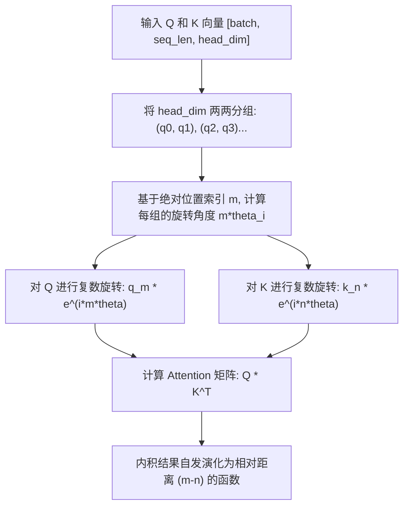

# RoPE 旋转位置编码

## 模块整体说明与架构拆解

旋转位置编码（Rotary Positional Embedding, 简称 **RoPE**）由苏剑林等于 2021 年提出（模型名为 Roformer）。它是目前所有主流大语言模型（如 LLaMA, Qwen, ChatGLM）标配的位置编码方案。

RoPE 的核心哲学是：**“通过操作绝对位置，达到相对位置的效果”**。它既保留了绝对位置编码的实现效率（直接作用于 Q 和 K），又具备了相对位置编码的强表达能力和优秀的长度外推性。

### 架构流转图示
RoPE 并不像传统的绝对位置编码那样直接“加”到输入序列的 Embedding 上，而是**在 Attention 计算内部、矩阵相乘之前**，通过对 $Q$ (Query) 和 $K$ (Key) 的向量维度进行成对的二维平面旋转来实现。



## 核心算法原理详解

### 1. 第一性原理与复数推导
我们希望寻找一个函数 $f(q, m)$ 和 $f(k, n)$，使得它们的内积只与相对位置 $m-n$ 有关：
$$ \langle f(q, m), f(k, n) \rangle = g(q, k, m-n) $$

如果我们将二维向量 $[q_0, q_1]$ 视为复平面的复数 $q_0 + i q_1$，那么如果在向量上乘以一个旋转因子 $e^{im\theta}$，就相当于在复平面上旋转了 $m\theta$ 的角度：
$$ f(q, m) = q e^{im\theta} $$
同理对于 $k$：
$$ f(k, n) = k e^{in\theta} $$

它们的复数内积（对应二维向量点积）为：
$$ \langle q e^{im\theta}, k e^{in\theta} \rangle = \text{Re}[q e^{im\theta} (k e^{in\theta})^*] = \text{Re}[q k^* e^{i(m-n)\theta}] $$

**物理意义**：虽然我们在操作 $Q$ 和 $K$ 时，使用的是它们各自的绝对位置（$m$ 和 $n$），但当这两个向量在 Attention 里进行点积相乘时，绝对位置的旋转神奇地相互抵消，剩下的角度只取决于它们在序列中的距离差距 $(m-n)$。

### 2. 多维扩展与旋转矩阵
实际上大模型的 `head_dim` 远不止 2 维（例如 128 维）。RoPE 的做法是将 128 维两两分组，变成 64 组二维向量。
对于第 $i$ 组，赋予一个固定的基础旋转频率 $\theta_i = 10000^{-2i/d}$。

整体而言，操作等价于乘以一个分块对角旋转矩阵 $\mathcal{R}_m$：
$$ \mathcal{R}_m = \begin{pmatrix} \cos m\theta_0 & -\sin m\theta_0 & 0 & 0 & \dots \\ \sin m\theta_0 & \cos m\theta_0 & 0 & 0 & \dots \\ 0 & 0 & \cos m\theta_1 & -\sin m\theta_1 & \dots \\ 0 & 0 & \sin m\theta_1 & \cos m\theta_1 & \dots \\ \dots & \dots & \dots & \dots & \ddots \end{pmatrix} $$

## 核心源码解剖与 Torch 对齐

在 PyTorch 的工业级实现中，为了极致的计算效率，我们不会真的去构建那个巨大的稀疏分块对角矩阵。而是利用下面这个恒等式将矩阵乘法转化为逐元素乘法和加法：

$$ \begin{pmatrix} x_0 \\ x_1 \end{pmatrix} \otimes \begin{pmatrix} \cos m\theta \\ \cos m\theta \end{pmatrix} + \begin{pmatrix} -x_1 \\ x_0 \end{pmatrix} \otimes \begin{pmatrix} \sin m\theta \\ \sin m\theta \end{pmatrix} $$

**工业级主流实现步骤**：
1. **拆分重组 (Rotate Half)**：不采用严格的“相邻两两成对”，而是把向量的前半部分 $x_{0\dots d/2}$ 和后半部分 $x_{d/2 \dots d}$ 视为一对复数的实部和虚部。这样 `rotate_half` 就可以通过简单的切片和 `torch.cat` 完成：
```python
def rotate_half(x):
    """把特征分为前后两半，将虚部取负后拼接在实部前，这等价于实现了 (-x1, x0) 的效果"""
    x1 = x[..., : x.shape[-1] // 2]
    x2 = x[..., x.shape[-1] // 2 :]
    return torch.cat((-x2, x1), dim=-1)
```

2. **应用旋转 (Apply Rotary)**：
```python
def apply_rotary_pos_emb(q, k, cos, sin):
    # q, k shape: [batch_size, seq_len, num_heads, head_dim]
    # cos, sin shape: [1, seq_len, 1, head_dim]
    q_embed = (q * cos) + (rotate_half(q) * sin)
    k_embed = (k * cos) + (rotate_half(k) * sin)
    return q_embed, k_embed
```

## 关联概念
- ➡️ 衍生为视觉空间的二维扩展：[[2d_rope_视觉位置编码]]
- ➡️ 衍生为多模态架构的最终归宿：[[mrope_多模态位置编码]]
- 广泛应用于所有主流 Transformer 底座架构。