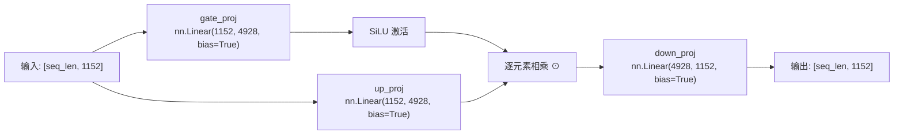

# SwiGLU 门控激活函数

## 模块整体说明

SwiGLU (Swish-Gated Linear Unit) 是 Qwen 全系列模型的 MLP（前馈神经网络）中所使用的激活函数架构。它取代了传统 Transformer 中的 ReLU 和 GELU，通过引入**门控机制**让模型更精准地控制信息流过，在同等参数量下带来显著性能提升。

**直观比喻**：传统 MLP 就像一条单管水渠——水（信息）进来，经过一个阀门（ReLU 激活函数，只有"全开"和"全关"两种状态），再流出去。SwiGLU 则升级为**双管水渠**——一条管子算"这条信息值多少分"（Gate 门控信号），另一条管子传送原始信息（Up 通道）。两者一相乘，就实现了对信息的**平滑精细控制**——不再是简单的开/关，而是 0%~100% 无级调节。

**在全链路中的位置**：SwiGLU MLP 位于每一个 VisionBlock 的后半部分（在 [[window_attention_交错注意力]] 之后），以及 LLM 骨干网的每一层 Decoder Block 中。

---

## 逻辑链输入与输出

- **逻辑链（输入）**：经 Attention + RMSNorm 处理后的特征 `[seq_len, hidden_size]`（ViT 中为 1152，LLM 中为 4096）。
- **逻辑链（输出）**：同维度 `[seq_len, hidden_size]`，语义更深。

---

## 核心算法原理详解

### 1. 传统 MLP vs SwiGLU MLP

**传统 MLP（Qwen2-VL ViT 中使用的 GELU MLP）**：

$$FFN(x) = GELU(x W_1) W_2$$

两层全连接中间夹一个激活函数，结构简单直接。

**SwiGLU MLP（Qwen2.5-VL 开始使用）**：

$$SwiGLU(x) = \left(SiLU(x W_{gate}) \odot x W_{up}\right) W_{down}$$

三步计算：
1. **门控信号**：$Gate = SiLU(x W_{gate})$，其中 $SiLU(z) = z \cdot \sigma(z)$（$\sigma$ 是 Sigmoid）
2. **上行特征**：$Up = x W_{up}$
3. **逐元素乘法 + 下行映射**：$Output = (Gate \odot Up) W_{down}$

### 2. SiLU / Swish 激活函数详解

SiLU (Sigmoid Linear Unit)，也称 Swish（当 $\beta=1$ 时），其数学定义为：

$$SiLU(x) = x \cdot \sigma(x) = \frac{x}{1 + e^{-x}}$$

**特性**：
- 非单调：在 $x \approx -1.28$ 处有最小值约 $-0.278$
- 对负值有轻微负响应（与 ReLU 的"一刀切"不同），能保留微弱的负方向梯度
- 在正值方向渐近趋向恒等映射 $y = x$

**为什么优于 ReLU？** ReLU 对负值完全截断（输出 0），导致"神经元死亡"问题。SiLU 对负值有轻微的负响应，保留了梯度流通。

### 3. 门控机制的数学直觉

**为什么加门控？** 关键在于**逐元素乘法 $\odot$**。

设 $Gate_i$ 是第 $i$ 个维度的门控值（0~1 之间），$Up_i$ 是第 $i$ 个维度的原始特征值。那么 $(Gate \odot Up)_i = Gate_i \times Up_i$。当 $Gate_i \approx 0$ 时，无论 $Up_i$ 多大，这个维度都被"关闭"；当 $Gate_i \approx 1$ 时，$Up_i$ 完全通过。

这就像一个可调节的混音台——Gate 通道决定每个频道的音量，Up 通道是原始音频信号。

### 4. 数值计算示例（Qwen2.5-VL ViT 中的参数）

ViT 中：`hidden_size = 1152`，`intermediate_size = 4928`

```
输入: x = [seq_len, 1152]

Step 1: gate = gate_proj(x)  →  [seq_len, 4928]   # nn.Linear(1152, 4928)
Step 2: up = up_proj(x)      →  [seq_len, 4928]   # nn.Linear(1152, 4928)
Step 3: gate = SiLU(gate)    →  [seq_len, 4928]   # 逐元素 SiLU 激活
Step 4: hidden = gate * up   →  [seq_len, 4928]   # 逐元素相乘（门控！）
Step 5: out = down_proj(hidden) → [seq_len, 1152]  # nn.Linear(4928, 1152)
```

### 5. Qwen2.5-VL ViT 中 bias=True 的特殊设计

**极其重要的设计差异**：在 Qwen2.5-VL 的 ViT MLP 中，`gate_proj`、`up_proj`、`down_proj` 全部**开启了 `bias=True`**。

**物理原因**：图像是连续物理信号的模拟值，由摄像头传感器采集。传感器固有的电子噪声会在信号中引入一个常量偏移——即**直流偏移（DC Offset）**。如果 MLP 全部是 `bias=False`（像 LLaMA 那样），网络只能拟合"过原点"的线性变换，无法消除这个常量底噪，被迫浪费宝贵的权重空间去间接拟合它。加上 bias 后，网络可以直接用一个常量项来消除 DC Offset。

**与 Qwen2-VL 的对比**：

| 特性 | Qwen2-VL VisionMLP | Qwen2.5-VL VisionMLP |
|------|--------------------|--------------------|
| 架构 | 标准两层 MLP (fc1 → act → fc2) | SwiGLU (gate × up → down) |
| 激活函数 | GELU (`quick_gelu`) | SiLU (`silu`) |
| 偏置 | 无 bias | **有 bias** |
| 门控 | 无 | **有** |

---

## 架构与代码流程图



---

## 源码逐行解剖

**代码路径**：`transformers/src/transformers/models/qwen2_5_vl/modeling_qwen2_5_vl.py`

```python
class Qwen2_5_VLMLP(nn.Module):
    def __init__(self, config, bias: bool = False):
        super().__init__()
        self.hidden_size = config.hidden_size          # 1152
        self.intermediate_size = config.intermediate_size  # 4928
        # 三个可训练线性层，全部带 bias
        self.gate_proj = nn.Linear(self.hidden_size, self.intermediate_size, bias=bias)
        self.up_proj = nn.Linear(self.hidden_size, self.intermediate_size, bias=bias)
        self.down_proj = nn.Linear(self.intermediate_size, self.hidden_size, bias=bias)
        self.act_fn = ACT2FN[config.hidden_act]  # config.hidden_act = "silu"

    def forward(self, hidden_state):
        # SwiGLU 三步：门控激活 × 上行特征 → 下行映射
        return self.down_proj(
            self.act_fn(self.gate_proj(hidden_state)) * self.up_proj(hidden_state)
        )
```

**Qwen2-VL 的旧版 VisionMLP 对比**：
```python
class VisionMlp(nn.Module):
    def __init__(self, dim: int, hidden_dim: int, hidden_act: str) -> None:
        super().__init__()
        self.fc1 = nn.Linear(dim, hidden_dim)       # 无门控，单路
        self.act = ACT2FN[hidden_act]                # quick_gelu
        self.fc2 = nn.Linear(hidden_dim, dim)

    def forward(self, x) -> torch.Tensor:
        return self.fc2(self.act(self.fc1(x)))        # 简单的两层 MLP
```

---

## 关联概念

- ✅ 支持 [[qwen2.5_vl_技术报告解析]]：ViT MLP 从 GELU 升级为 SwiGLU + bias 是核心改进。
- 与 [[window_attention_交错注意力]] 共同组成 VisionBlock 的双核心。
- 与 [[rmsnorm_归一化]] 配合使用（Pre-Norm 架构）。
- 🔄 演化自 Qwen2-VL 的 `quick_gelu` 两层 MLP。
- 在 LLM 骨干网中也使用同架构的 SwiGLU（但 `bias=False`，因为文本没有 DC Offset 问题）。

## 参考来源

- 原始资料：`knowledge_base/Qwen2.5-VL/Qwen2.5-VL.md`
- 学习指南：`knowledge_base/Qwen_Architecture_Guides/qwen_learning_guide_phase1.md`
- 前置知识：`qwen_learning_guide_phase0.md` §2 SwiGLU
