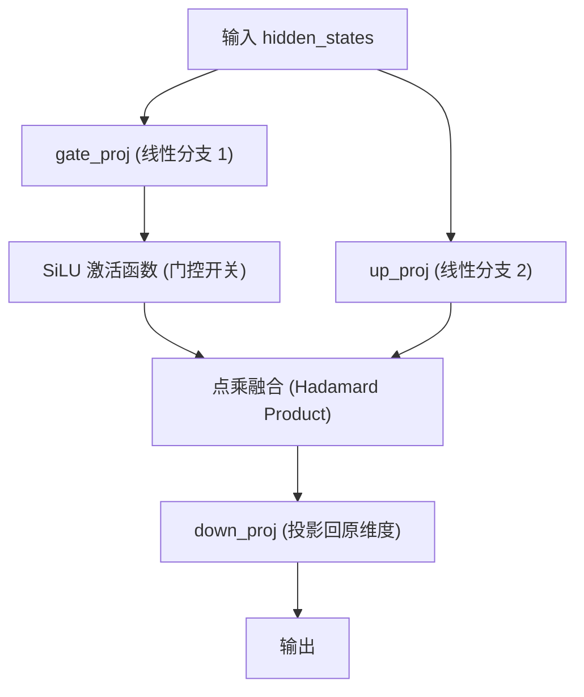

# SwiGLU 门控激活函数 (Vision MLP)

## 模块整体说明与架构拆解

SwiGLU 是 Qwen2.5-VL 视觉编码器中前馈网络（FFN/MLP）的核心结构。它不仅负责特征的非线性变换，更充当了一个**“语义过滤器”**，通过门控机制决定哪些视觉特征应该被保留，哪些噪声应该被滤除。

### 内部架构流转
在 `Qwen2_5_VLMLP` 中，数据流转遵循“分叉 $\rightarrow$ 门控激活 $\rightarrow$ 合流”的逻辑：



---

## 逻辑链输入与输出

- **逻辑链（输入）**：`hidden_states` [seq_len, 1152]。
- **逻辑链（输出）**：经过非线性变换后的 `hidden_states` [seq_len, 1152]。

---

## 核心算法原理详解

### 1. 从 ReLU 到 SwiGLU (第一性原理)

**传统方案 (ReLU/GELU)**：
简单的非线性激活。就像一个简单的阈值开关：高于 0 就通过，低于 0 就切断。

**SwiGLU 的精髓 (门控机制)**：
SwiGLU 是 Swish 激活函数与门控线性单元（GLU）的结合。它的数学表达式为：
$$SwiGLU(x, W, V, b, c) = (Swish_{\beta}(xW + b)) \otimes (xV + c)$$
其中 $Swish(x) = x \cdot \sigma(\beta x)$。
- **物理直觉**：`up_proj` 分支提供了“原始素材”，而 `gate_proj` + `SiLU` 分支产出了一个“控制掩码”。两者相乘，实现了对视觉信息的精细化选择。

### 2. Qwen2.5-VL 的核心变动：开启 Bias

**惊人细节：为什么 LLM 不用偏置，ViT 却要用？**
在 LLaMA 等纯文本大模型中，`bias` 默认设为 `False` 以追求极致的训练稳定性。但在 Qwen2.5-VL 的视觉侧，MLP 的三层线性投影（`gate`, `up`, `down`）全部显式开启了 **`bias=True`**。

*   **第一性原理推导**：
    1.  **物理背景**：文本 Token 是离散的符号，没有所谓的“本底噪声”。但视觉 Patch 是物理传感器采集的模拟信号。
    2.  **DC Offset 现象**：不同的摄像头传感器在采集全黑画面时，输出的像素值往往不是绝对的 0，而是带有一个微小的直流偏移（DC Offset）。
    3.  **偏置的作用**：开启 `bias=True` 就像是为模型提供了一个“本底扣除”能力，让模型能够拟合并抵消传感器的系统误差，从而在处理不同光照、不同设备采集的图像时更具鲁棒性。

---

## 核心源码解剖

**代码路径**：`transformers/src/transformers/models/qwen2_5_vl/modeling_qwen2_5_vl.py`

```python
class Qwen2_5_VLMLP(nn.Module):
    def __init__(self, config, bias: bool = False):
        super().__init__()
        self.hidden_size = config.hidden_size
        self.intermediate_size = config.intermediate_size
        
        # 三个核心线性层，Qwen2.5-VL 中由 config 传入 bias=True
        self.gate_proj = nn.Linear(self.hidden_size, self.intermediate_size, bias=bias)
        self.up_proj = nn.Linear(self.hidden_size, self.intermediate_size, bias=bias)
        self.down_proj = nn.Linear(self.intermediate_size, self.hidden_size, bias=bias)
        
        # 门控激活函数: SiLU (即 Swish 的 beta=1 特例)
        self.act_fn = ACT2FN[config.hidden_act]

    def forward(self, hidden_state):
        # 1. gate_proj + SiLU 产生门控掩码
        # 2. 与 up_proj 结果点乘
        # 3. down_proj 映射回 1152 维
        return self.down_proj(self.act_fn(self.gate_proj(hidden_state)) * self.up_proj(hidden_state))
```

---

## 参数生命周期与渊源追溯

- **网络结构**：三层线性变换。
- **参数量**：
  - 输入/输出：1152
  - 中间层 (intermediate_size)：4928
  - 总参数：$1152 \times 4928 \times 3 \approx 17M$ (单层 MLP)。
- **演化追溯**：
  - Qwen2-VL 视觉侧使用的是 GELU 激活函数。
  - **Qwen2.5-VL 升级为 SwiGLU**：实现了与 LLM 基座（Qwen2.5）在 MLP 结构上的完全对齐，进一步增强了视觉特征的非线性表达能力。
- **生命周期追踪**：
  - **训练阶段**：解冻，是视觉编码器最核心的可微调计算模块。
  - **SFT阶段**：冻结。

---

## 关联概念

- ✅ 支持 [[vit_核心原理与结构]]：作为 Transformer Block 的非线性基石。
- 🔄 演化自 PaLM 模型中的 GLU 变体方案。
- 协作：前置由 [[rmsnorm_归一化]] 保证数值稳定。

## 参考来源

- `transformers/src/transformers/models/qwen2_5_vl/modeling_qwen2_5_vl.py`
- `knowledge_base/raw/Qwen3.5源码逻辑与模型架构_骑虎南下_2026-03-17/index.md`
