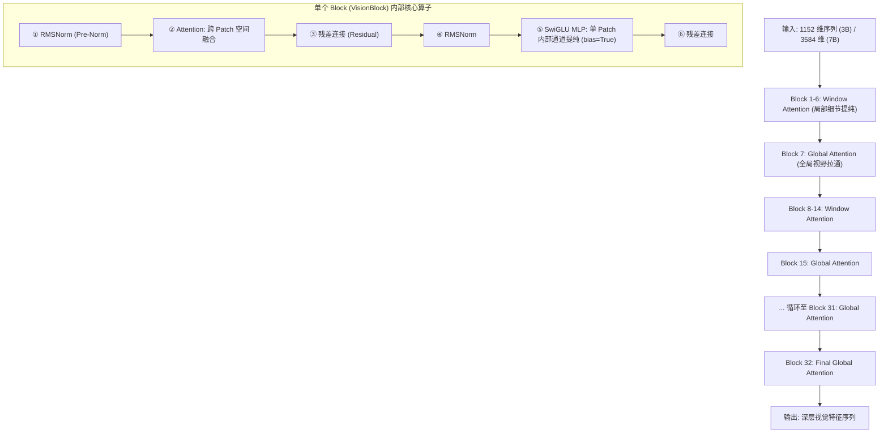

# ViT 视觉骨干网核心原理与结构

## 模块整体说明与架构拆解

视觉骨干网（Vision Backbone）是 Qwen2.5-VL 的**“语义核心熔炉”**。它的职责是接收由 [[conv3d_时空切块器]] 输出的、仅具备局部特征的视觉序列，通过 **32 层** 高度统一的 Transformer Block 深度堆叠，利用注意力机制（Attention）实现全局信息交换。

在这一阶段，离散的“像素切块特征”被提纯为具备高级语义概念（如：物体、场景、文字、动作）的视觉向量序列，为最终进入大语言模型（LLM）做好准备。

### 内部架构流转
Qwen2.5-VL 的 ViT 架构呈现出极致的“LLM 镜像化”特征。其 32 层 Block 并不是一成不变的重复，而是通过**注意力视野的交替切换**来实现算力与性能的平衡：



### 全局代码调用顺序与流转概览
1.  **准备阶段**：`Qwen2_5_VisionTransformerPretrainedModel.forward` 接收 `pixel_values` 与 `grid_thw`。
2.  **入口**：调用 `patch_embed` 完成 Conv3D 投影与拉平。
3.  **循环迭代**：在一个 32 次的循环中，逐个调用 `self.blocks`。
    - 在循环内部，系统根据 `config.fullatt_block_indexes`（默认 `[7, 15, 23, 31]`）动态决定当前层是执行 **[[window_attention_交错注意力#全局视野 (Global Attention)]]** 还是 **[[window_attention_交错注意力#窗口视野 (Window Attention)]]**。
4.  **收官**：经过最后一次 RMSNorm 归一化后，输出结果给下游 [[patchmerger_空间降维]]。

---

## 逻辑链输入与输出

- **逻辑链（输入）**：由 `patch_embed` 输出的视觉特征序列 `[TotalPatch, 1152]` (以 3B 为例)。
- **逻辑链（输出）**：深层高级视觉语义序列 `[TotalPatch, 1152]`。
  - **关键认知**：维度（Shape）在整个 Backbone 过程中保持不变，但向量内部的数值已经完成了从“像素感知”到“意图理解”的演化。

---

## 单层 Block 内部计算的微观放大镜 (Tensor Flow)

许多初学者对 Transformer 内部的流转感到困惑：一个 `[TotalPatch, 1152]` 的张量是如何经过一层计算，使得每个 Patch 的特征向量中都“包含”了整张图的注意力的？

我们将一层 `Qwen2_5_VLVisionBlock` 的前向计算按顺序放大拆解：

### 1. Pre-Norm (RMSNorm)
- **输入**：`X`，形状 `[TotalPatch, 1152]`。
- **操作**：对 1152 个通道维度计算方差并进行缩放。
- **物理意义**：把信号的尺度拉平，防止输入给后续算子的数值过大导致梯度爆炸。这是维稳的基石。👉详见 [[rmsnorm_归一化]]。

### 2. 跨空间融合：多头注意力机制 (Attention)
这是 ViT 产生“全局视野”的核心环节。
- **操作**：
  1. `X` 分别乘以三个权重矩阵 $W_q, W_k, W_v$，得到 $Q$（查询）、$K$（键）、$V$（值）。
  2. 根据 [[2d_rope_视觉位置编码]]，对 $Q$ 和 $K$ 进行旋转，注入位置坐标。
  3. **注意力矩阵计算**：$Attention = \text{Softmax}\left(\frac{Q K^T}{\sqrt{d}}\right)$。
     - *微观解释*：假设我们关注 Patch A（比如猫的耳朵）。Patch A 的 $Q_A$ 向量会和图里所有其他 Patch 的 $K$ 向量进行点积（计算相似度）。如果 Patch B（比如猫的眼睛）和它的点积值很大，Softmax 之后 Patch A 给 Patch B 分配的权重就非常高（比如 0.8）。
  4. **加权求和**：$Output_A = 0.8 \times V_B + 0.1 \times V_C + ...$
- **物理意义**：**Attention 是在做跨 Patch（空间）的信息混合**。经过这一步，Patch A 原本只包含“尖尖的形状”的 1152 维向量，现在被混入了“眼睛”和“胡须”的特征，从而演化出了“猫”的初级概念。
- **关于视频帧的注意边界**：注意，**ViT 内部的 Attention 是严格的单帧空间（Spatial）计算**。哪怕输入的是视频，[[packing_物理隔离机制]] 也会把视频的不同帧隔离成独立的图片。时间维度的融合一部分已经在上游的 Conv3D 完成（2合1），剩余的时间因果理解则交给下游的 LLM 处理。

### 3. 残差连接 1 (Residual Add)
- **操作**：`X_new = X_original + Attention_Output`。
- **物理意义**：原始特征信号走“捷径”直接加到了融合后的特征上。防止网络太深导致最初的物理特征丢失。

### 4. 单点通道过滤：非线性多层感知机 (SwiGLU)
- **操作**：`X_new` 再次经过 RMSNorm，然后进入 SwiGLU MLP。
  - `Up` 投影：将维度从 1152 升维到 4928。
  - `Gate` 投影：同样的升维，但加上 Swish 激活函数。
  - 逐元素相乘后，再通过 `Down` 投影降维回 1152。
- **物理意义**：如果说 Attention 是不同 Patch 在互相串门，那么 **MLP 就是每个 Patch 关起门来做内部消化**。它不跨空间混合信息，只负责在这个 Patch 的 1152 维特征内部进行非线性的组合、筛选和特征放大。为了对抗传感器的物理底噪，这里的 MLP 开启了 `bias=True`。👉详见 [[swiglu_门控激活函数]]。

### 5. 残差连接 2 (Residual Add)
- **操作**：`X_final = X_new + MLP_Output`。
- **输出**：这一层的最终结果，准备喂给下一层。

---

## 前向推理与反向传播 (Training vs Inference Flow)

模型不仅要能正向计算，更要在训练中更新参数。

### 前向推理 (Forward Pass)
1. **Conv3D 压平**的特征流进入 ViT。
2. 像流水线车间一样，数据依次穿过 32 层 Block。
3. 每穿过一层，特征向量里的“语义浓度”就提高一分。
4. 最终输出的 `[TotalPatch, 1152]` 送入 [[patchmerger_空间降维]]。

### 反向传播 (Backward Pass & Gradients Flow)
在训练阶段，当 LLM 输出最终文本并计算出 Loss（例如交叉熵损失）后：
1. **梯度回传**：Loss 首先对 LLM 的参数求导，然后顺着网络一路反向传回 PatchMerger，最后进入 ViT 的第 32 层。
2. **残差的“高速公路”作用**：ViT 有 32 层，如果梯度只能一层层乘过去，早就因为数值太小而消失了（梯度消失问题）。
   - 在反向传播时，残差连接（`+` 操作）是一个**梯度分配器**（Gradient Distributor）。
   - 它会将梯度 $100\%$ 无损地通过捷径传给上一层，同时也将梯度传给当前的 Attention 和 MLP 让它们更新权重。
   - 这就保证了即便在第 1 层的 Conv3D，依然能收到强烈的梯度信号来指导视觉特征的提取。

---

## 核心算法原理详解

### 1. 为什么需要 32 层堆叠？ (第一性原理)

**第一性原理推导**：卷积层（Conv3D）的感受野仅为 $14 \times 14 \times 2$，它就像是一面布满了几万个小孔的墙，模型只能通过每个小孔看到极窄的一角。
- **语义分层演化**：
  - **Layer 1-8 (局部认知)**：模型还在整理边缘、颜色块和简单的纹理。
  - **Layer 9-24 (部件组装)**：注意力开始让相邻的 Patch 对话，拼凑出“眼睛”、“轮子”或“笔画”。
  - **Layer 25-32 (全局语义)**：通过每 8 层一次的全局注意力，模型终于看清了“这是一个正蹲在草地上盯着蝴蝶的猫”。
- **结论**：**堆叠的深度决定了模型抽象能力的上限**。如果只有 1 层，模型永远只能看到像素点，无法建立宏观联系。

### 2. 架构统一：视觉侧的“LLM 化”

Qwen2.5-VL 相比前代最核心的哲学转变是：**让视觉编码器长得越来越像 LLM**。
- **归一化策略**：抛弃传统 ViT 的 LayerNorm，改用 LLM 标配的 [[rmsnorm_归一化]]。
- **非线性激活**：抛弃 GELU，改用与 Qwen2.5 文本端完全一致的 [[swiglu_门控激活函数]]。
- **位置编码**：引入 [[2d_rope_视觉位置编码]]。

**这种“架构统一”的终极物理意义**：
视觉特征与文本特征在数学分布上越接近，跨模态对齐（Alignment）的难度就越低。它就像是让两个说不同方言的人改说普通话，沟通效率会极大提升。

---

## 核心源码解剖

**文件路径**：`transformers/src/transformers/models/qwen2_5_vl/modeling_qwen2_5_vl.py`

```python
# 视觉骨干网主体
class Qwen2_5_VLVisionTransformer(Qwen2_5_VisionTransformerPretrainedModel):
    def __init__(self, config: Qwen2_5_VLVisionConfig):
        super().__init__(config)
        # 初始化 32 层 Block
        self.blocks = nn.ModuleList(
            [Qwen2_5_VLVisionBlock(config) for _ in range(config.num_hidden_layers)]
        )
        ...

# 单个 Block 实现
class Qwen2_5_VLVisionBlock(nn.Module):
    def forward(self, hidden_states, cu_seqlens, rotary_pos_emb):
        # 1. 第一层归一化 + 注意力 (Residual Path 1)
        # 注意：cu_seqlens 决定了视野是 Window 还是 Global
        hidden_states = hidden_states + self.attn(
            self.norm1(hidden_states), cu_seqlens, rotary_pos_emb
        )
        # 2. 第二层归一化 + MLP (Residual Path 2)
        # 注意：视觉侧 MLP 开启了 bias=True
        hidden_states = hidden_states + self.mlp(self.norm2(hidden_states))
        return hidden_states
```

---

## 参数心算验证 (以 3B 模型为例)

| 组件 | 计算公式 | 参数量 (约) | 角色 |
| :--- | :--- | :--- | :--- |
| **RMSNorm** | $1152 \times 2$ (Block 内) | 2.3k | 稳定性锚点 |
| **Attention** | $1152 \times 1152 \times 4$ ($Q/K/V/O$) | 5.3M | 跨空间语义融合器 |
| **SwiGLU MLP** | $1152 \times 4928 \times 3$ (Gate/Up/Down) | 17M | 单点特征过滤器 |
| **单层总计** | | **22.3M** | |
| **32层总计** | $22.3M \times 32$ | **713M** | 视觉大脑主体 |

> **注**：加上 `patch_embed` 和 `merger` 后，3B 模型的视觉侧总参数量约为 **0.7B** 左右。

---

## 质量自我审查与准出标准

1.  **流转逻辑看懂了吗？**：必须能闭眼描述出 `[TotalPatch, 1152]` 是如何依次通过 Norm -> Attention -> Add -> Norm -> MLP -> Add 的。
2.  **融合机制清楚了吗？**：能解释 Attention 是如何通过 $QK^T$ 让一个 Patch 获取全局（或窗口）特征的，而 MLP 只是在 Patch 内部混合通道。
3.  **看破 Bias 细节了吗？**：明白视觉侧 MLP 的 `bias=True` 是为了对抗物理传感器底噪，而文本端不需要（见 [[swiglu_门控激活函数]]）。
4.  **理解反向传播的高速公路了吗？**：知道在 32 层深的网络中，残差连接是如何保证梯度不消失的。

---

## 关联概念

- [[conv3d_时空切块器]]：上游输入，提供原始 5D 时空嵌入。
- [[window_attention_交错注意力]]：核心注意力机制，实现算力节省。
- [[swiglu_门控激活函数]]：核心非线性单元，负责特征过滤。
- [[rmsnorm_归一化]]：数值稳定性的基石。
- [[patchmerger_空间降维]]：下游衔接，将提纯后的 32 层特征进行最后的 4 倍压缩。

## 参考来源
- `transformers/src/transformers/models/qwen2_5_vl/modeling_qwen2_5_vl.py`
- `knowledge_base/raw/万字长文图解Qwen2.5-VL实现细节_猛猿_2025-06-25/index.md`
- 论文：*Qwen2-VL: To See the World from a New Perspective* (2024)
