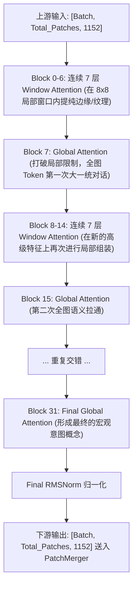

# ViT 视觉骨干网核心原理与结构

## 模块整体说明与架构拆解

视觉骨干网（Vision Backbone）是多模态大模型的“语义核心熔炉”。以 Google 于 2020 年提出的原始 Vision Transformer (ViT) 为开端，它打破了卷积神经网络 (CNN) 的空间归纳偏置，直接将图像按物理块（Patch）展平，利用 Transformer 的全局注意力机制提纯出极具表达力的高级语义特征。

在 Qwen2.5-VL 中，ViT 被深度改造并“LLM 化”。它的核心职责是接收由时空切块器（VisionPatchEmbed）吐出的局部物理特征序列，经过深达 **32 层** 的网络提纯，完成从“像素光影”到“高级语义意图（物体、动作、场景）”的跨越。

### Qwen2.5-VL ViT 的全局宏观架构 (32层堆叠)

Qwen2.5-VL 的视觉骨干网并不是 32 个一模一样的块在做无脑重复。为了在超高动态分辨率下节省极大的 $O(N^2)$ 算力开销，它采用了**交错视野（Window vs Global）**的宏观架构设计。

**整体架构串联与上下游 I/O 流转**：
- **上游输入**：来自于时空切块器（`patch_embed`）的特征序列。例如一个 Batch 里的一张缩略图，被切分为 196 个 Patch，每个 Patch 被投影为 1152 维的向量。输入张量形状为 `[Batch, 196, 1152]`。
- **架构配置**：总计 32 层（`num_hidden_layers = 32`）。
- **交错规律**：
  - 第 7, 15, 23, 31 层（共 4 层，`config.fullatt_block_indexes`）采用 **Global Attention（全局注意力）**。
  - 其余 28 层全部采用 **Window Attention（窗口注意力）**。
- **下游输出**：经过 32 层特征融合后，输出维度不改变，依然是 `[Batch, 196, 1152]`。随后被送入 `PatchMerger` 空间降维器。



---

## 每一层 Block 的内部结构串联

我们拿走上述 32 层中的任意一层（`Qwen2_5_VLVisionBlock`），用显微镜观察数据在它内部是如何流转的。
每一层 Block 的内部结构极为统一，由两个“残差高速公路（Residual Path）”连接的子网络组成：
1. **多头注意力子网络 (Multi-Head Attention)**
2. **前馈神经网络子网络 (MLP)**

**流转时序图**：
-encoder.png>)

**代码与张量的上下游串联流转**：
```python
class Qwen2_5_VLVisionBlock(nn.Module):
    def forward(self, hidden_states, cu_seqlens, rotary_pos_emb):
        # 【输入】 hidden_states: [Batch, 196, 1152]
        
        # ------------------ 第一条高速公路：注意力融合 ------------------
        # 1. 过第一道门：RMSNorm 归一化。把特征的尺度拉平，防梯度爆炸。
        normed_states_1 = self.norm1(hidden_states) 
        # 2. 时空特征融合：根据配置（Window 还是 Global）划定注意力边界，注入 2D-RoPE。
        attn_out = self.attn(normed_states_1, cu_seqlens, rotary_pos_emb) # 输出依然是 [Batch, 196, 1152]
        # 3. 残差相加：将原始输入和融合后的增量相加。
        hidden_states = hidden_states + attn_out 
        
        # ------------------ 第二条高速公路：通道提纯 ------------------
        # 4. 过第二道门：再次 RMSNorm 归一化。
        normed_states_2 = self.norm2(hidden_states)
        # 5. 单个 Patch 的内部消化：过带有 Bias 的 SwiGLU MLP，进行非线性通道过滤。
        mlp_out = self.mlp(normed_states_2) # 输出依然是 [Batch, 196, 1152]
        # 6. 残差相加：产生这一层最终的特征。
        hidden_states = hidden_states + mlp_out
        
        # 【输出】 交给下一层 Block 继续处理
        return hidden_states
```

---

## 核心组件一：多头注意力机制 (Multi-Head Attention) 深度解剖

### 1. 说明与直观概念理解
*   **说明**：如果说卷积只能看到周围 $3 \times 3$ 的几个像素，那么 Attention 机制则允许每一个 Patch 瞬间“凝视”整张图片上的所有其他 Patch（在 Global 层下）。
*   **直观理解**：假设图片里有一只猫。代表“猫耳朵”的 Token 此时只是个三角形的边缘特征。通过 Attention，它向全图发出了“查询（Query）”：“谁长得像眼睛和尾巴，快把你们的特征给我！”。于是，“猫眼睛”和“猫尾巴”的 Token 将自己拥有的值（Value）按极高的权重传递给了“耳朵”。孤立的碎片在这一刻，发生了化学反应，拼凑成了“猫”。

### 2. 第一性原理与算法公式推导
注意力机制的本质是**相似度加权求和**。
1.  **QKV 投影**：对输入序列 $X$ 进行三次不同的线性投影，得到 $Q$（我要找什么）、$K$（我拥有什么特征）、$V$（我的特征数值是多少）。
2.  **相似度计算 (Dot Product)**：用所有的 $Q$ 去乘以所有的 $K^T$。这一步算出了一个庞大的 $N \times N$ 的相关性矩阵。
3.  **缩放与归一化 (Scale & Softmax)**：除以 $\sqrt{d_k}$ 防止内积过大导致 Softmax 进入饱和区（梯度消失），再通过 Softmax 将所有相关性转换为加和为 1 的概率权重。
4.  **加权求和**：用算好的权重矩阵去乘以对应的 $V$。
$$ \text{Attention}(Q, K, V) = \text{Softmax}\left(\frac{Q K^T}{\sqrt{d_k}}\right) V $$

### 3. 多头拆分的物理形变与源码详解
真实的 PyTorch 实现为了利用 GPU 并行，都是一次性生成 QKV，并利用 `reshape` 和 `transpose` 实现“多头”的魔法。我们以 `embed_dim=768, num_heads=12`，输入序列 `N=197` 为例进行显微镜级拆解：

```python
class MultiheadAttention(nn.Module):
    def __init__(self, embed_dim=768, num_heads=12):
        super().__init__()
        self.num_heads = num_heads
        # 每个头的维度 head_dim = 768 / 12 = 64
        self.scale = (embed_dim // num_heads) ** -0.5 # 1/sqrt(64) = 0.125
        
        # 1. 【参数定义】一刀切的 QKV 投影矩阵。768 维进去，出来 2304 维 (768*3)
        self.qkv = nn.Linear(embed_dim, embed_dim * 3)
        self.out_linear = nn.Linear(embed_dim, embed_dim)

    def forward(self, x):
        B, N, C = x.shape  # 例如 B=1, N=197, C=768
        
        # ==================== 多头拆分形变 ====================
        # 1. 经过 Linear 映射，得到 [B, 197, 2304]
        # 2. 劈开成 3 份(Q/K/V)，以及 12 个头，每个头 64 维：reshape 得到 [B, 197, 3, 12, 64]
        # 3. 把 '3(QKV)' 换到第 0 维，'12(多头)' 换到序列前面：permute 得到 [3, B, 12, 197, 64]
        qkv = self.qkv(x).reshape(B, N, 3, self.num_heads, C // self.num_heads).permute(2, 0, 3, 1, 4)
        
        # 此时 q, k, v 各自的形状都是 [B, 12, 197, 64]
        # 这意味着：对于 12 个头，每个头都有自己独立的一个 197 个 token 的序列，每个 token 只有 64 维特征。
        q, k, v = qkv[0], qkv[1], qkv[2] 
        
        # ==================== 注意力矩阵计算 ====================
        # k.transpose(-2, -1) 将 k 从 [B, 12, 197, 64] 转置为 [B, 12, 64, 197]
        # q @ k^T 计算内积：[B, 12, 197, 64] @ [B, 12, 64, 197] = [B, 12, 197, 197]
        # 产生了一个 197x197 的热力图！这个图里的第 (i, j) 个数值，就代表第 i 个 patch 对第 j 个 patch 的关注度！
        attn = (q @ k.transpose(-2, -1)) * self.scale
        attn = attn.softmax(dim=-1) # 在最后一个维度（行）上做概率归一化
        
        # ==================== 特征混合与多头拼接 ====================
        # 用 197x197 的注意力矩阵去乘以 V [B, 12, 197, 64]
        # [B, 12, 197, 197] @ [B, 12, 197, 64] = [B, 12, 197, 64]
        # 这一步极其神奇：每个 64 维的 v 向量，都已经被别人按比例狠狠“混入了”新的特征。
        x_mixed = attn @ v
        
        # 将分离的 12 个头拼回一个完整的 768 维。
        # 先 transpose(1, 2) 变为 [B, 197, 12, 64]
        # 再 reshape 强行拍平最后两维 12*64 = 768。得到 [B, 197, 768]
        x = x_mixed.transpose(1, 2).reshape(B, N, C)
        
        # ==================== 最终线性投影 ====================
        # 通过最后一道门框，[B, 197, 768] 保持不变输出。
        return self.out_linear(x)
```

---

## 核心组件二：MLP 前馈网络深度解剖

### 1. 说明与直观概念理解
如果说 Attention 是让所有 Patch “串门互通”，那么 MLP 就是让每个 Patch **“关起门来内部消化”**。
MLP 在处理时，完全无视序列长度 N，它是对每一个 Token 独立的 768 维向量进行数学上的高维映射和非线性过滤。

### 2. 第一性原理：倒瓶颈结构 (Inverted Bottleneck)
*   **传统 ResNet 瓶颈 (Bottleneck)**：为了省算力，通常是先把 256 维用 1x1 卷积降到 64 维，处理完了再升回 256 维。
*   **Transformer 的倒瓶颈**：先用 Linear 把特征从 768 维**极度膨胀**到 3072 维（通常是 4 倍），经过激活函数后，再压缩回 768 维。
*   **原理解读**：高维空间具有极度稀疏的特性。当我们将纠缠在一起的 768 维复杂视觉特征强行拉入 3072 维的庞大空间时，特征的维度会被充分解耦。此时，非线性激活函数（如 GELU 或 SwiGLU）能像一把锋利的手术刀，轻易剔除掉不需要的底噪背景特征，只保留最尖锐的语义信号。

### 3. Qwen2.5-VL 专属架构：带 Bias 的 SwiGLU
在 Qwen 系列视觉骨干网中，采用的是 `SwiGLU` 而非传统的 `GELU`。
并且，与文本大模型端（无偏置）不同，视觉端的 MLP **强行开启了偏置 `bias=True`**。因为图像来源于物理传感器的连续模拟信号，天生存在“直流偏移（DC Offset）”。开启 bias 能够极其廉价地对抗这种物理底噪，防止神经网络白白浪费大量神经元去拟合这部分无关常量。

---

## 参数量与显存极限推演 (Memory & Parameters)

大模型时代，不仅要懂架构，更要能精准预估算力边界。
以经典的 ViT-Base 为例（$D=768$, 12层, 12头），其参数量约为 **86M**。
*   **参数分布大头**：主要集中在每一层的 Attention 投影矩阵（$768 \times 768 \times 4 \times 12$）和 FFN 升降维矩阵（$768 \times 3072 \times 2 \times 12$）中。

**显存开销公式推演**：
假设模型总参数量为 $M$ (十亿, Billion)。
1.  **训练阶段 (Training)**：
    *   显存不仅要装载**模型权重**，还要装载**梯度 (Gradients)**、**优化器状态 (Optimizer States, 如 Adam 的动量和方差)**，以及反向传播必需的**激活值 (Activations)**。
    *   **单精度 (FP32)** 训练：消耗约 $20M$ (GB)。
    *   **混合精度 (Mixed Precision: FP16/BF16 + FP32)**：注意！这是一个常见误区。开启混合精度并**不能**节省显存！因为为了保证更新精度，内存中必须同时保留 FP32 的权重副本和 FP16 的前向副本，实际消耗依然在 $16M \sim 20M$ (GB) 甚至更高。
    *   **纯 BF16 训练**：消耗约 $10M$ (GB)。
2.  **推理阶段 (Inference)**：
    *   无需保存梯度、优化器状态和长期的中间激活值。
    *   **半精度 (FP16/BF16)** 推理：显存消耗仅约为 $2M$ (GB)。
    *   **单精度 (FP32)** 推理：显存消耗约为 $4M$ (GB)。

---

## 关联概念
- [[conv3d_时空切块器]]：Qwen 体系下的上游输入，提供原始 5D 时空嵌入。
- [[window_attention_交错注意力]]：核心注意力机制在超高分辨率下的妥协演进。
- [[rmsnorm_归一化]] / [[swiglu_门控激活函数]]：模型向 LLM 化看齐的核心算子。