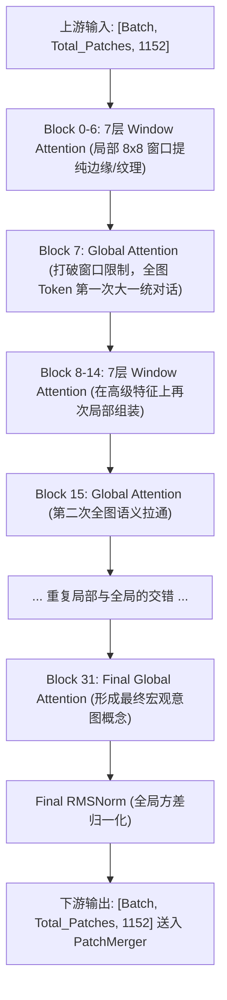

# ViT 视觉骨干网核心原理与结构

## 1. 模块整体说明与 Qwen2.5-VL 全局宏观架构

视觉骨干网（Vision Backbone）是多模态大模型提取图像/视频特征的“语义熔炉”。Qwen2.5-VL 彻底抛弃了卷积神经网络（CNN）的层级下采样，而是采用基于 Transformer 的 ViT 架构，利用全局注意力机制，将局部的像素特征一步步提纯为能被语言模型理解的高级语义意图（如：从“边缘”到“猫”）。

### 1.1 全局架构与上下游串联流转
Qwen2.5-VL 的视觉骨干网是一个深达 **32 层** 的庞大流水线。它并非 32 个相同模块的无脑重复，而是通过 **交错视野（Window vs Global）** 的设计，在超高原生分辨率下实现了算力与性能的绝佳平衡。

- **上游输入**：时空切块器（`VisionPatchEmbed`）吐出的物理 Patch 序列。假设有一张图片经过切分产生了 196 个 Patch，每个 Patch 被投影为 1152 维的向量。那么进入 ViT 的张量形状为 `[Batch, 196, 1152]`。
- **总层数**：32 层 Transformer Block。
- **视野交错分布**：
  - 第 7, 15, 23, 31 层（共 4 层）：执行 **Global Attention（全局注意力）**，所有 Patch 互相通信。
  - 其余 28 层：执行 **Window Attention（窗口注意力）**，Patch 只在自己所属的 $8 \times 8$ 局部窗口内通信。
- **下游输出**：经过 32 层的锤炼，输出的张量形状**完全不发生改变**，依然是 `[Batch, 196, 1152]`。但其内部的数值已经从底层的物理像素，坍缩成了高阶的语义向量，随后被送入 `PatchMerger` 进行 4 倍空间降维。

### 1.2 全局流转图示


---

## 2. 单层 Vision Block 的内部结构串联

我们把上述 32 层中的任意一层（`Qwen2_5_VLVisionBlock`）单独抽出来放进显微镜。每一层的结构完全一致，都是由两条“残差高速公路”串联起来的两个核心子模块。

### 2.1 上下游串联与 I/O
- **输入**：`hidden_states` `[B, L, D]` (例如 `[1, 196, 1152]`)。
- **内部流转步骤**：
  1. **归一化 1**：走入注意力之前，先用 `RMSNorm` 抹平数值方差，防梯度爆炸。
  2. **注意力机制**：交由 `Multi-Head Attention` 算子，结合 `2D-RoPE` 注入位置信息，完成跨 Patch 的空间信息交换。
  3. **残差连接 1**：将注意力机制算出的**增量特征**与原始输入相加。
  4. **归一化 2**：再次 `RMSNorm`。
  5. **通道非线性过滤**：进入 `SwiGLU MLP`，在每个 Patch 内部进行通道升维、激活和降维。
  6. **残差连接 2**：将过滤后的增量特征与上一步结果相加。
- **输出**：`[B, L, D]`，尺寸完美保持不变，直接无缝传递给下一层。

### 2.2 核心流转源码
```python
# transformers/src/transformers/models/qwen2_5_vl/modeling_qwen2_5_vl.py
class Qwen2_5_VLVisionBlock(nn.Module):
    def forward(self, hidden_states, cu_seqlens, rotary_pos_emb):
        # 1. 空间融合路：[B, L, D] -> Norm -> Attention -> Add -> [B, L, D]
        hidden_states = hidden_states + self.attn(
            self.norm1(hidden_states), cu_seqlens, rotary_pos_emb
        )
        # 2. 通道提纯路：[B, L, D] -> Norm -> MLP -> Add -> [B, L, D]
        # 注意：视觉侧 MLP 强行开启了 bias=True
        hidden_states = hidden_states + self.mlp(self.norm2(hidden_states))
        return hidden_states
```

---

## 3. 底层神经元解剖：多头注意力机制 (Multi-Head Attention)

如果说卷积是“近视眼”（只能看 $3 \times 3$），那么 Attention 就是“千里眼”。这是整个 ViT 能理解全图的最核心数学机制。

### 3.1 模块说明与直观理解
- **直观比喻 (相亲大会)**：假设这 196 个 Patch 参加相亲大会。每个 Patch 发出一个**查询 (Query，我想找什么样的人)**，同时展示自己的**钥匙 (Key，我有什么特质)** 和 **价值 (Value，我的实际内涵)**。大家两两配对（算内积），如果 Q 和 K 极其吻合，那么这个 Patch 就会把对方的 Value 狠狠地吸收进自己的特征里。
- **物理意义**：孤立的像素碎片（如“毛发”、“眼球”）通过这种互相的“吸收（加权求和）”，在几层之后，就拼凑出了连贯的高级特征（“猫”）。

### 3.2 第一性原理与算法公式推导
$$ \text{Attention}(Q, K, V) = \text{Softmax}\left(\frac{Q K^T}{\sqrt{d_k}}\right) V $$
- **为什么必须除以 $\sqrt{d_k}$ (Scale 操作)？**
  这是第一性原理中最关键的细节。如果 $Q$ 和 $K$ 的维度 $d_k$ 很大，它们的点积结果会变得非常大。这会导致随后送入 Softmax 的时候，最大的值无限逼近于 1，其他值全部变成 0（进入饱和区）。一旦进入饱和区，梯度就会变成 0，网络就**彻底停止学习（梯度消失）**。除以 $\sqrt{d_k}$ 强制把方差拉回 1，保证了梯度的顺畅传导。

### 3.3 逻辑链输入与输出 (神经元级张量形变)
- **输入**：`x` `[B, L, C]`，例如 `[1, 196, 1152]`。
- **输出**：`out` `[B, L, C]`，完全同尺寸。

### 3.4 结构形式与代码详解 (多头是如何劈开的？)
在工程上，我们绝对不会用 `for` 循环去算每一个“头（Head）”。下面展示 PyTorch 是怎么用纯张量形变完成这个伟大的运算的：

```python
class MultiheadAttention(nn.Module):
    def __init__(self, embed_dim=1152, num_heads=16):
        super().__init__()
        self.num_heads = num_heads
        # 每个头分配到的通道数：head_dim = 1152 / 16 = 72 维
        self.scale = (embed_dim // num_heads) ** -0.5 
        
        # 1. 联合映射：712维进去，出来 3456 (1152*3) 维
        self.qkv = nn.Linear(embed_dim, embed_dim * 3)
        self.out_linear = nn.Linear(embed_dim, embed_dim)

    def forward(self, x):
        B, N, C = x.shape  # B=1, N=196, C=1152
        
        # ==================== 神经元形变：多头劈裂 ====================
        # 1. Linear 得到 [1, 196, 3456]
        # 2. Reshape 把 3456 劈成：3(Q/K/V)份，16个头，每个头72维 -> [1, 196, 3, 16, 72]
        # 3. Permute 换位，把 3(QKV) 放最前面，多头放前面 -> [3, 1, 16, 196, 72]
        qkv = self.qkv(x).reshape(B, N, 3, self.num_heads, C // self.num_heads).permute(2, 0, 3, 1, 4)
        
        # 此时 q, k, v 各自完全独立，形状都是 [B=1, Heads=16, L=196, Head_Dim=72]
        q, k, v = qkv[0], qkv[1], qkv[2] 
        
        # --- (此处省略应用 2D-RoPE 旋转 Q 和 K 的代码) ---
        
        # ==================== 算法核心：相似度热力图计算 ====================
        # k.transpose(-2, -1) 将 k 转置为 [1, 16, 72, 196]
        # q @ k^T 计算矩阵乘法：[1, 16, 196, 72] @ [1, 16, 72, 196] = [1, 16, 196, 196]
        # 注意！我们得到了一个 196x196 的方阵！这个方阵的 (i, j) 坐标就代表第 i 个 Patch 对第 j 个 Patch 的关注度！
        attn = (q @ k.transpose(-2, -1)) * self.scale
        attn = attn.softmax(dim=-1) # 按行进行概率归一化
        
        # ==================== 价值吸收与多头缝合 ====================
        # 用 196x196 的注意力矩阵去乘以原始特征 v [1, 16, 196, 72]
        # 结果依然是 [1, 16, 196, 72]。但每个 72 维向量，已经吸饱了全图其他 Token 的精华。
        x_mixed = attn @ v
        
        # 缝合多头：transpose 后 [1, 196, 16, 72] -> reshape 强行拍扁为 [1, 196, 1152]
        x = x_mixed.transpose(1, 2).reshape(B, N, C)
        
        return self.out_linear(x) # [1, 196, 1152]
```

---

## 4. 底层神经元解剖：前馈网络 (MLP) 与倒瓶颈

如果 Attention 是“找外部兄弟借力”，那么 MLP 就是“在自己脑子里顿悟”。

### 4.1 结构形式与第一性原理 (倒瓶颈 Inverted Bottleneck)
*   **传统 CNN 瓶颈 (Bottleneck)**：为了省算力（如 ResNet），先把 256 维用 1x1 卷积降到 64 维，算完再升回 256 维。
*   **Transformer 的倒瓶颈**：先用 Linear 把特征从 1152 维**极度膨胀**到 4928 维（通常是原维度的 4 倍），经过激活函数后，再压缩回 1152 维。
*   **物理直观理解**：低维空间极其拥挤，不同的特征（猫耳朵、树叶）纠缠在一起。当我们把 1152 维强行拉伸到 4928 维的庞大高维空间时，这些特征就被彻底“解开”了。此时，非线性激活函数（SwiGLU）能像一把精密的剪刀，精准地裁剪掉无用的底噪，只保留最尖锐的高级语义。

### 4.2 Qwen 专属设计与代码详解
Qwen 视觉端 MLP 有两大特色：使用类似 LLM 的 `SwiGLU` 门控函数，并且**强行开启了 `bias=True`**。
**原理解读**：图像数据是模拟信号，物理传感器天生带有“直流偏移 (DC Offset)”。如果关掉 bias，网络将不得不浪费极其宝贵的权重矩阵去强行拟合这个无关的底噪常量。

```python
class Qwen2_5_VLMLP(nn.Module):
    def __init__(self, config, bias: bool = True):
        super().__init__()
        self.hidden_size = 1152
        self.intermediate_size = 4928
        
        # 膨胀层：1152 -> 4928 (强行开启 bias)
        self.gate_proj = nn.Linear(self.hidden_size, self.intermediate_size, bias=bias)
        self.up_proj = nn.Linear(self.hidden_size, self.intermediate_size, bias=bias)
        # 收缩层：4928 -> 1152
        self.down_proj = nn.Linear(self.intermediate_size, self.hidden_size, bias=bias)
        self.act_fn = nn.SiLU()

    def forward(self, hidden_state):
        # 逻辑链输入: [1, 196, 1152]
        
        # SwiGLU 的核心机制：利用 gate_proj 的结果去过滤 up_proj 的通道
        # act_fn(gate) * up = [1, 196, 4928]
        activated = self.act_fn(self.gate_proj(hidden_state)) * self.up_proj(hidden_state)
        
        # 降维回原尺寸
        # 逻辑链输出: [1, 196, 1152]
        return self.down_proj(activated)
```

---

## 5. 参数量与显存极限推演 (Memory & Parameters)

大模型时代，不仅要懂架构，更要能精准预估算力边界。
以经典的 ViT-Base 为例（$D=768$, 12层, 12头），其参数量约为 **86M**。
*   **参数分布大头**：全在矩阵相乘里。一层 Block 的参数 = Attention 投影矩阵（$768 \times 768 \times 4$）+ MLP 升降维矩阵（$768 \times 3072 \times 2$）。

**显存开销第一性计算法则**：
假设你的显卡里存了一个参数量为 $M$ (十亿, Billion) 的模型。
1.  **训练阶段 (Training)**：
    *   显存不仅要装模型（Weight），更要装反向传播必须的**激活值 (Activations)**、**梯度 (Gradients)** 和 **Adam 优化器动量 (Momentum/Variance)**。
    *   **单精度 (FP32) 训练**：每个参数 4 Bytes。总体消耗极大约为 **$20M$ (GB)**。
    *   **混合精度 (Mixed Precision FP16+FP32)**：**警惕陷阱！** 混合精度是为了加速计算，它**不能减半显存**！因为为了保证更新时不发生 Underflow，内存中必须同时保留一份 FP32 的权重 Master Copy，实际消耗依然高达 **$16M \sim 20M$ (GB)**。
    *   **纯 BF16 训练**：消耗约 **$10M$ (GB)**。
2.  **推理阶段 (Inference)**：
    *   不存梯度和优化器。
    *   **半精度 (FP16/BF16) 推理**：每个参数 2 Bytes，消耗仅约为 **$2M$ (GB)**。

---

## 质量自我审查与准出标准
1. **全景串联清楚了吗？**：必须能闭眼画出那 32 层是怎么通过 4 次 Global 和 28 次 Window 互相穿插的。
2. **张量形变看懂了吗？**：必须知道 `[B, 197, 2304]` 是怎么被劈成 `[B, 12, 197, 64]` 并最终乘出一个 `197x197` 的热力图的。
3. **第一性原理想透了吗？**：能够解释为什么 MLP 的瓶颈是倒着的（升维解耦），为什么 Attention 分母必须除以 $\sqrt{d}$（防软阈值饱和）。

## 关联概念
- [[conv3d_时空切块器]]：上游流水线，用 3D 卷积暴力切出 Patch 序列送入 ViT。
- [[window_attention_交错注意力]]：在此微观原理基础上的局部限制优化，专治高分辨率下的显存爆炸。
- [[rmsnorm_归一化]] / [[swiglu_门控激活函数]]：模型向 LLM 化看齐的核心算子。