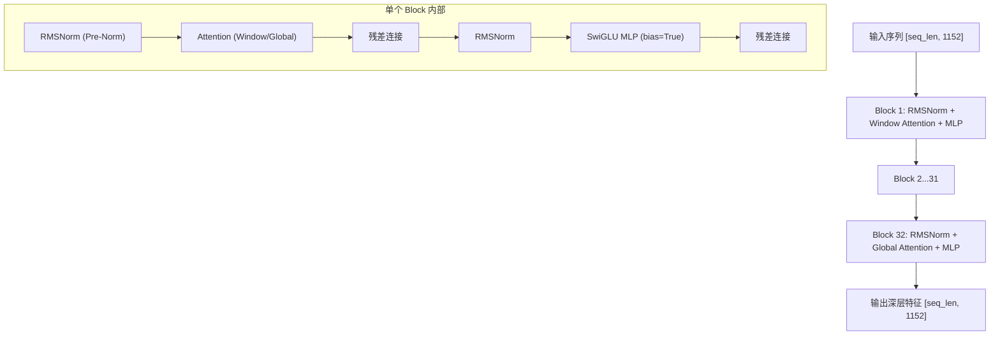

# ViT 视觉骨干网核心原理与结构

## 模块整体说明与架构拆解

视觉骨干网（Vision Backbone）是 Qwen2.5-VL 的“语义加工厂”。它的职责是接住 [[conv3d_时空切块器]] 输出的粗糙局部特征，通过多层 Transformer Block 的深度堆叠，实现从“局部像素块”到“全局语义概念”的华丽蜕变。

### 内部架构流转
Qwen2.5-VL 的视觉侧采用了一个深达 **32 层** 的 Transformer 结构：



---

## 逻辑链输入与输出

- **逻辑链（输入）**：拉平的视觉序列 `[seq_len_vision, 1152]`。
- **逻辑链（输出）**：深层高级视觉语义序列 `[seq_len_vision, 1152]`。

---

## 核心算法原理详解

### 1. 为什么需要多层堆叠？ (第一性原理)

**黑盒破除**：虽然 Transformer 每一层的输入输出维度都是 1152，但其语义密度（Information Density）是完全不同的。
- **浅层 (Layer 1-8)**：主要提取线条、色彩斑块、简单的几何形状。此时模型还在“看”细节。
- **中层 (Layer 9-24)**：开始将细节组合成局部物体部件（如猫的耳朵、汽车的轮子）。
- **深层 (Layer 25-32)**：形成宏观的语义抽象（如“这是一只正在睡觉的猫”）。
- **结论**：**堆叠的深度决定了模型对视觉场景理解的“深度”和“抽象层次”**。

### 2. 架构统一：视觉与语言的“同质化”

Qwen2.5-VL 相比 Qwen2-VL 的最大改进在于**将视觉侧的组件彻底 LLM 化**：
- **归一化**：LayerNorm $\rightarrow$ [[rmsnorm_归一化]]
- **前馈网络**：GELU MLP $\rightarrow$ [[swiglu_门控激活函数]]
- **算力优化**：Full Attention $\rightarrow$ [[window_attention_交错注意力]]

**意义**：这种“架构统一”让视觉特征在进入 LLM 之前，其分布特性已经非常接近词向量，极大降低了跨模态对齐的难度。

---

## 核心源码解剖

**代码路径**：`transformers/src/transformers/models/qwen2_5_vl/modeling_qwen2_5_vl.py`

```python
class Qwen2_5_VLVisionTransformer(Qwen2_5_VisionTransformerPretrainedModel):
    def __init__(self, config: Qwen2_5_VLVisionConfig):
        super().__init__(config)
        # 1. 物理入口
        self.patch_embed = Qwen2_5_VisionPatchEmbed(
            patch_size=config.patch_size,
            temporal_patch_size=config.temporal_patch_size,
            in_channels=config.in_channels,
            embed_dim=config.hidden_size,
        )
        # 2. 位置感知
        self.rotary_pos_emb = Qwen2_5_VisionRotaryEmbedding(config.hidden_size // config.num_heads)
        
        # 3. 32层深度堆叠
        self.blocks = nn.ModuleList(
            [Qwen2_5_VLVisionBlock(config) for _ in range(config.num_hidden_layers)]
        )
        
        # 4. 空间降维桥接器 (下个模块详解)
        self.merger = Qwen2_5_VLPatchMerger(
            dim=config.hidden_size, context_dim=config.hidden_size, spatial_merge_size=2
        )
```

---

## 演化与对比：Qwen2.5-VL vs Qwen3-VL

| 组件 | Qwen2.5-VL (当前) | Qwen3-VL (演化) | 物理意义 |
|------|-----------------|---------------|---------|
| **Norm** | RMSNorm | **LayerNorm 回退** | Qwen3-VL 发现 LayerNorm 在超大规模多模态混合训练下更稳定 |
| **Bias** | `bias=True` | `bias=True` | 坚持开启偏置以对抗传感器噪声 |
| **RoPE** | 2D-RoPE | **MRoPE-Interleave** | Qwen3-VL 实现了时空位置编码的深度交织 |

---

## 关联概念

- ✅ 支持 [[qwen2.5_vl_三阶段预训练]]：在 Stage 0/1/2 中作为主要训练目标。
- 上游：接收 [[conv3d_时空切块器]] 的输出。
- 内部：由 [[window_attention_交错注意力]]、[[swiglu_门控激活函数]]、[[rmsnorm_归一化]] 组成。
- 下游：输出送往 [[patchmerger_空间降维]]。

## 参考来源

- `transformers/src/transformers/models/qwen2_5_vl/modeling_qwen2_5_vl.py`
- `knowledge_base/raw/面试官!从Qwen-VL到Qwen3.5技术改进？(26年2月版)/面试官!从Qwen-VL到Qwen3.5技术改进？(26年2月版) .md`
