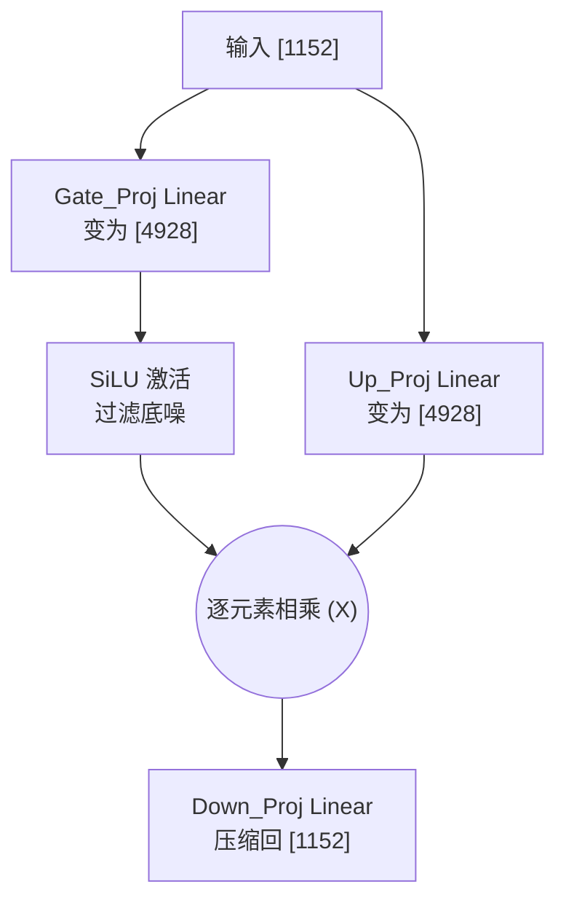

# ViT 视觉骨干网核心原理与结构

## 1. 模块整体说明与全景架构

视觉骨干网（Vision Backbone）是多模态大模型提取图像/视频特征的“语义熔炉”。从 Qwen2.5-VL 到最新的 **Qwen3.5**，均采用了基于 NaViT (Native Resolution ViT) 思想的纯 Transformer 架构，彻底抛弃了 CNN 的层级下采样。

### 1.1 全局架构与上下游串联流转
Qwen3.5 / Qwen2.5-VL 的视觉骨干网是一个深达 **32 层** 的庞大流水线。为了在超高分辨率下平衡算力，它采用了 **交错视野（Window vs Global）** 设计。

- **上游输入**：时空切块器（`VisionPatchEmbed`）吐出的物理 Patch 序列。张量形状为 `[Batch, Total_Patches, 1152]`。
- **视野交错分布**：
  - 第 7, 15, 23, 31 层：执行 **Global Attention（全局注意力）**，所有 Patch 互相通信。
  - 其余 28 层：执行 **Window Attention（窗口注意力）**，Patch 仅在局部窗口通信。
- **下游输出**：输出的张量形状不变，依然是 `[Batch, Total_Patches, 1152]`，随后被送入 `PatchMerger`。

### 1.2 核心源码解剖 (Qwen3.5 宏观结构)
在 Qwen3.5 中，视觉骨干网抛弃了 3.0 的 DeepStack，回归到了最极致干净的三段式流转。

```python
# transformers/src/transformers/models/qwen3_5/modeling_qwen3_5.py
class Qwen3_5VisionModel(Qwen3_5PreTrainedModel):
    def __init__(self, config, *inputs, **kwargs) -> None:
        super().__init__(config, *inputs, **kwargs)
        # 1. 空间切块器
        self.patch_embed = Qwen3_5VisionPatchEmbed(config=config)
        
        # 2. 2D-RoPE 多模态位置编码器
        head_dim = config.hidden_size // config.num_heads
        self.rotary_pos_emb = Qwen3_5VisionRotaryEmbedding(head_dim // 2)
        
        # 3. 32层 Transformer Block (交替 Global/Window)
        self.blocks = nn.ModuleList([Qwen3_5VisionBlock(config) for _ in range(config.depth)])
        
        # 4. 下游桥接器 (不再有 DeepStack 抽取中间特征)
        self.merger = Qwen3_5VisionPatchMerger(config=config, use_postshuffle_norm=False)
```

---

## 子模块/步骤详解

### 1. 多头自注意力机制 (Multi-Head Attention)

#### 模块说明
Attention 是 ViT 理解全图语义的核心数学机制。如果卷积是“近视眼”，Attention 就是“千里眼”。每个 Patch 发出一个查询 (Query)，同时展示自己的钥匙 (Key) 和价值 (Value)。如果 Q 和 K 高度吻合，该 Patch 就会吸收对方的 Value，从而将孤立的像素碎片（边缘、颜色）拼凑成高级语义（猫、汽车）。

#### 逻辑链输入与输出
- **输入 `hidden_states`**：形状 `[B, Seq_Len, 1152]`。
- **输出 `attn_output`**：形状 `[B, Seq_Len, 1152]`。

#### 具体操作逻辑拆解与 Torch 对齐
1. **联合投影**：利用一个大的 Linear 层一次性将 1152 维映射为 $1152 \times 3 = 3456$ 维。
2. **多头劈裂**：通过 `.reshape()` 和 `.permute()` 将大矩阵切分成 16 个独立的注意力“头”，每个头 72 维。
3. **注入位置信息**：对 $Q$ 和 $K$ 的特定维度施加 2D-RoPE 旋转矩阵。
4. **矩阵相乘与缩放**：计算 $Q \times K^T$，并除以 $\sqrt{72}$（缩放因子）。
5. **概率归一化**：使用 `softmax` 计算出关注度热力分布图。
6. **价值吸收与缝合**：用热力图去乘以 $V$，最后将 16 个头的结果强行 `.reshape()` 缝合回 1152 维。

#### 第一性原理与原理解读
为什么要除以 $\sqrt{d_k}$ (Scale 操作)？这是 Attention 能够收敛的生命线。当 $Q$ 和 $K$ 的维度 $d_k$（如 72）很大时，内积方差会变成 $d_k$。数值极大会导致 Softmax 瞬间进入两极分化的饱和区（一个值趋近 1，其他全是 0），产生**梯度消失**，整个网络直接锁死。除以 $\sqrt{d_k}$ 就是强行把方差拉回 1。

#### 公式推导与张量跟踪
$$ \text{Attention}(Q, K, V) = \text{Softmax}\left(\frac{Q K^T}{\sqrt{d_k}}\right) V $$
**张量跟踪**：
- $Q, K, V$ 切分后：`[1, 16, 196, 72]`
- $Q \times K^T$：`[1, 16, 196, 72] @ [1, 16, 72, 196] = [1, 16, 196, 196]` (这就是 $196 \times 196$ 的注意力热力方阵)
- $Softmax$ 后的热力图 $\times V$：`[1, 16, 196, 196] @ [1, 16, 196, 72] = [1, 16, 196, 72]`

#### 核心源码解剖
```python
# 截取自 Qwen3_5VisionAttention
def forward(self, hidden_states, cu_seqlens, rotary_pos_emb):
    B, N, C = hidden_states.shape  # B=1, N=196, C=1152
    
    # 1. 神经元形变：多头劈裂
    # Linear: 1152 -> 3456
    # Reshape: [1, 196, 3, 16, 72] -> Permute: [3, 1, 16, 196, 72]
    qkv = self.qkv(hidden_states).reshape(B, N, 3, self.num_heads, C // self.num_heads).permute(2, 0, 3, 1, 4)
    q, k, v = qkv[0], qkv[1], qkv[2] 
    
    # 2. 注入多模态旋转位置编码
    q, k = apply_rotary_pos_emb(q, k, rotary_pos_emb)
    
    # 3. 算法核心：相似度热力图计算 (使用 FlashAttention 或 Eager)
    # attn 形状: [1, 16, 196, 196]
    attn = (q @ k.transpose(-2, -1)) * self.scale
    attn = attn.softmax(dim=-1)
    
    # 4. 价值吸收与多头缝合
    # x_mixed 形状: [1, 16, 196, 72]
    x_mixed = attn @ v
    # 缝合: [1, 196, 16, 72] -> [1, 196, 1152]
    x = x_mixed.transpose(1, 2).reshape(B, N, C)
    
    return self.proj(x)
```

#### 图表辅助


---

### 2. 倒瓶颈前馈网络 (Inverted Bottleneck MLP)

#### 模块说明
如果 Attention 是“向外求索，找其他兄弟借力”，那么 MLP 就是“向内顿悟，提纯自己的思想”。它通过非线性激活函数，在超高维空间中裁剪掉无用的噪声，保留最尖锐的高级语义。

#### 逻辑链输入与输出
- **输入 `hidden_states`**：来自 Attention 输出的特征，形状 `[B, Seq_Len, 1152]`。
- **输出 `output`**：提纯后的特征，形状 `[B, Seq_Len, 1152]`。

#### 具体操作逻辑拆解与 Torch 对齐
1. **通道膨胀 (Gate & Up)**：利用两个 `nn.Linear`，将 1152 维的输入强行拉扯到 4928 维（中间层维度）。**特别注意：Qwen 的视觉 MLP 强行开启了 `bias=True`**。
2. **门控激活 (SiLU)**：对 Gate 支路应用 `SiLU` (Swish) 激活函数。
3. **特征相乘过滤**：将激活后的 Gate 与 Up 支路逐元素相乘（即 `SwiGLU` 机制）。
4. **通道收缩 (Down)**：再通过一个 `nn.Linear`，将 4928 维重新压缩回 1152 维。

#### 第一性原理与原理解读
*   **倒瓶颈的物理意义**：低维空间极其拥挤，不同特征（如猫耳朵、树叶边缘）纠缠在一起。当我们把 1152 维强行拉伸到 4928 维的高维空间时，这些特征就被彻底“解绑”了。此时，非线性门控函数像一把精密的剪刀，精准地裁剪掉无用的底噪常量，再压缩回低维时，特征变得极度纯净。
*   **为什么开启 `bias=True`**：图像数据是模拟信号，物理传感器天生带有“直流偏移 (DC Offset)”。如果关掉 bias，网络将不得不浪费极其宝贵的权重矩阵去强行拟合这个无关的底噪常量。

#### 公式推导与张量跟踪
$$ \text{SwiGLU}(x) = \text{Down}(\text{SiLU}(\text{Gate}(x)) \otimes \text{Up}(x)) $$
**张量跟踪**：
- $x$：`[1, 196, 1152]`
- $\text{Gate}(x), \text{Up}(x)$：`[1, 196, 4928]`
- 逐元素相乘后：依然是 `[1, 196, 4928]`
- $\text{Down}$ 压缩：恢复为 `[1, 196, 1152]`

#### 核心源码解剖
```python
# 截取自 Qwen3_5VisionMLP
class Qwen3_5VisionMLP(nn.Module):
    def __init__(self, config, bias: bool = True):
        super().__init__()
        self.hidden_size = 1152
        self.intermediate_size = 4928
        
        # 膨胀层：1152 -> 4928 (强行开启 bias=True 吸收直流偏移)
        self.gate_proj = nn.Linear(self.hidden_size, self.intermediate_size, bias=bias)
        self.up_proj = nn.Linear(self.hidden_size, self.intermediate_size, bias=bias)
        # 收缩层：4928 -> 1152
        self.down_proj = nn.Linear(self.intermediate_size, self.hidden_size, bias=bias)
        self.act_fn = nn.SiLU()

    def forward(self, hidden_state):
        # [1, 196, 1152] -> 膨胀并激活 -> [1, 196, 4928]
        activated = self.act_fn(self.gate_proj(hidden_state)) * self.up_proj(hidden_state)
        # 压缩 -> [1, 196, 1152]
        return self.down_proj(activated)
```

#### 图表辅助
