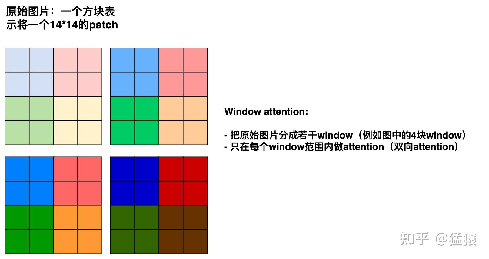
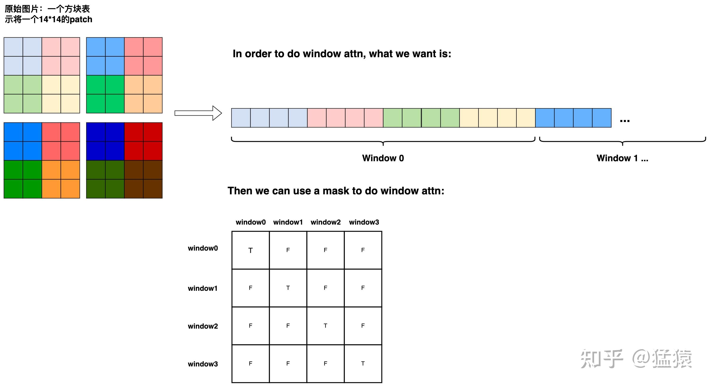
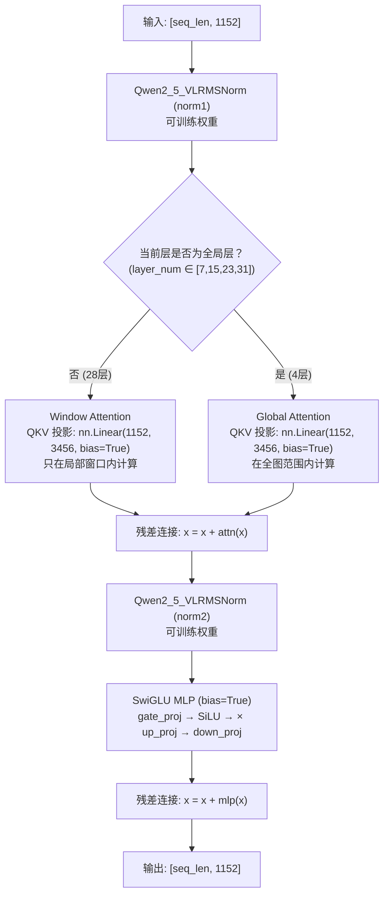

# Window Attention 交错窗口注意力

## 模块整体说明

交错窗口注意力（Interleaved Window Attention）是 Qwen2.5-VL 视觉骨干网（`Qwen2_5_VLVisionBlock`）的核心注意力机制。它解决的问题是：**大分辨率图像产生极长的视觉 Token 序列，如果全部做 Full Self-Attention（全局注意力），计算复杂度为 $O(N^2)$，显存和算力直接爆炸**。

**直观比喻**：想象你是一个阅卷老师，面前有 10000 份试卷（Token）。如果你要把每份试卷和其他 9999 份试卷逐一对比（Full Attention），那工作量是 $10000^2 = 1$ 亿次对比。Window Attention 的策略是：把试卷按座位分成小组（窗口），平时只在小组内互相对比；但每隔几轮，打乱一次让所有人全场对比一次，确保不遗漏跨组信息。

**在全链路中的位置**：窗口注意力位于视觉骨干网内部。它接收 [[conv3d_时空切块器]] 输出的 `[seq_len, 1152]` 序列，经过多层 Transformer Block 后输出同维度的深层特征，再送给 [[patchmerger_空间降维]] 进行压缩。

---

## 逻辑链输入与输出

- **逻辑链（输入）**：拉平的视觉序列 `[seq_len_vision, 1152]`。
- **逻辑链（输出）**：深层视觉序列 `[seq_len_vision, 1152]`（维度不变，语义变深）。

---

## 核心算法原理详解

### 1. 交错配置策略

Qwen2.5-VL 的 ViT 共有 **32 层** VisionBlock。这 32 层中：
- **4 层使用 Full Self-Attention（全局注意力）**：第 7, 15, 23, 31 层
- **28 层使用 Window Attention（窗口注意力）**：其余所有层

```python
fullatt_block_indexes = list(range(7, 32, 8))  # [7, 15, 23, 31]
```

**为什么选择每隔 8 层做一次全局注意力？** 这是效率与效果的黄金平衡：
- 绝大多数层只在局部窗口内计算，算力需求从 $O(N^2)$ 降到 $O(N \times W)$（$W$ 是窗口大小）。
- 每隔 8 层有一次全局注意力，确保跨窗口的长程依赖信息能流通到全图。
- 实验表明这种 $7:1$ 的交错比例在性能和效率之间达到了最佳折衷。

### 2. 窗口注意力的工作原理

**Step 1**：将全图的 Token 序列按照空间位置分成若干个固定大小的窗口（Window）。例如窗口大小为 $4 \times 4 = 16$ 个 Token。

**Step 2**：在每个窗口内独立进行 Self-Attention 计算。窗口之间完全隔离。

**Window Attention 与 Patch 排布重塑示意图**：

由于进入 ViT 之前，底层流水线是将 $2 \times 2$ 的区域转为 1 个超级 Token 的排布，所以在实际做窗口切分时，需要做一系列维度重排（Reshape）：


**Step 3**：窗口内的 Self-Attention 计算与标准 Attention 完全相同：
$$Attention(Q, K, V) = softmax\left(\frac{QK^T}{\sqrt{d_k}}\right) V$$

**数值示例**：假设一张图产生了 $30 \times 30 = 900$ 个 Token，窗口大小为 $4 \times 4$：
- Full Attention：$900 \times 900 = 810,000$ 次注意力计算
- Window Attention（窗口数 $\approx 56$，每窗口 16 Token）：$56 \times 16 \times 16 = 14,336$ 次
- **计算量降低约 56 倍！**

### 3. 窗口索引的获取

通过 `get_window_index(self, grid_thw)` 方法获取 `cu_window_seqlens`（Window Attention 分割列表），它告诉每一层应该用什么样的 Attention 范围：

```python
for layer_num, blk in enumerate(self.blocks):
    if layer_num in self.fullatt_block_indexes:
        cu_seqlens_now = cu_seqlens      # 全局注意力：全图范围
    else:
        cu_seqlens_now = cu_window_seqlens  # 窗口注意力：局部窗口
    hidden_states = blk(hidden_states, cu_seqlens=cu_seqlens_now, rotary_pos_emb=rotary_pos_emb)
```

### 4. VisionBlock 内部完整结构

每一个 VisionBlock 内部是标准的 Pre-Norm Transformer Block：

1. **RMSNorm → Attention → 残差连接**
2. **RMSNorm → SwiGLU MLP → 残差连接**

```python
def forward(self, hidden_states, cu_seqlens, position_embeddings):
    # 1. 归一化 + 自注意力 + 残差
    hidden_states = hidden_states + self.attn(self.norm1(hidden_states), ...)
    # 2. 归一化 + 带偏置的前馈网络 + 残差
    hidden_states = hidden_states + self.mlp(self.norm2(hidden_states))
    return hidden_states
```

### 可训练参数与训练方式

每一层 VisionBlock 包含以下可训练结构：

| 组件 | 网络结构 | 参数配置 | bias |
|------|---------|---------|------|
| `norm1` | `Qwen2_5_VLRMSNorm` | `(1152,)` 缩放权重 | - |
| `attn.qkv` | `nn.Linear` | `(1152, 1152×3)` | **True** |
| `attn.proj` | `nn.Linear` | `(1152, 1152)` | **True** |
| `norm2` | `Qwen2_5_VLRMSNorm` | `(1152,)` 缩放权重 | - |
| `mlp.gate_proj` | `nn.Linear` | `(1152, 4928)` | **True** |
| `mlp.up_proj` | `nn.Linear` | `(1152, 4928)` | **True** |
| `mlp.down_proj` | `nn.Linear` | `(4928, 1152)` | **True** |

**注意**：所有线性层都开启了 `bias=True`。这与 LLaMA 等语言模型中无偏置的设计不同。原因见 [[swiglu_门控激活函数]] 中关于 DC Offset 的解释。

**训练状态**：
- Stage 1：ViT 可训练
- Stage 2/3：全模型可训练
- 后训练 SFT/DPO：ViT 冻结

---

## 架构与代码流程图



---

## 源码逐行解剖

**代码路径**：`transformers/src/transformers/models/qwen2_5_vl/modeling_qwen2_5_vl.py`

```python
class Qwen2_5_VLVisionBlock(GradientCheckpointingLayer):
    def __init__(self, config):
        super().__init__()
        # 可训练参数：缩放权重 weight，形状 [1152]
        self.norm1 = Qwen2_5_VLRMSNorm(config.hidden_size, eps=1e-6)
        # 可训练参数：Q,K,V,O 投影矩阵，全部 bias=True
        self.attn = Qwen2_5_VLVisionAttention(config=config)
        self.norm2 = Qwen2_5_VLRMSNorm(config.hidden_size, eps=1e-6)
        # 极其关键：传入 bias=True 对抗传感器直流偏移
        self.mlp = Qwen2_5_VLMLP(config, bias=True)

    def forward(self, hidden_states, cu_seqlens, position_embeddings):
        # 1. 归一化 + 自注意力 (Window 或 Global)
        hidden_states = hidden_states + self.attn(
            self.norm1(hidden_states), cu_seqlens=cu_seqlens, ...
        )
        # 2. 归一化 + 带偏置的前馈网络
        hidden_states = hidden_states + self.mlp(self.norm2(hidden_states))
        return hidden_states
```

---

## 版本演化对比

| 版本 | 注意力策略 | Norm | MLP |
|------|-----------|------|-----|
| Qwen2-VL | Full Attention（全层全局） | LayerNorm | GELU MLP (quick_gelu) |
| **Qwen2.5-VL** | **交错 Window/Global (7:1)** | **RMSNorm** | **SwiGLU + bias=True** |
| Qwen3-VL | 继续交错 + LayerNorm 回退 | LayerNorm | SwiGLU + bias=True |
| Qwen3.5 | 回归 Qwen2.5-VL 配置 | RMSNorm | SwiGLU |

---

## 关联概念

- ✅ 支持 [[qwen2.5_vl_技术报告解析]]：ViT 从全局注意力升级为交错窗口注意力是核心改进之一。
- 上游：接收 [[conv3d_时空切块器]] 输出的 `[seq_len, 1152]` 序列。
- 下游：输出送给 [[patchmerger_空间降维]] 进行 4× 空间压缩。
- 内部使用 [[rmsnorm_归一化]] 做 Pre-Norm。
- 内部使用 [[swiglu_门控激活函数]] 做前馈网络。
- 🔄 演化自 Swin Transformer 的窗口注意力思想。

## 参考来源

- 原始资料：`knowledge_base/Qwen2.5-VL/Qwen2.5-VL.md`
- 学习指南：`knowledge_base/Qwen_Architecture_Guides/qwen_learning_guide_phase1.md`
