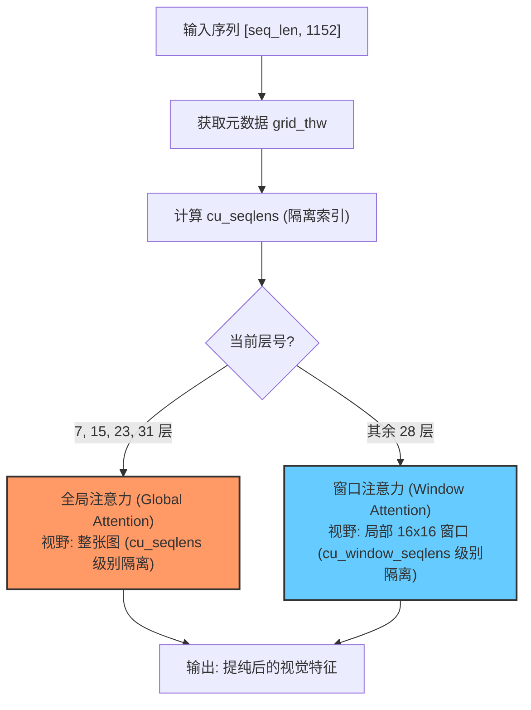

# Window Attention 交错窗口注意力

## 模块整体说明与架构拆解

交错窗口注意力（Interleaved Window Attention）是 Qwen2.5-VL 视觉骨干网（`Qwen2_5_VLVisionBlock`）的核心运算引擎。它主要解决了两个极限工程挑战：
1. **算力爆炸**：大分辨率图像产生极长的 Token 序列（如 4K 图产生 10k+ Token），全量 $O(N^2)$ 注意力的计算量是模型无法承受之重。
2. **异构隔离 (NaViT Packing)**：不同尺寸、不同归属的媒体 Patch 被“打包”在同一个长序列中，必须确保图片 A 的像素在计算时“看不见”图片 B 的像素（物理隔离）。

### 内部架构流转
在 32 层 VisionBlock 中，系统通过配置不同的“注意力视野”来实现算力与性能的平衡：



### 全局代码调用顺序与流转概览
1. **元数据摄入**：在 `Qwen2_5_VLVisionTransformer` 顶层，根据输入 `grid_thw` 计算出全局隔离索引 `cu_seqlens`。
2. **窗口划分**：调用 `get_window_index()`，根据物理位置将 `cu_seqlens` 进一步细拆为 `cu_window_seqlens`。
3. **逐层分发**：遍历 32 层 Block，根据层号动态切换传入的 `cu_seqlens`。
4. **内核执行**：进入 `Qwen2_5_VLVisionAttention.forward`，根据是否启用 Flash Attention 执行“硬件掩码”或“手动拆分”。

---

## 子模块/步骤详解

### 1. 步骤一：数据打包与物理隔离 (Packing & Isolation)

#### 模块说明
这是对 NaViT 核心思想的工程落地。为了最大化 GPU 吞吐量，Qwen2.5-VL 不对图片进行补零（Padding），而是直接将多张图的 Patch 拼接。本步骤的作用是**利用 `cu_seqlens` 建立一道数学围墙**，防止不同图片间的特征污染。

#### 逻辑链输入与输出
- **逻辑链（输入）**：`grid_thw` [Num_Media, 3] (每项的 T, H, W 网格规格)。
- **逻辑链（输出）**：`cu_seqlens` [Num_Media + 1] (累积序列偏移量)。

#### 第一性原理与原理解读
*   **为什么要隔离？** 在注意力矩阵 $QK^T$ 计算中，如果不加掩码，图片 A 的 Query 会去查询图片 B 的 Key。这在物理意义上会导致模型认为两张毫不相关的图片具有因果联系，破坏特征的纯净度。
*   **cu_seqlens 的本质 (物理围墙)**：它是一组累积坐标。它不仅隔离了不同的图片，还隔离了**同一视频的不同时间步**。
    - **隔离逻辑**：Qwen2.5-VL 认为视觉特征提取阶段应专注于“空间提纯”。因此，哪怕是一个 100 帧的视频，在 ViT 内部也会被拆成 50 个独立的时间步，每个步（Step）只在自己内部做空间 Attention。
    - **计算公式推导**：
      $$cu\_seqlens = cumsum([S_1, S_1, ..., S_2, S_2, ...]) \quad \text{(其中 } S_i \text{ 为第 i 个媒体项的空间 Token 数)}$$
      通过 `repeat_interleave(spatial_count, temporal_steps)`，系统为视频的每一个时间步都打上了一道围墙。

#### 核心源码解剖
**代码路径**：`transformers/src/transformers/models/qwen2_5_vl/modeling_qwen2_5_vl.py`

```python
# 将 grid_thw (T, H, W) 转化为累积长度，用于 Flash Attention
# 计算每张图的总 Patch 数: T * H * W
# repeat_interleave 是为了处理变长序列
cu_seqlens = torch.repeat_interleave(grid_thw[:, 1] * grid_thw[:, 2], grid_thw[:, 0]).cumsum(
    0, dtype=torch.int32
)
cu_seqlens = F.pad(cu_seqlens, (1, 0), value=0)
```

---

### 2. 步骤二：交错视野切换 (Window vs Global)

#### 模块说明
为了打破 $O(N^2)$ 困局，绝大多数层被限制在局部窗口（Window）内。但为了保留全局感知，每隔 8 层放开一次限制。

#### 逻辑链输入与输出
- **输入**：`seq_len = 10000`。
- **Window (28层)**：计算量 $\approx 10000 \times 256$ (假设窗口大小 16x16)。
- **Global (4层)**：计算量 $\approx 10000^2$ (单张图内)。

#### 具体操作逻辑拆解
1. **逻辑网格重构**：系统利用 `grid_thw` 记录的原始行列信息 $(H', W')$，将 1D 展平序列重新理解为 2D 物理平面。
2. **窗口切分 (Window Partition)**：
   - **窗口尺寸定义**：Qwen2.5-VL 默认 `window_size=112`，这指的是**原始图像像素**。
   - **Patch 换算**：由于每个 Patch 为 14x14，因此 112 像素对应于 $112/14 = 8$ 个 Patch。即：Window Attention 是在 **8x8 的 Patch 窗口**内进行的。
   - **算力对齐逻辑**：在源码实现中，为了配合后续的 `PatchMerger`（2x2 合并），系统会先将 8x8 的 Patch 窗口视为 4x4 的“元窗口”（每个元窗口包含 2x2 个 Patch），在 `get_window_index` 中体现为 `vit_merger_window_size = 4`。
3. **cu_window_seqlens 的生成**：
   - 它是 `cu_seqlens` 的“子集”。
   - 系统不仅会在不同媒体项（图片/视频）间划界，还会在同一个媒体项的内部，根据窗口边界强制划界。
   - **核心源码实现** (`get_window_index`)：
     ```python
     # 简化的逻辑示意
     # 1. 确定每个 Patch 所属的窗口 ID
     window_ids = (y // window_size) * (W // window_size) + (x // window_size)
     # 2. 统计每个 ID 出现的次数并累加
     cu_window_seqlens = torch.bincount(window_ids).cumsum(0)
     ```
4. **局部注意力**：在 Window Attention 层，Flash Attention 接收的是 `cu_window_seqlens`。这确保了 Query 只在所属的 8x8 小方块内寻找 Key/Value，计算复杂度从全图的 $O(N^2)$ 降为窗口内的常数级。

#### 第一性原理与原理解读
**视野的辩证法**：Window Attention 就像“闭门造车”，专注于打磨局部纹理（如：识别出一根猫毛）；Global Attention 就像“开门看路”，将局部的细节组合成宏观意图（如：识别出这是一只猫）。$7:1$ 的交错比例确保了模型既能看清细节，又不会迷失在局部中。

---

### 3. 步骤三：工业级加速实现 (Flash Attention vs Manual Split)

#### 模块说明
如何让隔离（Isolation）在底层硬件上高效运行。

#### 具体操作逻辑拆解与 Torch 对齐
Qwen2.5-VL 实现了两套隔离机制：
1. **硬件掩码 (Flash Attention)**：
   - 直接将 `cu_seqlens` 传给 Flash Attention 内核。内核在扫描矩阵时，会自动根据这个索引截断运算。这是**零开销隔离**，性能最高。
2. **手动拆分 (Manual Split)**：
   - 如果显卡不支持 Flash Attention，系统会根据 `cu_seqlens` 计算出的长度，用 `torch.split` 将大管子切回成若干个小 Tensor。
   - 对每一个小 Tensor 分别计算 Attention 后再 `torch.cat` 回去。

#### 核心源码解剖
```python
if is_flash_attention_requested(self.config):
    # 模式 A: 硬件高效掩码
    attn_output, _ = attention_interface(
        ...,
        cu_seq_lens_q=cu_seqlens, # 传入隔离索引
        cu_seq_lens_k=cu_seqlens,
        ...
    )
else:
    # 模式 B: 物理拆分隔离
    lengths = cu_seqlens[1:] - cu_seqlens[:-1]
    splits = [torch.split(tensor, lengths.tolist(), dim=2) for tensor in (...)]
    attn_outputs = [attention_interface(..., q, k, v, ...) for q, k, v in zip(*splits)]
    attn_output = torch.cat(attn_outputs, dim=1)
```

---

## 质量自我审查与准出标准

1. **算清楚了吗？**：理解 `cu_seqlens` 的计算公式，明白为什么它是从 `grid_thw` 演化而来的。
2. **看懂隔离了吗？**：能解释为什么图片 A 不会“看到”图片 B。
3. **理解加速了吗？**：明白 Flash Attention 处理变长序列（Packing）的物理意义。

---

## 关联概念

- ✅ 支持 [[qwen2.5_vl_预处理流水线]]：提供了隔离所需的原始数据 `grid_thw`。
- ✅ 支持 [[navit_动态分辨率]]：这是 NaViT Packing 思想在 Qwen 中的终极体现。
- 🔄 演化自 Flash Attention 2 / Swin Transformer。
- 下游：输出送往 [[patchmerger_空间降维]]。

## 参考来源

- `transformers/src/transformers/models/qwen2_5_vl/modeling_qwen2_5_vl.py`
- `knowledge_base/raw/万字长文图解Qwen2.5-VL实现细节_猛猿_2025-06-25/`
