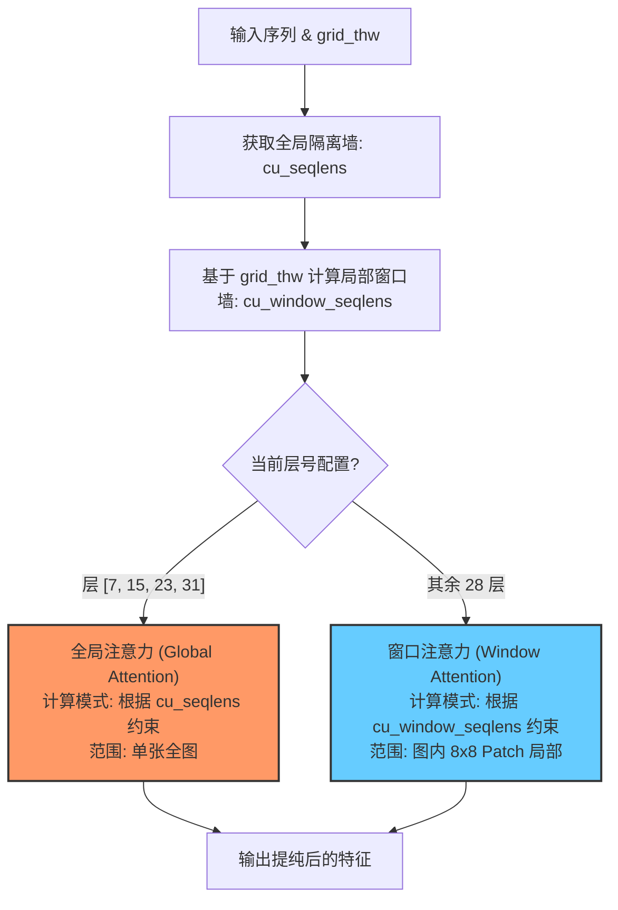

# Window Attention 交错窗口注意力

## 模块整体说明与架构拆解

交错窗口注意力（Interleaved Window Attention）是 Qwen2.5-VL 视觉骨干网（`Qwen2_5_VLVisionBlock`）的核心运算算子。它专门用于解决高分辨率图像输入下，单张图片内部 $O(N^2)$ 全局计算导致算力爆炸的问题。

通过将整图的特征序列重新划分成若干个 16x16 像素（相当于 8x8 Patch）的局部“窗口”，并限定大部分网络层只在窗口内部进行注意力交互，Qwen2.5-VL 极大地降低了计算量，同时辅以少量全局层（Global Attention）来保持宏观语义。

### 内部架构流转
在 32 层 VisionBlock 中，系统基于 [[packing_物理隔离机制]] 的 `cu_seqlens` 提供的大图片边界，动态切换每一层的注意力视野：



### 全局代码调用顺序与流转概览
1. **生成窗口隔离索引**：在进入 32 层的循环之前，模型调用 `get_window_index()`，传入 `grid_thw`，计算出 `cu_window_seqlens`。
2. **层间动态切换**：在迭代 Block 时，通过判断当前层序号是否在 `config.fullatt_block_indexes` 中：
    - 若在，则将 `cu_seqlens` 传给 Attention 算子。
    - 若不在，则将 `cu_window_seqlens` 传给 Attention 算子。
3. **计算核运行**：`Qwen2_5_VLVisionAttention` 不区分逻辑，只根据传入的 `cu_xxxx_seqlens` 去划分 Flash Attention 的计算边界。

---

## 子模块/步骤详解

### 1. 窗口切分算法 (Window Partition)

#### 模块说明
如何在被展平的 1D 视觉序列中，根据其原始 2D 物理空间关系，抠出 8x8 Patch 的局部窗口。

#### 逻辑链输入与输出
- **逻辑链（输入）**：`grid_thw` [Num_Media, 3]，包含 $(T, H, W)$，也就是每张图的原始 Patch 行列分布。
- **逻辑链（输出）**：`cu_window_seqlens`。在全图长序列中，切分出一个个 8x8 窗口对应的起始累加偏移量。

#### 具体操作逻辑拆解与 Torch 对齐
为了在不改变展平序列本质的情况下圈出 2D 窗口，系统使用了类似于给每个 Patch 发放“门牌号”（Window ID）的策略：
1. **网格复原与门牌计算**：根据 `grid_thw` 遍历每张图片，对图中的每个 Patch $(y, x)$，计算它属于哪个窗口：
   $$window\_id = (y // 8) \times (W // 8) + (x // 8)$$
   （假设窗口为 8x8 Patch）。
2. **重排与累积**：统计拥有相同 `window_id` 的 Patch 数量，并计算 `cumsum` 得到 `cu_window_seqlens`。

*注：由于后续会有空间合并（PatchMerger, $2\times2$ 聚合），Qwen2.5-VL 源码中引入了 `vit_merger_window_size`。这里的 Window 并非严格的 $8\times8$，而是在合并前的逻辑空间中被巧妙组织，以确保一个窗口内的元素能完整对应下家合并逻辑的边界。*

#### 第一性原理与原理解读
*   **视野的辩证法**：为什么不全是 Window Attention？因为纯粹的窗口注意力就像一堆坐在格子间里的人，他们对格外的世界一无所知（只能识别猫毛或花纹）。而 7:1 比例加入的 Global Attention 层，打通了所有格子间的通信壁垒，将细微的纹理聚合成“猫在花丛中”的宏观概念。
*   **解耦的精妙**：注意，Attention 算子内部本身**不知道**什么是窗口、什么是全局。它只认传入的 `cu_lengths` 偏移量数组。外部负责把 1D 数组按逻辑组装成“全局”和“窗口”的偏移数组，实现了计算与架构隔离。

#### 核心源码解剖
**代码路径**：`transformers/src/transformers/models/qwen2_5_vl/modeling_qwen2_5_vl.py`

```python
# Qwen2_5_VLVisionTransformer.forward 内部的视野切换逻辑
cu_window_seqlens, _ = get_window_index(
    grid_thw,
    window_size=self.config.window_size, # 默认 112 像素
    patch_size=self.config.patch_size,   # 默认 14 像素
    ...
)

# 开始遍历 32 层 Block
for i, layer_module in enumerate(self.blocks):
    # 动态切换隔离墙
    if i in self.config.fullatt_block_indexes:
        # 全局层，传入基于图片/帧隔离的 cu_seqlens
        current_cu_seqlens = cu_seqlens 
    else:
        # 窗口层，传入被进一步细分的 cu_window_seqlens
        current_cu_seqlens = cu_window_seqlens 
    
    hidden_states = layer_module(
        hidden_states,
        cu_seqlens=current_cu_seqlens, # Attention 算子只管在这个区间内计算
        ...
    )
```

---

## 质量自我审查与准出标准

1. **理清两者的关系了吗？**：理解 `cu_window_seqlens` 是对 `cu_seqlens` 在单图内部的进一步小区块细分。
2. **算力逻辑明白了吗？**：能回答在 4K 图像上，Window Attention 是如何将 $O(N^2)$ 的复杂度降为 $O(N \cdot W^2)$ 线性复杂度的。
3. **架构切换看懂了吗？**：知道在 `forward` 循环中，是通过 `if i in fullatt_block_indexes` 简单的切换传入变量来实现局部到全局的视界转换的。

---

## 关联概念

- ✅ 依赖 [[packing_物理隔离机制]]：窗口的划分必须建立在图片与图片不相交的大前提下。
- 🔄 演化自 Swin Transformer 的局部窗口注意力，但舍弃了 Shift 操作（通过交错 Global Attention 解决全局信息流通）。
