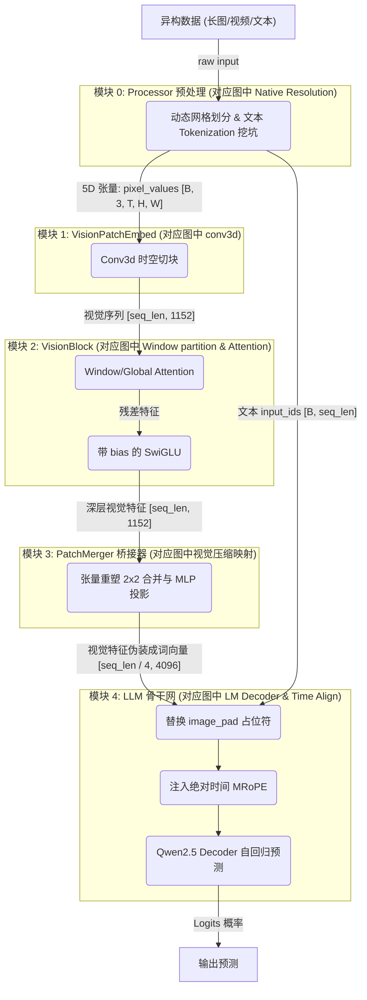
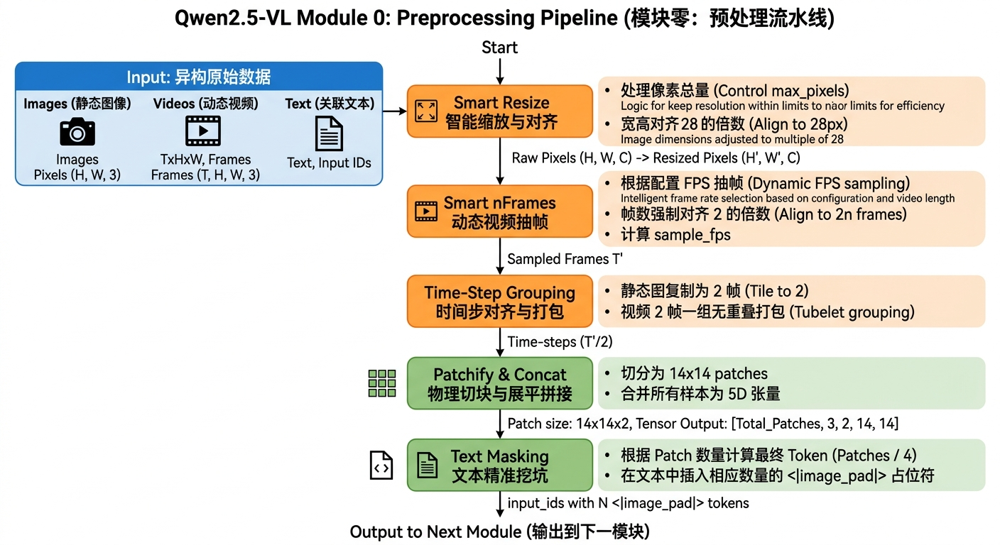
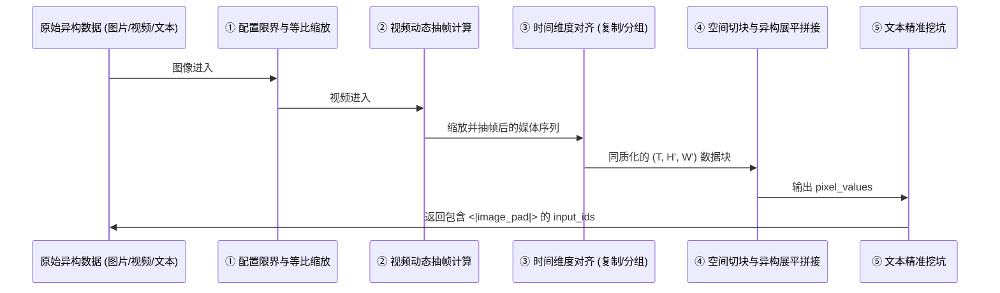
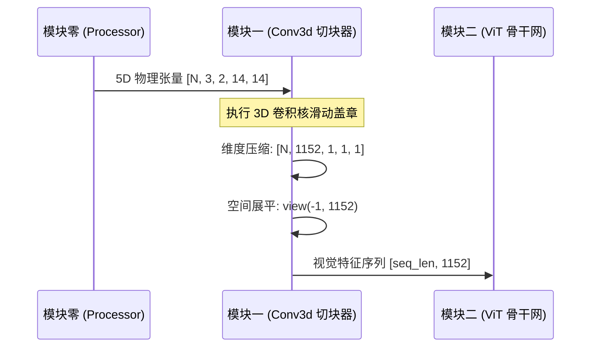
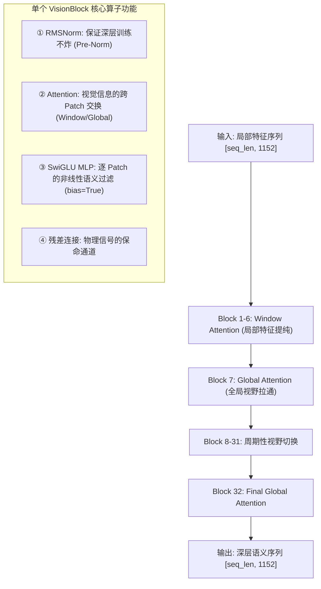
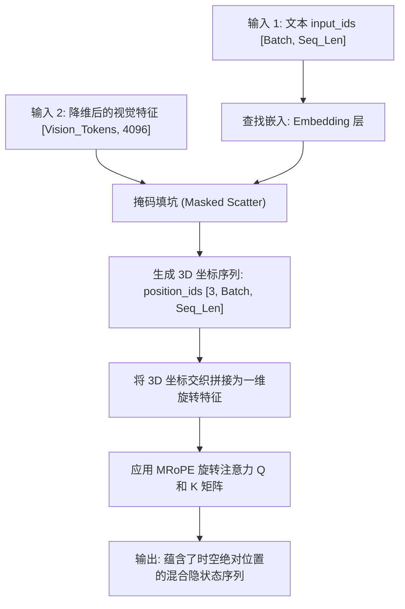
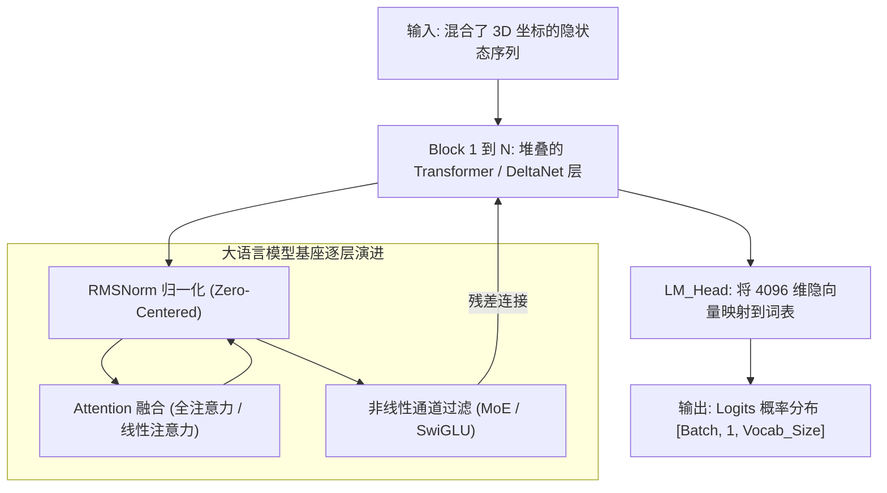
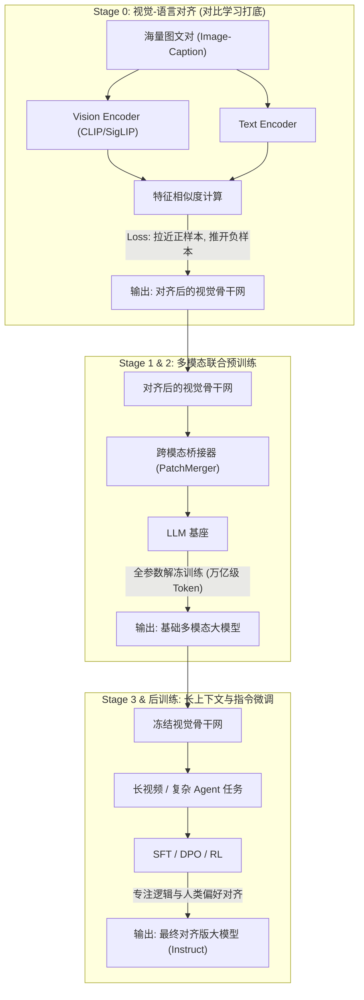

# Qwen 系列多模态大模型硬核学习指南

> **前言：本指南的正确使用方式**
> 本文件是整个 Qwen2.5-VL 架构体系的**「教学大纲」与「作战地图」**。这里不会直接堆砌冗长的代码和晦涩的数学推导，而是专注于**构建你的系统化学习脉络**。
> 
> 针对每一个核心模块，我们都严格遵循四大章节进行梳理：
> **1. 架构顺序解读**：模块的来龙去脉、输入输出、以及数据在其中经历了哪些处理步骤。
> **2. 概念学习序列**：按顺序将模块内容串联，说明组件的功能与概念来源，并**严格定义“吃透该概念的准出条件”**。
> **3. 学习目标与标准**：你需要达到什么程度的理解。
> **4. 疑问解答**：列出最关键的核心疑问，并**提供精确到章节的跳转解答链接**。
>
> 所有的复杂内容、全流程拆解、源码逐行剖析与第一性原理推导，均已收敛在对应的 **`[[知识卡片]]`** 中，请通过大纲中的链接跳转进行沉浸式学习。

---

## 第 1 章：全景架构大纲与数据流拓扑

Qwen2.5-VL 标志着经典“三段式”架构的完全成熟。它的整体运行链路严格按照以下五个模块顺次流转：

### 1.1 官方架构图导读
为了建立宏观认知，我们需要先对图中的每一部分建立"透视"映射：

1. **左侧输入端 (Native Resolution)**：对应我们定义的**模块零（预处理流水线）**，不经过神经网络，只负责图像视频的物理缩放与打包。
2. **中间靠下 (MRoPE Time IDs)**：同样在**模块零**内计算，但其实际作用在最终的**模块四**。
3. **右侧 Vision Encoder (conv3d + Window + Attention)**：囊括了**模块一（时空切块器）**和**模块二（视觉骨干网）**。
4. **图中隐含的跨模态投影**：这是至关重要的**模块三（PatchMerger）**，在视觉特征进入 LLM 前的必经之路。
5. **最上侧 (Qwen2.5 LM Decoder)**：最终的**模块四（LLM基座）**。

### 1.2 全链路核心数据流拓扑
为了将官方架构图进一步映射到我们的物理代码结构中，我们提取了如下的核心数据流拓扑（**这也是你接下来逐步学习的顺序图**）：

---

## 第 2 章：模块零 —— Processor 预处理流水线 (黄金学习样板)

### 1. 架构顺序解读

**来龙去脉**：大语言模型（LLM）底座只能处理一维的“词向量（Token）”序列。而现实世界中的多模态数据是高度异构的（包括长宽比例极端的超清长图、尺寸极小的图标、高低帧率及时长各异的视频）。预处理模块（Processor）不包含任何神经网络权重，它是整个多模态架构的**安全看门人与格式翻译官**，负责在进入深度学习网络前，通过纯数学和矩阵操作完成数据的标准化。

**架构流转图示**：

**输入与输出（结合具体实例）**：
- **输入**：
  - Picture 1（超清长图）：`[8204, 1092, 3]` (HWC)
  - Picture 2（极小图）：`[28, 224, 3]`
  - Video 1（视频）：原始时长 8s，分辨率 `[392, 644, 3]`
  - Text：`"这是图1<image>，这是图2<image>，这是视频<video>"`
- **流转步骤**（对应后文知识点）：
  1. **图像尺寸限界与等比缩放**（应用 [[qwen2.5_vl_预处理流水线#步骤一：图像的配置检查与限界缩放 (smart_resize)]]）：基于 `max_pixels` 进行等比缩放并对齐 28。Picture 1 算满后不变，Picture 2 不变。
  2. **视频动态抽帧**（应用 [[qwen2.5_vl_预处理流水线#步骤二：视频动态抽帧与真实 FPS 计算 (smart_nframes)]]）：Video 1 根据用户请求及截断策略抽取出 4 帧。
  3. **同质化包装与时间维对齐**（应用 [[qwen2.5_vl_预处理流水线#步骤三：时间维度对齐与 5D 张量奥秘 (Time-Step Grouping)]]）：Picture 1 和 2 静态图在内存中直接复制为 2 帧；Video 1 的 4 帧按时间顺序每 2 帧组成一个时间步组（共 2 个时间步）。
  4. **拼装切块与拉平**（应用 [[qwen2.5_vl_预处理流水线#步骤四：暴力拉平与文本挖坑 (Concat & Tokenization)]]）：全部按照 $14 \times 14$ 切割为 Patch，并在 Batch 内把所有 Patch 暴力展平拼接为超长的一维管子。
  5. **精准文本挖坑**（应用 [[qwen2.5_vl_预处理流水线#步骤四：暴力拉平与文本挖坑 (Concat & Tokenization)]]）：计算最终视觉 Token 数量，在文本中精准插入总对应数量的 `<|image_pad|>`。
- **输出**：
  - `pixel_values`：标准 5D 张量 `[48316, 3, 2, 14, 14]`（其中 48316 是合并了前述三者的所有 Patch 块总数）。
  - `input_ids`：包含 11427 + 8 + 644 = 12079 个 `<|image_pad|>` 的文本序列。

> **注：关于 14x14 Patch 与算力转移点的本质**
> 1. **维度的本质**：最后的两维 `14*14` 纯粹只是 Patch 块的空间尺寸。在这一步，张量本身**没有进行任何像素级别的压缩或特征提取**（除了受限于配置的智能等比缩放与视频抽帧）。它仅仅是为了迎合后续模块的 Conv3D 接收格式而进行的物理维度重组。
> 2. **进入 GPU 的时机**：整个预处理流水线（模块零）是完全在 **CPU 和内存** 中完成的。只有当输出的 `pixel_values` 被移交到 GPU（`.to("cuda")`）并执行 `model.forward` 进入模块一（Conv3D）时，才会真正消耗 GPU 算力与显存。

### 2. 概念学习序列与学习目标

在这一章，你需要按以下层级逻辑逐步吃透配置管理、像素计算和维度重组等核心概念：

#### 2.1 基础理念层：原生动态分辨率 (NaViT)
*   **概念说明**：一切预处理的核心哲学来源。打破传统 ViT 必须 Resize 成固定正方形（如 224x224）的桎梏，主张保留原始画面宽高比。它与业界另一种“切块拼图法（Dynamic Tiling）”形成了鲜明对比。另外，动态分辨率会带来 Token 爆炸，因此也催生了后续的视觉 Token 压缩技术。
*   **学习目标与吃透标准**：
    *   能清晰说出原生动态分辨率与传统 Resize 操作的本质区别。
    *   能够对比说明 Qwen 的“原生整体缩放”与 InternVL / LLaVA-NeXT 的“网格切片（Tiling）”方案的优劣。
    *   了解业界主流的 4 种视觉 Token 压缩流派。
*   👉 **去教材详读**：[[navit_动态分辨率#核心算法原理详解]] 与 [[navit_动态分辨率#7-动态分辨率方案深度对比：原生-vs-切片-tiling]]

#### 2.2 核心机制层：Qwen2.5-VL 配置管理与参数计算
*   **子知识点 A：`max_pixels` 限制与图像尺寸缩放**
    *   ...
*   **子知识点 C：媒体身份标识与元数据生成 (grid_thw)**
    *   **概念说明**：异构数据打包（Packing）后的身份卡。记录每张图/视频的 `(T, H, W)` 规格。
    *   **学习目标与吃透标准**：明白为什么需要 `grid_thw`，它是如何在后方实现“数据隔离（Isolation）”的基石。
    *   👉 **去教材详读**：[[qwen2.5_vl_预处理流水线#步骤五：媒体身份标识与元数据生成 (grid_thw)]]

#### 2.3 物理整合层：5D 张量时空流转与异构大串联
*   **概念说明**：预处理的终极魔法。解释如何将处理好的图与视频，统一拍平打包成 `[total_patches, 3, 2, 14, 14]` 形状的张量，并在文本中插入精准对应的占位符。
*   **学习目标与吃透标准**：
    *   必须能在脑海里心算出一个极限样本经过处理后，到底生成了多少个 Patch。
    *   **深刻理解 Packing（打包）思想**：明白为什么我们要把不同尺寸的图拼成一根“长管子”（为了极致利用 GPU 算力，拒绝无谓的补零 Padding）。
    *   👉 **去教材详读**：[[qwen2.5_vl_预处理流水线#步骤三：时间步打包与 5D 张量同质化 (Time-Step Grouping)]] 与 [[qwen2.5_vl_预处理流水线#步骤四：异构展平拼接与精准挖坑 (Concat & Tokenization)]]

#### 2.4 工程实战层：框架集成与显存评估 (OOM救火)
*   **概念说明**：将预处理放到 LLaMA-Factory / SWIFT 训练框架及 vLLM 推理框架中去理解。讲解数据是如何在 CPU 与 GPU 之间流转的，以及如何根据模块零的计算结果评估所需的显存大小。
*   **学习目标与吃透标准**：
    *   能画出并行 Dataloader 与 GPU 训练的配合流转图。
    *   在遇到 OOM 时，能立刻知道该调整 `max_pixels` 或 `fps` 到什么数值，并能在脑海中预估改完后的序列长度和显存收益。
*   👉 **去教材详读**：[[qwen2.5_vl_预处理框架集成与显存评估]]

### 3. 疑问解答 (Q&A 索引)

针对本章所学的三个概念层级，我们整理了最核心的疑问与详尽解答跳转：

#### 3.1 关于原生动态分辨率
*   **Q1: Qwen2.5-VL 采用了 NaViT 的动态分辨率，那它也使用了 Token Drop 机制来随机丢弃 Token 吗？**
    👉 解答详见：[[qwen2.5_vl_预处理流水线#步骤一：图像的配置检查与限界缩放 (smart_resize)]]
*   **Q2: 把多张不同尺寸的图片 Pack 到同一个序列中，计算 Attention 时怎么保证它们不互相污染？**
    👉 解答详见：[[navit_动态分辨率#1-navit-的基石思想-patch-n-pack]]
*   **Q3: 相比于基于切片的动态分辨率（如 InternVL2），原生动态分辨率（如 Qwen2-VL）的 Token 消耗真的更少吗？**
    👉 解答详见：[[navit_动态分辨率#原生-qwen-vs-切片-internvl：token-消耗对决]]

#### 3.2 关于配置管理与参数计算
*   **Q2: 配置文件中没有 `max_token`，那是怎么通过 `max_pixels` 和 `min_pixels` 实现原生限制 Token 数量的？**
    👉 解答详见：[[qwen2.5_vl_预处理流水线#步骤一：图像的配置检查与限界缩放 (smart_resize)]]
*   **Q3: 视频的抽帧（`nframes`）到底是怎么算的？为什么要反推一个真实的 `sample_fps`？**
    👉 解答详见：[[qwen2.5_vl_预处理流水线#步骤二：视频动态抽帧与真实 FPS 计算 (smart_nframes)]]

#### 3.3 关于时空打包与 5D 张量整合
*   **Q4: 为什么最终生成的 5D 张量里，中间一定要有一个“维度值为 2”的时间维？这有什么物理直觉？**
    👉 解答详见：[[qwen2.5_vl_预处理流水线#步骤三：时间步打包与 5D 张量同质化 (Time-Step Grouping)]]
*   **Q5: 静态图片只有一帧，怎么送进这包含时间维度的 5D 张量？**
    👉 解答详见：[[qwen2.5_vl_预处理流水线#步骤三：时间步打包与 5D 张量同质化 (Time-Step Grouping)]]
*   **Q6: 视频如果是按 2 帧一组，且是无重叠分组（1-2, 3-4），时间连续性不会被割裂吗？**
    👉 解答详见：[[qwen2.5_vl_预处理流水线#步骤三：时间步打包与 5D 张量同质化 (Time-Step Grouping)]]
*   **Q7: 占位符 `<|image_pad|>` 是怎么算出数量并在文本中精准挖坑的？**
    👉 解答详见：[[qwen2.5_vl_预处理流水线#步骤四：暴力拉平与文本挖坑 (Concat & Tokenization)]]

---

## 第 3 章：模块一 —— 时空切块器 (VisionPatchEmbed)

### 1. 架构顺序解读

**来龙去脉**：预处理吐出的 5D 张量虽然已经完成了物理上的分块与对齐，但它们仍然只是原始的像素数值（物理模拟信号）。大语言模型无法直接理解像素，它需要的是具备高阶语义潜力的“稠密向量”。时空切块器（VisionPatchEmbed）作为视觉编码器的**物理神经元入口**，其核心使命就是将离散的像素块，通过 3D 卷积的“时空感受野”投影到高维特征空间。

**架构流转图示**：

**输入与输出**：
- **输入**：重塑后的 5D 物理张量 `[Batch × 块数, 3(RGB), 2(T), 14(H), 14(W)]`。
- **流转核心**：利用一个核大小为 `(2, 14, 14)` 的 3D 卷积核，在三个维度上以等长的步长（Stride）进行不重叠滑动。这不仅实现了空间上的 $14 \times 14$ 压缩，更关键是实现了时间轴上每 2 帧的“管状（Tubelet）”融合。
- **输出**：一维拉平的视觉特征序列 `[seq_len_vision, 1152]`。

### 2. 概念学习序列与学习目标

在这一章，你将深入理解卷积神经网络如何作为视觉进入 Transformer 的“翻译官”：

#### 2.1 核心机制层：3D 卷积与 Tubelet Embedding
*   **概念说明**：解释为什么抛弃 2D 卷积，选择 3D 卷积核。理解“管状切分”如何捕捉微弱的运动信息。同时需要建立对底层卷积家族（如空洞卷积、分组卷积、深度可分离卷积）的宏观认知，以便对比理解。
*   **学习目标与吃透标准**：
    *   能够手算给定输入下，Conv3D 产生的张量形状变化。
    *   能清晰定义卷积核大小（Kernel Size）与步长（Stride）相等的工程意图（即保证 Patch 互不重叠）。
    *   能说出转置卷积（反卷积）产生棋盘格伪影的原因。
*   👉 **去教材详读**：[[conv3d_时空切块器#1-步骤一：3d-卷积时空滤波-tubelet-embedding]] 与 [[convolution_卷积家族原理]]

#### 2.2 第一性原理层：视觉嵌入 vs 文本嵌入
*   **概念说明**：深度对比物理信号的“滤波”与人为符号的“查表”差异。
*   **学习目标与吃透标准**：
    *   能解释为什么视觉嵌入训出来的是“滤波器（Filter）”，而文本嵌入训出来的是“字典（Dictionary）”。
    *   理解为什么视觉嵌入层虽然提取了特征，但却“看不见”全局，从而推导出后文 Transformer 的必要性。
*   👉 **去教材详读**：[[conv3d_时空切块器#第一性原理深度对比：视觉 vs 文本]]

#### 2.3 渊源与演化层：参数设计与版本差异
*   **概念说明**：追溯 Conv3D 参数的来源，理解 `bias=False` 的设计权衡，以及 Qwen3-VL 为何又将其开启。
*   **学习目标与吃透标准**：
    *   能说出 Qwen2.5-VL 视觉编码器的参数量及训练阶段（Stage 0/1/2/3）中的冻结状态。
    *   理解偏置（Bias）在对抗传感器“直流偏移”中的物理意义。
* 👉 **去教材详读**：[[conv3d_时空切块器#1. 步骤一：3D 卷积时空滤波 (Tubelet Embedding)]] 与 [[conv3d_时空切块器#参数生命周期与渊源追溯]]

### 3. 疑问解答 (Q&A 索引)

*   **Q1: 既然是处理视频的 3D 卷积，那在处理静态图片时，是不是会造成算力的极大浪费？**

    👉 解答详见：[[conv3d_时空切块器#数值计算示例与心算验证]]
*   **Q2: 视觉嵌入和纯文本嵌入在第一性原理上有什么不同？为什么不直接给像素编号做查表？**
    👉 解答详见：[[conv3d_时空切块器#第一性原理深度对比：视觉 vs 文本]]
*   **Q3: 为什么 Qwen2.5-VL 的 Conv3D 不开偏置（Bias=False），但 Qwen3-VL 却开了？**
    👉 解答详见：[[conv3d_时空切块器#1. 步骤一：3D 卷积时空滤波 (Tubelet Embedding)]]

---

## 第 4 章：模块二 —— 视觉骨干网 (ViT Backbone)

### 1. 架构顺序解读

**来龙去脉**：时空切块器（模块一）生成的局部特征序列虽然具备了高维信息，但由于卷积感受野的局限，每个 Patch 都是无法感知全局的“孤岛”。视觉骨干网（ViT Backbone）本质上是一个**深层语义熔炉**。它通过 32 层 Transformer 结构的深度堆叠，利用注意力机制打破空间限制，让分散的 Patch 互相对话，逐步拼凑出宏观的、能够被大模型理解的高级视觉意图（如从“边缘线”到“猫”的跨越）。

**架构流转图示**：

**输入与输出（结合 3B 模型）**：
- **输入**：拉平的视觉序列 `[TotalPatch, 1152]`。
- **流转核心**：连续经过 32 层 Transformer Block。每层都执行“层归一化 $\rightarrow$ 注意力融合 $\rightarrow$ 非线性映射”的标准化动作。
- **核心优化**：为了节省算力，只有在第 7, 15, 23, 31 层会执行 $O(N^2)$ 的全局注意力，其余层均被限制在局部窗口内。
- **输出**：深层高级视觉语义序列 `[TotalPatch, 1152]`（维度保持不变，但每个向量已刻印了全图上下文）。

### 2. 概念学习序列与学习目标

在这一章，你将深入理解视觉信息是如何被一层层“提纯”并“LLM 化”的：

#### 2.1 理念奠基：为什么需要 32 层以及“架构统一”
*   **来龙去脉**：在进入复杂的微观计算前，我们必须明白大方向。时空切块器送来的特征虽然密集，但缺乏宏观联系。ViT 通过 32 层的深度堆叠（从提取边缘到识别猫咪）实现语义的跃迁。同时，为了让这些视觉特征后续能顺利被大语言模型（LLM）理解，Qwen2.5-VL 的 ViT 在底层组件（如 RMSNorm、SwiGLU）上进行了彻底的“LLM 镜像化”。
*   **学习目标与吃透标准**：能解释深层与浅层的特征分工；能列举出 Qwen2.5-VL 相比传统 ViT 做了哪些“向 LLM 看齐”的改动。
*   👉 **去教材详读**：[[vit_核心原理与结构#1. 为什么需要多层堆叠？ (第一性原理)]]

#### 2.2 物理准备：打包隔离 (Packing) 与 空间定位 (2D-RoPE)
*   **来龙去脉**：当千奇百怪、分辨率各异的图片和视频帧被暴力展平合并成一根 `[TotalPatch, 1152]` 的长管子进入骨干网时，首先面临两个致命问题：一是如何防止不同图片的像素互相“串台”？二是如何让模型知道每个像素原本在二维平面上的绝对位置？
*   **核心组件与学习目标**：
    *   **【组件 A：Packing 物理隔离机制 (cu_seqlens)】**：学习它如何根据 `grid_thw` 建立起不可逾越的数学围墙。👉 [[packing_物理隔离机制]]
    *   **【组件 B：二维位置觉察 (2D-RoPE)】**：学习它为什么把特征维度劈成两半（一半管 X 一半管 Y），从而彻底解放了对固定分辨率的限制。👉 [[2d_rope_视觉位置编码]]

#### 2.3 语义提纯：交错视野 (Attention) 与 归一化 (RMSNorm)
*   **来龙去脉**：位置和围墙确定后，特征开始在 32 层网络中循环提纯。如果让每个像素都和同图片内的所有像素做交互（Global Attention），算力会瞬间爆炸。因此，模型在“围墙”内再次划定了“格子间”（Window Attention），并以 7:1 的精巧比例交替全局与局部视野。而为了保证这 32 层的深层训练不崩溃，每次交互前都需要进行极简的方差归一化。
*   **核心组件与学习目标**：
    *   **【组件 C：交错窗口注意力 (Window Attention)】**：理解 `cu_window_seqlens` 如何进一步切分 8x8 Patch 窗口，以及算力是如何被节约下来的。👉 [[window_attention_交错注意力]]
    *   **【组件 D：RMSNorm 归一化】**：学习仅凭方差缩放实现的极简归一化。👉 [[rmsnorm_归一化]]

#### 2.4 底噪对抗：带偏置的视觉 MLP (SwiGLU)
*   **来龙去脉**：注意力机制完成了“像素与像素”之间的空间交流，接下来需要一个专门的模块来进行“特征与特征”通道间的非线性过滤，把无效的背景噪音滤除。这就是 SwiGLU 的职责。
*   **核心组件与学习目标**：
    *   **【组件 E：视觉 SwiGLU 与 Bias】**：必须能解释为什么视觉侧 MLP 必须开启 `bias=True` 来对抗传感器物理直流偏移，而 LLM 侧则不需要。👉 [[swiglu_门控激活函数#2. Qwen2.5-VL 的核心变动：开启 Bias]]

### 3. 学习目标与标准：参数心算与黑盒破除

**【吃透标准】**：彻底破除 Vision Transformer 的“黑盒”迷信。你必须能够：
1.  **心算参数**：知道一个 3B 模型的视觉侧（约 0.7B）中，绝大部分参数都消耗在 32 层 MLP 和 Attention 中。
2.  **解释视野**：说清楚窗口注意力（局部纹理）与全局注意力（宏观意图）的协同辩证法。
3.  **理解隔离**：在 NaViT 打包模式下，如何利用 `cu_seqlens` 保证不同比例、不同媒体的 Patch 在同一个 Batch 里互不干扰，以及它与 `cu_window_seqlens` 的关系。

### 4. 疑问解答 (Q&A 索引)

*   **Q1: 既然输入输出维度不变，为什么不直接训一层大 Embedding，非要堆 32 层 Transformer？**
    👉 解答详见：[[vit_核心原理与结构#1. 为什么需要多层堆叠？ (第一性原理)]]
*   **Q2: 为什么处理人类文本的 LLM 不需要偏置，而处理图像物理信号的 ViT 却必须开启 `Bias=True`？**
    👉 解答详见：[[swiglu_门控激活函数#2. Qwen2.5-VL 的核心变动：开启 Bias]]
*   **Q3: 在一个 Batch 里混了 10 张不同比例的图，ViT 计算时怎么保证它们不互相干扰？**
    👉 解答详见：[[packing_物理隔离机制#1. 数据打包与边界划分 (Packing & cu_seqlens)]]

---

## 第 5 章：模块三 —— 空间降维桥接器 (PatchMerger)

### 1. 架构顺序解读
**来龙去脉**：虽然通过了 ViT，但每张图动辄产生上万个 Token。大语言模型的处理成本极其昂贵，必须在跨模态对接前进行极限压缩，并将 1152 维翻译成语言模型认得的 4096 维词典空间。
**输入**：深层视觉序列 `[seq_len, 1152]`。
**流转步骤**：利用内存连续性，强行将 4 个相邻 Token Reshape 为 1 个。经过两层 MLP 线性投影压维。
**输出**：压缩降维后的超级 Token `[seq_len / 4, 4096]`。

### 2. 概念学习序列
*   **【概念一：PatchMerger 空间合并投影】**
    *   **组件作用与位置**：视觉网与语言基座间的咽喉要塞。
    *   **准出条件（如何叫整明白）**：必须能结合预处理时的 5D 序列排布规律，解释出这个看似简单的 `.view(-1, 4608)` 魔法，是怎么巧妙实现空间上 $2 \times 2$ 物理块收缩的。
    *   👉 **深度学习去这里**：**[[patchmerger_空间降维]]**

### 3. 学习目标与标准
**【吃透标准】**：理解序列重塑（Reshape/View）在算力优化中的四两拨千斤之效。

### 4. 疑问解答 (Q&A 索引)
*   **Q1: 怎么在不引入复杂卷积的情况下，强行合并砍掉 75% 的序列长度？**
    👉 解答详见：`[[patchmerger_空间降维#1-空间下采样：张量形变魔法]]`

---

## 第 6 章：模块四（前半） —— 多模态特征融合与三维空间感知 (Cross-Modal & MRoPE)

### 1. 架构顺序解读

**来龙去脉**：桥接器吐出的超级视觉特征，终于顺理成章地填入了自然语言序列中预留好的 `<|image_pad|>` 坑位。但由于语言模型天生只能理解“前后词”的线性时序关系，根本不懂“上下排（图像空间）、长短视频（时间流逝）”的 3D 概念。因此，必须在进行自回归解码之前，为这串混合序列注入多维度的空间位置编码体系（MRoPE）。

**架构流转图示**：

**输入与输出（结合实例）**：
- **输入**：对齐后的视觉特征 `[seq_len_vision, 4096]` 与纯文本的 `input_ids` 序列。
- **流转核心**：
  1. **填充空位**：利用布尔掩码将文本 Embedding 中属于 `<|image_pad|>` 的零向量替换为真实的视觉特征。
  2. **时空赋权**：获取预处理阶段算好的 3D 坐标系，通过 MRoPE 分配给 T、H、W 维度。特别地，基于真实 `sample_fps`，计算视频帧在绝对物理时钟（秒）上的真实间隔。
- **输出**：准备好进入 LLM 解码层的混合隐状态序列。

### 2. 概念学习序列

在这一章，你将深入理解文本与图像是如何被贴上同一个世界体系的物理坐标戳的：

#### 2.1 物理觉察层：万物旋转的基础 (RoPE)
*   **来龙去脉**：在进入多维复杂空间之前，必须理解一维旋转位置编码的复数乘法本质。大模型是如何做到既不破坏原始向量特征，又能优雅地表示相对距离的？这是所有衍生架构的唯一数学基石。
*   **学习目标与吃透标准**：
    *   能推导绝对位置在经过复数旋转相乘后，是如何在点积中自发演化出相对距离 $(m-n)$ 的。
*   👉 **去教材详读**：[[rope_旋转位置编码]]

#### 2.2 多模融合层：三维时空觉察与交织 (MRoPE)
*   **来龙去脉**：为了区分长序列中的 Token 究竟是纯文本、静态图的某个角落还是视频的某一帧，大模型基座将一维的 `head_dim` (如 128) 物理切割为三段，分别用来编码时间 (T)、高度 (H) 和宽度 (W)。对于纯文本，T/H/W 退化为同步递增；对于视频，则各自拥有独特的 3D 坐标生长轨迹。
*   **学习目标与吃透标准**：
    *   必须能够在纸上画出：一个文本 Token 和一个 2x2 图像的 Patch，它们的 3D 位置 ID 分别长什么样。
    *   必须能够解释 `mrope_section` (如 [16, 24, 24]) 是如何将旋转角度分配的，并在代码层面上追踪它。
*   👉 **去教材详读**：[[mrope_多模态位置编码]]

### 3. 学习目标与标准

**【吃透标准】**：融会贯通，将**模块零（预处理流水线）**计算出的时空变量 `grid_thw` 和 `sample_fps`，完美闭环并落地到**模块四**的 MRoPE 复数旋转方程中。

### 4. 疑问解答 (Q&A 索引)

*   **Q1: 预处理算出的真实视频 `sample_fps` 是怎么在这个阶段发挥作用，对齐物理绝对时间（秒）的？**
    👉 解答详见：[[mrope_多模态位置编码#1-3d-id-序列的生成逻辑-token-级别的显微镜]]
*   **Q2: RoPE 是如何把绝对位置转换为相对位置的？**
    👉 解答详见：[[rope_旋转位置编码#1-第一性原理与复数推导]]
*   **Q3: 在一个包含了长段文本和一段视频的 Prompt 里，Token 们的 3D position_id 都是怎么生长的？**
    👉 解答详见：[[mrope_多模态位置编码#1-3d-id-序列的生成逻辑-token-级别的显微镜]]

---

## 第 7 章：模块五 —— 大语言模型基座 (LLM Backbone & Reasoning)

### 1. 架构顺序解读

**来龙去脉**：在完成了视觉特征的提纯（ViT）和空间位置的标注（MRoPE）后，所有的数据最终进入了大模型的核心“大脑”——大语言模型基座（LLM Backbone）。这一部分不关心像素如何处理，它专职负责**因果逻辑推理、常识调取和最终的文本预测（Token Generation）**。多模态模型的上限，很大程度上取决于这层语言底座的智商与效率。

**架构流转图示**：

**输入与输出**：
- **输入**：经过 MRoPE 旋转处理的混合隐状态序列。
- **流转核心**：在包含数十层的极深网络中，视觉 Token 和文本 Token 互相“凝视（Attention）”。文本通过视觉 Token 的激活找回与画面相关的常识，视觉 Token 在文本的引导下明确回答的意图。
- **输出**：模型对下一个 Token 的概率预测分布。

### 2. 概念学习序列

在这一章，你将深入探讨 LLM 底座从 Qwen2.5 的成熟稳定走向 Qwen3/3.5 的极速狂飙：

#### 2.1 底座基石：稠密网络与 Qwen2.5
*   **来龙去脉**：了解 Qwen2.5-VL 所使用的标准 Transformer 架构。它通过 GQA (分组查询注意力)、SwiGLU 激活函数和标准的 RMSNorm 构建了强大的推理底座。
*   **学习目标与吃透标准**：明确它与前置视觉 ViT 在结构组件上的异同。
*   👉 **去教材详读**：[[llm_backbone_大语言模型基座#1-qwen2-5-经典底座核心组件-qwen2-5-vl-的引擎]]

#### 2.2 推理革命：线性注意力与极致稀疏 (Qwen3 / 3.5)
*   **来龙去脉**：随着多模态数据（尤其是长视频）使得输入序列轻松突破十万、百万大关，传统的 Self-Attention 因为 $O(N^2)$ 的 KV Cache 显存爆炸而走入死胡同。Qwen3.5 引入了 3:1 混合的 Gated DeltaNet (线性注意力) 和高度稀疏的 MoE 架构，让长序列推理成本呈线性下降。
*   **学习目标与吃透标准**：
    *   必须能够解释 Gated DeltaNet 是如何用一个恒定大小的记忆状态矩阵 $S$ 替代传统不断增长的 KV Cache 的。
    *   理解 Zero-Centered RMSNorm $(1+w)$ 为什么在训练初期能保证恒等映射。
*   👉 **去教材详读**：[[llm_backbone_大语言模型基座#3-qwen3-5-革命性创新二：gated-deltanet-线性注意力]]

### 3. 学习目标与标准

**【吃透标准】**：破除“把大模型当做黑盒”的迷信。不仅要明白语言模型在多模态架构中的推理作用，更要对当前 LLM 领域为了克服极长上下文而演化出的前沿架构（线性注意力、MoE 稀疏激活、门控机制）有深入的代码级理解。

### 4. 疑问解答 (Q&A 索引)

*   **Q1: Qwen3.5 里的 Gated DeltaNet 是怎么解决 $O(N^2)$ 算力瓶颈的？它和 RNN 有什么关系？**
    👉 解答详见：[[llm_backbone_大语言模型基座#核心源码解剖-gated-deltanet-的状态更新]]
*   **Q2: 为什么 Qwen3.5 要把 RMSNorm 替换成 Zero-Centered RMSNorm？**
    👉 解答详见：[[llm_backbone_大语言模型基座#2-qwen3-5-革命性创新一：zero-centered-rmsnorm]]

---

## 第 8 章：预训练生命周期与对比学习基座 (Model Training Lifecycle)

### 1. 架构顺序解读

**来龙去脉**：任何大模型的强大能力都不是一蹴而就的。从零开始的婴儿模型到能够完成复杂图文推理的专家，必须经历科学的数据喂养与阶段性解冻训练。而这一切的基石，是让原本各自为政的视觉编码器和文本大模型在一个统一的语义空间里学会“对话”，这就是对比学习（Contrastive Learning）和多阶段训练的意义。

**生命周期流转图示**：

**输入与输出**：
- **流转核心**：
  1. **打基座 (Stage 0)**：通过 CLIP 或进阶的 SigLIP 损失函数，在一个极其庞大的 Batch 中进行图文二分类或相似度对齐，赋予视觉网络跨模态（Zero-shot）的泛化能力。
  2. **学常识 (Stage 1/2)**：解冻所有网络（ViT, Merger, LLM），灌入纯文本、图像、视频等混合异构数据，让模型建立对真实世界的物理规律认知。
  3. **学规矩 (Post-Training)**：冻结提取物理特征的视觉底座，专心调教 LLM 和桥接器的逻辑推理与格式输出。

### 2. 概念学习序列

在这一章，你将深入探讨多模态大模型是如何被一步步“炼”成的：

#### 2.1 零样本的基石：对比学习视觉编码 (CLIP / SigLIP)
*   **来龙去脉**：为什么模型能认识没见过的物体？因为在底层，我们不用固定类别来训练，而是用描述文本（Caption）来做特征匹配。从 CLIP 的全局 Softmax 瓶颈到 SigLIP 的 Sigmoid 极限切分优化，是工程上的巨大飞跃。
*   **学习目标与吃透标准**：
    *   必须能够写出 CLIP 对角矩阵正负样本相似度计算的核心逻辑。
    *   能解释 SigLIP 是如何将 $O(B^2)$ 的内存复杂度降为 $O(b^2)$ 的，以及它对多模态底座训练的意义。
*   👉 **去教材详读**：[[clip_对比学习视觉编码]]

#### 2.2 融会贯通：三阶段大熔炉预训练
*   **来龙去脉**：理解每一阶段输入的数据分布有什么本质变化（从看图识字 $\rightarrow$ 复杂多轮对话 $\rightarrow$ 超长视频推理）。
*   **学习目标与吃透标准**：
    *   熟练掌握 Stage 0、1、2、3 以及最终后训练（SFT/DPO/RL）中，网络中究竟哪些阀门被打开（可训练参数），哪些被冻结。
*   👉 **去教材详读**：[[qwen2.5_vl_三阶段预训练]]

### 3. 学习目标与标准

**【吃透标准】**：跳出代码与张量计算，建立对大模型工程落地化训练节奏的全盘上帝视角。明确各种 Loss（对比损失 vs 自回归交叉熵损失）在模型生命周期不同阶段的接力作用。

### 4. 疑问解答 (Q&A 索引)

*   **Q1: 既然 ViT 那么强，为什么在最终的 SFT / DPO 微调阶段，必须把它给冻结掉？**
    👉 解答详见：[[qwen2.5_vl_三阶段预训练#3-后训练阶段-post-training-sft--dpo]]
*   **Q2: CLIP 在多机多卡训练时，为什么要通过 `all-gather` 收集其他显卡上的特征？SigLIP 又是怎么避免这个高昂通信开销的？**
    👉 解答详见：[[clip_对比学习视觉编码#1-clip-的全局-softmax-机制]] 与 [[clip_对比学习视觉编码#2-进化：siglip-的二分类革新]]