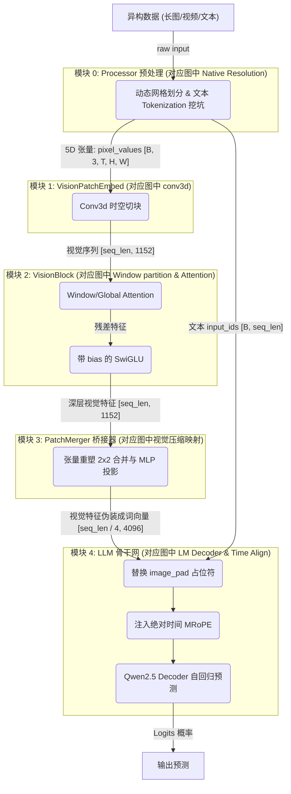
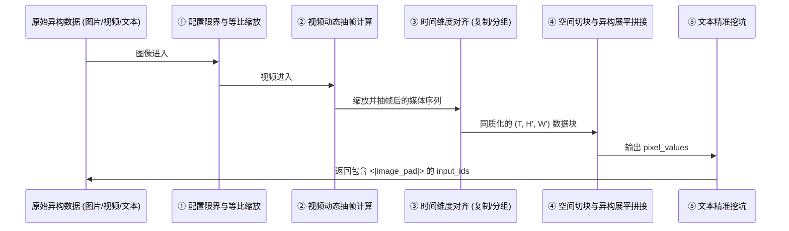

# Qwen 系列多模态大模型硬核学习指南

> **前言：本指南的正确使用方式**
> 本文件是整个 Qwen2.5-VL 架构体系的**「教学大纲」与「作战地图」**。这里不会直接堆砌冗长的代码和晦涩的数学推导，而是专注于**构建你的系统化学习脉络**。
> 
> 针对每一个核心模块，我们都严格遵循四大章节进行梳理：
> **1. 架构顺序解读**：模块的来龙去脉、输入输出、以及数据在其中经历了哪些处理步骤。
> **2. 概念学习序列**：按顺序将模块内容串联，说明组件的功能与概念来源，并**严格定义“吃透该概念的准出条件”**。
> **3. 学习目标与标准**：你需要达到什么程度的理解。
> **4. 疑问解答**：列出最关键的核心疑问，并**提供精确到章节的跳转解答链接**。
>
> 所有的复杂内容、全流程拆解、源码逐行剖析与第一性原理推导，均已收敛在对应的 **`[[知识卡片]]`** 中，请通过大纲中的链接跳转进行沉浸式学习。

---

## 第 1 章：全景架构大纲与数据流拓扑

Qwen2.5-VL 标志着经典“三段式”架构的完全成熟。它的整体运行链路严格按照以下五个模块顺次流转：

### 1.1 官方架构图导读
为了建立宏观认知，我们需要先对图中的每一部分建立"透视"映射：

1. **左侧输入端 (Native Resolution)**：对应我们定义的**模块零（预处理流水线）**，不经过神经网络，只负责图像视频的物理缩放与打包。
2. **中间靠下 (MRoPE Time IDs)**：同样在**模块零**内计算，但其实际作用在最终的**模块四**。
3. **右侧 Vision Encoder (conv3d + Window + Attention)**：囊括了**模块一（时空切块器）**和**模块二（视觉骨干网）**。
4. **图中隐含的跨模态投影**：这是至关重要的**模块三（PatchMerger）**，在视觉特征进入 LLM 前的必经之路。
5. **最上侧 (Qwen2.5 LM Decoder)**：最终的**模块四（LLM基座）**。

### 1.2 全链路核心数据流拓扑
为了将官方架构图进一步映射到我们的物理代码结构中，我们提取了如下的核心数据流拓扑（**这也是你接下来逐步学习的顺序图**）：

---

## 第 2 章：模块零 —— Processor 预处理流水线 (黄金学习样板)

### 1. 架构顺序解读

**来龙去脉**：大语言模型（LLM）底座只能处理一维的“词向量（Token）”序列。而现实世界中的多模态数据是高度异构的（包括长宽比例极端的超清长图、尺寸极小的图标、高低帧率及时长各异的视频）。预处理模块（Processor）不包含任何神经网络权重，它是整个多模态架构的**安全看门人与格式翻译官**，负责在进入深度学习网络前，通过纯数学和矩阵操作完成数据的标准化。

**架构流转图示**：

**输入与输出（结合具体实例）**：
- **输入**：
  - Picture 1（超清长图）：`[8204, 1092, 3]` (HWC)
  - Picture 2（极小图）：`[28, 224, 3]`
  - Video 1（视频）：原始时长 8s，分辨率 `[392, 644, 3]`
  - Text：`"这是图1<image>，这是图2<image>，这是视频<video>"`
- **流转步骤**（对应后文知识点）：
  1. **图像尺寸限界与等比缩放**（应用 [[qwen2.5_vl_预处理流水线#步骤一：图像的配置检查与限界缩放 (smart_resize)]]）：基于 `max_pixels` 进行等比缩放并对齐 28。Picture 1 算满后不变，Picture 2 不变。
  2. **视频动态抽帧**（应用 [[qwen2.5_vl_预处理流水线#步骤二：视频动态抽帧与真实 FPS 计算 (smart_nframes)]]）：Video 1 根据用户请求及截断策略抽取出 4 帧。
  3. **同质化包装与时间维对齐**（应用 [[qwen2.5_vl_预处理流水线#步骤三：时间维度对齐与 5D 张量奥秘 (Time-Step Grouping)]]）：Picture 1 和 2 静态图在内存中直接复制为 2 帧；Video 1 的 4 帧按时间顺序每 2 帧组成一个时间步组（共 2 个时间步）。
  4. **拼装切块与拉平**（应用 [[qwen2.5_vl_预处理流水线#步骤四：暴力拉平与文本挖坑 (Concat & Tokenization)]]）：全部按照 $14 \times 14$ 切割为 Patch，并在 Batch 内把所有 Patch 暴力展平拼接为超长的一维管子。
  5. **精准文本挖坑**（应用 [[qwen2.5_vl_预处理流水线#步骤四：暴力拉平与文本挖坑 (Concat & Tokenization)]]）：计算最终视觉 Token 数量，在文本中精准插入总对应数量的 `<|image_pad|>`。
- **输出**：
  - `pixel_values`：标准 5D 张量 `[48316, 3, 2, 14, 14]`（其中 48316 是合并了前述三者的所有 Patch 块总数）。
  - `input_ids`：包含 11427 + 8 + 644 = 12079 个 `<|image_pad|>` 的文本序列。

### 2. 概念学习序列与学习目标

在这一章，你需要按以下层级逻辑逐步吃透配置管理、像素计算和维度重组等核心概念：

#### 2.1 基础理念层：原生动态分辨率 (NaViT)
*   **概念说明**：一切预处理的核心哲学来源。打破传统 ViT 必须 Resize 成固定正方形（如 224x224）的桎梏，主张保留原始画面宽高比。
*   **学习目标与吃透标准**：
    *   能清晰说出原生动态分辨率与传统 Resize 操作的本质区别。
    *   能够理解原始 NaViT 中的 TokenDropping 策略，并知道它与 Qwen2.5-VL 实际落地方案的差异。
*   👉 **去教材详读**：[[navit_动态分辨率#核心算法原理详解]]

#### 2.2 核心机制层：Qwen2.5-VL 配置管理与参数计算
*   **子知识点 A：`max_pixels` 限制与图像尺寸缩放**
    *   **概念说明**：讲解配置项 `min_pixels` / `max_pixels` 如何在代码层面拦截超长输入，如何进行等比缩放，以及为什么最后要强行对齐到 28 的倍数。
    *   **学习目标与吃透标准**：闭卷能解释为什么模型没有 `max_token` 参数，并用数学公式推导出 `max_pixels` 是如何等价锁死 Token 上限的。
    *   👉 **去教材详读**：[[qwen2.5_vl_预处理流水线#步骤一：图像的配置检查与限界缩放 (smart_resize)]]
*   **子知识点 B：视频抽帧 (`nframes`) 与真实 `sample_fps` 演算**
    *   **概念说明**：视频输入的专属处理。讲解配置项 `fps`，以及下限 `min_frames`、上限 `max_frames` 是如何生效截断的。
    *   **学习目标与吃透标准**：能解释为什么抽出帧数后必须反推一个真实的 `sample_fps`，并明白这个值是后续对齐物理时钟的唯一依赖。
    *   👉 **去教材详读**：[[qwen2.5_vl_预处理流水线#步骤二：视频动态抽帧与真实 FPS 计算 (smart_nframes)]]

#### 2.3 物理整合层：5D 张量时空流转与异构大串联
*   **概念说明**：预处理的终极魔法。解释如何将处理好的图与视频，统一拍平打包成 `[total_patches, 3, 2, 14, 14]` 形状的张量，并在文本中插入精确对应的占位符。
*   **学习目标与吃透标准**：
    *   必须能在脑海里心算出一个极限样本经过处理后，到底生成了多少个 Patch。
    *   能解释清楚为什么要有“维度值为 2”的时间维，静态图片是怎么送进去的，视频两两分组的算力妥协在哪。
*   👉 **去教材详读**：[[qwen2.5_vl_预处理流水线#步骤三：时间步打包与 5D 张量同质化 (Time-Step Grouping)]] 与 [[qwen2.5_vl_预处理流水线#步骤四：暴力拉平与文本挖坑 (Concat & Tokenization)]]

### 3. 疑问解答 (Q&A 索引)

针对本章所学的三个概念层级，我们整理了最核心的疑问与详尽解答跳转：

#### 3.1 关于原生动态分辨率
*   **Q1: Qwen2.5-VL 采用了 NaViT 的动态分辨率，那它也使用了 Token Drop 机制来随机丢弃 Token 吗？**
    👉 解答详见：[[qwen2.5_vl_预处理流水线#步骤一：图像的配置检查与限界缩放 (smart_resize)]]

#### 3.2 关于配置管理与参数计算
*   **Q2: 配置文件中没有 `max_token`，那是怎么通过 `max_pixels` 和 `min_pixels` 实现原生限制 Token 数量的？**
    👉 解答详见：[[qwen2.5_vl_预处理流水线#步骤一：图像的配置检查与限界缩放 (smart_resize)]]
*   **Q3: 视频的抽帧（`nframes`）到底是怎么算的？为什么要反推一个真实的 `sample_fps`？**
    👉 解答详见：[[qwen2.5_vl_预处理流水线#步骤二：视频动态抽帧与真实 FPS 计算 (smart_nframes)]]

#### 3.3 关于时空打包与 5D 张量整合
*   **Q4: 为什么最终生成的 5D 张量里，中间一定要有一个“维度值为 2”的时间维？这有什么物理直觉？**
    👉 解答详见：[[qwen2.5_vl_预处理流水线#步骤三：时间步打包与 5D 张量同质化 (Time-Step Grouping)]]
*   **Q5: 静态图片只有一帧，怎么送进这包含时间维度的 5D 张量？**
    👉 解答详见：[[qwen2.5_vl_预处理流水线#步骤三：时间步打包与 5D 张量同质化 (Time-Step Grouping)]]
*   **Q6: 视频如果是按 2 帧一组，且是无重叠分组（1-2, 3-4），时间连续性不会被割裂吗？**
    👉 解答详见：[[qwen2.5_vl_预处理流水线#步骤三：时间步打包与 5D 张量同质化 (Time-Step Grouping)]]
*   **Q7: 占位符 `<|image_pad|>` 是怎么算出数量并在文本中精准挖坑的？**
    👉 解答详见：[[qwen2.5_vl_预处理流水线#步骤四：暴力拉平与文本挖坑 (Concat & Tokenization)]]

---

## 第 3 章：模块一 —— 时空切块器 (VisionPatchEmbed)

### 1. 架构顺序解读
**来龙去脉**：预处理吐出的 5D 张量只是一堆物理像素块，大语言模型无法理解它们。必须有一个网络入口，将它们转换为高维的稠密特征向量。
**输入**：重塑后的 5D 物理张量 `[Batch × 块数, 3, 2, 14, 14]`。
**流转步骤**：通过三维卷积核（Conv3D），以互不重叠的方式，在空间（14x14）和时间（厚度2）上滑动“盖章”，挤压出高维特征。
**输出**：一维拉平的视觉特征序列 `[seq_len_vision, 1152]`。

### 2. 概念学习序列
*   **【概念一：Conv3D 时空特征提取】**
    *   **组件作用与位置**：视觉编码器（ViT）的第一层物理神经元。
    *   **准出条件（如何叫整明白）**：必须能够从第一性原理出发，对比并解释出“视觉嵌入（Conv3d 物理滤波）”与“文本嵌入（nn.Embedding 字典查表）”在工作原理和特征产出上的本质区别；能够背出 Conv3D 的核心参数来源及冻结状态。
    *   👉 **深度学习去这里**：**[[conv3d_时空切块器]]**

### 3. 学习目标与标准
**【吃透标准】**：深刻理解为什么多模态架构的入口抛弃了传统的 2D 卷积，而选择能捕捉微弱运动光流的 Tubelet 3D 切片思想。

### 4. 疑问解答 (Q&A 索引)
*   **Q1: 视觉嵌入和纯文本嵌入在第一性原理上有什么不同？**
    👉 解答详见：`[[conv3d_时空切块器#4-视觉嵌入与文本嵌入的深度对比第一性原理]]`
*   **Q2: 这个 Conv3D 在三个预训练阶段中处于什么地位？会被微调吗？**
    👉 解答详见：`[[conv3d_时空切块器#可训练参数与渊源追溯]]`

---

## 第 4 章：模块二 —— 视觉骨干网 (ViT Backbone)

### 1. 架构顺序解读
**来龙去脉**：切块器生成的局部特征缺乏全局关联（只能看到一小块区域）。视觉骨干网就是高级的“语义熔炉”，让这些分散的 Patch 不断交流，逐步拼凑出宏观的、能够被大模型理解的高级意图。
**输入**：拉平的视觉序列 `[seq_len_vision, 1152]`。
**流转步骤**：连续经过 32 层 Transformer Block。每一层依次执行：RMSNorm 归一化 $\rightarrow$ (Window 或 Global) 自注意力机制信息融合 $\rightarrow$ RMSNorm 归一化 $\rightarrow$ 带 Bias 的 SwiGLU 过滤底噪特征重组。
**输出**：深层高级视觉语义序列 `[seq_len_vision, 1152]`。

### 2. 概念学习序列
*   **【概念一：ViT 的第一性原理】**
    *   **组件作用与位置**：骨干网的整体宏观使命。
    *   **准出条件**：能回答既然输入输出维度不变，为什么必须堆叠几十层网络？每一层到底提纯了什么信息？
    *   👉 **深度学习去这里**：**[[vit_核心原理与结构]]**
*   **【概念二：交错窗口注意力 (Window Attention)】**
    *   **准出条件**：能算出 $O(N^2)$ 全局注意力的算力爆炸点；能画出为什么把 Patch 强行打乱进窗口能极致省算力；明白为什么第 7/15/23/31 层又要放开为全局。
    *   👉 **深度学习去这里**：**[[window_attention_交错注意力]]**
*   **【概念三：对抗底噪的 SwiGLU】**
    *   **准出条件**：明白为什么处理人类文本的 FFN 不需要偏置，而处理图像物理信号的 FFN 必须开启 `Bias=True`（对抗传感器 DC Offset）。
    *   👉 **深度学习去这里**：**[[swiglu_门控激活函数]]**
*   **【概念四：RMSNorm】**
    *   **准出条件**：理解为什么大模型时代抛弃了 LayerNorm 中复杂的均值漂移，转而只用方差收敛。
    *   👉 **深度学习去这里**：**[[rmsnorm_归一化]]**

### 3. 学习目标与标准
**【吃透标准】**：彻底破除 Vision Transformer 的“黑盒”迷信。必须能闭卷说出上述四大组件是如何在底层物理层面一步步提纯图像信息的。

### 4. 疑问解答 (Q&A 索引)
*   **Q1: Qwen 从头特训的这个 675M ViT 到底是怎么把局部滤波融合成高阶全局语义的？**
    👉 解答详见：`[[vit_核心原理与结构#破除黑盒：为什么需要多层-transformer]]`
*   **Q2: 为什么要使用交错窗口注意力代替全局 Attention？省了多少算力？**
    👉 解答详见：`[[window_attention_交错注意力#2-窗口注意力的工作原理]]`

---

## 第 5 章：模块三 —— 空间降维桥接器 (PatchMerger)

### 1. 架构顺序解读
**来龙去脉**：虽然通过了 ViT，但每张图动辄产生上万个 Token。大语言模型的处理成本极其昂贵，必须在跨模态对接前进行极限压缩，并将 1152 维翻译成语言模型认得的 4096 维词典空间。
**输入**：深层视觉序列 `[seq_len, 1152]`。
**流转步骤**：利用内存连续性，强行将 4 个相邻 Token Reshape 为 1 个。经过两层 MLP 线性投影压维。
**输出**：压缩降维后的超级 Token `[seq_len / 4, 4096]`。

### 2. 概念学习序列
*   **【概念一：PatchMerger 空间合并投影】**
    *   **组件作用与位置**：视觉网与语言基座间的咽喉要塞。
    *   **准出条件（如何叫整明白）**：必须能结合预处理时的 5D 序列排布规律，解释出这个看似简单的 `.view(-1, 4608)` 魔法，是怎么巧妙实现空间上 $2 \times 2$ 物理块收缩的。
    *   👉 **深度学习去这里**：**[[patchmerger_空间降维]]**

### 3. 学习目标与标准
**【吃透标准】**：理解序列重塑（Reshape/View）在算力优化中的四两拨千斤之效。

### 4. 疑问解答 (Q&A 索引)
*   **Q1: 怎么在不引入复杂卷积的情况下，强行合并砍掉 75% 的序列长度？**
    👉 解答详见：`[[patchmerger_空间降维#1-空间下采样：张量形变魔法]]`

---

## 第 6 章：模块四 —— 大语言模型融合与绝对三维位置系 (LLM Backbone)

### 1. 架构顺序解读
**来龙去脉**：桥接器吐出的超级视觉特征，终于顺理成章地填入了自然语言序列中预留好的 `<|image_pad|>` 坑位。但语言模型天生只能理解“前后词”关系，根本不懂“上下排、长短视频”的空间感，必须注入多维度的空间位置编码体系。
**输入**：降维后的视觉特征与文本序列。
**流转步骤**：填充空位 $\rightarrow$ 获取预处理阶段根据 `sample_fps` 算好的 3D 坐标系 $\rightarrow$ 通过 MRoPE 将坐标系刻印在注意力运算的 Q/K 矩阵上 $\rightarrow$ 最终自回归解码。
**输出**：文本概率 Logits。

### 2. 概念学习序列
*   **【概念一：二维解耦 (2D-RoPE)】**
    *   **准出条件**：能解释为什么普通的 1D RoPE 会让一幅长方形的图被理解成一根长面条，2D-RoPE 是如何将维度砍半分配给行与列的。
    *   👉 **深度学习去这里**：**[[2d_rope_视觉位置编码]]**
*   **【概念二：绝对时间对齐 (Time-Absolute MRoPE)】**
    *   **准出条件**：极其核心！必须能够计算并解释：预处理算出来的真实 `sample_fps`，是如何在这里转化成物理时钟（秒）的？必须明白旧版 MRoPE 在遇到“2倍速”或“慢动作”视频时为何会失灵。
    *   👉 **深度学习去这里**：**[[mrope_多模态位置编码]]**

### 3. 学习目标与标准
**【吃透标准】**：融会贯通，将模块零（预处理）计算的时空变量，完美闭环并落地到模块四的位置编码方程中。

### 4. 疑问解答 (Q&A 索引)
*   **Q1: 预处理算出的真实视频 `sample_fps` 是怎么在这个阶段发挥作用，对齐物理绝对时间（秒）的？**
    👉 解答详见：`[[mrope_多模态位置编码#4-qwen2-5-vl-核心创新：绝对时间对齐-time-absolute-mrope]]`

---

## 第 7 章：预训练生命周期 (Model Training Lifecycle)

### 1. 架构顺序解读
**来龙去脉**：任何大模型的形成都不是一蹴而就的。从零开始的婴儿模型到能够完成复杂代理任务的专家，必须经历科学的数据喂养与阶段性封锁训练。

### 2. 概念学习序列
*   **【概念一：三阶段大熔炉预训练】**
    *   **准出条件**：熟练掌握 Stage 0、1、2、3 以及最终后训练（SFT/DPO）中，网络中究竟哪些阀门被打开（可训练），哪些被冻结。明白每一阶段输入的数据分布有什么本质变化（从看图识字 $\rightarrow$ 复杂多轮对话 $\rightarrow$ 超长视频推理）。
    *   👉 **深度学习去这里**：**[[qwen2.5_vl_三阶段预训练]]**

### 3. 学习目标与标准
**【吃透标准】**：跳出代码与张量，建立对大模型工程落地化训练节奏的全盘上帝视角。

### 4. 疑问解答 (Q&A 索引)
*   **Q1: 既然 ViT 那么强，为什么在最终的 SFT / DPO 微调阶段，必须把它给冻结掉？**
    👉 解答详见：`[[qwen2.5_vl_三阶段预训练#3-后训练阶段-post-training-sft--dpo]]`