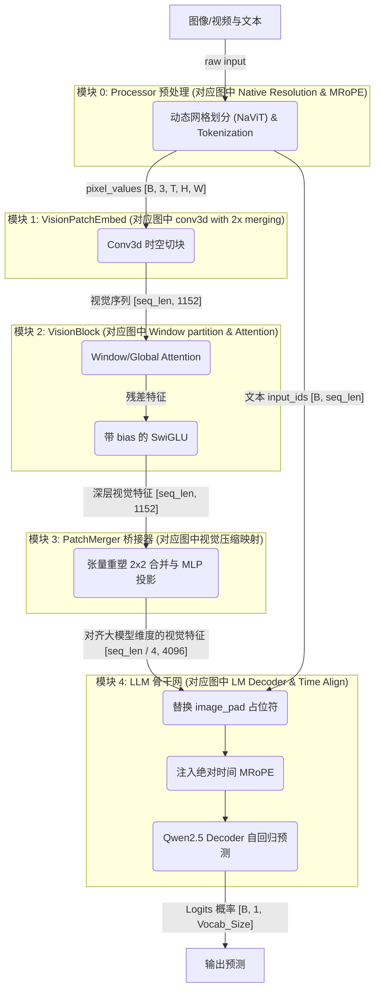
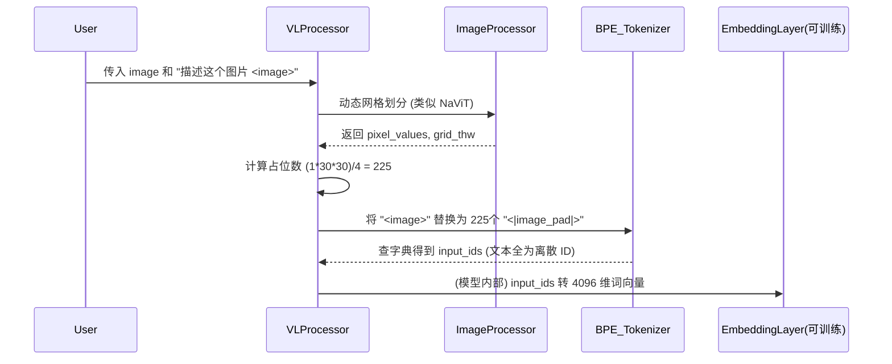
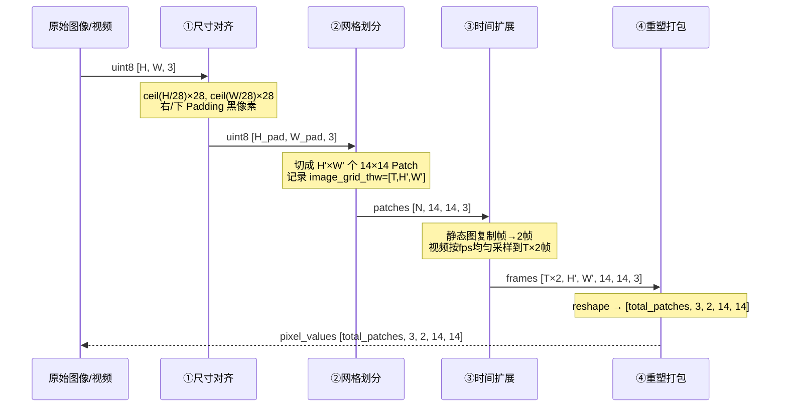
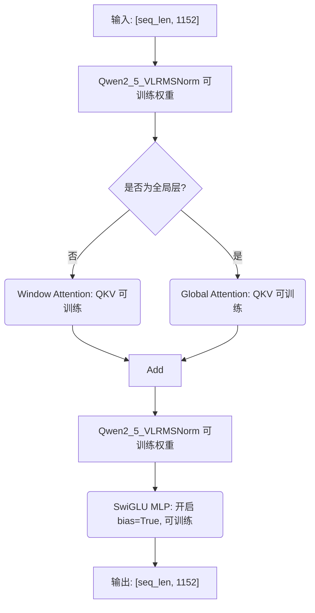
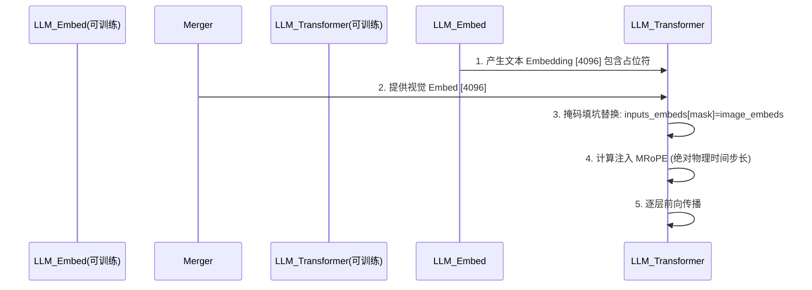

# Qwen 系列多模态大模型硬核学习指南

## 阶段一：Qwen2.5-VL 深度剖析（多模态拼接时代的成熟体）

> **关联知识卡片索引**（在 Obsidian 中可直接点击跳转）：
> - [[navit_动态分辨率]] · [[conv3d_时空切块器]] · [[window_attention_交错注意力]] · [[swiglu_门控激活函数]]
> - [[rmsnorm_归一化]] · [[patchmerger_空间降维]] · [[mrope_多模态位置编码]] · [[2d_rope_视觉位置编码]]
> - [[qwen2.5_vl_三阶段预训练]] · [[动态分辨率方案对比]]
> - 来源摘要：[[qwen2.5_vl_技术报告解析]]

> **前言**：
> 本章节严格执行 `llm-architecture-analyzer` 技能的**“无死角串联”**与**“五段式解剖范式”**。
> 本指南具备**知识图谱级双向链接**，任何架构图的部分、组件名词、前沿算法（如 [NaViT](#31-核心组件名词与算法原理详解)、[MRoPE](#71-mrope-多模态旋转位置编码-与可训练结构)、[PatchMerger](#61-组件名词patchmerger-与可训练参数) 等）及其[源码位置](#43-源码逐行解剖)均可互相跳转。
> 我们将全面拆解网络中**每一个可训练的神经元结构**的参数配置与训练状态，并彻底追溯 Tokenizer 预处理过程的本质。

---

### 1. 模块级整体说明与架构拓扑图

Qwen2.5-VL 标志着经典“三段式”架构的完全成熟。它的整体运行链路可以概括为：**[Processor 预处理打包](#2-模块零processor-像素预处理与-tokenizer) $\rightarrow$ [视觉编码器提取深层特征](#4-模块二视觉骨干网与局部注意力-qwen2_5_vlvisionblock) $\rightarrow$ [PatchMerger 空间降维压缩](#6-模块三空间降维桥接器-qwen2_5_vlpatchmerger-即-projector) $\rightarrow$ [结合绝对时间的 LLM 自回归解码](#7-模块四大语言模型融合与绝对时间-mrope-llm-backbone)**。

#### 1.1 官方架构图：全景导读、模块映射与深度拆解

为了帮助大家彻底吃透官方论文中的架构图，我们严格遵循**全局通读 $\rightarrow$ 剥洋葱式拆解 $\rightarrow$ 模块映射**的准则。


##### 1.1.1 架构图全景导读与剥洋葱式拆解

我们从左到右对图中的每一部分进行"透视"，详细交代它们是什么、有什么作用、参数训练状态与核心技术点。**以下所有 I/O 张量形状均以官方架构图中的三个真实样本为例推导**：
- **Picture 1**：8204×1092 超宽长图
- **Picture 2**：28×224 极小图
- **Video 1**：392×644，时长 8s，动态帧率采样 4 帧

---

**Part 1：左侧输入端 (Native Resolution 动态分辨率)**

- **整体说明与作用**：不是一个神经网络层，而是 **Processor 对原始图像/视频执行的预处理流水线**。实现 [[navit_动态分辨率|NaViT]] 思想——不强制 Resize，按 14×14 网格就地切块，保留原始宽高比。整个流程分四步：**① 尺寸对齐（Pad 到 14 的整数倍）→ ② 网格划分（切出 H'×W' 个 14×14 Patch）→ ③ 时间扩展（单帧图像复制 2 帧对齐 Conv3d）→ ④ 重塑为 5D 张量**。详见 **[§2.3 NaViT 动态网格四步流水线](#23-navit-动态网格的四步流水线详解)**。
- **输入张量（真实样本）**：
  - Picture 1：原始像素 `uint8 [8204, 1092, 3]`（HWC 格式）
  - Picture 2：原始像素 `uint8 [28, 224, 3]`
  - Video 1：帧序列 `uint8 [4, 392, 644, 3]`（4 帧）
- **输出张量（进入 Conv3d 前的 5D 像素块，`pixel_values`）**：
  - Picture 1：`[45708, 3, 2, 14, 14]`
    - 推导：H'=8204/14=586，W'=1092/14=78，空间块数=586×78=**45708**，复制为 2 帧
  - Picture 2：`[32, 3, 2, 14, 14]`
    - 推导：H'=28/14=2，W'=224/14=16，空间块数=2×16=**32**，复制为 2 帧
  - Video 1：`[2576, 3, 2, 14, 14]`
    - 推导：H'=392/14=28，W'=644/14=46，单帧空间块=28×46=1288；4 帧→2 个时间步（Conv3d 每 2 帧合并），块数=1288×2=**2576**
- **技术点**：[[navit_动态分辨率|NaViT]] 动态切块 + Padding 对齐，详见 **[§2.3](#23-navit-动态网格的四步流水线详解)**。
- **映射关系**：对应 **[【模块零：Processor 预处理】](#2-模块零processor-像素预处理与-tokenizer)**。
- **可训练结构**：无（纯外部图像预处理，无任何神经网络参数）。

---

**Part 2：中间靠下 (Sampled MRoPE Time IDs & dynamic fps sampling)**

- **整体说明与作用**：同属 **Processor 预处理阶段**（与 Part 1 同步完成）。基于视频真实物理帧率（fps）计算 MRoPE 三维位置索引张量，Processor 里算好、LLM Attention 里用。详见 **[§2.4 MRoPE 三维位置索引](#24-mrope-三维位置索引的计算过程与张量形式)**。
- **输入**：
  - `image_grid_thw: LongTensor [N_media, 3]`——每个媒体的网格 [T, H', W']
  - `second_per_grid_ts`——每时间步的物理秒数（由 fps 推算）
  - `input_ids`——含 `<|image_pad|>` 占位符的文本 token 序列
- **输出（三维位置索引张量）**：`position_ids: LongTensor [3, 1, total_seq_len]`
  - 3 个通道分别是 T/H/W 三个轴的位置 ID
  - 以 Video 1（fps=0.5，`tokens_per_second=25`，`temporal_patch_size=2`）为例：
    ```
    time_interval = 25 × (2 / 0.5) = 100
    # Video 1 共 644 个视觉 token，2 个时间步（各 322 个 token）
    T 轴: [0,0,...(322个), 100,100,...(322个)]
    H 轴: [0,0,..,13, 0,0,..,13, ...]  # 每时间步内行号 0-13 循环
    W 轴: [0,1,..,22, 0,1,..,22, ...]  # 每行内列号 0-22 循环
    ```
- **技术点**：[[mrope_多模态位置编码|MRoPE]] + 基于 FPS 的绝对时间对齐，详见 **[§2.4](#24-mrope-三维位置索引的计算过程与张量形式)** 与 **[§7.1](#71-mrope-多模态旋转位置编码-与可训练结构)**。
- **映射关系**：计算在 **[模块零](#2-模块零processor-像素预处理与-tokenizer)**，注入在 **[模块四](#7-模块四大语言模型融合与绝对时间-mrope-llm-backbone)**。
- **可训练结构**：RoPE 旋转矩阵无参数；Q、K 投影矩阵有参数（可训练）。

---

**Part 3：右侧大框 (Vision Encoder 核心流水线)**

- **整体说明与作用**：`Qwen2_5_VisionTransformer` 完整黑盒流水线，含 Conv3d 入口、32 层 VisionBlock 主干、PatchMerger 出口。
- **输入张量**：`pixel_values [total_patches, 3, 2, 14, 14]`（来自 Part 1 输出）
- **内部各阶段 I/O（以 Picture 1 全程追踪）**：

  | 子模块 | 官方图对应文字 | 输入 shape | 输出 shape |
  |--------|---------------|-----------|----------|
  | **[模块一 Conv3d](#3-模块一时空切块器-qwen2_5_visionpatchembed)** | `conv3d with 2x temporal merging` | `[45708, 3, 2, 14, 14]` | `[45708, 1152]` |
  | **[模块二 VisionBlock×32](#4-模块二视觉骨干网与局部注意力-qwen2_5_vlvisionblock)** | `Window partition + Attention` | `[45708, 1152]` | `[45708, 1152]` |
  | **[模块三 PatchMerger](#6-模块三空间降维桥接器-qwen2_5_vlpatchmerger-即-projector)** | *(图中隐含，Vision Encoder 出口)* | `[45708, 1152]` | `[11427, 4096]` |

  Picture 1 最终输出 **11427 个 4096 维 token** ← 与官方图标注完全吻合 ✅

  | 样本 | Conv3d 后 seq_len | PatchMerger 后 token 数 |
  |------|-----------------|----------------------|
  | Picture 1 (8204×1092) | 45708 | **11427** |
  | Picture 2 (28×224) | 32 | **8** |
  | Video 1 (4帧) | 1288×2=2576 | **644** |

- **可训练结构**：Conv3D `[3→1152, kernel=(2,14,14)]`；32×VisionBlock 的 QKV/O `nn.Linear(1152,1152,bias=True)`；SwiGLU MLP `nn.Linear(bias=True)`；PatchMerger MLP `[4608→4608→4096]`。

---

**Part 4：最上侧 (Qwen2.5 LM Decoder 拼接与解码)**

- **整体说明与作用**：自回归底座。视觉特征替换 `<|image_pad|>` 占位符后与文本 embedding 拼接，通过 LLM 自回归解码。
- **输入张量（拼接后送入 LLM）**：
  - `inputs_embeds: [Batch, total_seq_len, 4096]`
    - `total_seq_len` = 视觉 token 数（如 11427）+ 文本 token 数
  - `position_ids: [3, Batch, total_seq_len]`（来自 Part 2 的三维 MRoPE 索引）
- **输出张量**：`logits: [Batch, 1, 151936]`（词表大小 151936）
- **技术点**：**[MRoPE 注入](#71-mrope-多模态旋转位置编码-与可训练结构)**、Qwen2.5 LM Decoder。
- **映射关系**：对应 **[【模块四：LLM 骨干网】](#7-模块四大语言模型融合与绝对时间-mrope-llm-backbone)**。
- **可训练结构**：`nn.Embedding(151936, 4096)`、32 层 Transformer Block、`lm_head nn.Linear(4096, 151936, bias=False)`。

---

##### 1.1.2 极度硬核：Token 数学破案 (官方图的数字是怎么来的？)
官方图视觉输出与文本拼接处展示了精确的 Token 数量（如图1 11427 Tokens，图2 8 Tokens）。
**破案线索**：核心 Patch 大小是 $14 \times 14$；进入 LLM 之前有一个 $2 \times 2$ 的 **[[patchmerger_空间降维|PatchMerger]]**。
**终极公式**：空间维度上，原始分辨率的宽高需分别除以 $14 \times 2 = 28$！即：$Token\_Count = (\frac{H}{28}) \times (\frac{W}{28})$。

现场验算：
- **Picture 1 (8204×1092)**：$H=8204 / 28 = 293$；$W=1092 / 28 = 39$。总数：$293 \times 39 = \mathbf{11427}$。**完全吻合！**
- **Picture 2 (28×224)**：$H=28 / 28 = 1$；$W=224 / 28 = 8$。总数：$1 \times 8 = \mathbf{8}$。**完全吻合！**
- **Video 1 (392×644×8s)**：
  - 单帧空间 Token = $(392/28) \times (644/28) = 14 \times 23 = 322$。
  - 时间维度 `conv3d with 2x temporal merging`：动态帧率采样 4 帧，时间 Token 数就是 2。
  - 总视频 Token：$322 \times 2 = \mathbf{644}$。**完美吻合！**
#### 1.2 全链路逻辑数据流拓扑图
为了将官方架构图进一步映射到我们的物理代码结构中，我们提取了如下的核心数据流拓扑：



---

### 2. 模块零：Processor 像素预处理与 Tokenizer

**模块整体说明**：
该模块是大模型的数据入口，负责将物理世界的图像/视频解码为张量，同时将自然语言文本通过 Tokenizer 转化为词 ID，并在文本中为图像挖好 `<|image_pad|>` 占位符。
> 知识链接：这里运用了类似 [[navit_动态分辨率|NaViT]] 的动态网格思想。

**逻辑链（输入）**：用户传入的原始图片对象 `images`，以及自然语言 Prompt `text`。
**逻辑链（输出）**：
  - `pixel_values`：`[Batch * 总块数, 3(RGB), 时间, 高度, 宽度]`
  - `image_grid_thw`：每个图像的 3D 网格尺寸 `[Time, Height, Width]`
  - `text_inputs` (`input_ids`)：序列张量 `[Batch, seq_len]`，包含精确数量的 `<|image_pad|>` 占位符。

#### 2.1 追根溯源：Tokenizer 预处理与可训练结构

**Tokenizer 是处理文本还是图片？**
- Tokenizer **只处理文本**。图片的处理是由 `ImageProcessor`（底层调 torchvision）完成的。图片本身不经过 BPE Tokenizer。
- Tokenizer 只会在文本序列中，按照图片的尺寸，插入对应数量的**代表图片的特殊文本占位符**（`<|image_pad|>`，其 ID 通常固定，比如在 Qwen2.5-VL 中可能是 151652）。

**使用的什么模型来 Token 化？**
- 使用的是基于 BPE（Byte-Pair Encoding）的 `Qwen2TokenizerFast`（基于 Tiktoken 库）。词表大小为 151936。

**Token 化模型的结构、参数与训练状态**：
- **可训练结构（神经元）**：Tokenizer 本身是无参数映射表（String -> Int）。但在大语言模型内部，有一个对应的**词向量嵌入层 `nn.Embedding(151936, 4096)`**。
- **参数配置**：形状为 `[151936, 4096]`。
- **如何训练**：这个 Embedding 层的权重继承自纯文本的 Qwen2.5 LM。在多模态第一阶段预训练（训练 Projector 时）**通常是冻结的**；在第二/三阶段指令微调时，Embedding 层（或者针对 `<|image_pad|>` 的新词嵌入）可能被**解冻参与微调**。

#### 2.2 代码结构图


#### 2.3 NaViT 动态网格的四步流水线详解

> 知识卡片：[[navit_动态分辨率]] | 返回示例：本节所有数字均来自 [§1.1.1 Part 1](#111-架构图全景导读与剥洋葱式拆解) 的三个官方样本

NaViT 在 Qwen2.5-VL 的 Processor 里分四步完成：

##### 步骤一：尺寸对齐（Padding 到 patch_size 的整数倍）

图片的原始 H/W 不一定能整除 14（`patch_size`）。必须先 Pad，再切块。

**Padding 策略**：在右边和下边补 0 像素，使 H、W 均向上取整到 14 的整数倍。公式：

$$H_{pad} = \lceil H / p \rceil \times p, \quad W_{pad} = \lceil W / p \rceil \times p, \quad p=14$$

**具体例子（Picture 1，8204×1092）**：
- $H: 8204 / 14 = 586.0$，整除，无需 Pad → $H_{pad} = 8204$
- $W: 1092 / 14 = 78.0$，整除，无需 Pad → $W_{pad} = 1092$
- **（恰好整除，无 Pad）**

**具体例子（非整除情况，假设图片 H=100, W=200）**：
- $H: \lceil 100/14 \rceil \times 14 = 8 \times 14 = 112$，右侧补 12 行黑色像素
- $W: \lceil 200/14 \rceil \times 14 = 15 \times 14 = 210$，底部补 10 列黑色像素
- Pad 后 tensor：`[112, 210, 3]` → 切块后 $8 \times 15 = 120$ 个 Patch

**代码路径**：`transformers/src/transformers/models/qwen2_5_vl/image_processing_qwen2_5_vl.py`
```python
def smart_resize(height, width, factor=28, ...):
    # factor=28 = patch_size(14) × spatial_merge_size(2)
    # 保证最终 token 数是整数
    height = math.ceil(height / factor) * factor
    width  = math.ceil(width  / factor) * factor
    return height, width

# ImageProcessor 中调用：
new_h, new_w = smart_resize(orig_h, orig_w, factor=28)
# PIL resize（保持宽高比，再 pad 到目标尺寸）
image = image.resize((new_w, new_h), resample=BICUBIC)
```

> ⚠️ **注意**：Qwen2.5-VL 实际用的 `factor=28`（而非 14），因为 PatchMerger 会再做 2×2 空间合并，所以从一开始就保证 H/W 能整除 28，最终 LLM token 数一定是整数。

##### 步骤二：网格划分（切出 H'×W' 个 14×14 Patch）

Pad 后对图片做均匀网格切分，不做任何 Resize：

$$H' = H_{pad} / 14, \quad W' = W_{pad} / 14$$

```python
# 将 [H_pad, W_pad, 3] 的图片重塑为 patch 序列
# patches shape: [H', W', 14, 14, 3]
patches = image.reshape(H_prime, 14, W_prime, 14, 3)
patches = patches.transpose(0, 2, 1, 3, 4)  # [H', W', 14, 14, 3]
patches = patches.reshape(H_prime * W_prime, 14 * 14 * 3)  # [N_patches, 588]
# N_patches = H' × W'
```

**对应的 `image_grid_thw` 张量**：每张图/视频的网格信息保存为 `[T, H', W']`：
```
Picture 1 (8204×1092): image_grid_thw = [1, 586, 78]  # T=1帧
Picture 2 (28×224):    image_grid_thw = [1, 2, 16]
Video 1 (4帧,392×644):  image_grid_thw = [2, 28, 46]   # T=2个时间步（4帧/2）
```

##### 步骤三：时间扩展（静态图复制为 2 帧对齐 Conv3d）

Conv3d 的时间核大小为 2（`temporal_patch_size=2`），要求输入至少 2 帧。对于静态图片（只有 1 帧），Processor 会将该帧**复制一次**变成 2 帧：

```python
if num_frames == 1:
    # 静态图：复制帧
    pixel_values = np.tile(pixel_values, (2, 1, 1, 1))  # [2, H_pad, W_pad, 3]
# 视频：已有多帧，但必须是 temporal_patch_size(2) 的整数倍
# 如不足则最后一帧重复，如超出则按 fps 均匀采样
```

##### 步骤四：重塑为 5D 张量（最终 `pixel_values`）

将所有图片/视频的 Patch 拼接为一个大 batch，重塑为 Conv3d 需要的 5D 格式：

```python
# 最终 pixel_values shape: [total_patches, 3, temporal_patch_size, patch_size, patch_size]
# = [total_patches, 3, 2, 14, 14]
#
# total_patches 计算：
# 对图片：H' × W' × (T/temporal_patch_size) = H' × W' × 1
# 对视频：H' × W' × (num_frames/temporal_patch_size)
#
# 以官方样本为例（假设一次输入 Picture1 + Picture2 + Video1）：
# Picture1: 586×78×1 = 45708
# Picture2: 2×16×1   = 32
# Video1:   28×46×2  = 2576
# total_patches = 45708 + 32 + 2576 = 48316
pixel_values = torch.tensor(...)  # [48316, 3, 2, 14, 14]
```

**完整流水线时序图**：


#### 2.4 MRoPE 三维位置索引的计算过程与张量形式

> 知识卡片：[[mrope_多模态位置编码]] | 注入位置：[§7.1 LLM 骨干网](#71-mrope-多模态旋转位置编码-与可训练结构)

MRoPE 的位置索引在 Processor 的 `get_rope_index()` 方法中生成，输出的是一个三维张量，代表序列中每个 token 在时间（T）、高度（H）、宽度（W）三个轴上的坐标。

##### 输出张量形式

```
position_ids: LongTensor, shape = [3, 1, total_seq_len]
  维度 0：3 = T轴, H轴, W轴 三个独立坐标
  维度 1：1 = Batch（单样本）
  维度 2：total_seq_len = 视觉token数 + 文本token数

三维矩阵示意（以 Video 1 为例，644个视觉token + 假设5个文本token）：

  T轴 [0, :, :]：
    [  0,  0, ...(322个)  ,100,100,...(322个), 101,102,103,104,105 ]
      ↑时间步0的所有token    ↑时间步1(+100)    ↑文本token继续递增

  H轴 [1, :, :]：
    [  0, 0,...,13, 0,...,13, ...(重复2次),  101,102,103,104,105 ]
      ↑每个时间步内按行号0-13排列              ↑文本同上

  W轴 [2, :, :]：
    [  0,1,...,22, 0,...,22, ...(重复28次×2时间步), 101,102,103,104,105 ]
      ↑每行按列号0-22排列                            ↑文本同上
```

##### 关键计算：`time_interval`（时间步长）

**公式**：$interval = tokens\_per\_second \times \frac{temporal\_patch\_size}{fps}$

**直观意义**：将物理时间（秒）映射到位置 ID 空间。`tokens_per_second=25` 相当于定义了时间轴的分辨率——每秒对应 25 个位置单元。

| 视频 fps | temporal_patch_size | time_interval | 含义 |
|---------|---------------------|--------------|------|
| 1 fps | 2 | 25×2/1 = **50** | 每时间步跨越 2 秒，对应 50 个位置单元 |
| 2 fps | 2 | 25×2/2 = **25** | 每时间步跨越 1 秒，对应 25 个位置单元 |
| 25 fps | 2 | 25×2/25 = **2** | 每时间步跨越 0.08 秒，对应 2 个位置单元 |
| **0.5 fps（Video 1）** | 2 | 25×2/0.5 = **100** | 每时间步跨越 4 秒，对应 100 个位置单元 |

**核心代码路径**：`transformers/src/transformers/models/qwen2_5_vl/modeling_qwen2_5_vl.py`
```python
def get_rope_index(self, input_ids, image_grid_thw, video_grid_thw, second_per_grid_ts, ...):
    position_ids = torch.ones(3, input_ids.shape[0], input_ids.shape[1], dtype=torch.long)
    # ...
    for media_type, grid_thw in [(1, image_grid_thw), (2, video_grid_thw)]:
        t, h, w = grid_thw[media_idx]  # e.g. t=2, h=28, w=46 for Video 1
        if media_type == 2:  # 视频：使用物理时间对齐
            second_per_grid_t = second_per_grid_ts[video_idx]
            time_interval = tokens_per_second * second_per_grid_t  # 100
        else:  # 图片：时间步长固定为 1
            time_interval = 1

        # 构建 [T, H', W'] 三维坐标网格
        llm_pos_ids = []
        for i in range(t):  # 对每个时间步
            t_ids = torch.full((h * w,), i * time_interval)       # T坐标：0 or 100
            h_ids = torch.arange(h).repeat_interleave(w)          # H坐标：0..27重复
            w_ids = torch.arange(w).repeat(h)                     # W坐标：0..45循环
            llm_pos_ids.append(torch.stack([t_ids, h_ids, w_ids]))# [3, h*w]
        vision_pos = torch.cat(llm_pos_ids, dim=1)  # [3, t*h*w] = [3, 2576]

        # 文本 token 接在视觉 token 之后，三维坐标相同（退化为1D）
        text_start = vision_pos.max() + 1  # = 100 + 1 = 101
        text_len = (text_end - text_start)
        text_pos = torch.arange(text_start, text_start + text_len).unsqueeze(0).repeat(3, 1)
        # 最终拼接写入 position_ids[batch_idx]
```

---

### 3. 模块一：时空切块器 (`Qwen2_5_VisionPatchEmbed`)

**模块整体说明**：
位于 `Qwen2_5_VisionTransformer` 的前端。将三维的色彩信息切分成互不重叠的小块（Patch），并通过 3D 卷积核提取高维空间的稠密向量。
> 知识链接：其思想源自 ViViT 管状切分，为 [[window_attention_交错注意力|视觉骨干网]] 准备基础特征。详见知识卡片 [[conv3d_时空切块器]]。

**逻辑链（输入）**：重塑后的 5D 物理张量 `[Batch * 块数, 3(通道), 2(时间维), 14(高度维), 14(宽度维)]`。
**逻辑链（输出）**：一维拉平视觉特征序列 `[seq_len_vision, embed_dim(1152)]`。

#### 3.1 核心组件名词与算法原理详解
- **NaViT (Native Resolution ViT) 思想**：
  - **来龙去脉**：以往 ViT 把所有图片强行 Resize 破坏长宽比。NaViT 理念主张保持原始长宽比，动态划分 Patch。
- **Conv3d (三维卷积管状切块)**：
  - **直观比喻**：用一个方形模具（14x14，厚2）在一大块豆腐（像素立方体）上“盖章”，榨出浓缩果汁（特征向量）。
  - **可训练参数与训练方式 (Trainable Params)**：
    - **网络结构**：单层三维卷积 `nn.Conv3d`。
    - **参数配置**：`in_channels=3, out_channels=1152, kernel_size=(2,14,14), stride=(2,14,14), bias=False`。
    - **如何训练**：参数继承自大规模预训练的 Vision Transformer，在多模态各个训练阶段（尤其是指令微调阶段）通常随视觉基座一起被**联合微调（全参或 LoRA）**。

#### 3.2 源码逐行解剖
**代码路径**：`transformers/src/transformers/models/qwen2_5_vl/modeling_qwen2_5_vl.py`
```python
class Qwen2_5_VisionPatchEmbed(nn.Module):
    def __init__(self, patch_size=14, temporal_patch_size=2, in_channels=3, embed_dim=1152):
        super().__init__()
        kernel_size = [temporal_patch_size, patch_size, patch_size] 
        # 可训练神经元结构：3D 卷积提取特征，无偏置
        self.proj = nn.Conv3d(in_channels, embed_dim, kernel_size=kernel_size, stride=kernel_size, bias=False)

    def forward(self, hidden_states: torch.Tensor) -> torch.Tensor:
        hidden_states = hidden_states.view(-1, 3, 2, 14, 14)
        # .view(-1, 1152) 抛弃空间坐标，拉平为一维序列
        hidden_states = self.proj(hidden_states).view(-1, 1152) 
        return hidden_states 
```

---

### 4. 模块二：视觉骨干网与局部注意力 (`Qwen2_5_VLVisionBlock`)

**模块整体说明**：
经过切块的序列进入多层 Transformer。利用自注意力机制互相交流，提取深层局部与全局语义，并通过带偏置的 MLP 过滤底层图像模拟信号底噪。
> 知识链接：这里的输出将喂入下方的 [[patchmerger_空间降维|PatchMerger]] 进行压缩。详见知识卡片 [[window_attention_交错注意力]] 和 [[swiglu_门控激活函数]]。

**逻辑链（输入）**：拉平的视觉序列 `[seq_len_vision, 1152]`。
**逻辑链（输出）**：深层视觉序列 `[seq_len_vision, 1152]`。

#### 4.1 核心组件名词与算法原理详解
- **Window Attention (交错窗口注意力)**：
  - **来龙去脉**：大图带来长序列 $O(N^2)$ 算力爆炸。将全图分窗口，平时只在窗口内 Attention，特定层（7, 15, 23, 31层）全图 Global Attention。
  - **可训练参数与训练方式**：内部的 $Q, K, V$ 和 $O$ 投影矩阵（`nn.Linear(1152, 1152)`），带有 `bias=True`。在多模态预训练中随视觉基座微调。
- **带 Bias 的 SwiGLU (`Qwen2_5_VLMLP`)**：
  - **物理原理**：图像是连续物理信号模拟值，存在“直流偏移（DC Offset）”。如果 MLP 无偏置，网络将浪费算力去拟合常量底噪。
  - **可训练参数与训练方式**：`gate_proj`, `up_proj`, `down_proj` 全是 `nn.Linear(1152, 4928)` 等带参数神经元结构，且**开启了 `bias=True`**，在基座上充分训练后，在多模态阶段可采用全量解冻微调。

#### 4.2 架构与代码流程图


#### 4.3 源码逐行解剖
**代码路径**：`transformers/src/transformers/models/qwen2_5_vl/modeling_qwen2_5_vl.py`
```python
class Qwen2_5_VLVisionBlock(GradientCheckpointingLayer):
    def __init__(self, config):
        super().__init__()
        # 可训练参数：缩放权重 weight
        self.norm1 = Qwen2_5_VLRMSNorm(config.hidden_size, eps=1e-6)
        self.attn = Qwen2_5_VLVisionAttention(config=config) # 包含可训练 Q,K,V,O
        self.norm2 = Qwen2_5_VLRMSNorm(config.hidden_size, eps=1e-6)
        
        # 可训练神经元结构：极其关键，传入 bias=True 对抗传感器直流偏移
        self.mlp = Qwen2_5_VLMLP(config, bias=True) 

    def forward(self, hidden_states, cu_seqlens, position_embeddings):
        # 1. 归一化 + 自注意力 
        hidden_states = hidden_states + self.attn(...)
        # 2. 归一化 + 带偏置的前馈网络
        hidden_states = hidden_states + self.mlp(self.norm2(hidden_states))
        return hidden_states
```

---

### 6. 模块三：空间降维桥接器 (`Qwen2_5_VLPatchMerger` 即 Projector)

**模块整体说明**：
视觉与文本打通前的咽喉要道。将大量局部空间特征压缩合并（降低 75% 序列长度），并作为跨模态投影仪（Projector）将 1152 维的视觉特征对齐到大模型的 4096 维字典空间。
> 知识链接：这里的输出会直接送到 [[mrope_多模态位置编码|模块四：LLM Backbone]] 替换前面挖好的坑。详见知识卡片 [[patchmerger_空间降维]]。

**逻辑链（输入）**：ViT 最后一层输出 `[seq_len, 1152]`。
**逻辑链（输出）**：降维并对齐维度后的超级视觉 Token `[seq_len / 4, 4096]`。

#### 6.1 组件名词：PatchMerger 与可训练参数
- **算法原理 (空间下采样)**：利用内存连续性，强行将相邻的 4 个 1152 维 Token 改变视角 `.view(-1, 4608)` 视为 1 个胖 Token，再用 MLP 压维。
- **可训练参数与训练方式 (Trainable Params)**：
  - **网络结构**：两层线性层构成的 MLP：`nn.Linear(4608, 4608) -> GELU -> nn.Linear(4608, 4096)`。
  - **如何训练**：这是多模态模型的**重头戏**！在预训练的第一阶段，通常只有这个 Projector 是**解冻的（从头训练或基于少量数据初始化）**，强行把视觉特征往语言模型的表征空间“拽”。

#### 6.2 源码逐行解剖
**代码路径**：`transformers/src/transformers/models/qwen2_5_vl/modeling_qwen2_5_vl.py`
```python
class Qwen2_5_VLPatchMerger(nn.Module):
    def __init__(self, dim=4096, context_dim=1152, spatial_merge_size=2):
        super().__init__()
        self.hidden_size = context_dim * (spatial_merge_size**2) # 4608
        self.ln_q = Qwen2_5_VLRMSNorm(context_dim, eps=1e-6)
        
        # 可训练神经元结构：桥接器 MLP
        self.mlp = nn.Sequential(
            nn.Linear(self.hidden_size, self.hidden_size), # 4608 -> 4608 (可训练)
            nn.GELU(),
            nn.Linear(self.hidden_size, dim), # 4608 -> 4096 (可训练)
        )

    def forward(self, x: torch.Tensor) -> torch.Tensor:
        # 神来之笔：抛弃 torch.cat，直接利用内存排布 view(-1, 4608) 改变视角，将 4 个 Token 合为 1 个
        x = self.mlp(self.ln_q(x).view(-1, self.hidden_size))
        return x # 输出 [seq_len / 4, 4096]
```

---

### 7. 模块四：大语言模型融合与绝对时间 MRoPE (`LLM Backbone`)

**模块整体说明**：
万里长征最后一步。视觉特征被替换到文本的 `<|image_pad|>` 空位中。随后系统注入考虑了物理客观规律的“绝对时间 MRoPE 位置编码”，帮助模型理解 3D 坐标，然后通过 LLM 的 Transformer 层自回归解码。

**逻辑链（输入）**：对齐好的视觉特征 `[seq_len / 4, 4096]` 与 文本 Embedding 特征 `[Batch, total_len, 4096]`。
**逻辑链（输出）**：语言模型最后预测的 Logits 分布 `[Batch, 1, Vocab_Size]`。

#### 7.1 MRoPE (多模态旋转位置编码) 与可训练结构
- **核心算法 ([[2d_rope_视觉位置编码|2D-RoPE]] / [[mrope_多模态位置编码|MRoPE]])**：
  - **来龙去脉**：普通 1D RoPE 无法表达图像的高宽。[[2d_rope_视觉位置编码|2D-RoPE]] 用两个独立 RoPE 表示宽高。[[mrope_多模态位置编码|MRoPE]] 则进一步加入了基于物理时间（`fps`）的绝对秒数作为第三维时间轴 ID。训练策略详见 [[qwen2.5_vl_三阶段预训练]]。
- **可训练参数与训练方式 (Trainable Params)**：
  - **网络结构 (RoPE)**：RoPE 的计算公式（旋转矩阵的 cos/sin 值）是固定的**不包含可训练参数**。但是，RoPE 的结果会直接作用在 Attention 的可训练参数 $Q, K$ 上。
  - **网络结构 (LLM Decoder)**：核心可训练神经元全在底座 `Qwen2ForCausalLM` 中（数以十亿计的 Attention 权重、MLP、`lm_head` 预测层）。在 SFT 阶段通常使用 **LoRA 微调**或**全量解冻微调**。

#### 7.2 架构与代码流程图


#### 7.3 源码逐行解剖
**代码路径**：`transformers/src/transformers/models/qwen2_5_vl/modeling_qwen2_5_vl.py`
```python
# 1. MRoPE 基于物理真实秒数的绝对时间对齐：
if modality_type == 2: # 2 代表视频
    # tokens_per_second 为基准，乘以 processor 算出的真实帧率步长 second_per_grid_ts
    time_interval = tokens_per_second * int(next(second_per_grid_ts))

# 2. 视觉特征融合填坑：
vision_outputs = self.visual(pixel_values, ...) 
image_embeds = vision_outputs.pooler_output # [seq_len/4, 4096]

# special_image_mask 是从输入 input_ids 算出的布尔掩码
# inputs_embeds 包含可训练的 nn.Embedding 权重输出
inputs_embeds[special_image_mask] = image_embeds 

# 送入底层 LLM Decoder (Qwen2_5_VLTextModel -> lm_head) 进行最终预测。
```
