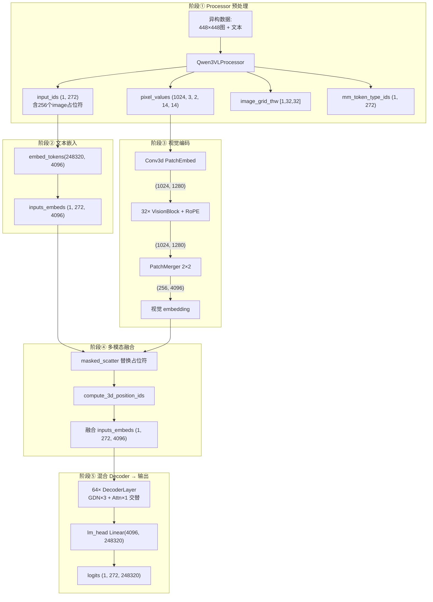
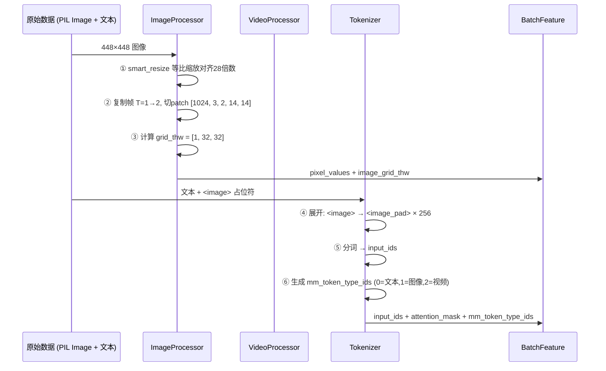
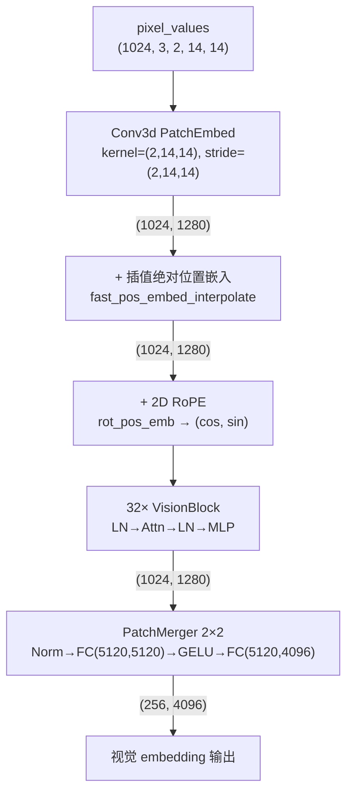
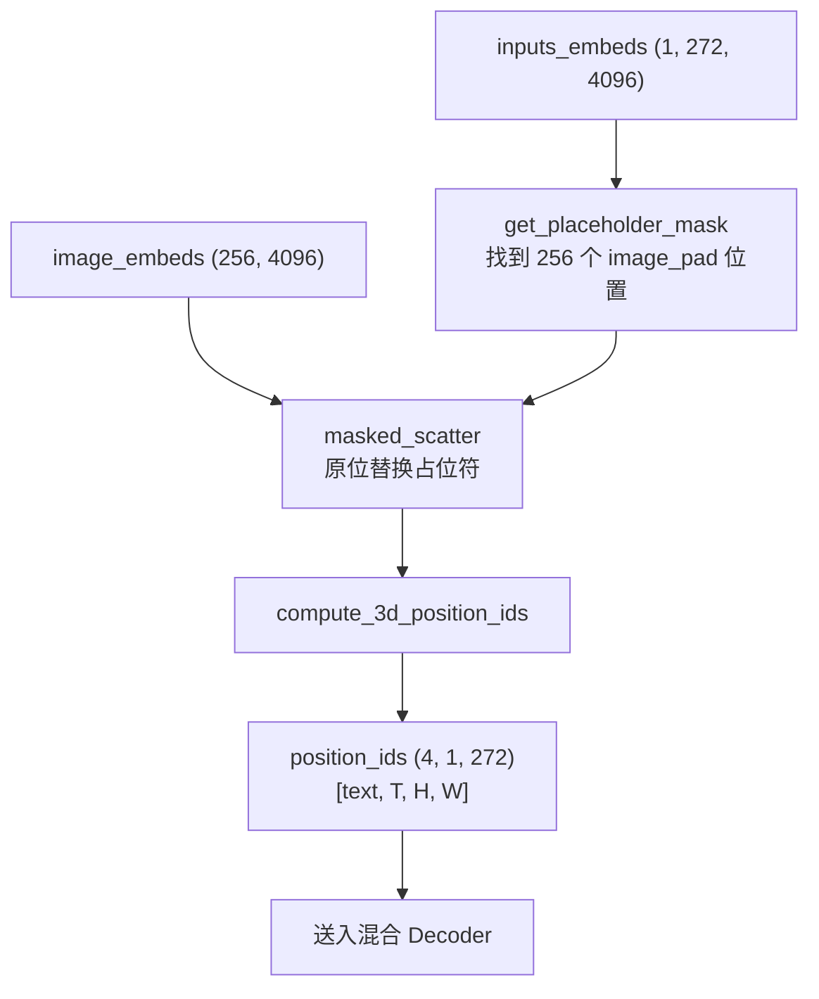
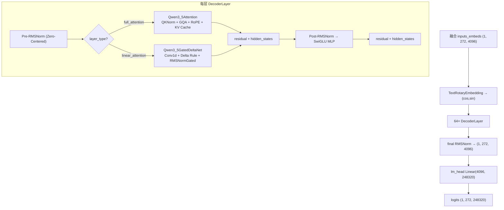

# Qwen3.5 系列多模态大模型硬核学习指南

> **前言：本指南的正确使用方式**
> 本文件是 Qwen3.5 架构体系的**「教学大纲」与「作战地图」**，同时也是**完整的前向传播全链路流转文档**。
> 相比于 [[qwen2.5_vl_深度剖析学习指南]]，Qwen3.5 在语言基座上进行了大刀阔斧的革命，引入了线性注意力（Gated DeltaNet）、摒弃了 DeepStack，回归了 `ViT + PatchMerger + 混合LLM` 三段式结构。
>
> 所有张量形状均以**具体推演样本**为例推算，不做抽象描述。
> 深度内容已收敛在对应的 **`[[知识卡片]]`** 中，请通过链接跳转进行沉浸式学习。

---

## 推演样本定义（全文统一）

**输入数据**：

- **图像**：1 张 448×448 RGB 图
- **视频**：1 段 4 帧（原始 24fps, 抽帧后 4 帧），分辨率 392×644
- **文本**：`"描述这张图片和视频"`
- **完整 prompt**（chat template 展开后）：

```
<|im_start|>user
<|vision_start|><|image_pad|>×256<|vision_end|>
<|vision_start|><|video_pad|>×N_video<|vision_end|>
描述这张图片和视频<|im_end|>
<|im_start|>assistant
```

**模型参数**：

| 参数 | 值 |
|------|-----|
| 模型 | Qwen3.5-VL |
| hidden_size (LLM) | 4096 |
| vision_hidden_size | 1280 |
| patch_size / temporal_patch_size | 14 / 2 |
| spatial_merge_size | 2 |
| ViT 层数 / Decoder 层数 | 32 / 64 |
| vocab_size | 248320 |
| num_attention_heads / num_kv_heads | 32 / 4 (GQA 8:1) |

**图像 Token 推算**：
- 448÷14 = 32（H 和 W 方向各 32 个 patch）
- grid_thw = `[1, 32, 32]`
- 总 patch 数 = 1 × 32 × 32 = 1024
- PatchMerger 2×2 → 1024 ÷ 4 = **256 视觉 tokens**

**视频 Token 推算**：
- 4 帧 ÷ temporal_patch_size(2) = 2 个时间步
- 392÷14 = 28（H 方向），644÷14 = 46（W 方向）
- grid_thw = `[2, 28, 46]`
- 总 patch 数 = 2 × 28 × 46 = 2576
- PatchMerger 2×2 → 2576 ÷ 4 = **644 视觉 tokens**

**文本 Token 推算**（chat template 展开后）：
- `<|im_start|>` (1) + `user` (1) + `\n` (1) = 3
- 图像区：`<|vision_start|>` (1) + `<|image_pad|>` × 256 + `<|vision_end|>` (1) = 258
- `\n` (1) = 1
- 视频区：`<|vision_start|>` (1) + `<|video_pad|>` × 644 + `<|vision_end|>` (1) = 646
- `\n描述这张图片和视频` ≈ 8 tokens
- `<|im_end|>` (1) + `\n` (1) + `<|im_start|>` (1) + `assistant` (1) + `\n` (1) = 5
- **总计 ≈ 921 tokens**（其中 256 个图像 + 644 个视频 = 900 个视觉占位符）

---

## 第 1 章：全景架构大纲与核心演进拓扑

### 1.1 官方架构图导读


**图中关键信息映射**：

1. **左侧 3×+1× 堆叠**：LLM Decoder 的混合层结构 — 每 3 层 GatedDeltaNet（线性注意力）+ 1 层 Gated Attention（全注意力）
2. **右上展开**：Gated Attention 内部 — QKV 投影 → Zero-Centered RMSNorm → Partial RoPE → Scaled Dot Product Attention → Output Gate(Sigmoid)
3. **右下展开**：GatedDeltaNet 内部 — Conv1d → L2 Norm → Gated Delta Rule → Zero-Centered RMSNorm → Output Gate(SiLU)
4. **MoE 层**：每层 Attention/GDN 后接 Mixture of Experts（图中未完全展开 ViT 部分）

### 1.2 全链路核心数据流拓扑



### 1.3 核心演进锚点（与前代对比）

| 维度 | Qwen2.5-VL | Qwen3-VL | **Qwen3.5** |
|------|-----------|---------|------------|
| LLM Decoder | 纯 Dense Attention | 纯 Dense Attention | **混合 Attention + GatedDeltaNet** |
| 视觉特征注入 | PatchMerger → LLM | **DeepStack** 跨层注入 | **回归纯 PatchMerger** |
| 位置编码 | MRoPE `[16,24,24]` chunked | MRoPE `[24,20,20]` | **Interleaved MRoPE `[11,11,10]`** |
| MLP | Dense SwiGLU | Dense SwiGLU | **MoE (可选)** |
| Attention Mask | 统一 causal | 统一 causal | **双 mask**: causal + linear |

---

## 第 2 章：阶段一 —— Processor 预处理流水线

### 1. 架构顺序解读

**来龙去脉**：Processor 是整个多模态架构的**格式翻译官**，不含任何神经网络权重。它在 CPU 上将异构的原始数据（不同分辨率的图片、变帧率的视频、自然语言文本）标准化为模型可消费的张量。

Qwen3.5 的 Processor **直接复用 Qwen3-VL 的 `Qwen3VLProcessor`**，与 Qwen2.5-VL 的差异主要在视频处理（引入帧时间戳）和 `mm_token_type_ids`。

**架构流转图示**：


### 2. 具体实例推演（输入与输出）

- **输入**：PIL Image(448×448) + `"<image>\n描述这张图片"`

- **输出**：

| 字段 | 形状 | 推演说明 |
|------|------|---------|
| `pixel_values` | `(1024, 3, 2, 14, 14)` | 32×32=1024 patches, 每个含 2帧×14×14×RGB |
| `image_grid_thw` | `(1, 3)` = `[1,32,32]` | T=1帧, H=32格, W=32格 |
| `input_ids` | `(1, 272)` | chat template 展开后约 272 tokens |
| `mm_token_type_ids` | `(1, 272)` | 文本位=0, 图像位=1 |
| `attention_mask` | `(1, 272)` | 全1（无 padding） |

**关键计算**：
- 占位符数 = `grid_thw.prod() // merge_size²` = `(1×32×32) // 4` = **256**
- 这 256 个 `<|image_pad|>` token 会在阶段④被视觉 embedding 替换

### 3. 概念学习序列

#### 3.1 核心机制：占位符展开与 Token 数量计算
*   **概念说明**：Processor 在分词前先计算每张图/视频需要多少视觉 token，然后将文本中的 `<|image_pad|>` 展开为精确数量的占位符。这个数量由 `grid_thw` 和 `merge_size` 共同决定。
*   **学习目标**：能手算任意分辨率图像的视觉 token 数。
*   👉 **去教材详读**：[[qwen2.5_vl_预处理流水线]] — 步骤一到四完整覆盖

#### 3.2 Qwen3.5 新增：mm_token_type_ids
*   **概念说明**：Qwen3.5 引入了 `mm_token_type_ids` 字段，为序列中每个 token 标记模态类型（0=文本, 1=图像, 2=视频）。这是 `get_rope_index` 计算 3D 位置的关键输入。
*   **学习目标**：理解为什么需要在 Processor 阶段就区分模态类型。
*   👉 **去教材详读**：[[qwen3.5_processor预处理#1. mm_token_type_ids — 模态类型标记]]

#### 3.3 Qwen3.5 新增：视频帧时间戳
*   **概念说明**：Qwen3.5 的视频处理增加了帧时间戳计算（`_calculate_timestamps`），将抽帧索引除以 FPS 得到物理秒数，插入到 prompt 中作为 `<X.X seconds>` 标记。
*   **学习目标**：理解时间戳如何辅助 MRoPE 的时间维度编码。
*   👉 **去教材详读**：[[qwen3.5_processor预处理#3. 视频帧时间戳 (_calculate_timestamps)]]

#### 3.4 工程实战：框架集成与显存评估
*   👉 **去教材详读**：[[qwen2.5_vl_预处理框架集成与显存评估]] — OOM 救火与序列长度预估

### 4. 核心源码路径

| 文件 | 内容 |
|------|------|
| `models/qwen3_vl/processing_qwen3_vl.py` | Processor 主逻辑 (272行) |
| `models/qwen3_vl/image_processing_qwen3_vl.py` | 图像预处理 |
| `models/qwen3_vl/video_processing_qwen3_vl.py` | 视频预处理 |

### 5. 疑问解答 (Q&A)

*   **Q1: 256 这个数怎么来的？** → 448÷14=32, 32×32=1024 patches, PatchMerger 2×2 → 1024÷4=256
*   **Q2: mm_token_type_ids 有什么用？** → 告诉 `get_rope_index` 每个 token 的模态，以分配 3D 位置坐标
*   **Q3: 视频帧时间戳怎么算？** → `_calculate_timestamps`: 帧索引÷FPS → 物理秒数，相邻帧取均值

---

## 第 3 章：阶段二 —— 文本嵌入与 Token 序列构建

### 1. 架构顺序解读

**来龙去脉**：标准的 `nn.Embedding` 查表操作，将 integer token ID 映射为 4096 维的稠密向量。此时图像占位符位置（256 个 `<|image_pad|>`）也有 embedding，但它们是**语义无效的占位值**，会在阶段④被视觉特征替换。

### 2. 具体实例推演

```
输入: input_ids (1, 272) — 整数 token ID 序列
  │
  └─ embed_tokens = nn.Embedding(248320, 4096)
     │
     └─ 输出: inputs_embeds (1, 272, 4096)
        │
        ├─ 位置 0-2: <|im_start|>, user, \n → 有效文本 embedding
        ├─ 位置 3: <|vision_start|> → 有效特殊 token embedding
        ├─ 位置 4-259: <|image_pad|> × 256 → 占位值（即将被替换）
        ├─ 位置 260: <|vision_end|> → 有效特殊 token embedding
        └─ 位置 261-271: \n描述这张图片... → 有效文本 embedding
```

### 3. 概念学习序列

#### 3.1 Embedding 的物理意义
*   **概念说明**：`nn.Embedding(V, D)` 本质是一个形状为 `(V, D)` 的权重矩阵。token ID 作为行索引直接取出对应的 D 维向量。这与视觉编码器的 Conv3d 完全不同 — 文本是**查表**，视觉是**滤波**。
*   👉 **对比详见**：[[conv3d_时空切块器#第一性原理深度对比：视觉 vs 文本]]
*   👉 **完整详解**：[[qwen3.5_文本嵌入与特殊token#1. nn.Embedding 查表原理]]

#### 3.2 特殊 Token 的角色
*   `<|vision_start|>` / `<|vision_end|>`：标记视觉 token 的边界，让模型知道这里的内容来自图像/视频
*   `<|image_pad|>` (ID=248056)：占位符，在阶段④被 `masked_scatter` 替换
*   `<|im_start|>` / `<|im_end|>`：ChatML 格式的对话轮次边界
*   👉 **完整详解**：[[qwen3.5_文本嵌入与特殊token#3. 特殊 Token 角色定义]]

### 4. 核心源码路径

```python
# 文件: models/qwen3_5/modular_qwen3_5.py:612
inputs_embeds = self.get_input_embeddings()(input_ids)
# → nn.Embedding(248320, 4096) 查表
```

---

## 第 4 章：阶段三 —— 视觉编码器 (Vision Encoder)

### 1. 架构顺序解读

**来龙去脉**：视觉编码器是将原始像素「翻译」为语义向量的核心模块。Qwen3.5 继承自 Qwen3-VL 的 ViT 架构，核心改动是**删除 DeepStack**（不再从 ViT 中间层提取特征注入 LLM），回归纯粹的 `Conv3d → ViT Blocks → PatchMerger` 三段式。

**架构流转图示**：


### 2. 具体实例推演

| 步骤 | 操作 | 输入形状 | 输出形状 | 说明 |
|------|------|---------|---------|------|
| ① | Conv3d | (1024, 3, 2, 14, 14) | (1024, 1280) | 每 patch group 投影到 1280 维 |
| ② | + 位置嵌入 | (1024, 1280) | (1024, 1280) | 双线性插值到 32×32 网格 |
| ③ | 2D RoPE | — | cos/sin (1024, 80) | head_dim//2 = 1280/16/2 = 40 → ×2 = 80 |
| ④ | 32× VisionBlock | (1024, 1280) | (1024, 1280) | 维度不变，语义逐层提纯 |
| ⑤ | PatchMerger | (1024, 1280) | **(256, 4096)** | 4 token 拼接 → MLP 投影 |

### 3. 概念学习序列

#### 3.1 神经元入口：Conv3d Tubelet Embedding
*   **概念说明**：用 3D 卷积核 `(2,14,14)` 将每个像素立方体一步投影为 1280 维向量。stride=kernel → 无重叠切分。
*   **Qwen3.5 特性**：embed_dim=**1280**（vs Qwen2.5-VL 的 1152），`bias=True`。
*   **学习目标**：能手算 Conv3d 输出维度；理解 Tubelet 比 2D 卷积多捕获的运动信息。
*   👉 **去教材详读**：[[conv3d_时空切块器]] 与 [[qwen3.5_视觉编码器#1. Conv3d PatchEmbed]]

#### 3.2 空间定位：双线性插值位置嵌入 + 2D RoPE
*   **概念说明**：两套互补的位置系统：(a) 可学习绝对位置嵌入（通过双线性插值支持动态分辨率）；(b) 2D RoPE（将 head_dim 一分为二，分别编码行/列坐标的旋转频率）。
*   **学习目标**：理解为什么需要两套位置编码；理解 `spatial_merge_size` 如何影响位置嵌入的排列顺序。
*   👉 **去教材详读**：[[2d_rope_视觉位置编码]] 与 [[qwen3.5_视觉编码器#2. 绝对位置嵌入 (fast_pos_embed_interpolate)]]

#### 3.3 语义提纯：32 层 VisionBlock
*   **概念说明**：标准 Pre-Norm Transformer：`LN → Attention → residual → LN → MLP → residual`。使用 `cu_seqlens` 实现变长 attention（多图 packing），非因果。
*   **与 Qwen2.5-VL 的差异**：Qwen3.5 **不使用 Window Attention**（全部是全局 attention），因为 DeepStack 的移除使得简化成为可能。
*   👉 **去教材详读**：[[qwen3.5_视觉编码器#4. VisionBlock (×32)]] 与 [[window_attention_交错注意力]]（Qwen2.5-VL 对比）

#### 3.4 咽喉要塞：PatchMerger 空间降维
*   **概念说明**：将 1024 个 1280 维 token 通过 2×2 合并 + 两层 MLP 降至 256 个 4096 维 token。利用内存连续性的 `.view()` 魔法实现零开销空间重组。
*   **学习目标**：能解释 `.view(-1, 5120)` 如何实现空间合并；能推算任意分辨率的最终 LLM token 数。
*   👉 **去教材详读**：[[patchmerger_空间降维]] 与 [[qwen3.5_视觉编码器#5. PatchMerger]]

### 4. 疑问解答 (Q&A)

*   **Q1: 为什么 Qwen3.5 删除了 DeepStack？** → 混合 Decoder（GDN+Attention）已足够强大，不需要从 ViT 中间层注入特征
*   **Q2: PatchMerger 输出为什么是 4096 维？** → `out_hidden_size` 配置为与 LLM hidden_size 一致，确保 `masked_scatter` 维度匹配
*   **Q3: 为什么不用 Window Attention？** → 移除 DeepStack 后不再需要分层提取，全局 attention 更简洁

### 5. 核心源码路径

| 文件 | 内容 |
|------|------|
| `models/qwen3_5/modular_qwen3_5.py:421-479` | Qwen3_5VisionModel（删除 DeepStack） |
| `models/qwen3_vl/modeling_qwen3_vl.py:59-823` | 父类完整 ViT 实现 |

---

_（后续章节：阶段四 多模态融合 + 阶段五 混合 Decoder）_

---

## 第 5 章：阶段四 —— 多模态融合与三维位置编码

### 1. 架构顺序解读

**来龙去脉**：视觉编码器输出的 256 个 4096 维视觉 token 需要「嫁接」到文本序列中。同时，LLM 天生只理解 1D 线性位置，必须为视觉 token 注入 3D 空间坐标 (T,H,W)。

**架构流转图示**：


### 2. 具体实例推演

| 步骤 | 操作 | 关键张量 | 说明 |
|------|------|---------|------|
| ① | `get_placeholder_mask` | mask: (1,272,4096) bool | 找到 input_ids 中 256 个 == 248056 的位置 |
| ② | `masked_scatter` | inputs_embeds: (1,272,4096) | 256 个占位 embedding 被视觉特征替换 |
| ③ | `get_rope_index` | position_ids: (3,1,272) | 按 mm_token_type_ids 分配 3D 坐标 |
| ④ | 拼接 text_pos | position_ids: (4,1,272) | [0]=text位置，[1:]=T,H,W |

**position_ids 推演（简化）**：
```
token序列: [BOS, user, \n, <vs>, ×256, <ve>, \n, 描, 述, ...]
mm_type:   [ 0,   0,   0,  0,   1×256,     0,  0,  0, 0, ...]

分组:
1. 文本段(0-3):  T=H=W=[0,1,2,3],  current_pos→4
2. 图像段(256个): grid=[1,32,32], merge=2 → 16×16
   T: 全=4 (T=1帧)
   H: [4,4,...,4, 5,...,5, ..., 19,...,19] (16行)
   W: [4,5,...,19, 4,...,19, ...] (16列)
   current_pos += 16 → 20
3. 文本段(261-):  T=H=W=[20,21,22,...], 递增
```

### 3. 概念学习序列

#### 3.1 占位符替换机制 (masked_scatter)
*   **概念说明**：`masked_scatter` 将视觉 embedding **按顺序**填入 mask 为 True 的位置。这是 Qwen 系列实现多模态融合的核心手法 — 不需要额外的 cross-attention，视觉 token 直接伪装成「词向量」参与自回归。
*   👉 **去教材详读**：[[qwen3.5_多模态融合机制#2. masked_scatter — 原位替换]]

#### 3.2 3D 位置坐标分配 (get_rope_index)
*   **概念说明**：为每个 token 分配 (T,H,W) 三维坐标。文本 token 三维退化为同步递增（等价于 1D RoPE）；图像 token 按 grid 展开为 2D 空间坐标；视频 token 额外有时间维度递增。
*   **学习目标**：能手写出含图片的混合序列的 position_ids。
*   👉 **去教材详读**：[[qwen3.5_多模态融合机制#4. get_rope_index — 逐 token 位置分配]] 与 [[mrope_多模态位置编码]]

#### 3.3 Interleaved MRoPE 位置编码
*   **概念说明**：Qwen3.5 将 T/H/W 三维的旋转频率**交错排列** `[THWTHW...]` 而非连续分块 `[TTT...HHH...WWW...]`。mrope_section 从 `[16,24,24]` 变为 `[11,11,10]`，让每个维度都获得低频和高频信号。
*   **学习目标**：能解释交错 vs 分块的优势；能推演频率索引分配。
*   👉 **去教材详读**：[[qwen3.5_interleaved_mrope]]

### 4. 疑问解答 (Q&A)

*   **Q1: 为什么不用 Cross-Attention？** → 直接替换更简洁，且视觉 token 可以与文本 token 在同一序列中做标准自注意力
*   **Q2: 文本 token 的 T/H/W 为什么要同步递增？** → 三维相同时，MRoPE 数学上退化为 1D RoPE，保证纯文本场景不受影响
*   **Q3: 视觉 token 推进的位置步长怎么算？** → `max(H,W) // merge_size`，即按较大维度的 merge 后尺寸推进

---

## 第 6 章：阶段五 —— 混合 Decoder 与文本生成

### 1. 架构顺序解读

**来龙去脉**：这是 Qwen3.5 最精华、最硬核的部分。为支撑超长上下文，Qwen3.5 将经典的全 Attention Decoder 替换为**混合架构**：通过 `config.layer_types` 指定每层是 Full Attention 还是 GatedDeltaNet（线性注意力），再接 MLP/MoE。


**架构流转图示**：


### 2. 具体实例推演

| 步骤 | 操作 | 输入 | 输出 |
|------|------|------|------|
| ① | Interleaved MRoPE | pos_ids (3,1,272) | cos,sin 各 (1,272,128) |
| ② | 64× DecoderLayer | (1,272,4096) | (1,272,4096) 每层不变 |
| ③ | Final RMSNorm | (1,272,4096) | (1,272,4096) |
| ④ | lm_head | (1,272,4096) | **(1,272,248320)** logits |

**双 Mask 系统**：
- Full Attention 层：`causal_mask (1,1,272,272)` — 标准下三角因果 mask
- GatedDeltaNet 层：`linear_attn_mask (1,272)` — 仅 padding mask（递推天然因果）

### 3. 概念学习序列

#### 3.1 GatedDeltaNet：线性注意力革命
*   **来龙去脉**：用固定大小的状态矩阵 $S \in \mathbb{R}^{d_k \times d_v}$ 替代不断增长的 KV Cache。核心递推：$S_t = e^{g_t} S_{t-1} + \beta_t k_t (v_t - S_{t-1}^T k_t)^T$
*   **准出条件**：能解释 Delta Rule 的「误差驱动更新」为什么优于简单累加；能说明解码时 $O(1)$ 复杂度的由来。
*   👉 **去教材详读**：[[qwen3.5_gated_delta_net]]

#### 3.2 Full Attention 与 QKNorm
*   **来龙去脉**：每 3 层 GDN 后插入 1 层全注意力，用于保底全局长程精确召回。Qwen3.5 引入 QKNorm（投影后对 Q/K 做 per-head RMSNorm）防止 attention score 爆炸。
*   **准出条件**：能写出 GQA 8:1 的 repeat_kv 逻辑；理解 QKNorm 对训练稳定性的作用。
*   👉 **去教材详读**：[[qwen3.5_混合decoder架构#3. 标准 Attention (Qwen3_5Attention) — 完整源码]]

#### 3.3 混合层路由与双 Mask
*   **概念说明**：`layer_types` 列表决定每层类型。每层只实例化一种注意力模块，节省显存。Attention 层用因果 mask，GDN 层仅用 padding mask。
*   👉 **去教材详读**：[[qwen3.5_混合decoder架构#1. DecoderLayer — 混合层路由]] 与 [[qwen3.5_混合decoder架构#2. 双 Mask 系统]]

#### 3.4 SwiGLU MLP 与 Zero-Centered RMSNorm
*   **概念说明**：MLP 用 `SiLU(gate) × up` 门控；RMSNorm 用 `(1+w)` zero-centered 初始化，训练初期等价恒等映射。
*   👉 **去教材详读**：[[qwen3.5_混合decoder架构#4. SwiGLU MLP]] 与 [[rmsnorm_归一化]]

### 4. 疑问解答 (Q&A)

*   **Q1: GatedDeltaNet 和 RNN 有什么关系？** → 都是递推结构，但 GDN 有误差驱动更新和指数衰减，表达力远超传统 RNN
*   **Q2: 为什么不全用线性注意力？** → 线性注意力对精确回忆有损，关键层用 Full Attention 保底
*   **Q3: Zero-Centered RMSNorm 的 `(1+w)` 为什么重要？** → w 初始化为 0，训练初期 Norm 层是恒等映射，不干扰梯度流

---

## 第 7 章：原生多模态训练范式

### 1. 架构顺序解读

Qwen3.5 从极早期就开始图文混合训练（Joint Pre-training），而非先训文本再学看图。训练阶段：
1. **Stage 0**：视觉底座对比学习（SigLIP2）
2. **Stage 1/2**：全参数解冻，图文混合万亿级 Token 训练
3. **Stage 3**：长上下文扩展
4. **Post-training**：SFT / DPO / RL 人类偏好对齐

### 2. 概念学习序列

*   **对比学习基座 (SigLIP2)**：👉 [[clip_对比学习视觉编码]]
*   **多阶段训练**：👉 [[qwen2.5_vl_三阶段预训练]]
*   **MTP 多 Token 预测**：训练时同时预测多个未来 token，倒逼视觉编码器提取更具逻辑连贯性的特征

---

## 第 8 章：Qwen 版本演化总览

| 维度 | Qwen2.5-VL | Qwen3-VL | **Qwen3.5** |
|------|-----------|---------|------------|
| Vision Encoder | 1152d, Window+Global Attn | 1280d, DeepStack 注入 | **1280d, 纯 PatchMerger** |
| LLM Decoder | Dense Attention | Dense Attention | **Attention + GatedDeltaNet 混合** |
| 位置编码 | MRoPE chunked | MRoPE chunked | **Interleaved MRoPE** |
| MLP | Dense SwiGLU | Dense SwiGLU | **MoE 可选** |
| 长上下文 | ~128K | ~128K | **256K+** (线性注意力) |
| 训练 | 分阶段解冻 | 分阶段解冻 | **原生联合训练** |

---

## 完整函数调用链（速查索引）

```
model.generate(**inputs)
 └─ Qwen3_5ForConditionalGeneration.forward()
     ├─ embed_tokens(input_ids)                    → (1,272,4096)     §第3章
     ├─ get_image_features(pixel_values, grid_thw)
     │   └─ Qwen3_5VisionModel.forward()           → (256,4096)      §第4章
     ├─ masked_scatter(image_mask, image_embeds)    → (1,272,4096)    §第5章
     ├─ compute_3d_position_ids(...)                → (4,1,272)       §第5章
     ├─ Qwen3_5TextModel.forward()                                    §第6章
     │   ├─ TextRotaryEmbedding → (cos,sin)
     │   └─ 64× DecoderLayer → (1,272,4096)
     ├─ lm_head → logits (1,272,248320)                               §第6章
     └─ generate loop...
```

---

## 关联概念索引

| 卡片 | 章节关联 |
|------|---------|
| [[qwen_代码地图]] | 全局代码导航 |
| [[qwen3.5_视觉编码器]] | §第4章 |
| [[qwen3.5_gated_delta_net]] | §第6章 |
| [[qwen3.5_混合decoder架构]] | §第6章 |
| [[qwen3.5_多模态融合机制]] | §第5章 |
| [[qwen3.5_interleaved_mrope]] | §第5章 |
| [[conv3d_时空切块器]] | §第4章 |
| [[patchmerger_空间降维]] | §第4章 |
| [[mrope_多模态位置编码]] | §第5章 |
| [[qwen2.5_vl_预处理流水线]] | §第2章 |
| [[qwen2.5_vl_预处理框架集成与显存评估]] | §第2章 |

## 参考来源

- `transformers/src/transformers/models/qwen3_5/modular_qwen3_5.py` (701行)
- `transformers/src/transformers/models/qwen3_vl/modeling_qwen3_vl.py` (1773行)
- `transformers/src/transformers/models/qwen3_vl/processing_qwen3_vl.py` (272行)
- `knowledge_base/raw/Qwen-3.5 Preview/` — 官方架构图