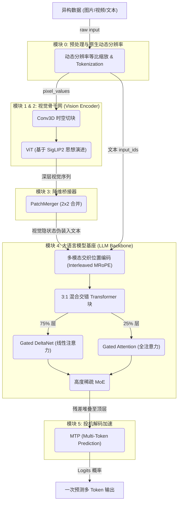

# Qwen3.5 系列多模态大模型硬核学习指南

> **前言：本指南的正确使用方式**
> 本文件是 Qwen3.5 架构体系的**「教学大纲」与「作战地图」**。Qwen3.5 标志着多模态大模型在**“极长上下文”**与**“极致推理效率”**上的巅峰。
> 相比于 Qwen2.5-VL，Qwen3.5 在语言基座（LLM Backbone）上进行了大刀阔斧的革命，引入了线性注意力（Gated DeltaNet）和极度稀疏的混合专家（MoE）架构，并摒弃了 Qwen3 中复杂的 DeepStack，回归了大道至简的 `ViT + PatchMerger + LLM` 三段式结构。
>
> 所有的复杂内容、全流程拆解、源码逐行剖析与第一性原理推导，均已收敛在对应的 **`[[知识卡片]]`** 中，请通过大纲中的链接跳转进行沉浸式学习。

---

## 第 1 章：全景架构大纲与核心演进拓扑

Qwen3.5 重新回归了极致简洁的架构美学，同时将底层的运行效率推向了极致。

### 1.1 全景架构流转图示

### 1.2 核心演进锚点 (与前代对比)
1. **告别 DeepStack**：Qwen3 曾经尝试将 ViT 中间层特征抽取出来强行注入 LLM 前 K 层（DeepStack）。Qwen3.5 证明了只要 LLM 足够强，回归纯粹的 `PatchMerger` 依然能保持卓越的视觉理解能力，且大幅降低工程复杂度。
2. **算力革命**：利用 `Gated DeltaNet` 彻底消灭了 $O(N^2)$ 的 KV Cache 爆炸问题，实现了流式推理的 $O(1)$ 复杂度。
3. **多模态对齐绝对时间**：`MRoPE` 进化为 `Interleaved MRoPE`。

---

## 第 2 章：多模态视觉处理与位置感知 (Vision & Positional Encoding)

### 1. 架构顺序解读
**来龙去脉**：在图像和视频真正进入恐怖的推理巨兽（LLM）之前，必须先将其从“光影像素”提纯为“语义向量”，并打上精准的时空坐标戳。这一步完美继承了原生动态分辨率的衣钵，并在位置编码上做了极致交织。

### 2. 概念学习序列
*   **【概念一：原生动态分辨率输入方案】**
    *   **准出条件**：深刻理解为什么不把图像切成死板的方块（Tiling），而是采用整体缩放后 `Patch n' Pack` 或 Padding 的策略。能对比出它与 InternVL 切片方案在 Token 消耗上的算式差异。
    *   👉 **深度学习去这里**：**[[navit_动态分辨率]]**
*   **【概念二：时空切块与视觉提纯 (Conv3D & ViT)】**
    *   **准出条件**：闭眼能在脑海里浮现出 `[Batch, 196, 1152]` 张量是怎么经过 Multi-Head Attention (多头拆分、热力图相乘) 和 Inverted Bottleneck MLP 的。
    *   👉 **深度学习去这里**：**[[conv3d_时空切块器]]** 与 **[[vit_核心原理与结构]]**
*   **【概念三：三维时空坐标系 (Interleaved MRoPE)】**
    *   **准出条件**：必须能够手写出一段文本接两帧视频的 Token 们的 `(T, H, W)` 是怎么在时间轴和空间轴上生长的。知道 `mrope_section` 数组是怎么配合 `rotate_half` 切片完成复数旋转的。
    *   👉 **深度学习去这里**：**[[mrope_多模态位置编码]]** 与 **[[rope_旋转位置编码]]**

---

## 第 3 章：大语言模型革命底座 (LLM Backbone)

### 1. 架构顺序解读
**来龙去脉**：这是 Qwen3.5 最精华、最硬核的部分。为了支撑 256K 乃至 1M 的上下文，Qwen3.5 抛弃了经典的稠密（Dense）与纯全注意力（Full Attention）架构，转而走向了线性与稀疏的极限。

### 2. 概念学习序列 (黄金准出标准)
*   **【概念一：Gated DeltaNet (线性注意力)】**
    *   **来龙去脉**：解决 $O(N^2)$ 注意力计算瓶颈的终极武器。它放弃了保存所有历史 Token 的 KV Cache，改用一个恒定大小的记忆状态矩阵 $S$ 来吸纳新知识、遗忘旧知识。
    *   **黄金准出条件**：必须能在代码层面解释 `torch_recurrent_gated_delta_rule` 中的核心递推公式 $S_t = g_t \cdot S_{t-1} + \beta_t \cdot k_t \cdot \Delta_t$。能够向人解释清楚为什么解码（Decoding）时它是 $O(1)$ 复杂度的。
    *   👉 **深度学习去这里**：**[[llm_backbone_大语言模型基座#2-神经元级微观解剖一：gated-deltanet-线性注意力]]**

*   **【概念二：Gated Attention 与 Zero-Centered RMSNorm】**
    *   **来龙去脉**：每 3 层 DeltaNet 后插入的 1 层全注意力，用于保底全局长程召回。同时，从归一化到输出都贯彻了“门控（Gating）”哲学。
    *   **黄金准出条件**：能写出 Zero-Centered RMSNorm 的 $y = \frac{x}{\text{RMS}} \cdot (1 + w)$ 公式，并解释 $w$ 初始化为 0 对训练初期恒等映射的救命作用。理解 `attn_output * sigmoid(gate)` 是如何动态过滤无用上下文的。
    *   👉 **深度学习去这里**：**[[llm_backbone_大语言模型基座#3-神经元级微观解剖二：gated-attention-全注意力]]**

*   **【概念三：极度稀疏 MoE (混合专家)】**
    *   **来龙去脉**：397B 的庞然大物，每次 Token 预测只激活 17B 参数的秘密。
    *   **黄金准出条件**：明白 `Router` 怎么从 512 个专家中 `Top-K` 选出 10 个，且所有 Token 都要强制经过 1 个共享专家（Shared Expert）以稳固常识底座的机制。
    *   👉 **深度学习去这里**：**[[llm_backbone_大语言模型基座#4-神经元级微观解剖三：高度稀疏-moe-混合专家]]**

*   **【概念四：MTP (多 Token 预测解码加速)】**
    *   **来龙去脉**：在庞大的网络顶端套一个“草稿层”，利用投机解码的思想，一次推理输出多个 Token。
    *   **黄金准出条件**：解释 MTP 是如何在不牺牲精度的情况下，白嫖 1.5 倍吞吐量提升的。
    *   👉 **深度学习去这里**：**[[llm_backbone_大语言模型基座#5-多模态与解码提效前沿]]**

---

## 第 4 章：对比学习基座与预训练生命周期 (Training Lifecycle)

### 1. 概念学习序列
*   **【概念一：对比学习视觉编码 (SigLIP2)】**
    *   **来龙去脉**：Qwen 视觉特征强大的零样本（Zero-shot）泛化能力，来源于其底层的多模态对齐训练。从 CLIP 到 SigLIP 的演进是分布式训练工程的奇迹。
    *   **黄金准出条件**：能手绘出双塔对比学习 $N \times N$ 相似度矩阵的热力分布图。必须能解释 SigLIP 是如何把 Softmax 变成 Sigmoid，从而去掉全局归一化分母，让多机多卡通信（All-gather）的 $O(B^2)$ 开销骤降为 Chunked 计算的 $O(b^2)$ 的。
    *   👉 **深度学习去这里**：**[[clip_对比学习视觉编码]]**

*   **【概念二：大模型的多阶段炼丹术】**
    *   **来龙去脉**：从 Stage 0 (打视觉底座) $\rightarrow$ Stage 1/2 (解冻所有参数灌输常识) $\rightarrow$ Stage 3 (长上下文) $\rightarrow$ SFT/DPO/RL (冻结视觉，专精人类偏好对齐)。
    *   **黄金准出条件**：跳出代码与张量，建立对大模型工程落地化训练节奏的全盘上帝视角。
    *   👉 **深度学习去这里**：**[[qwen2.5_vl_三阶段预训练]]**

### 2. 核心疑问解答 (Q&A 索引)

*   **Q1: Qwen3.5 为什么摒弃了 Qwen3 里的 DeepStack 跨层融合？**
    👉 解答详见：[[qwen_evolution_架构演进与前沿底座#1-视觉端的进化之路]]
*   **Q2: 线性注意力 Gated DeltaNet 在处理极长 Prompt (Prefilling 阶段) 和逐字生成 (Decoding 阶段) 时，底层的算法有何不同？**
    👉 解答详见：[[llm_backbone_大语言模型基座#23-核心源码解剖-流式推理的-o1-实现]]